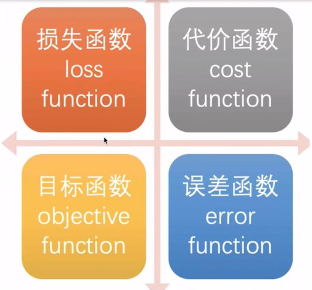
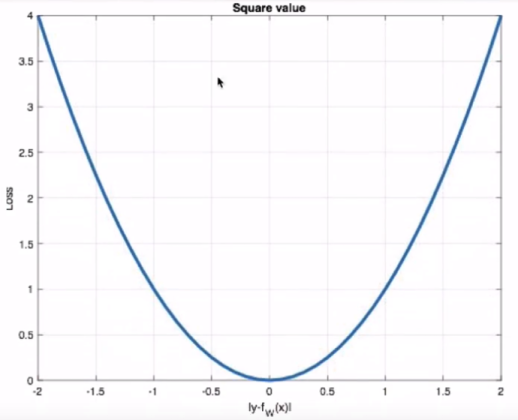

# [深度神经网络](https://www.yuque.com/models/yvphv7/gcktgc#iQscY)

- 输入层（Input Layer）：1层
- 隐藏层（Hidden Layer）：N层
- 输出层（Output Layer）：1层

- 为什么叫全链接呢？

- - 因为layer1与layer2之间两两都有连接，所以叫做Fully Connect；

- 为什么叫前馈呢？

- - 因为现在传递的方向是由后往前传，所以叫做Feedforward。

# 神经网络

## 1. 激活函数

在神经元中引入了激活函数，它的本质是向神经网络中引入非线性因素的，通过激活函数，神经网络就可以拟合各种曲线。如果不用激活函数，每一层输出都是上层输入的线性函数，无论神经网络有多少层，输出都是输入的线性组合，引入非线性函数作为激活函数，那输出不再是输入的线性组合，可以逼近任意函数。

激活函数的用途？

如果不用激励函数（其实相当于激励函数是f(x) = x），在这种情况下你每一层节点的输入都是上层输出的线性函数，很容易验证，无论你神经网络有多少层，输出都是输入的线性组合，与没有隐藏层效果相当，这种情况就是最原始的感知机（Perceptron）了，那么网络的逼近能力就相当有限。正因为上面的原因，我们决定引入非线性函数作为激励函数，这样深层神经网络表达能力就更加强大（不再是输入的线性组合，而是几乎可以逼近任意函数）。

有哪些激活函数，都有什么性质和特点？

早期研究神经网络主要采用sigmoid函数或者tanh函数，输出有界，很容易充当下一层的输入。

近些年Relu函数及其改进型（如Leaky-ReLU、P-ReLU、R-ReLU等）在多层神经网络中应用比较多。下面我们来总结下这些激活函数：

### 1.1 Sigmoid/logistics函数

数学表达式为：

sigmoid 在定义域内处处可导，且两侧导数逐渐趋近于0。如果X的值很大或者很小的时候，那么函数的梯度（函数的斜率）会非常小，在反向传播的过程中，导致了向低层传递的梯度也变得非常小。此时，网络参数很难得到有效训练。这种现象被称为梯度消失。一般来说， sigmoid 网络在 5 层之内就会产生梯度消失现象。而且该激活函数并不是以0为中心的。在实践中这种激活函数一般只用于二分类的输出层。

~~~ python
# 导入相应的工具包
import tensorflow as tf
import tensorflow.keras as keras
import matplotlib.pyplot as plt
import numpy as np

# 定义x的取值范围
x = np.linspace(-10, 10, 100)
# 直接使用tensorflow实现
y = tf.nn.sigmoid(x)
# 绘图
plt.plot(x,y)
plt.grid()
plt.show()
~~~

### 1.2 tanh(双曲正切曲线)

数学表达式如：

tanh也是一种非常常见的激活函数。与sigmoid相比，它是以原点（0, 0）为中心的，使得其收敛速度要比sigmoid快，减少迭代次数。然而，从图中可以看出，tanh两侧的导数也为0，同样会造成梯度消失。

若使用时可在隐藏层使用tanh函数，在输出层使用sigmoid函数。

~~~ python
# 导入相应的工具包
import tensorflow as tf
import tensorflow.keras as keras
import matplotlib.pyplot as plt
import numpy as np

# 定义x的取值范围
x = np.linspace(-10, 10, 100)
# 直接使用tensorflow实现
y = tf.nn.tanh(x)
# 绘图
plt.plot(x,y)
plt.grid()
plt.show()
~~~

### 1.3 RELU

数学表达式为：

ReLU是目前最常用的激活函数。 当x<0时，ReLU导数为0，而当x>0时，则不存在饱和问题。所以，ReLU 能够在x>0时保持梯度不衰减，从而缓解梯度消失问题。然而，随着训练的推进，部分输入会落入小于0区域，导致对应权重无法更新。这种现象被称为“神经元死亡”。

与sigmoid相比，RELU的优势是：

- 采用sigmoid函数，计算量大（指数运算），反向传播求误差梯度时，求导涉及除法，计算量相对大，而采用Relu激活函数，整个过程的计算量节省很多。
- sigmoid函数反向传播时，很容易就会出现梯度消失的情况，从而无法完成深层网络的训练。
- Relu会使一部分神经元的输出为0，这样就造成了网络的稀疏性，并且减少了参数的相互依存关系，缓解了过拟合问题的发生。

~~~ python
# 导入相应的工具包
import tensorflow as tf
import tensorflow.keras as keras
import matplotlib.pyplot as plt
import numpy as np

# 定义x的取值范围
x = np.linspace(-10, 10, 100)
# 直接使用tensorflow实现
y = tf.nn.relu(x)
# 绘图
plt.plot(x,y)
plt.grid()
plt.show()
~~~

### 1.4 LeakReLu

该激活函数是对RELU的改进，数学表达式为：

~~~ python
# 导入相应的工具包
import tensorflow as tf
import tensorflow.keras as keras
import matplotlib.pyplot as plt
import numpy as np

# 定义x的取值范围
x = np.linspace(-10, 10, 100)
# 直接使用tensorflow实现
y = tf.nn.leaky_relu(x)
# 绘图
plt.plot(x,y)
plt.grid()
plt.show()
~~~

### 1.5 SoftMax

softmax用于多分类过程中，它是二分类函数sigmoid在多分类上的推广，目的是将多分类的结果以概率的形式展现出来。

，softmax 直白来说就是将网络的输出通过 softmax 函数映射成为(0,1)之间的值，而这些值的累和为1（满足概率的性质)，将它理解成概率，选取概率最大的作为我们的预测目标类别。

~~~ python
# 导入相应的工具包
import tensorflow as tf
import tensorflow.keras as keras
import matplotlib.pyplot as plt
import numpy as np

# 数字中的score
x = tf.constant([0.2, 0.02, 0.15, 1.3, 0.5, 0.06, 1.1, 0.05, 3.75])
# 将其送入到softmax中计算分类结果
y = tf.nn.softmax(x)
# 将结果进行打印
print(y)
~~~

输出:

~~~ python
tf.Tensor(
[0.02167152 0.01810158 0.02061459 0.06510484 0.02925349 0.01884031
 0.05330333 0.01865285 0.75445753], shape=(9,), dtype=float32)
~~~

### 1.6 其他激活函数

### 1.7 如何选择

**隐藏层：**

- 优先选择Relu激活函数
- 如果ReLu效果不好，尝试其他的，如Leaky ReLu等
- 如果使用ReLu，需要注意一下Dead ReLu问题，避免出现大的梯度从而导致过多的神经元死亡
- 不要使用sigmoid激活函数，可以尝试使用tanh激活函数

**输出层：**

- 二分类问题选择sigmoid激活函数
- 多分类问题选择softmax激活函数
- 回归问题选择identity激活函数

## 2. 参数初始化

对于某一个神经元来说，需要初始化的参数有两类：一类是权重W，还有一类是偏置b，偏置b初始化为0即可。而权重W的初始化比较重要，下面介绍常见的初始化方式

### 2.1 随机初始化

随机初始化从均值为0，标准差是1的高斯分布中取样，使用一些很小的值对参数W进行初始化。

### 2.2 标准初始化

权重参数初始化从区间均匀随机取值。即在均匀分布中生成当前神经元的权重，其中d为每个神经元的输入数量。

### 2.3 Xavier初始化

该方法的基本思想是各层的激活值和梯度的方差在传播过程中保持一致，也叫做Glorot初始化。在tk.keras中实现的方法有两种：

- **正态化Xavier初始化**

Glorot 正态分布初始化器，也称为 Xavier 正态分布初始化器。它从以 0 为中心，标准差为 `stddev = sqrt(2 / (fan_in + fan_out))` 的正态分布中抽取样本， 其中 `fan_in` 是输入神经元的个数， `fan_out` 是输出的神经元个数。

~~~ python
# 导入工具包
import tensorflow as tf
# 进行实例化
initializer = tf.keras.initializers.glorot_normal()
# 采样得到权重值
values = initializer(shape=(9, 1))
# 打印结果
print(values)
~~~

输出结果为：

~~~ python
tf.Tensor(
[[-0.001864  ]
 [ 0.74279845]
 [-0.8117696 ]
 [-0.83777374]
 [ 1.0158616 ]
 [-0.354366  ]
 [-0.20703831]
 [-0.1718407 ]
 [-0.02905037]], shape=(9, 1), dtype=float32)
~~~

- **标准化Xavier初始化**

Glorot 均匀分布初始化器，也称为 Xavier 均匀分布初始化器。它从 [-limit，limit] 中的均匀分布中抽取样本， 其中 `limit` 是 `sqrt(6 / (fan_in + fan_out))`， 其中 `fan_in` 是输入神经元的个数， `fan_out` 是输出的神经元个数。

~~~ python
# 导入工具包
import tensorflow as tf
# 进行实例化
initializer = tf.keras.initializers.glorot_uniform()
# 采样得到权重值
values = initializer(shape=(9, 1))
# 打印结果
print(values)
~~~

输出结果为：

~~~ python
tf.Tensor(
[[ 0.27936757]
 [ 0.18326306]
 [-0.73190516]
 [-0.00999147]
 [-0.55424786]
 [ 0.38887167]
 [-0.25821656]
 [ 0.6301414 ]
 [-0.15612221]], shape=(9, 1), dtype=float32)
~~~

### 2.4.He初始化

he初始化，也称为Kaiming初始化，出自大神何恺明之手，它的基本思想是正向传播时，激活值的方差保持不变；反向传播时，关于状态值的梯度的方差保持不变。

- **正态化的he初始化**

He 正态分布初始化是以 0 为中心，标准差为 `stddev = sqrt(2 / fan_in)` 的截断正态分布中抽取样本， 其中 `fan_in`是输入神经元的个数，在tf.keras中的实现方法为：

~~~ python
# 导入工具包
import tensorflow as tf
# 进行实例化
initializer = tf.keras.initializers.he_normal()
# 采样得到权重值
values = initializer(shape=(9, 1))
# 打印结果
print(values)
~~~

输出结果为：

~~~ python
tf.Tensor(
[[-0.32596654]
 [-0.90306413]
 [-0.34386975]
 [-0.02676025]
 [ 0.6124093 ]
 [ 0.1211364 ]
 [-0.0321003 ]
 [ 0.1694025 ]
 [-0.45046365]], shape=(9, 1), dtype=float32)
~~~

- **标准化的he初始化**

He 均匀方差缩放初始化器。它从 [-limit，limit] 中的均匀分布中抽取样本， 其中 `limit` 是 `sqrt(6 / fan_in)`， 其中 `fan_in` 输入神经元的个数。实现为：

~~~ python
# 导入工具包
import tensorflow as tf
# 进行实例化
initializer = tf.keras.initializers.he_uniform()
# 采样得到权重值
values = initializer(shape=(9, 1))
# 打印结果
print(values)
~~~

输出结果为：

~~~ python
tf.Tensor(
[[ 0.5564928 ]
 [-0.06862044]
 [-0.728481  ]
 [-0.7506062 ]
 [-0.06330895]
 [ 0.6763499 ]
 [ 0.78432477]
 [ 0.46012866]
 [-0.48878983]], shape=(9, 1), dtype=float32)
~~~

## 3. 神经网络的搭建

tk.Keras中构建模有两种方式，一种是通过Sequential构建，一种是通过Model类构建。前者是按一定的顺序对层进行堆叠，而后者可以用来构建比较复杂对网络。首先我们介绍下用来构建网络对全连接层：

~~~ python
tf.keras.layers.Dense(
    units, activation=None, use_bias=True, kernel_initializer='glorot_uniform',
    bias_initializer='zeros')
~~~

**主要参数：**

- units：当前层中包含的神经元个数
- Activations：激活函数，relu，sigmoid等
- use_bias：是否使用偏置，默认使用偏置
- kernel_initializer：权重的初始化方式，默认是Xavier初始化
- bias_initializer：偏置的初始化方式，默认为0

### 3.1 通过Sequential构建

~~~ python
# 导入相关的工具包
import tensorflow as tf
from tensorflow import keras
from tensorflow.keras import layers

# 定义一个Sequential模型，包含3层
model = keras.Sequential(
    [
        # 第一层：激活函数为relu,权重初始化为he_normal
        layers.Dense(3, activation="relu",
                     kernel_initializer="he_normal", name="layer1",input_shape=(3,)),
        # 第二层：激活函数为relu,权重初始化为he_normal
        layers.Dense(2, activation="relu",
                     kernel_initializer="he_normal", name="layer2"),
        # 第三层（输出层）：激活函数为sigmoid,权重初始化为he_normal
        layers.Dense(2, activation="sigmoid",
                     kernel_initializer="he_normal", name="layer3"),
    ],
    name="my_Sequential"
)
# 展示模型结果
model.summary()
~~~

输出结果：

~~~ python
Model: "my_Sequential"
_________________________________________________________________
Layer (type)                 Output Shape              Param #   
=================================================================
layer1 (Dense)               (None, 3)                 12        
_________________________________________________________________
layer2 (Dense)               (None, 2)                 8         
_________________________________________________________________
layer3 (Dense)               (None, 2)                 6         
=================================================================
Total params: 26
Trainable params: 26
Non-trainable params: 0
_________________________________________________________________
~~~

**注意：**通过sequnential的方式只能构建简单的序列模型，较为复杂的模型没有办法实现

### 3.2 利用function API构建

tf.keras 提供了 Functional API，建立更为复杂的模型，使用方法是将层作为可调用的对象并返回张量，并将输入向量和输出向量提供给 `tf.keras.Model` 的 `inputs` 和 `outputs` 参数:

~~~ python
# 导入工具包
import tensorflow as tf

# 定义模型的输入
inputs = tf.keras.Input(shape=(3,),name = "input")
# 第一层：激活函数为relu，其他默认
x = tf.keras.layers.Dense(3, activation="relu",name = "layer1")(inputs)
# 第二层：激活函数为relu，其他默认
x = tf.keras.layers.Dense(2, activation="relu",name = "layer2")(x)
# 第三层（输出层）：激活函数为sigmoid
outputs = tf.keras.layers.Dense(2, activation="sigmoid",name = "layer3")(x)
# 使用Model来创建模型，指明输入和输出
model = tf.keras.Model(inputs=inputs, outputs=outputs,name="my_model")

# 展示模型结果
model.summary()

# 模型展示
tf.keras.utils.plot_model(model, show_shapes=True)
~~~

输出结果：

~~~ python
Model: "my_model"
_________________________________________________________________
Layer (type)                 Output Shape              Param #   
=================================================================
input (InputLayer)           [(None, 3)]               0         
_________________________________________________________________
layer1 (Dense)               (None, 3)                 12        
_________________________________________________________________
layer2 (Dense)               (None, 2)                 8         
_________________________________________________________________
layer3 (Dense)               (None, 2)                 6         
=================================================================
Total params: 26
Trainable params: 26
Non-trainable params: 0
_________________________________________________________________
~~~

### 3.3 通过model的子类构建

通过model的子类构建模型，此时需要在__init__中定义神经网络的层，在call方法中定义网络的前向传播过程:

~~~ python
# 导入工具包
import tensorflow as tf

# 定义model的子类
class MyModel(tf.keras.Model):
    # 在init方法中定义网络的层结构
    def __init__(self):
        super(MyModel, self).__init__()
        # 第一层：激活函数为relu,权重初始化为he_normal
        self.layer1 = tf.keras.layers.Dense(3, activation="relu",
                     kernel_initializer="he_normal", name="layer1",input_shape=(3,))
        # 第二层：激活函数为relu,权重初始化为he_normal
        self.layer2 =tf.keras.layers.Dense(2, activation="relu",
                     kernel_initializer="he_normal", name="layer2")
        # 第三层（输出层）：激活函数为sigmoid,权重初始化为he_normal
        self.layer3 =tf.keras.layers.Dense(2, activation="sigmoid",
                     kernel_initializer="he_normal", name="layer3")
    # 在call方法中万完成前向传播
    def call(self, inputs):
        x = self.layer1(inputs)
        x = self.layer2(x)
        return self.layer3(x)
    
# 实例化模型
model = MyModel()
# 设置一个输入，调用模型（否则无法使用summay()）
x = tf.ones((1, 3))
y = model(x)
# 展示模型结果
model.summary()
~~~

输出结果：

~~~ python
Model: "my_model"
_________________________________________________________________
Layer (type)                 Output Shape              Param #   
=================================================================
layer1 (Dense)               multiple                  12        
_________________________________________________________________
layer2 (Dense)               multiple                  8         
_________________________________________________________________
layer3 (Dense)               multiple                  6         
=================================================================
Total params: 26
Trainable params: 26
Non-trainable params: 0
_________________________________________________________________
~~~

## 4. 神经网络的优缺点

**优点：**

- 精度高，性能优于其他的机器学习方法，甚至在某些领域超过了人类
- 因为加入了激活函数，可以近似任意的非线性函数
- 随着计算机硬件的发展，近年来在学界和业界受到了热捧，有大量的框架和库可以调用 

**缺点：**

- 黑箱，很难解释模型是怎么工作的
- 训练时间长，需要大量的计算力
- 网络结构复杂，需要调整超参数
- 小数据集上表现不佳，容易发生过拟合

在深度学习中, 损失函数是用来衡量模型参数的质量的函数, 衡量的方式是比较网络输出和真实输出的差异，损失函数在不同的文献中名称是不一样的，主要有以下几种命名方式：

- 损失函数: loss function
- 代价函数: cost function
- 目标函数: objective function
- 误差函数: error function

# 损失函数

在深度学习中，损失函数是用来衡量模型参数的质量的函数，衡量的方式是比较网络输出和真实输出的差异，损失函数在不同文献中名称是不一样的，主要有以下几种命名方式：

## 1. 分类任务

在深度学习的分类任务中使用最多的是交叉熵损失函数，所以这里主要介绍这种损失函数

### 1.1 多分类任务

在多分类任务通常使用softmax将logits转换为概率的形式，所以多分类的交叉熵损失也叫做softmax损失，它的计算方法是： 

其中，y是样本x属于某一个类别的真实概率，而f(x)是样本属于某一类别的预测分数，S是softmax函数，L用来衡量p,q之间差异性的损失结果。

~~~ python
# 导入相应的包
import tensorflow as tf

# 设置真实值和预测值
y_true = [[0, 1, 0], [0, 0, 1]]
y_pred = [[0.05, 0.95, 0], [0.1, 0.8, 0.1]]
# 实例化交叉熵损失
cce = tf.keras.losses.CategoricalCrossentropy()
# 计算损失结果
print(cce(y_true, y_pred).numpy())

1.1769392
~~~

### 1.2 二分类任务

在处理二分类任务时，我们不在使用softmax激活函数，而是使用sigmoid激活函数，那损失函数也相应的进行调整，使用二分类的交叉熵损失函数：

其中，y是样本x属于某一个类别的真实概率，而$\hat y$是样本属于某一类别的预测概率，L用来衡量真实值与预测值之间差异性的损失结果。

~~~ python
# 导入相应的包
import tensorflow as tf

# 设置真实值和预测值
y_true = [[0], [1]]
y_pred = [[0.4], [0.6]]
# 实例化二分类交叉熵损失
bce = tf.keras.losses.BinaryCrossentropy()
# 计算损失结果
print(bce(y_true, y_pred).numpy())

0.5108254
~~~

## 2. 回归任务

### 2.1 MAE损失

Mean absolute loss(MAE)也被称为L1 Loss，是以绝对误差作为距离： 

特点是：由于L1 loss具有稀疏性，为了惩罚较大的值，因此常常将其作为正则项添加到其他loss中作为约束。L1 loss的最大问题是梯度在零点不平滑，导致会跳过极小值。

~~~ python
# 导入相应的包
import tensorflow as tf

# 设置真实值和预测值
y_true = [[0.], [0.]]
y_pred = [[1.], [1.]]
# 实例化MAE损失
mae = tf.keras.losses.MeanAbsoluteError()
# 计算损失结果
print(mae(y_true, y_pred).numpy
      
1.0
~~~

### 2.2 MSE损失（欧氏距离）

Mean Squared Loss/ Quadratic Loss(MSE loss)也被称为L2 loss，或欧氏距离，它以误差的平方和作为距离：

特点是：L2 loss也常常作为正则项。当预测值与目标值相差很大时, 梯度容易爆炸。

~~~ python
# 导入相应的包
import tensorflow as tf

# 设置真实值和预测值
y_true = [[0.], [1.]]
y_pred = [[1.], [1.]]
# 实例化MSE损失
mse = tf.keras.losses.MeanSquaredError()
# 计算损失结果
print(mse(y_true, y_pred).numpy())

0.5
~~~

### 2.3 smooth L1 损失

Smooth L1损失函数如下式所示：

从上图可以看出，该函数实际上就是一个分段函数，在[-1,1]之间实际上就是L2损失，这样解决了L1的不光滑问题，在[-1,1]区间外，实际上就是L1损失，这样就解决了离群点梯度爆炸的问题。通常在目标检测中使用该损失函数。

~~~ python
# 导入相应的包
import tensorflow as tf

# 设置真实值和预测值
y_true = [[0], [1]]
y_pred = [[0.6], [0.4]]
# 实例化smooth L1损失
h = tf.keras.losses.Huber()
# 计算损失结果
print(h(y_true, y_pred).numpy())

0.18
~~~

# 优化方法

## 1. 反向传播算法（BP算法）

利用反向传播算法对神经网络进行训练。该方法与梯度下降算法相结合，对网络中所有权重计算损失函数的梯度，并利用梯度值来更新权值以最小化损失函数。我们先看下前向传播和链式法则的内容。

### 1.1 前向传播与反向传播

前向传播指的是数据输入的神经网络中，逐层向前传输，一直到运算到输入层为止。

在网络的训练过程中经过前向传播后得到的最终结果跟训练样本的真实值总是存在一定误差，这个误差便是损失函数。想要减少这个误差，就用损失函数ERROR，从后往前，依次求这个参数的偏导，这就是反向传播。

### 1.2 链式法则

反向传播算法是利用链式法则进行梯度求解及权重更新的。对于复杂的复合函数，我们将其拆分为一系列的加减乘除和指数、对数、三角函数等初等函数，通过链式法则完成复合函数的求导。为简单起见，这里以一个神经网络中常见的复合函数的例子证明这个过程。

令复合函数为：

### 1.3反向传播算法

反向传播算法里用链式法则对神经网络中的各个节点的权重进行更新。假设当前前向传播的过程如下图所示：

- 计算损失函数，并进行反向传播：

- 计算梯度值

- 参数更新

## 2. 梯度下降算法

**梯度下降法简单来说就是一种寻找使损失函数最小化的方法**。从数学上的角度来看，梯度的方向是函数值增长速度最快的方向，那么梯度的反方向就是函数值减少最快的方向，所以有： 

其中，η是学习率，如果学习率太小，那么每次训练之后得到的效果都太小，增大训练的时间成本。如果，学习率太大，那就有可能直接跳过最优解，进入无限的训练中。

上图展示了一维和多维的损失函数，损失函数呈碗状。在训练过程中损失函数对权重的偏导数就是损失函数在该位置点的梯度。可以看到，沿着负梯度方向移动，就可以到达损失函数底部，从而使损失函数最小化。这种种利用损失函数的梯度迭代地寻找局部最小值的过程就是梯度下降的过程。

根据在进行迭代时使用的样本量，将梯度下降算法分为以下三类：

### 2.1 随机梯度下降算法

实际中使用较多的是小批量的梯度下降算法，在tk.keras中通过以下方法实现：

~~~ python
tf.keras.optimizers.SGD(
    learning_rate=0.01, momentum=0.0, nesterov=False, name='SGD', **kwargs
)
~~~

示例:

~~~ python
# 导入相应的工具包
import tensorflow as tf

# 实例化优化方法：SGD
opt = tf.keras.optimizers.SGD(learning_rate=0.1)
# 定义要调整的参数
var = tf.Variable(1.0)
# 定义损失函数：无参但有返回值
loss = lambda: (var ** 2)/2.0
# 计算梯度，并对参数进行更新，步长为 `- learning_rate * grad`
opt.minimize(loss, [var]).numpy()
# 展示参数更新结果
print(var.numpy())

# 1-0.1*1=0.9
0.9
~~~

### 2.2 动量梯度下降算法

动量梯度下降（Gradient Descent with Momentum）计算梯度的指数加权平均数，并利用该值来更新参数值。主要解决鞍点问题。动量梯度下降法的整个过程如下，其中β通常设置为0.9： 

在tf.keras中使用Momentum算法仍使用功能SGD方法，但要设置momentum参数:

~~~ python
# 导入相应的工具包
import tensorflow as tf

# 实例化优化方法：SGD 指定参数beta=0.9
opt = tf.keras.optimizers.SGD(learning_rate=0.1, momentum=0.9)
# 定义要调整的参数，初始值
var = tf.Variable(1.0)
val0 = var.value()
# 定义损失函数
loss = lambda: (var ** 2)/2.0         
#第一次更新：计算梯度，并对参数进行更新，步长为 `- learning_rate * grad`
opt.minimize(loss, [var]).numpy()
val1 = var.value()
# 第二次更新：计算梯度，并对参数进行更新，因为加入了momentum,步长会增加
opt.minimize(loss, [var]).numpy()
val2 = var.value()
# 打印两次更新的步长
print("第一次更新步长={}".format((val0 - val1).numpy()))
print("第二次更新步长={}".format((val1 - val2).numpy()))

第一次更新步长=0.10000002384185791
第二次更新步长=0.18000000715255737
~~~

另外还有一种动量算法Nesterov accelerated gradient(NAG)，使用了根据动量项**预先估计**的参数，在Momentum的基础上进一步加快收敛，提高响应性，该算法实现依然使用SGD方法，要设置nesterov设置为True.

### 2.3 AdaGrad

AdaGrad算法会使用一个小批量随机梯度   按元素平方的累加变量    。在首次迭代时，AdaGrad将  中每个元素初始化为0。在t次迭代，首先将小批量随机梯度  按元素平方后累加到变量  ： 

其中  是学习率，  是为了维持数值稳定性而添加的常数，如  。这里开方、除法和乘法的运算都是按元素运算的。这些按元素运算使得目标函数自变量中每个元素都分别拥有自己的学习率。

~~~ python
tf.keras.optimizers.Adagrad(
    learning_rate=0.001, initial_accumulator_value=0.1, epsilon=1e-07
)
~~~

示例：

~~~ python
# 导入相应的工具包
import tensorflow as tf

# 实例化优化方法：SGD
opt = tf.keras.optimizers.Adagrad(
    learning_rate=0.1, initial_accumulator_value=0.1, epsilon=1e-07
)
# 定义要调整的参数
var = tf.Variable(1.0)
# 定义损失函数：无参但有返回值
def loss(): return (var ** 2)/2.0
# 计算梯度，并对参数进行更新，
opt.minimize(loss, [var]).numpy()
# 展示参数更新结果
print(var.numpy())

0.9046537
~~~

### 2.4 RMSprop

AdaGrad算法在迭代后期由于学习率过小，较难找到最优解。为了解决这一问题，RMSProp算法对AdaGrad算法做了一点小小的修改。

不同于AdaGrad算法里状态变量  是截至时间步t所有小批量随机梯度  按元素平方和，RMSProp（Root Mean Square Prop)算法将这些梯度按元素平方做指数加权移动平均： 

其中 同样是为了维持数值稳定的一个常数。最终自变量每个元素的学习率在迭代过程中就不再一直降低。RMSProp 有助于减少抵达最小值路径上的摆动，并允许使用一个更大的学习率  ，从而加快算法学习速度。

~~~ python
    learning_rate=0.001, rho=0.9, momentum=0.0, epsilon=1e-07, centered=False,
    name='RMSprop', **kwargs
)
~~~

示例:

~~~ python
# 导入相应的工具包
import tensorflow as tf

# 实例化优化方法RMSprop
opt = tf.keras.optimizers.RMSprop(learning_rate=0.1)
# 定义要调整的参数
var = tf.Variable(1.0)
# 定义损失函数：无参但有返回值
def loss(): return (var ** 2)/2.0
# 计算梯度，并对参数进行更新，
opt.minimize(loss, [var]).numpy()
# 展示参数更新结果
print(var.numpy())

0.6837723
~~~

### 2.5 Adam

Adam 优化算法（Adaptive Moment Estimation，自适应矩估计）将 Momentum 和 RMSProp 算法结合在一起。Adam算法在RMSProp算法基础上对小批量随机梯度也做了指数加权移动平均。

假设用每一个 mini-batch 计算 dW、db，第t次迭代时： 

其中 l 为某一层，t 为移动平均迭代的次数。

Adam 算法的参数更新： 

建议的参数设置的值：

- 学习率α：**需要尝试一系列的值，来寻找比较合适的**
- β1：常用的缺省值为 0.9
- β2：建议为 0.999
- ϵ：默认值1e-8

~~~ python
tf.keras.optimizers.Adam(
    learning_rate=0.001, beta_1=0.9, beta_2=0.999, epsilon=1e-07
)
~~~

示例:

~~~ python
# 导入相应的工具包
import tensorflow as tf

# 实例化优化方法Adam
opt = tf.keras.optimizers.Adam(learning_rate=0.1)
# 定义要调整的参数
var = tf.Variable(1.0)
# 定义损失函数：无参但有返回值
def loss(): return (var ** 2)/2.0
# 计算梯度，并对参数进行更新，
opt.minimize(loss, [var]).numpy()
# 展示参数更新结果
print(var.numpy())

0.90000033
~~~

## 3. 学习率退火

在训练神经网络时，一般情况下学习率都会随着训练而变化，这主要是由于，在神经网络训练的后期，如果学习率过高，会造成loss的振荡，但是如果学习率减小的过快，又会造成收敛变慢的情况。

### 3.1 分段常数衰减

分段常数衰减是在事先定义好的训练次数区间上，设置不同的学习率常数。刚开始学习率大一些，之后越来越小，区间的设置需要根据样本量调整，一般样本量越大区间间隔应该越小。

~~~ python
tf.keras.optimizers.schedules.PiecewiseConstantDecay(boundaries, values)
~~~

参数：

- Boundaries: 设置分段更新的step值
- Values: 针对不用分段的学习率值

示例：对于前100000步，学习率为1.0，对于接下来的100000-110000步，学习率为0.5，之后的步骤学习率为0.1

~~~ python
# 设置的分段的step值
boundaries = [100000, 110000]
# 不同的step对应的学习率
values = [1.0, 0.5, 0.1]
# 实例化进行学习的更新
learning_rate_fn = tf.keras.optimizers.schedules.PiecewiseConstantDecay(
    boundaries, values)
~~~

### 3.2 指数衰减

指数衰减可以用如下的数学公式表示: $$ \alpha=\alpha_{0} e^{-k t} $$ 其中，t表示迭代次数，α0,k是超参数

~~~ python
tf.keras.optimizers.schedules.ExponentialDecay(initial_learning_rate, decay_steps, decay_rate)
~~~

参数：

+ Initial_learning_rate: 初始学习率，α0

+ decay_steps: k值

+ decay_rate: 指数的底

### 3.3 1/t衰减

1/t衰减可以用如下的数学公式表示： $$ \alpha=\alpha_{0} /(1+k t) $$ 其中，t表示迭代次数，α0,k是超参数

~~~ python
tf.keras.optimizers.schedules.InverseTimeDecay(initial_learning_rate, decay_steps, decay_rate)
~~~

参数：

+ Initial_learning_rate: 初始学习率，α0

+ decay_step/decay_steps: k值

## 4. 正则化

### 4.1 L1与L2正则化

**L2正则化**

这里的λ是正则化参数，它是一个需要优化的超参数。L2正则化又称为权重衰减，因为其导致权重趋向于0（但不全是0）

~~~ python
tf.keras.regularizers.L2(l2=0.01)
~~~

**L1正则化**

这里，我们惩罚权重矩阵的绝对值。其中，λ 为正则化参数，是超参数，不同于L2，权重值可能被减少到0.因此，L1对于压缩模型很有用。其它情况下，一般优先选择L2正则化。

~~~ python
tf.keras.regularizers.L1(l1=0.01)
~~~

**L1L2正则化**

~~~ python
tf.keras.regularizers.L1L2(
    l1=0.0, l2=0.0
)
~~~

示例:

~~~ python
# 导入相应的工具包
import tensorflow as tf
from tensorflow.keras import regularizers

# 创建模型
model = tf.keras.models.Sequential()
# L2正则化，lambda为0.01
model.add(tf.keras.layers.Dense(16, kernel_regularizer=regularizers.l2(0.001),
                       activation='relu', input_shape=(10,)))
# L1正则化，lambda为0.01
model.add(tf.keras.layers.Dense(16, kernel_regularizer=regularizers.l1(0.001),
                       activation='relu'))
# L1L2正则化，lambda1为0.01,lambda2为0.01
model.add(tf.keras.layers.Dense(16, kernel_regularizer=regularizers.L1L2(0.001, 0.01),
                       activation='relu'))
~~~

### 4.2 Dropout正则化

dropout是在深度学习领域最常用的正则化技术。Dropout的原理很简单：神经网络在每个迭代过程中，随机选择某些节点，并且删除前向和后向连接。

因此，每个迭代过程都会有不同的节点组合，从而导致不同的输出，这可以看成机器学习中的集成方法（ensemble technique）。集成模型一般优于单一模型，因为它们可以捕获更多的随机性。相似地，dropout使得神经网络模型优于正常的模型。

~~~ python
tf.keras.layers.Dropout(rate)
~~~

参数：

rate： 每一个神经元被丢弃的概率

~~~ python
# 导入相应的库
import numpy as np
import tensorflow as tf

# 定义dropout层,每一个神经元有0.2的概率被失活，未被失活的输入将按1 /（1-rate）放大
layer = tf.keras.layers.Dropout(0.2,input_shape=(2,))
# 定义五个批次的数据
data = np.arange(1,11).reshape(5, 2).astype(np.float32)
# 原始数据进行打印
print(data)
# 进行随机失活：在training模式中，返回应用dropout后的输出；或者在非training模式下，正常返回输出（没有dropout）
outputs = layer(data,training=True)
# 打印失活后的结果
print(outputs)

tf.Tensor(
[[ 1.25  2.5 ]
 [ 0.    5.  ]
 [ 6.25  7.5 ]
 [ 0.   10.  ]
 [11.25 12.5 ]], shape=(5, 2), dtype=float32)
~~~

### 4.3 提前停止

提前停止（early stopping）是将一部分训练集作为验证集（validation set）。 当验证集的性能越来越差时或者性能不再提升，则立即停止对该模型的训练。 这被称为提前停止。

在上图中，在虚线处停止模型的训练，此时模型开始在训练数据上过拟合。

~~~ python
tf.keras.callbacks.EarlyStopping(
    monitor='val_loss',  patience=5
)
~~~

上面，monitor参数表示监测量，这里val_loss表示验证集损失。而patience参数则表示模型在训练的过程中，在验证集上的性能，在连续5个epochs后没有提升时，会停止训练。

~~~ python
# 导入相应的工具包
import tensorflow as tf
import numpy as np

# 当连续3个epoch loss不下降则停止训练
callback = tf.keras.callbacks.EarlyStopping(monitor='loss', patience=3)
# 定义只有一层的神经网络
model = tf.keras.models.Sequential([tf.keras.layers.Dense(10)])
# 设置损失函数和梯度下降算法
model.compile(tf.keras.optimizers.SGD(), loss='mse')
# 模型训练
history = model.fit(np.arange(100).reshape(5, 20), np.array([0,1,2,1,2]),
                    epochs=10, batch_size=1, callbacks=[callback],
                    verbose=1)
# 打印运行的epoch
print(len(history.history['loss']))

Epoch 1/10
5/5 [==============================] - 0s 599us/step - loss: 36599538043060224.0000
Epoch 2/10
5/5 [==============================] - 0s 597us/step - loss: 48172975859544216648975038210375680.0000
Epoch 3/10
5/5 [==============================] - 0s 597us/step - loss: inf
Epoch 4/10
5/5 [==============================] - 0s 400us/step - loss: inf
4
~~~

### 4.4 批标准化

批标准化(BN层, Batch Normalization)是2015年提出的一种方法，在进行深度网络训练时，大多会采取这种算法，与全连接层一样，BN层也是属于网络中的一层。

BN层是针对单个神经元进行，利用网络训练时一个 mini-batch 的数据来计算该神经元  的均值和方差，归一化后并重构，因而称为 Batch Normalization。在每一层输入之前，将数据进行BN，然后再送入后续网络中进行学习：

首先我们对某一批次的数据的神经元的输出进行标准化: 

然后再使用变换重构，引入了可学习参数  ,  ，如果各隐藏层的输入均值在靠近0的区域，即处于激活函数的线性区域，不利于训练非线性神经网络，从而得到效果较差的模型。因此，需要用  和  对标准化后的结果做进一步处理： 

~~~ python
# 直接将其放入构建神经网络的结构中即可
tf.keras.layers.BatchNormalization(
    epsilon=0.001, center=True, scale=True,
    beta_initializer='zeros', gamma_initializer='ones',
)
~~~

## 5. 示例

使用手写数字的MINIST数据集如上图所示，该数据集包含60000个用于训练的样本和10000个用于测试的样本，图像是固定大小（28*28像素），其值为0到255。

整个案例的流程为：

- 数据加载
- 数据处理
- 数据构建
- 数据训练
- 数据测试
- 数据保存

### 5.1 数据加载

~~~ python
# 导入相应的工具包
import numpy as np
import matplotlib.pyplot as plt
plt.rcParams['figure.figsize'] = (7, 7)
import tensorflow as tf
# 数据集
from tensorflow.keras.datasets import mnist
# 构建序列模型
from tensorflow.keras.models import Sequential
# 导入需要的层
from tensorflow.keras.layers import Dense, Dropout, Activation, BatchNormalization
# 导入辅助工具包
from tensorflow.keras import utils
# 正则化
from tensorflow.keras import regularizers
~~~

**首先加载手写数字图像**

~~~ python
# 类别总数
nb_classes = 10
# 加载数据集
(X_train, y_train), (X_test, y_test) = mnist.load_data()
# 打印输出数据集的维度
print("训练样本初始维度", X_train.shape)
print("训练样本目标值初始维度", y_train.shape)
~~~

结果为：

~~~ python
训练样本初始维度 (60000, 28, 28)
训练样本目标值初始维度 (60000,)
~~~

数据展示：

~~~ python
# 数据展示：将数据集的前九个数据集进行展示
for i in range(9):
   plt.subplot(3, 3, i+1)
   # 以灰度图显示，不进行插值
   plt.imshow(X_train[i], cmap='gray', interpolation='none')
   # 设置图片标题：对应的类别
   plt.title('数字{}'.format(y_train[i]))
#展示图形
plt.show()
~~~

效果如下图所示：

### 5.2 数据处理

神经网络中的每一个训练样本是一个向量，因此需要对输入进行重塑，使每个28*28的图像成为一个784维向量。另外，将输入数据进行归一化处理，从0-255调整到0-1

~~~ python
# 调整数据维度：每一个数字转换成一个向量
X_train = X_train.reshape(60000, 784)
X_test = X_test.reshape(10000, 784)
# 格式转换
X_train = X_train.astype('float32')
X_test = X_test.astype('float32')
# 归一化
X_train /= 255
X_test /= 255
# 维度调整后结果
print("训练集：", X_train.shape)
print("测试集：", X_test.shape)
~~~

输出为：

~~~ python
训练集： (60000, 784)
测试集： (10000, 784)
~~~

另外对于目标值我们也需要进行处理，将其转换为热编码的格式：

实现方法如下：

~~~ python
# 将目标值转换为热编码的格式
Y_train = utils.to_categorical(y_train, nb_classes)
Y_test = utils.to_categorical(y_test, nb_classes)
~~~

### 5.3 数据构建

在这里我们构建只有3层全连接的网络来处理：

构建方法如下所示：

~~~ python
# 利用序列模型来构建模型
model = Sequential()
# 全连接层，共512个神经元，输入维度大小784
model.add(Dense(512, input_shape=(784, )))
# 激活函数使用relu
model.add(Activation('relu'))
# 使用正则化方法drouout
model.add(Dropout(0.2))
# 全连接层，共512个神经元，并加入L2正则化
model.add(Dense(512, kernel_regularizer=regularizers.l2(0.001)))
# BN层
model.add(BatchNormalization())
# 激活函数
model.add(Activation('relu'))
model.add(Dropout(0.2))
# 全连接层
model.add(Dense(10))
# softmax将神经网络输出的score转换为概率值
model.add(Activation('softmax'))
# 展示模型结果
model.summary()
~~~

返回结果：

~~~ python
Model: "sequential"
_________________________________________________________________
Layer (type)                 Output Shape              Param #   
=================================================================
dense (Dense)                (None, 512)               401920    
_________________________________________________________________
activation (Activation)      (None, 512)               0         
_________________________________________________________________
dropout (Dropout)            (None, 512)               0         
_________________________________________________________________
dense_1 (Dense)              (None, 512)               262656    
_________________________________________________________________
batch_normalization (BatchNo (None, 512)               2048      
_________________________________________________________________
activation_1 (Activation)    (None, 512)               0         
_________________________________________________________________
dropout_1 (Dropout)          (None, 512)               0         
_________________________________________________________________
dense_2 (Dense)              (None, 10)                5130      
_________________________________________________________________
activation_2 (Activation)    (None, 10)                0         
=================================================================
Total params: 671,754
Trainable params: 670,730
Non-trainable params: 1,024
_________________________________________________________________
~~~

### 5.4 模型编译

设置模型训练使用的损失函数交叉熵损失和优化方法adam，损失函数用来衡量预测值与真实值之间的差异，优化器用来使用损失函数达到最优：

~~~ python
# 模型编译，致命损失函数和优化器，评估指标
model.compile(loss='categorical_crossentropy', optimizer='adam', metrics=['accuracy'])
~~~

### 5.5 模型训练

~~~ python
# batch_size是每次送入模型中样本个数，epochs是所有样本的迭代次数，并指明验证数据集
history = model.fit(X_train, Y_train, batch_size=128, epochs=4, verbose=1, validation_data=(X_test, Y_test))
~~~

训练过程如下所示：

~~~ python
Epoch 1/4
469/469 [==============================] - 5s 11ms/step - loss: 0.5262 - accuracy: 0.9301 - val_loss: 0.2599 - val_accuracy: 0.9675
Epoch 2/4
469/469 [==============================] - 5s 11ms/step - loss: 0.2154 - accuracy: 0.9670 - val_loss: 0.1596 - val_accuracy: 0.9737
Epoch 3/4
469/469 [==============================] - 5s 11ms/step - loss: 0.1527 - accuracy: 0.9734 - val_loss: 0.1650 - val_accuracy: 0.9697
Epoch 4/4
469/469 [==============================] - 5s 11ms/step - loss: 0.1348 - accuracy: 0.9760 - val_loss: 0.1322 - val_accuracy: 0.9788
~~~

将损失绘制成曲线：

~~~ python
# 绘制损失函数变化曲线
plt.figure()
# 训练集损失函数变化
plt.plot(history.history["loss"], label="train_loss")
# 验证集损失函数变化
plt.plot(history.history["val_loss"], label="val_loss")
plt.legend()
plt.grid()
plt.show()
~~~

将训练的准确率绘制曲线：

~~~ python
# 绘制准确率的变化曲线
plt.figure()
# 训练集准确率
plt.plot(history.history["accuracy"], label="train_accuracy")
# 验证集准确率
plt.plot(history.history["val_accuracy"], label="val_accuracy")
plt.legend()
plt.grid()
plt.show()
~~~

另外可通过tensorboard监控训练过程，这时我们指定回调函数：

~~~ python
# 添加tensorboard观察
tensorboard = tf.keras.callbacks.TensorBoard(log_dir="./graph", histogram_freq=1, write_graph=True, write_images=True)
~~~

再进行训练：

~~~ python
# 训练
history = model.fit(X_train, Y_train, batch_size=128, epochs=4, verbose=1, callbacks=[tensorboard], validation_data=(X_test, Y_test))
~~~

打开终端：

~~~ python
# 指定存在文件的目录，打开下面命令
tensorboard --logdir="./"
~~~

在浏览器打开指定网址，可查看损失函数和准确率的变化，图机构等

### 5.6 模型测试

~~~ python
# 模型训练
score = model.evaluate(X_test, Y_test, verbose=1)
# 打印结果
print("测试集准确率", score)
~~~

结果：

~~~ python
313/313 [==============================] - 1s 2ms/step - loss: 0.1234 - accuracy: 0.9801
测试集准确率 [0.12338075041770935, 0.9800999760627747]
~~~

### 5.7 模型保存

~~~ python
# 保存模型架构与权重在h5文件中
model.save("my_model.h5")
# 加载模型：包括架构和对应的权重
model = tf.keras.models.load_model("my_model.h5")
~~~

完整代码：

~~~ python
# 导入相应的工具包
import numpy as np
import matplotlib.pyplot as plt
plt.rcParams['figure.figsize'] = (7, 7)
import tensorflow as tf
# 数据集
from tensorflow.keras.datasets import mnist
# 构建序列模型
from tensorflow.keras.models import Sequential
# 导入需要的层
from tensorflow.keras.layers import Dense, Dropout, Activation, BatchNormalization
# 导入辅助工具包
from tensorflow.keras import utils
# 正则化
from tensorflow.keras import regularizers

# 类别总数
nb_classes = 10
# 加载数据集
(X_train, y_train), (X_test, y_test) = mnist.load_data()
# 打印输出数据集的维度
print("训练样本初始维度", X_train.shape)
print("训练样本目标值初始维度", y_train.shape)

# 数据展示：将数据集的前九个数据集进行展示
for i in range(9):
   plt.subplot(3, 3, i+1)
   # 以灰度图显示，不进行插值
   plt.imshow(X_train[i], cmap='gray', interpolation='none')
   # 设置图片标题：对应的类别
   plt.title('数字{}'.format(y_train[i]))
   # 展示图形
plt.show()

# 调整数据维度：每一个数字转换成一个向量
X_train = X_train.reshape(60000, 784)
X_test = X_test.reshape(10000, 784)
# 格式转换
X_train = X_train.astype('float32')
X_test = X_test.astype('float32')
# 归一化
X_train /= 255
X_test /= 255
# 维度调整后结果
print("训练集：", X_train.shape)
print("测试集：", X_test.shape)

# 将目标值转换为热编码的格式
Y_train = utils.to_categorical(y_train, nb_classes)
Y_test = utils.to_categorical(y_test, nb_classes)

# 利用序列模型来构建模型
model = Sequential()
# 全连接层，共512个神经元，输入维度大小784
model.add(Dense(512, input_shape=(784, )))
# 激活函数使用relu
model.add(Activation('relu'))
# 使用正则化方法drouout
model.add(Dropout(0.2))
# 全连接层，共512个神经元，并加入L2正则化
model.add(Dense(512, kernel_regularizer=regularizers.l2(0.001)))
# BN层
model.add(BatchNormalization())
# 激活函数
model.add(Activation('relu'))
model.add(Dropout(0.2))
# 全连接层
model.add(Dense(10))
# softmax将神经网络输出的score转换为概率值
model.add(Activation('softmax'))
# 展示模型结果
model.summary()

# 模型编译，致命损失函数和优化器，评估指标
model.compile(loss='categorical_crossentropy', optimizer='adam', metrics=['accuracy'])
# batch_size是每次送入模型中样本个数，epochs是所有样本的迭代次数，并指明验证数据集
history = model.fit(X_train, Y_train, batch_size=128, epochs=4, verbose=1, validation_data=(X_test, Y_test))

# 绘制损失函数变化曲线
plt.figure()
# 训练集损失函数变化
plt.plot(history.history["loss"], label="train_loss")
# 验证集损失函数变化
plt.plot(history.history["val_loss"], label="val_loss")
plt.legend()
plt.grid()
plt.show()

# 绘制准确率的变化曲线
plt.figure()
# 训练集准确率
plt.plot(history.history["accuracy"], label="train_accuracy")
# 验证集准确率
plt.plot(history.history["val_accuracy"], label="val_accuracy")
plt.legend()
plt.grid()
plt.show()

# 添加tensorboard观察
tensorboard = tf.keras.callbacks.TensorBoard(log_dir="./graph", histogram_freq=1, write_graph=True, write_images=True)
# 训练
history = model.fit(X_train, Y_train, batch_size=128, epochs=4, verbose=1, callbacks=[tensorboard], validation_data=(X_test, Y_test))

# 模型训练
score = model.evaluate(X_test, Y_test, verbose=1)
# 打印结果
print("测试集准确率", score)

# 保存模型架构与权重在h5文件中
model.save("my_model.h5")
# 加载模型：包括架构和对应的权重
model = tf.keras.models.load_model("my_model.h5")
~~~

