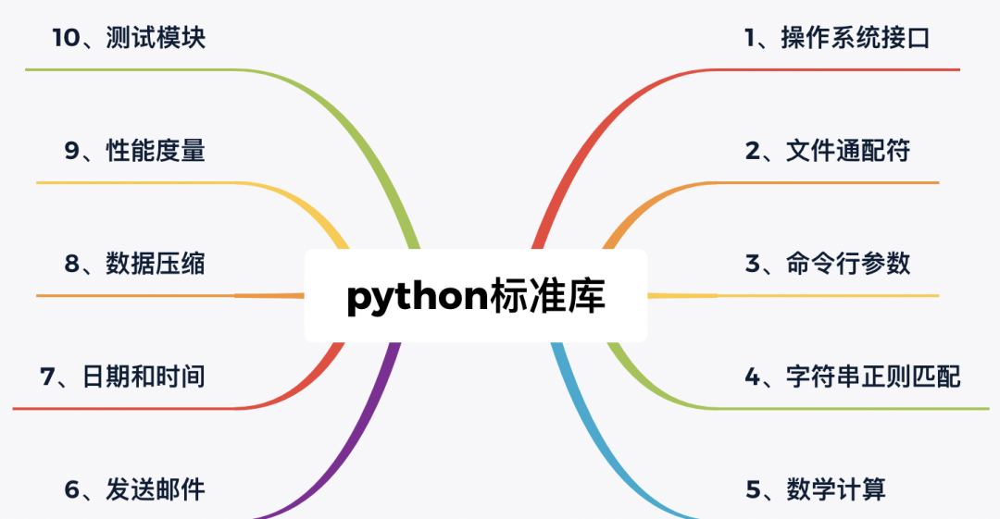

Python<br />
<a name="g8LMT"></a>
## 1、操作系统接口
os模块提供了不少与操作系统相关联的函数。
```python
>>> import os
>>> os.getcwd()      # 返回当前的工作目录
'C:\\Python34'
>>> os.chdir('/server/accesslogs')   # 修改当前的工作目录
>>> os.system('mkdir today')   # 执行系统命令 mkdir
```
建议使用 "`import os`" 风格而非 "`from os import *`"。这样可以保证随操作系统不同而有所变化的 `os.open()` 不会覆盖内置函数 `open()`。<br />os常用命令

| 序号 | 方法 | 功能 |
| --- | --- | --- |
| 1 | `os.access(path, mode)` | 检验权限模式 |
| 2 | `os.chdir(path)` | 改变当前工作目录 |
| 3 | `os.chflags(path, flags)` | 设置路径的标记为数字标记。 |
| 4 | `os.chmod(path, mode)` | 更改权限 |
| 5 | `os.chown(path, uid, gid)` | 更改文件所有者 |
| 6 | `os.chroot(path)` | 改变当前进程的根目录 |
| 7 | `os.close(fd)` | 关闭文件描述符 fd |
| 8 | `os.closerange(fd_low, fd_high)` | 关闭所有文件描述符，从 fd_low (包含) 到 fd_high (不包含), 错误会忽略 |
| 9 | `os.dup(fd)` | 复制文件描述符 fd |
| 10 | `os.dup2(fd, fd2)` | 将一个文件描述符 fd 复制到另一个 fd2 |

<a name="RcCzA"></a>
## 2、文件通配符
glob模块提供了一个函数用于从目录通配符搜索中生成文件列表：
```python
>>> import glob
>>> glob.glob('*.py')
['primes.py', 'random.py', 'quote.py']
```
<a name="m52YW"></a>
## 3、命令行参数
通用工具脚本经常调用命令行参数。这些命令行参数以链表形式存储于 sys 模块的 argv 变量。
```python
sys.argv
```
可以用`sys.argv`获取当前正在执行的命令行参数的参数列表(list)。<br />变量解释

- `sys.argv[0]`当前程序名
- `sys.argv[1]`第一个参数
- `sys.argv[2]`第二个参数

`len(sys.argv)-1` 参数个数(减去文件名)<br />例如在命令行中执行 "python demo.py one two three" 后可以得到以下输出结果：
```python
>>> import sys
>>> print(sys.argv)
['demo.py', 'one', 'two', 'three']
```
<a name="Hohta"></a>
## 4、字符串正则匹配
re模块为高级字符串处理提供了正则表达式工具。可以说是爬虫必备，对于复杂的匹配和处理，正则表达式提供了简洁、优化的解决方案:如果只需要简单的功能，应该首先考虑字符串方法，因为它们非常简单，易于阅读和调试:
```python
>>> 'tea for too'.replace('too', 'two')
'tea for two'
```
`re.match`函数<br />`re.match` 尝试从字符串的起始位置匹配一个模式，如果不是起始位置匹配成功的话，match()就返回none。<br />函数语法：
```python
re.match(pattern, string, flags=0)
```
函数参数说明：

| 参数 | 描述 |
| --- | --- |
| pattern | 匹配的正则表达式 |
| string | 要匹配的字符串。 |
| flags | 标志位，用于控制正则表达式的匹配方式，如：是否区分大小写，多行匹配等等。 |

匹配成功`re.match`方法返回一个匹配的对象，否则返回None。<br />可以使用`group(num)` 或 `groups()` 匹配对象函数来获取匹配表达式。

| 匹配对象方法 | 描述 |
| --- | --- |
| group(num=0) | 匹配的整个表达式的字符串，group() 可以一次输入多个组号，在这种情况下它将返回一个包含那些组所对应值的元组。 |
| groups() | 返回一个包含所有小组字符串的元组，从 1 到 所含的小组号。 |

<a name="tAUTO"></a>
## 5、数学计算
math模块为浮点运算提供了对底层C函数库的访问:
```python
>>> import math
>>> math.cos(math.pi / 4)
0.70710678118654757
>>> math.log(1024, 2)
10.0
```
在实际工作中，math标准库往往无法满足需求，我还需要扩展库：NumPy<br />NumPy(Numerical Python) 支持大量的维度数组与矩阵运算，此外也针对数组运算提供大量的数学函数库。

- NumPy 官网 [http://www.numpy.org/](http://www.numpy.org/)
<a name="Z7taG"></a>
## 6、发送邮件
有几个模块用于访问互联网以及处理网络通信协议。其中最简单的两个是用于处理从 urls 接收的数据的 urllib.request 以及用于发送电子邮件的 smtplib：
```python
import smtplib
smtpObj = smtplib.SMTP( [host [, port [, local_hostname]]] )
```
参数说明：

- host: SMTP 服务器主机。你可以指定主机的ip地址或者域名如: runoob.com，这个是可选参数。
- port: 如果你提供了 host 参数, 你需要指定 SMTP 服务使用的端口号，一般情况下 SMTP 端口号为25。
- local_hostname: 如果 SMTP 在你的本机上，你只需要指定服务器地址为 localhost 即可。

Python SMTP 对象使用 sendmail 方法发送邮件，语法如下：
```python
SMTP.sendmail(from_addr, to_addrs, msg[, mail_options, rcpt_options])
```
参数说明：

- from_addr: 邮件发送者地址。
- to_addrs: 字符串列表，邮件发送地址。
- msg: 发送消息

案例：
```python
#!/usr/bin/python
# -*- coding: UTF-8 -*-
import smtplib
from email.mime.text import MIMEText
from email.header import Header
sender = 'from@runoob.com'
receivers = ['429240967@qq.com']  # 接收邮件，可设置为你的QQ邮箱或者其他邮箱
# 三个参数：第一个为文本内容，第二个 plain 设置文本格式，第三个 utf-8 设置编码
message = MIMEText('Python 邮件发送测试...', 'plain', 'utf-8')
message['From'] = Header("菜鸟教程", 'utf-8')   # 发送者
message['To'] =  Header("测试", 'utf-8')        # 接收者
subject = 'Python SMTP 邮件测试'
message['Subject'] = Header(subject, 'utf-8')
try:
    smtpObj = smtplib.SMTP('localhost')
    smtpObj.sendmail(sender, receivers, message.as_string())
    print "邮件发送成功"
except smtplib.SMTPException:
    print "Error: 无法发送邮件"
```
<a name="DAZdx"></a>
## 7、日期和时间
datetime模块为日期和时间处理同时提供了简单和复杂的方法。<br />支持日期和时间算法的同时，实现的重点放在更有效的处理和格式化输出。<br />该模块还支持时区处理：
```python
>>> # dates are easily constructed and formatted
>>> from datetime import date
>>> now = date.today()
>>> now
datetime.date(2003, 12, 2)
>>> now.strftime("%m-%d-%y. %d %b %Y is a %A on the %d day of %B.")
'12-02-03. 02 Dec 2003 is a Tuesday on the 02 day of December.'
```
时间的三种存在方式：时间对象，时间字符串，时间戳。
<a name="r7KRo"></a>
### （1）字符串转datetime：
```python
>>> string = '2014-01-08 11:59:58'
>>> time1 = datetime.datetime.strptime(string,'%Y-%m-%d %H:%M:%S')
>>> print time1
2014-01-08 11:59:58
```
<a name="tc2AS"></a>
### （2）datetime转字符串：
```python
>>> time1_str = datetime.datetime.strftime(time1,'%Y-%m-%d %H:%M:%S')
>>> time1_str
'2014-01-08 11:59:58'
```
<a name="o0OjB"></a>
### （3）时间戳转时间对象：
```python
>>>time1 = time.localtime()
>>>time1_str = datetime.datetime.fromtimestamp(time1)
```
<a name="JhZ9g"></a>
## 8、数据压缩
以下模块直接支持通用的数据打包和压缩格式：zlib，gzip，bz2，zipfile，以及 tarfile。
```python
>>> import zlib
>>> s = b'witch which has which witches wrist watch'
>>> len(s)
41
>>> t = zlib.compress(s)
>>> len(t)
37
>>> zlib.decompress(t)
b'witch which has which witches wrist watch'
>>> zlib.crc32(s)
226805979
```
<a name="j4dUt"></a>
## 9、性能度量
有些用户对了解解决同一问题的不同方法之间的性能差异很感兴趣。Python 提供了一个度量工具，为这些问题提供了直接答案。<br />例如，使用元组封装和拆封来交换元素看起来要比使用传统的方法要诱人的多,timeit 证明了现代的方法更快一些。
```python
>>> from timeit import Timer
>>> Timer('t=a; a=b; b=t', 'a=1; b=2').timeit()
0.57535828626024577
>>> Timer('a,b = b,a', 'a=1; b=2').timeit()
0.54962537085770791
```
相对于 timeit 的细粒度，:mod:profile 和 pstats 模块提供了针对更大代码块的时间度量工具。
<a name="wBCgr"></a>
## 10、测试模块
开发高质量软件的方法之一是为每一个函数开发测试代码，并且在开发过程中经常进行测试<br />doctest模块提供了一个工具，扫描模块并根据程序中内嵌的文档字符串执行测试。<br />测试构造如同简单的将它的输出结果剪切并粘贴到文档字符串中。<br />通过用户提供的例子，它强化了文档，允许 doctest 模块确认代码的结果是否与文档一致：
```python
def average(values):
    """Computes the arithmetic mean of a list of numbers.

    >>> print(average([20, 30, 70]))
    40.0
    """
    return sum(values) / len(values)

import doctest
doctest.testmod()   # 自动验证嵌入测试
```
<a name="h3kd7"></a>
## 11、操作数据库：MySQLdb
安装MySQLdb，请访问 [http://sourceforge.net/projects/mysql-python](http://sourceforge.net/projects/mysql-python) 
```python
import MySQLdb
# 连接数据库
conn = MySQLdb.connect(host='localhost',user='root',passwd='xxxx',db='test1')
# 获取cursor对象来进行操作
cursor = conn.cursor()
# 从你的全世界错过~
sql = "select * from world where someone like 'you' "
# 执行sql
cursor.execute(sql)
```
<a name="Gt3gs"></a>
## 12、Web 开发：flask
把客户端所有的请求都转发给这个程序实例
```python
from flask import Flask
import datetime
server=Flask(__name__)
@server.route('/time',methods=['post','get'])
def get_time():
    now=str(datetime.datetime.now())#把当前时间转换成字符串
    return "当前的时间是：%s"%now
server.run(port=8888)
```
<a name="rDoug"></a>
## 13、网络爬虫：requests
Requests 允许发送纯天然的 HTTP/1.1 请求，无需手工劳动。不需要手动为 URL 添加查询字串，也不需要对 POST 数据进行表单编码。Keep-alive 和 HTTP 连接池的功能是 100% 自动化的。<br />一个简单的爬虫样例：
```python
import requests
heads = {}
heads['User-Agent'] = 'Mozilla/5.0 ' \
                          '(Macintosh; U; Intel Mac OS X 10_6_8; en-us) AppleWebKit/534.50 ' \
                          '(KHTML, like Gecko) Version/5.1 Safari/534.50'
response = requests.get('http://www.baidu.com',headers=headers)
```
<a name="njUx9"></a>
## 14、操作execl：pandas
```python
# -*- coding: utf-8 -*-
import xlrdimport xlwt
from datetime import date,datetime
def read_excel():
    # 打开文件
    workbook = xlrd.open_workbook(r'F:\demo.xlsx')
    # 获取所有sheet
    print workbook.sheet_names() # [u'sheet1', u'sheet2']
    sheet2_name = workbook.sheet_names()[1]
    # 根据sheet索引或者名称获取sheet内容
    sheet2 = workbook.sheet_by_index(1) # sheet索引从0开始
    sheet2 = workbook.sheet_by_name('sheet2')
    # sheet的名称，行数，列数
    print sheet2.name,sheet2.nrows,sheet2.ncols
    # 获取整行和整列的值（数组）
    rows = sheet2.row_values(3) # 获取第四行内容
    cols = sheet2.col_values(2) # 获取第三列内容
    print rows
    print cols
    # 获取单元格内容
    print sheet2.cell(1,0).value.encode('utf-8')
    print sheet2.cell_value(1,0).encode('utf-8')
    print sheet2.row(1)[0].value.encode('utf-8')
    # 获取单元格内容的数据类型
    print sheet2.cell(1,0).ctype
if __name__ == '__main__':
    read_excel()
```
<a name="FS0h0"></a>
## 15、数据分析：numpy
NumPy 包含大量的各种数学运算的函数，包括三角函数，算术运算的函数，复数处理函数等。<br />NumPy 提供了多种排序的方法。这些排序函数实现不同的排序算法，每个排序算法的特征在于执行速度，最坏情况性能，所需的工作空间和算法的稳定性。下表显示了三种排序算法的比较。<br />三角函数<br />NumPy 提供了标准的三角函数：`sin()`、`cos()`、`tan()`。
```python
import numpy as np
a = np.array([0,30,45,60,90])
print ('不同角度的正弦值：')
# 通过乘 pi/180 转化为弧度  
print (np.sin(a*np.pi/180))
print ('\n')
print ('数组中角度的余弦值：')
print (np.cos(a*np.pi/180))
print ('\n')
print ('数组中角度的正切值：')
print (np.tan(a*np.pi/180))
```
<a name="KYrtv"></a>
## 16、数据画图分析：Matplotlib
```python
import numpy as np 
from matplotlib import pyplot as plt 
x = np.arange(1,11) 
y =  2  * x +  5 
plt.title("Matplotlib demo") 
plt.xlabel("x axis caption") 
plt.ylabel("y axis caption") 
plt.plot(x,y) 
plt.show()
```
以上实例中，`np.arange()` 函数创建 x 轴上的值。y 轴上的对应值存储在另一个数组对象 y 中。这些值使用 matplotlib 软件包的 pyplot 子模块的 `plot()` 函数绘制。<br />图形由 `show()` 函数显示。<br />
<a name="rm2RI"></a>
## 17、科学计算：scipy
`scipy.special`库中的特殊函数都是超越函数，所谓超越函数是指变量之间的关系不能用有限次加、减、乘、除、乘方、开方 运算表示的函数。如初等函数中的三角函数、反三角函数与对数函数、指数函数都是初等超越函数，一般来说非初等函数都是超越函数。<br />初等函数：指由基本初等函数经过有限次四则运算与复合运算所得到的函数<br /><br />
<a name="EmzKm"></a>
## 18、视觉及图像处理：PIL（pillow）
<a name="xPK9N"></a>
### 创建缩略图
```python
import os
from PIL import Image

image_path = 'python-logo.png'  # 图片位置
size = (128, 128)  # 文件大小
f, e = os.path.splitext(image_path)  # 获取文件名与后缀
outfile = f + ".thumbnail"
if image_path != outfile:
    try:
        im = Image.open(image_path)
        im.thumbnail(size)  # 设置缩略图大小
        im.save(outfile, "JPEG")
    except IOError:
        print("cannot convert", image_path)
```
<a name="yebv4"></a>
### 创建滚动图形
Python学得好，PS也能干！
```python
from PIL import Image

def roll(image, delta):
    """ 向侧面滚动图像 """
    xsize, ysize = image.size
    roll(im, 300).show()  # 向侧面滚动 300 像素
    delta = delta % xsize
    if delta == 0: return image

    part1 = image.crop((0, 0, delta, ysize))
    part2 = image.crop((delta, 0, xsize, ysize))
    image.paste(part1, (xsize - delta, 0, xsize, ysize))
    image.paste(part2, (0, 0, xsize - delta, ysize))

    return image


if __name__ == '__main__':
    image_path = 'test.jpg'
    im = Image.open(image_path)
```
<a name="Sh6XU"></a>
## 19、图形界面开发：PyQT
俄罗斯方块游戏是有史以来最受欢迎的电脑游戏。<br />最初的游戏是由俄罗斯设计和编程的程序员阿列克谢帕基特诺夫于1985年。此后,俄罗斯方块是几乎所有的计算机平台上可用在很多变化。<br />俄罗斯方块称为积木拼图游戏。在这个游戏中,我们有七种不同形状叫tetrominoes:“s”形,Z-shape,t形,一个l型的空间,一个线,MirroredL-shape和正方形。这些形状的形成有四个方格。形状是跌倒。俄罗斯方块游戏的对象是移动和旋转的形状使他们适合尽可能多。<br />如果我们设法形成一个行,该行摧毁我们得分。我们直到我们玩俄罗斯方块游戏。<br /><br />PyQt5是一种用于创建应用程序的工具。还有其他的库是针对创建电脑游戏。<br />然而,PyQt5和其他应用程序工具包可以用来创建简单的游戏。<br />创建一个电脑游戏是一个提高编程技能的很好的方发。
<a name="GQ62A"></a>
## 20、游戏开发：pygame

- Pygame是一组跨平台的Python模块, 用于创建视频游戏。
- 它由旨在与Python编程语言一起使用的计算机图形和声音库组成。
- Pygame由Pete Shinners正式编写, 以取代PySDL。
- Pygame适合于创建客户端应用程序, 这些应用程序可以包装在独立的可执行文件中。
```python
import pygame
pygame.init()
screen = pygame.display.set_mode((400, 500))
done = False
while not done:
    for event in pygame.event.get():
        if event.type == pygame.QUIT:
            done = True
    pygame.display.flip()
```
