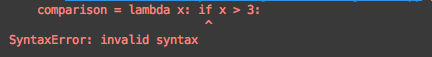

Python
<a name="GrreW"></a>
## 1、`for`循环中的`else`条件
这是一个for-else方法，循环遍历列表时使用`else`语句。<br />下面举个例子，比如想检查一个列表中是否包含奇数。<br />那么可以通过`for`循环，遍历查找。
```python
numbers = [2, 4, 6, 8, 1]

for number in numbers:
    if number % 2 == 1:
        print(number)
        break
else:
    print("No odd numbers")
```
如果找到了奇数，就会打印该数值，并且执行`break`语句，跳过`else`语句。<br />没有的话，就不会执行`break`语句，而是执行`else`语句。
<a name="OwkiR"></a>
## 2、从列表中获取元素，定义多个变量
```python
my_list = [1, 2, 3, 4, 5]
one, two, three, four, five = my_list
```
<a name="MdvjQ"></a>
## 3、使用`heapq`模块，获取列表中`n`个最大或最小的元素
```python
import heapq

scores = [51, 33, 64, 87, 91, 75, 15, 49, 33, 82]

print(heapq.nlargest(3, scores))  # [91, 87, 82]
print(heapq.nsmallest(5, scores))  # [15, 33, 33, 49, 51]
```
<a name="xZU1H"></a>
## 4、将列表中的所有元素作为参数传递给函数
可以使用 `*` 号，提取列表中所有的元素
```python
my_list = [1, 2, 3, 4]

print(my_list)  # [1, 2, 3, 4]
print(*my_list)  # 1 2 3 4
```
如此便可以将列表中的所有元素，作为参数传递给函数
```python
def sum_of_elements(*arg):
    total = 0
    for i in arg:
        total += i

    return total


result = sum_of_elements(*[1, 2, 3, 4])
print(result)  # 10
```
<a name="Fja2X"></a>
## 5、获取列表的所有中间元素
```python
_, *elements_in_the_middle, _ = [1, 2, 3, 4, 5, 6, 7, 8]
print(elements_in_the_middle)  # [2, 3, 4, 5, 6, 7]
```
<a name="ww2vy"></a>
## 6、使用一行代码赋值多个变量
```python
one, two, three, four = 1, 2, 3, 4
```
<a name="rP90v"></a>
## 7、列表推导式
只用一行代码，便可完成对数组的迭代以及运算。<br />比如，将列表中的每个数字提高一倍。
```python
numbers = [1, 2, 3, 4, 5]
squared_numbers = [num * num for num in numbers]

print(squared_numbers) # [1, 4, 9, 16, 25]
```
推导式不仅列表能用，字典、集合、生成器也能使用。<br />下面看一下，使用字典推导式，将字典的值提高一倍。
```python
dictionary = {'a': 4, 'b': 5}
squared_dictionary = {key: num * num for (key, num) in dictionary.items()}

print(squared_dictionary)  # {'a': 16, 'b': 25}
```
<a name="i4ikl"></a>
## 8、通过`Enum`枚举同一标签或一系列常量的集合
枚举是绑定到唯一的常量值的一组符号名称(成员)。<br />在枚举中，成员可以通过身份进行比较，枚举本身可以迭代。
```python
from enum import Enum


class Status(Enum):
    NO_STATUS = -1
    NOT_STARTED = 0
    IN_PROGRESS = 1
    COMPLETED = 2


print(Status.IN_PROGRESS.name)  # IN_PROGRESS
print(Status.COMPLETED.value)  # 2
```
<a name="oZEGB"></a>
## 9、重复字符串
```python
name = "Banana"
print(name * 4)  # BananaBananaBananaBanana
```
<a name="H5Rvh"></a>
## 10、比较3个数字的大小
如果想比较一个值和其他两个值的大小情况，可以使用简单的数学表达式。
```python
1 < x < 10
```
这个是最简单的代数表达式，在Python中也是可以使用的。
```python
x = 3

print(1 < x < 10)  # True
print(1 < x and x < 10)  # True
```
<a name="FQ98e"></a>
## 11、使用1行代码合并字典
```python
first_dictionary = {'name': 'Fan', 'location': 'Guangzhou'}
second_dictionary = {'name': 'Fan', 'surname': 'Xiao', 'location': 'Guangdong, Guangzhou'}

result = first_dictionary | second_dictionary

print(result)
# {'name': 'Fan', 'location': 'Guangdong, Guangzhou', 'surname': 'Xiao'}
```
<a name="IJaop"></a>
## 12、查找元组中元素的索引
```python
books = ('Atomic habits', 'Ego is the enemy', 'Outliers', 'Mastery')

print(books.index('Mastery'))   # 3
```
<a name="ORw7N"></a>
## 13、将字符串转换为字符串列表
假设在函数中获得输出，原本应该是一个列表，但实际上却是一个字符串。
```python
input = "[1,2,3]"
```
可能第一时间会想到使用索引或者正则表达式。<br />实际上，使用`ast`模块的`literal_eval`方法就能搞定。
```python
import ast


def string_to_list(string):
    return ast.literal_eval(string)


string = "[1, 2, 3]"
my_list = string_to_list(string)
print(my_list)  # [1, 2, 3]

string = "[[1, 2, 3],[4, 5, 6]]"
my_list = string_to_list(string)
print(my_list)  # [[1, 2, 3], [4, 5, 6]]
```
<a name="JLKKn"></a>
## 14、计算两数差值
计算出2个数字之间的差值。
```python
def subtract(a, b):
    return a - b


print((subtract(1, 3)))  # -2
print((subtract(3, 1)))  # 2
```
上面的这个方法，需要考虑数值的先后顺序。
```python
def subtract(a, b):
    return a - b


print((subtract(a=1, b=3)))  # -2
print((subtract(b=3, a=1)))  # -2
```
使用命名参数，安排顺序，这样就不会出错了。
<a name="JEqcs"></a>
## 15、用一个`print()`语句打印多个元素
```python
print(1, 2, 3, "a", "z", "this is here", "here is something else")
```
<a name="b2iGi"></a>
## 16、在同一行打印多个元素
```python
print("Hello", end="")
print("World")  # HelloWorld

print("Hello", end=" ")
print("World")  # Hello World

print('words',   'with', 'commas', 'in', 'between', sep=', ')
# words, with, commas, in, between
```
<a name="BHxbb"></a>
## 17、打印多个值，在每个值之间使用自定义分隔符
```python
print("29", "01", "2022", sep="/")  # 29/01/2022

print("name", "domain.com", sep="@")  # name@domain.com
```
<a name="N2isW"></a>
## 18、不能在变量名的开头使用数字
```python
four_letters = "abcd" # this works

4_letters = "abcd" # this doesn’t work
```
这是Python的变量命名规则。
<a name="NMgAU"></a>
## 19、不能在变量名的开头使用运算符
```python
+variable = "abcd"  # this doesn’t work
```
<a name="INnjl"></a>
## 20、数字的第一位不能是0
```python
number = 0110 # this doesn't work
```
<a name="VsqNe"></a>
## 21、在变量名的任何地方使用下划线
```python
a______b = "abcd"  # this works
_a_b_c_d = "abcd"  # this also works
```
这并不意味着，可以无限使用，为了代码的易读性，还是需要合理使用。
<a name="pddsK"></a>
## 22、使用下划线分割数值较大的数字
```python
print(1_000_000_000)  # 1000000000
print(1_234_567)  # 1234567
```
如此，看到一大堆数字时，也能轻松阅读。
<a name="Om1yY"></a>
## 23、反转列表
```python
my_list = ['a', 'b', 'c', 'd']

my_list.reverse()

print(my_list)  # ['d', 'c', 'b', 'a']
```
<a name="uwEyh"></a>
## 24、使用步进函数对字符串切片
```python
my_string = "This is just a sentence"
print(my_string[0:5])  # This

# Take three steps forward
print(my_string[0:10:3])  # Tsse
```
<a name="LLqtW"></a>
## 25、反向切片
```python
my_string = "This is just a sentence"
print(my_string[10:0:-1])  # suj si sih

# Take two steps forward
print(my_string[10:0:-2])  # sjs i
```
<a name="tLjaW"></a>
## 26、使用开始或结束索引进行切片
```python
my_string = "This is just a sentence"
print(my_string[4:])  # is just a sentence

print(my_string[:3])  # Thi
```
<a name="exnH1"></a>
## 27、`/`和`//`的区别
```python
print(3/2)  # 1.5
print(3//2)  # 1
```
<a name="PpFVk"></a>
## 28、`==`和`is`的区别
`is`：检查两个变量是否指向同一对象内存中<br />`==`：比较两个对象的值
```python
first_list = [1, 2, 3]
second_list = [1, 2, 3]

# 比较两个值
print(first_list == second_list)  # True

# 是否指向同一内存
print(first_list is second_list)  
# False


third_list = first_list

print(third_list is first_list)  
# True
```
<a name="ZipW7"></a>
## 29、合并字典
```python
dictionary_one = {"a": 1, "b": 2}
dictionary_two = {"c": 3, "d": 4}

merged = {**dictionary_one, **dictionary_two}

print(merged)  # {'a': 1, 'b': 2, 'c': 3, 'd': 4}
```
<a name="WvFIo"></a>
## 30、检查字符串是否大于另一字符串
```python
first = "abc"
second = "def"

print(first < second)  # True

second = "ab"
print(first < second)  # False
```
<a name="OnT9u"></a>
## 31、检查字符串是否以特定字符开头(不使用索引)
```python
my_string = "abcdef"
print(my_string.startswith("b"))  # False
```
<a name="CLrxx"></a>
## 32、使用`id()`查找变量的唯一id
```python
print(id(1))  # 4325776624
print(id(2))  # 4325776656
print(id("string"))  # 4327978288
```
<a name="EwhJP"></a>
## 33、整数、浮点数、字符串、布尔值和元组都是不可变的
当变量被赋值为整数、浮点数、字符串、布尔值、元组这些不可变类型后，该变量就会指向一个内存对象。<br />如果重新给变量再赋值，它的内存对象就会发生改变。
```python
number = 1
print(id(number))  # 4325215472
print(id(1))  # 4325215472

number = 3
print(id(number))  # 4325215536
print(id(1))  # 4325215472
```
<a name="kgmZk"></a>
## 34、字符串和元组也是不可变的
此处再说明一次。
```python
name = "Fatos"
print(id(name))  # 4422282544

name = "fatos"
print(id(name))  # 4422346608
```
<a name="RGVGW"></a>
## 35、列表、集合和字典都是可变的
这意味着发生更改时，不会改变其内存对象。
```python
cities = ["Beijing", "Guangzhou", "chengdu"]
print(id(cities))  # 4482699712

cities.append("Beijing")
print(id(cities))  # 4482699712
```
下面是字典。
```python
my_set = {1, 2, 3, 4}
print(id(my_set))  # 4352726176

my_set.add(5)
print(id(my_set))  # 4352726176
```
<a name="uYEY2"></a>
## 36、把一个列表变成不可变的列表
```python
my_set = frozenset(['a', 'b', 'c', 'd'])

my_set.add("a")
```
使用`frozenset()`后，就无法更改了。
<a name="lYwUg"></a>
## 37、if-elif块可以在没有`else`块的情况下存在
但是elif不能在没有if语句之前独立存在。
```python
def check_number(number):
    if number > 0:
        return "Positive"
    elif number == 0:
        return "Zero"

    return "Negative"


print(check_number(1))  # Positive
```
<a name="MdP0R"></a>
## 38、使用`sorted()`检查2个字符串是否为相同
```python
def check_if_anagram(first_word, second_word):
    first_word = first_word.lower()
    second_word = second_word.lower()
    return sorted(first_word) == sorted(second_word)


print(check_if_anagram("testinG", "Testing"))  # True
print(check_if_anagram("Here", "Rehe"))  # True
print(check_if_anagram("Know", "Now"))  # False
```
<a name="tIwZ9"></a>
## 39、获取字符的`Unicode`值
```python
print(ord("A"))  # 65
print(ord("B"))  # 66
print(ord("C"))  # 66
print(ord("a"))  # 97
```
<a name="lwWPB"></a>
## 40、获取字典的键
```python
dictionary = {"a": 1, "b": 2, "c": 3}

keys = dictionary.keys()
print(list(keys))  # ['a', 'b', 'c']
```
<a name="CngLo"></a>
## 41、获取字典的值
```python
dictionary = {"a": 1, "b": 2, "c": 3}

values = dictionary.values()
print(list(values))  # [1, 2, 3]
```
<a name="Pz2OU"></a>
## 42、交换字典的键、值位置
```python
dictionary = {"a": 1, "b": 2, "c": 3}

reversed_dictionary = {j: i for i, j in dictionary.items()}
print(reversed)  # {1: 'a', 2: 'b', 3: 'c'}
```
<a name="BpERM"></a>
## 43、将布尔值转换为数字
```python
print(int(False))  # 0
print(float(True))  # 1.0
```
<a name="XtNl4"></a>
## 44、在算术运算中使用布尔值
```python
x = 10
y = 12

result = (x - False)/(y * True)
print(result)  # 0.8333333333333334
```
<a name="dH5Iw"></a>
## 45、将任何数据类型转换为布尔值
```python
print(bool(.0))  # False
print(bool(3))  # True
print(bool("-"))  # True
print(bool("string"))  # True
print(bool(" "))  # True
```
<a name="tNAUP"></a>
## 46、将值转换为复数
```python
print(complex(10, 2))  # (10+2j)
```
也可以将数字转换为十六进制数。
```python
print(hex(11))  # 0xb
```
<a name="NJ4bt"></a>
## 47、在列表的第一个位置添加一个值
如果使用`append()`，将从列表的最后一个位置插入新值。<br />可以通过使用`insert()`，来指定插入新元素的索引和数值。<br />那么列表的第一个位置为0，即下标为0。
```python
my_list = [3, 4, 5]

my_list.append(6)
my_list.insert(0, 2)
print(my_list)  # [2, 3, 4, 5, 6]
```
<a name="pyJgI"></a>
## 48、Lambda函数只能在一行代码中
无法通过多行代码，来使用lambda函数。
```python
comparison = lambda x: if x > 3:
                    print("x > 3")
                else:
                    print("x is not greater than 3")
```
报错。<br />
<a name="PiqeB"></a>
## 49、Lambda中的条件语句应始终包含`else`语句
```python
comparison = lambda x: "x > 3" if x > 3
```
运行上面的代码，报错。<br /><br />这是由于条件表达式的特性，而不是lambda的导致的。
<a name="sYpz4"></a>
## 50、使用`filter()`，获得一个新对象
```python
my_list = [1, 2, 3, 4]

odd = filter(lambda x: x % 2 == 1, my_list)

print(list(odd))   # [1, 3]
print(my_list)  # [1, 2, 3, 4]
```
<a name="ZonDy"></a>
## 51、`map()`返回一个新对象
`map()`函数将给定函数应用于可迭代对象(列表、元组等)，然后返回结果(map对象)。
```python
my_list = [1, 2, 3, 4]

squared = map(lambda x: x ** 2, my_list)

print(list(squared))   # [1, 4, 9, 16]
print(my_list)  # [1, 2, 3, 4]
```
<a name="RINdm"></a>
## 52、`range()`的`step`参数
```python
for number in range(1, 10, 3):
    print(number, end=" ")
# 1 4 7
```
<a name="FsOn1"></a>
## 53、`range()`默认从0开始
```python
def range_with_zero(number):
    for i in range(0, number):
        print(i, end=' ')


def range_with_no_zero(number):
    for i in range(number):
        print(i, end=' ')


range_with_zero(3)  # 0 1 2
range_with_no_zero(3)  # 0 1 2
```
<a name="yu27e"></a>
## 54、不需要和0比较长度
如果长度大于0，则默认为`True`。
```python
def get_element_with_comparison(my_list):
    if len(my_list) > 0:
        return my_list[0]


def get_first_element(my_list):
    if len(my_list):
        return my_list[0]


elements = [1, 2, 3, 4]
first_result = get_element_with_comparison(elements)
second_result = get_element_with_comparison(elements)

print(first_result == second_result)  # True
```
<a name="M8MtH"></a>
## 55、可以在同一个作用域内多次定义一个方法
但是，只有最后一个会被调用，覆盖以前。
```python
def get_address():
    return "First address"


def get_address():
    return "Second address"


def get_address():
    return "Third address"


print(get_address())  # Third address
```
<a name="wkyTp"></a>
## 56、在外部直接访问私有属性
在定义属性或方法时，在属性名或者方法名前增加两个下划线，定义的就是私有属性或方法。<br />如果想要在外部访问，那么只需要在名称前面加上 '`_类名`' 变成 '`_类名__名称`'。
```python
class Engineer:
    def __init__(self, name):
        self.name = name
        self.__starting_salary = 62000


dain = Engineer('Dain')
print(dain._Engineer__starting_salary)  # 62000
```
<a name="ATgC6"></a>
## 57、检查对象的内存使用情况
```python
import sys

print(sys.getsizeof("bitcoin"))  # 56
```
<a name="hJbt1"></a>
## 58、定义一个方法，可以调用任意个参数
```python
def get_sum(*arguments):
    result = 0
    for i in arguments:
        result += i
    return result


print(get_sum(1, 2, 3))  # 6
print(get_sum(1, 2, 3, 4, 5))  # 15
print(get_sum(1, 2, 3, 4, 5, 6, 7))  # 28
```
<a name="fbeTS"></a>
## 59、使用`super()`或父类的名称调用父类的初始化
使用`super`函数调用父类的初始化方法。
```python
class Parent:
    def __init__(self, city, address):
        self.city = city
        self.address = address


class Child(Parent):
    def __init__(self, city, address, university):
        super().__init__(city, address)
        self.university = university


child = Child('Peking University', 'Fudan University', 'Tsinghua University')
print(child.university)  # Tsinghua University
```
使用父类的名称调用父类。
```python
class Parent:
    def __init__(self, city, address):
        self.city = city
        self.address = address


class Child(Parent):
    def __init__(self, city, address, university):
        Parent.__init__(self, city, address)
        self.university = university


child = Child('Peking University', 'Fudan University', 'Tsinghua University')
print(child.university)  # Tsinghua University
```
<a name="FFAXn"></a>
## 60、在类中使用 + 操作符
在两个int数据类型之间使用 + 运算符时，将得到它们的和。<br />而在两个字符串数据类型之间使用它时，会将其合并。
```python
print(10 + 1)  # 两数相加
print('first' + 'second')  # 字符串相加
```
这个就是操作符重载，还可以在类中使用(`__add__`)。
```python
class Expenses:
    def __init__(self, rent, groceries):
        self.rent = rent
        self.groceries = groceries

    def __add__(self, other):
        return Expenses(self.rent + other.rent,
                        self.groceries + other.groceries)


april_expenses = Expenses(1000, 200)
may_expenses = Expenses(1000, 300)

total_expenses = april_expenses + may_expenses
print(total_expenses.rent)  # 2000
print(total_expenses.groceries)  # 500
```
<a name="VlHwU"></a>
## 61、在类中使用 `<` 和 `==` 操作符
下面定义一个操作重载示例( `<` 操作符)，使用`__lt__`方法。
```python
class Game:
    def __init__(self, score):
        self.score = score

    def __lt__(self, other):
        return self.score < other.score


first = Game(1)
second = Game(2)

print(first < second)  # True
```
同样的，`==` 操作符使用`__eq__`方法。
```python
class Journey:
    def __init__(self, location, destination, duration):
        self.location = location
        self.destination = destination
        self.duration = duration

    def __eq__(self, other):
        return ((self.location == other.location) and
                (self.destination == other.destination) and
                (self.duration == other.duration))


first = Journey('Location A', 'Destination A', '30min')
second = Journey('Location B', 'Destination B', '30min')

print(first == second)
```
还有一些其他的定义。
```python
__sub__() for -
__mul__() for *
__truediv__() for /
__ne__() for !=
__ge__() for >=
__gt__() for >
```
<a name="Sp25h"></a>
## 62、为类的对象定义自定义的可打印版本
```python
class Rectangle:
    def __init__(self, a, b):
        self.a = a
        self.b = b

    def __repr__(self):
        return repr('Rectangle with area=' + str(self.a * self.b))


print(Rectangle(3, 4))  # 'Rectangle with area=12'
```
<a name="uBEIw"></a>
## 63、交换字符串中字符的大小写
```python
string = "This is just a sentence."
result = string.swapcase()

print(result)  # tHIS IS JUST A SENTENCE.
```
<a name="cA1p6"></a>
## 64、检查字符串是否都是空格
```python
string = "  "
result = string.isspace()

print(result)  # True
```
<a name="VkmZf"></a>
## 65、检查字符串是否都是字母或数字
```python
name = "Password"
print(name.isalnum())  # True

name = "Secure Password "
print(name.isalnum())  # False

name = "S3cur3P4ssw0rd"
print(name.isalnum())  # True

name = "133"
print(name.isalnum())  # True
```
<a name="M5zHY"></a>
## 66、检查字符串是否都是字母
```python
string = "Name"
print(string.isalpha())  # True

string = "Firstname Lastname"
print(string.isalpha())  # False

string = "P4ssw0rd"
print(string.isalpha())  # False
```
<a name="JNCux"></a>
## 67、根据参数删除字符
从右侧开始。
```python
string = "This is a sentence with       "
print(string.rstrip())  # "This is a sentence with"

string = "this here is a sentence…..,,,,aaaaasd"
print(string.rstrip(".,dsa"))  # "this here is a sentence"
```
同样的，左侧也能操作。
```python
string = "ffffffffFirst"
print(string.lstrip("f"))  # First
```
<a name="QU9PP"></a>
## 68、检查字符串是否为数字
```python
string = "seven"
print(string.isdigit())  # False

string = "1337"
print(string.isdigit())  # True

string = "5a"
print(string.isdigit())  # False

string = "2**5"
print(string.isdigit())  # False
```
<a name="l0afn"></a>
## 69、检查字符串是否为中文数字
```python
# 42673
string = "四二六七三"

print(string.isdigit())  # False
print(string.isnumeric())  # True
```
<a name="RtVHr"></a>
## 70、检查字符串是否所有单词都是大写开头
```python
string = "This is a sentence"
print(string.istitle())  # False

string = "10 Python Tips"
print(string.istitle())  # True

string = "How to Print A String in Python"
# False
print(string.istitle())

string = "PYTHON"
print(string.istitle())  # False
```
<a name="WSLN8"></a>
## 71、在元组中使用负索引
```python
numbers = (1, 2, 3, 4)

print(numbers[-1])  # 4
print(numbers[-4])  # 1
```
<a name="Hc1a2"></a>
## 72、在元组中嵌套列表和元组
```python
mixed_tuple = (("a"*10, 3, 4), ['first', 'second', 'third'])

print(mixed_tuple[1])  # ['first', 'second', 'third']
print(mixed_tuple[0])  # ('aaaaaaaaaa', 3, 4)
```
<a name="Zn9r5"></a>
## 73、快速统计元素在列表中出现的次数
```python
names = ["Besim", "Albert", "Besim", "Fisnik", "Meriton"]

print(names.count("Besim"))  # 2
```
<a name="HsLZw"></a>
## 74、使用`slice()`获取元素
使用`slice()`获取最后n个元素。
```python
my_list = [1, 2, 3, 4, 5, 6, 7, 8, 9, 10]
slicing = slice(-4, None)
print(my_list[slicing])  # [4, 5, 6]

print(my_list[-3])  # 4
```
使用`slice()`做切片任务。
```python
string = "Data Science"

slice_object = slice(5, None)
print(string[slice_object])   # Science
```
<a name="vMPvi"></a>
## 75、计算元素在元组中出现的次数
```python
my_tuple = ('a', 1, 'f', 'a', 5, 'a')

print(my_tuple.count('a'))  # 3
```
<a name="S4Ysc"></a>
## 76、获取元组中元素的索引
```python
my_tuple = ('a', 1, 'f', 'a', 5, 'a')

print(my_tuple.index('f'))  #  2
```
<a name="oxE6X"></a>
## 77、步进获得元组
```python
my_tuple = (1, 2, 3, 4, 5, 6, 7, 8, 9, 10)

print(my_tuple[::3])  # (1, 4, 7, 10)
```
<a name="bTBsd"></a>
## 78、通过索引获取子元组
```python
my_tuple = (1, 2, 3, 4, 5, 6, 7, 8, 9, 10)

print(my_tuple[3:])  # (4, 5, 6, 7, 8, 9, 10)
```
<a name="siH26"></a>
## 79、将列表、集合、字典中所有元素删除
```python
my_list = [1, 2, 3, 4]
my_list.clear()
print(my_list)  # []

my_set = {1, 2, 3}
my_set.clear()
print(my_set)  # set()

my_dict = {"a": 1, "b": 2}
my_dict.clear()
print(my_dict)  # {}
```
<a name="Yo4zp"></a>
## 80、合并集合
使用`union()`方法，返回一个新集合。
```python
first_set = {4, 5, 6}
second_set = {1, 2, 3}

print(first_set.union(second_set))  # {1, 2, 3, 4, 5, 6}
```
还可以使用`update()`方法，将第二个集合的元素插入到第一个集合中去。
```python
first_set = {4, 5, 6}
second_set = {1, 2, 3}

first_set.update(second_set)

print(first_set)  # {1, 2, 3, 4, 5, 6}
```
<a name="iQPRx"></a>
## 81、在函数里输出结果
```python
def is_positive(number):
    print("Positive" if number > 0 else "Negative")  # Positive


is_positive(-3)
```
<a name="LUYvN"></a>
## 82、if语句中的多个条件
```python
math_points = 51
biology_points = 78
physics_points = 56
history_points = 72

my_conditions = [math_points > 50, biology_points > 50,
                 physics_points > 50, history_points > 50]

if all(my_conditions):
    print("Congratulations! You have passed all of the exams.")
else:
    print("I am sorry, but it seems that you have to repeat at least one exam.")
# Congratulations! You have passed all of the exams.
```
<a name="YdVY4"></a>
## 83、在一个if语句中，至少满足多个条件中的一个
```python
math_points = 40
biology_points = 78
physics_points = 56
history_points = 72

my_conditions = [math_points > 50, biology_points > 50,
                 physics_points > 50, history_points > 50]

if any(my_conditions):
    print("Congratulations! You have passed all of the exams.")
else:
    print("I am sorry, but it seems that you have to repeat at least one exam.")
# Congratulations! You have passed all of the exams.
```
<a name="z6NvE"></a>
## 84、任何非空字符串都为`True`
```python
print(bool("Non empty"))  # True
print(bool(""))  # False
```
<a name="OR6pW"></a>
## 85、任何非空列表、元组、字典都为`True`
```python
print(bool([]))  # False
print(bool(set([])))  # False

print(bool({}))  # False
print(bool({"a": 1}))  # True
```
<a name="WGnag"></a>
## 86、`None`、`False`、`0`都为`False`
```python
print(bool(False))  # False
print(bool(None))  # False
print(bool(0))  # False
```
<a name="pS0aC"></a>
## 87、在函数中使用全局变量
在函数无法直接修改全局变量的值。
```python
string = "string"


def do_nothing():
    string = "inside a method"


do_nothing()

print(string)  # string
```
可通过修饰符`global`，修改全局变量的值。
```python
string = "string"


def do_nothing():
    global string
    string = "inside a method"


do_nothing()

print(string)  # inside a method
```
<a name="JGcLi"></a>
## 88、计算字符串或列表中元素的数量
使用`collections`中的`Counter`计算字符串或列表中元素的数量。
```python
from collections import Counter

result = Counter("Banana")
print(result)  # Counter({'a': 3, 'n': 2, 'B': 1})


result = Counter([1, 2, 1, 3, 1, 4, 1, 5, 1, 6])
print(result)  # Counter({1: 5, 2: 1, 3: 1, 4: 1, 5: 1, 6: 1})
```
<a name="D7OsR"></a>
## 89、检查2个字符串是否为相同
可以使用`Counter()`方法。
```python
from collections import Counter


def check_if_anagram(first_string, second_string):
    first_string = first_string.lower()
    second_string = second_string.lower()
    return Counter(first_string) == Counter(second_string)


print(check_if_anagram('testinG', 'Testing'))  # True
print(check_if_anagram('Here', 'Rehe'))  # True
print(check_if_anagram('Know', 'Now'))  # False
```
可以使用`sorted()`方法。
```python
def check_if_anagram(first_word, second_word):
    first_word = first_word.lower()
    second_word = second_word.lower()
    return sorted(first_word) == sorted(second_word)


print(check_if_anagram("testinG", "Testing"))  # True
print(check_if_anagram("Here", "Rehe"))  # True
print(check_if_anagram("Know", "Now"))  # False
```
<a name="Wm9lx"></a>
## 90、使用`itertools`中的`count`计算元素的数量
```python
from itertools import count

my_vowels = ['a', 'e', 'i', 'o', 'u', 'A', 'E', 'I', 'O', 'U']

current_counter = count()

string = "This is just a sentence."

for i in string:
    if i in my_vowels:
        print(f"Current vowel: {i}")
        print(f"Number of vowels found so far: {next(current_counter)}")
```
输出如下。
```python
Current vowel: i
Number of vowels found so far: 0
Current vowel: i
Number of vowels found so far: 1
Current vowel: u
Number of vowels found so far: 2
Current vowel: a
Number of vowels found so far: 3
Current vowel: e
Number of vowels found so far: 4
Current vowel: e
Number of vowels found so far: 5
Current vowel: e
Number of vowels found so far: 6
```
<a name="ml4ij"></a>
## 91、对字符串或列表的元素进行次数排序
`collections`模块的`Counter()`，默认情况下是不会根据元素的频率对它们进行排序的。
```python
from collections import Counter

result = Counter([1, 2, 3, 2, 2, 2, 2])
print(result)  # Counter({2: 5, 1: 1, 3: 1})
print(result.most_common())  # [(2, 5), (1, 1), (3, 1)]
```
`map()`函数将给定函数应用于可迭代对象(列表、元组等)，然后返回结果(`map`对象)。
<a name="s17gg"></a>
## 92、查找列表中出现频率最高的元素
```python
my_list = ['1', 1, 0, 'a', 'b', 2, 'a', 'c', 'a']

print(max(set(my_list), key=my_list.count))  # a
```
<a name="jIzRW"></a>
## 93、`copy()`和`deepcopy()`的区别
浅拷贝: 拷贝父对象，但是不会拷贝对象的内部的子对象。<br />深拷贝: 拷贝父对象，以及其内部的子对象。<br />下面是一个`copy()`的例子。
```python
first_list = [[1, 2, 3], ['a', 'b', 'c']]

second_list = first_list.copy()

first_list[0][2] = 831

print(first_list)  # [[1, 2, 831], ['a', 'b', 'c']]
print(second_list)  # [[1, 2, 831], ['a', 'b', 'c']]
```
这里是一个`deepcopy()`的例子。
```python
import copy

first_list = [[1, 2, 3], ['a', 'b', 'c']]

second_list = copy.deepcopy(first_list)

first_list[0][2] = 831

print(first_list)  # [[1, 2, 831], ['a', 'b', 'c']]
print(second_list)  # [[1, 2, 3], ['a', 'b', 'c']]
```
<a name="yjPnk"></a>
## 94、访问字典中不存在的键时，避免报错
如果想访问字典一个不存在的键，代码会报错。
```python
my_dictonary = {"name": "Name", "surname": "Surname"}
print(my_dictonary["age"])  
```
错误如下。
```python
KeyError: 'age'
```
可以通过使用`defaultdict()`，代码将不会报错。
```python
from collections import defaultdict

my_dictonary = defaultdict(str)
my_dictonary['name'] = "Name"
my_dictonary['surname'] = "Surname"

print(my_dictonary["age"])  
```
<a name="uhqNY"></a>
## 95、构建迭代器
```python
class OddNumbers:
    def __iter__(self):
        self.a = 1
        return self

    def __next__(self):
        x = self.a
        self.a += 2
        return x


odd_numbers_object = OddNumbers()
iterator = iter(odd_numbers_object)

print(next(iterator))  # 1
print(next(iterator))  # 3
print(next(iterator))  # 5
```
<a name="jLeQ9"></a>
## 96、删除列表的重复项
```python
my_set = set([1, 2, 1, 2, 3, 4, 5])
print(list(my_set))  # [1, 2, 3, 4, 5]
```
<a name="etsZe"></a>
## 97、打印模块的安装位置
```python
import pandas

print(pandas)  # <module 'torch' from '/Users/...'
```
<a name="i88Ff"></a>
## 98、使用`not in`检查一个值是否在列表中
```python
odd_numbers = [1, 3, 5, 7, 9]
even_numbers = []

for i in range(9):
    if i not in odd_numbers:
        even_numbers.append(i)

print(even_numbers)  # [0, 2, 4, 6, 8]
```
<a name="gOUys"></a>
## 99、`sort()`和`sorted()`的区别
`sort()`：对原始列表进行排序<br />`sorted()`：返回一个新的排序列表
```python
groceries = ['milk', 'bread', 'tea']

new_groceries = sorted(groceries)
# new_groceries = ['bread', 'milk', 'tea']

print(new_groceries)

# groceries = ['milk', 'bread', 'tea']
print(groceries)

groceries.sort()

# groceries = ['bread', 'milk', 'tea']
print(groceries)
```
<a name="uGvcl"></a>
### 100、使用uuid模块生成唯一ID
UUID代表唯一标识符。
```python
import uuid

# 根据主机ID、序列号和当前时间生成UUID
print(uuid.uuid1())  # 308490b6-afe4-11eb-95f7-0c4de9a0c5af

# 生成一个随机UUID
print(uuid.uuid4())  # 93bc700b-253e-4081-a358-24b60591076a
```
