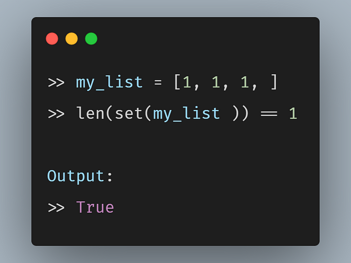
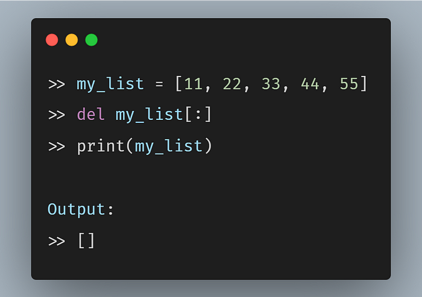
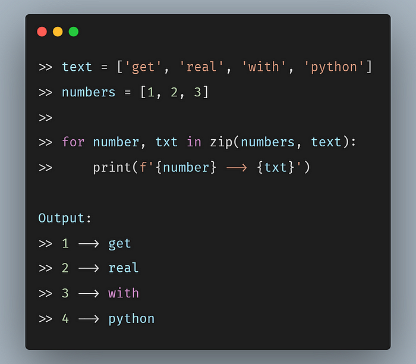
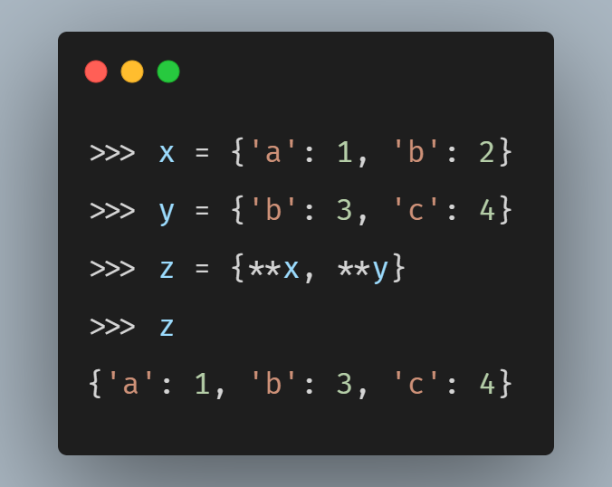
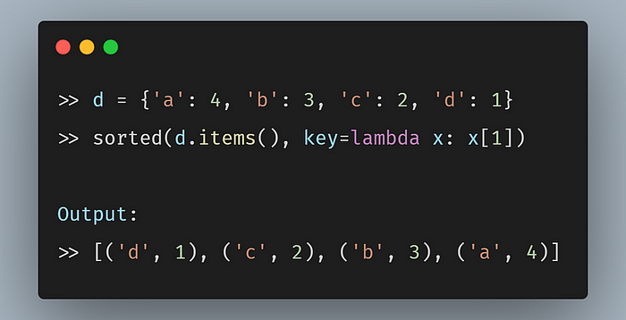
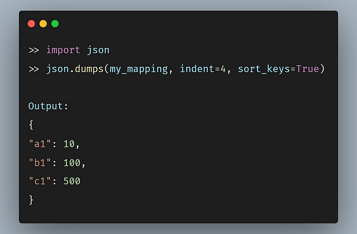
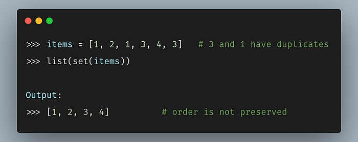
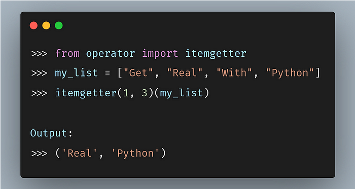
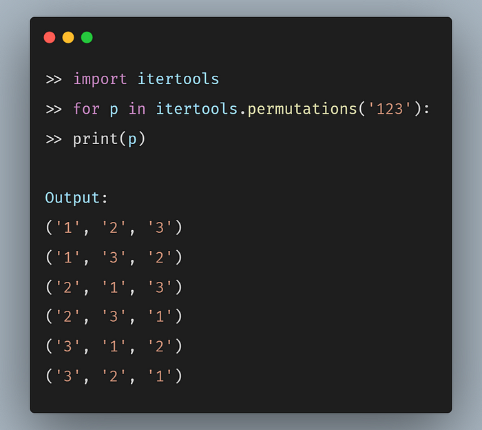
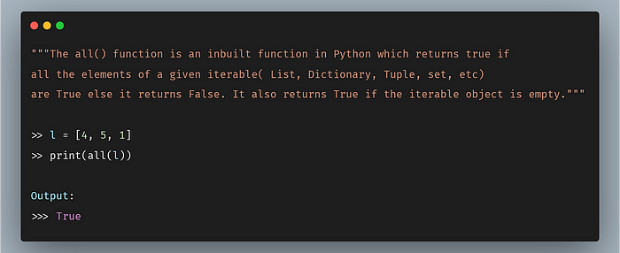

### 1、检查列表中的所有项目是否相等

### 2、使用切片删除列表中的所有项目

### 3、使用`zip()`循环2个或更多序列

### 4、合并两个字典

### 5、按值对字典排序

### 6、漂亮地打印字典

### 7、从列表中删除重复项

### 8、使用Itemgetter从列表或字典中获取多个项目

### 9、获取字符串的所有排列组合

### 10、Python中的`all()`方法

