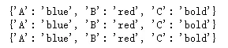
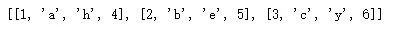
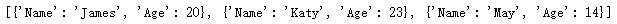
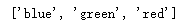
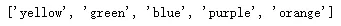
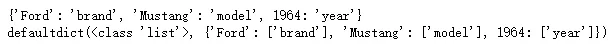
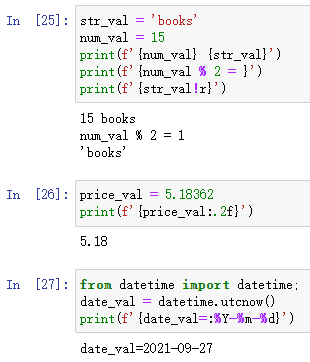
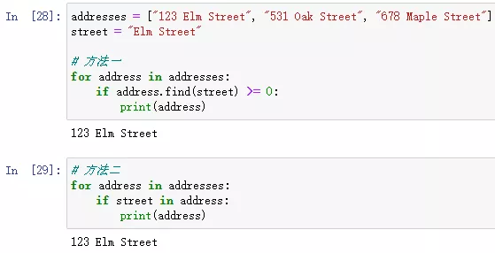
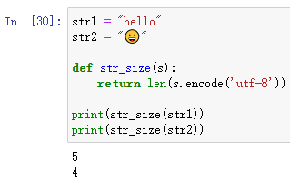

Python
<a name="YbxxF"></a>
## 列表
与列表相关的6个操作，介绍如下；
<a name="CX5sv"></a>
### 1、将两个列表合并到一个字典中
假设在Python中有两个列表，希望将它们合并为字典形式，其中一个列表的项目作为字典的键，另一个作为值。这是在用 Python 编写代码时经常遇到的一个非常常见的问题。<br />但是为了解决这个问题，需要考虑几个限制，比如两个列表的大小，两个列表中项目的类型，以及其中是否有重复的项目，尤其是将使用的项目 作为钥匙。可以通过使用像 zip 这样的内置函数来克服这个问题。
```python
keys_list = ['A', 'B', 'C']
values_list = ['blue', 'red', 'bold']

# 有 3 种方法可以将这两个列表转换为字典
# 1.使用Python zip、dict函数
dict_method_1 = dict(zip(keys_list, values_list))

# 2. 使用带有字典推导式的 zip 函数
dict_method_2 = {key:value for key, value in zip(keys_list, values_list)}

# 3.循环使用zip函数
items_tuples = zip(keys_list, values_list) 
dict_method_3 = {} 
for key, value in items_tuples: 
    if key in dict_method_3: 
        pass 
    else: 
        dict_method_3[key] = value
        
print(dict_method_1)
print(dict_method_2)
print(dict_method_3)
```
结果如下：<br />
<a name="KsJGP"></a>
### 2、将两个或多个列表合并为一个列表
当有两个或更多列表时，希望将它们全部收集到一个大列表中，其中较小列表的所有第一项构成较大列表中的第一个列表。<br />例如，如果有 4 个列表 `[1,2,3]`、`['a','b','c']`、`['h','e','y']`， 和`[4,5,6]`，为这四个列表创建一个新列表；它将是 `[[1,'a','h',4], [2,'b','e',5], [3,'c','y',6]]`。
```python
def merge(*args, missing_val = None):
    max_length = max([len(lst) for lst in args])
    outList = []
    for i in range(max_length):
        outList.append([args[k][i] if i < len(args[k]) else missing_val for k in range(len(args))])
    return outList

merge([1,2,3],['a','b','c'],['h','e','y'],[4,5,6])

```
结果如下：<br />
<a name="BjqW7"></a>
### 3、对字典列表进行排序
下一组日常列表任务是排序任务。根据列表中包含的项目的数据类型，将采用稍微不同的方式对它们进行排序。首先从对字典列表进行排序开始。
```python
dicts_lists = [
  {
    "Name": "James",
    "Age": 20,
  },
  {
     "Name": "May",
     "Age": 14,
  },
  {
    "Name": "Katy",
    "Age": 23,
  }
]

# 方法一
dicts_lists.sort(key=lambda item: item.get("Age"))

# 方法二
from operator import itemgetter
f = itemgetter('Name')
dicts_lists.sort(key=f)
```
结果如下：<br />
<a name="K0FaU"></a>
### 4、对字符串列表进行排序
经常面临包含字符串的列表，需要按字母顺序、长度或应用程序需要的任何其他因素对这些列表进行排序。<br />现在，应该提到这些是对字符串列表进行排序的直接方法，但有时可能需要实现排序算法来解决该问题。
```python
my_list = ["blue", "red", "green"]

# 方法一
my_list.sort() 
my_list = sorted(my_list, key=len) 

# 方法二
import locale
from functools import cmp_to_key
my_list = sorted(my_list, key=cmp_to_key(locale.strcoll)) 
```
结果如下：<br />
<a name="TN2Fw"></a>
### 5、根据另一个列表对列表进行排序
有时，可能想要/需要使用一个列表来对另一个列表进行排序。因此，将有一个数字列表（索引）和一个使用这些索引进行排序的列表。
```python
a = ['blue', 'green', 'orange', 'purple', 'yellow']
b = [3, 2, 5, 4, 1]

sortedList =  [val for (_, val) in sorted(zip(b, a), key=lambda x: x[0])]
print(sortedList)
```
结果如下：<br />
<a name="jeLrT"></a>
### 6、将列表映射到字典
如果给定一个列表并将其映射到字典中。也就是说，将列表转换为带有数字键的字典，应该怎么做呢？
```python
mylist = ['blue', 'orange', 'green']
#Map the list into a dict using the map, zip and dict functions
mapped_dict = dict(zip(itr, map(fn, itr)))
```
<a name="zO5zF"></a>
## 字典
与字典相关的2个操作，介绍如下；
<a name="SWkLr"></a>
### 7、合并两个或多个字典
假设有两个或多个字典，并且希望将它们全部合并为一个具有唯一键的字典。
```python
from collections import defaultdict

def merge_dicts(*dicts):
    mdict = defaultdict(list)
    for dict in dicts:
    for key in dict:
        res[key].append(d[key])
    return dict(mdict)
```
<a name="DAqnP"></a>
### 8、反转字典
一个非常常见的字典任务是如果有一个字典并且想要反转它的键和值。因此，键将成为值，而值将成为键。<br />当这样做时，需要确保没有重复的键，值可以重复，但键不能，并确保所有新键都是可散列的。
```python
my_dict = {
  "brand": "Ford",
  "model": "Mustang",
  "year": 1964
}
# 方法一
my_inverted_dict_1 = dict(map(reversed, my_dict.items()))

# 方法二
from collections import defaultdict
my_inverted_dict_2 = defaultdict(list)
{my_inverted_dict_2[v].append(k) for k, v in my_dict.items()}

print(my_inverted_dict_1)
print(my_inverted_dict_2)
```
结果如下：<br />
<a name="ztIXu"></a>
## 字符串
与字符串相关的3个操作，介绍如下；
<a name="jevst"></a>
### 9、使用 f 字符串
格式化字符串可能是您几乎每天都需要完成的第一项任务。在 Python 中有多种方法可以格式化字符串；最常用的是使用 f 字符串。
```python
str_val = 'books'
num_val = 15
print(f'{num_val} {str_val}') 
print(f'{num_val % 2 = }') 
print(f'{str_val!r}') 

price_val = 5.18362
print(f'{price_val:.2f}') 

from datetime import datetime;
date_val = datetime.utcnow()
print(f'{date_val=:%Y-%m-%d}') 
```
结果如下：<br />
<a name="tyfYF"></a>
### 10、检查子串
之前需要多次执行的一项非常常见的任务是，检查字符串是否在字符串列表中。
```python
addresses = ["123 Elm Street", "531 Oak Street", "678 Maple Street"]
street = "Elm Street"

# 方法一
for address in addresses:
    if address.find(street) >= 0:
        print(address)
        
# 方法二
for address in addresses:
    if street in address:
        print(address)
```
结果如下：<br />
<a name="WRbKE"></a>
### 11、以字节为单位获取字符串的大小
有时，尤其是在构建内存关键应用程序时，需要知道字符串使用了多少内存。幸运的是，这可以通过一行代码快速完成。
```python
str1 = "hello"
str2 = "😀"

def str_size(s):
    return len(s.encode('utf-8'))

print(str_size(str1))
print(str_size(str2))
```
结果如下：<br />
<a name="ArvyP"></a>
## 输入/输出操作
与输入/输出操作相关的2个操作，介绍如下；
<a name="gL3HJ"></a>
### 12、检查文件是否存在
在数据科学和许多其他应用程序中，经常需要从文件中读取数据或向其中写入数据。但要做到这一点，需要检查文件是否存在。因此，代码不会因错误而终止。
```python
# 方法一
import os 
exists = os.path.isfile('/path/to/file')

# 方法二
from pathlib import Path
config = Path('/path/to/file') 
if config.is_file(): 
    pass
```
<a name="TLPJf"></a>
### 13、解析电子表格
另一种非常常见的文件交互是从电子表格中解析数据。幸运的是，有 CSV 模块来有效地执行该任务。
```python
import csv
csv_mapping_list = []
with open("/path/to/data.csv") as my_data:
    csv_reader = csv.reader(my_data, delimiter=",")
    line_count = 0
    for line in csv_reader:
        if line_count == 0:
            header = line
        else:
            row_dict = {key: value for key, value in zip(header, line)}
            csv_mapping_list.append(row_dict)
        line_count += 1
```
