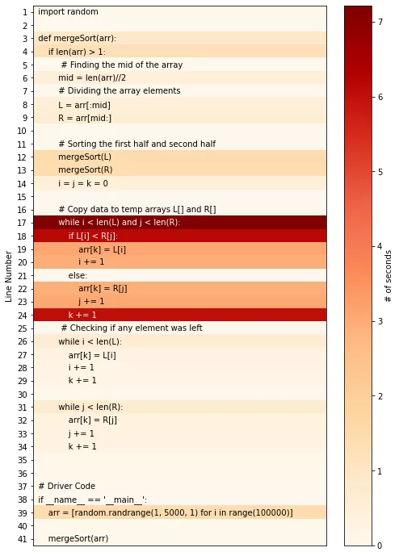
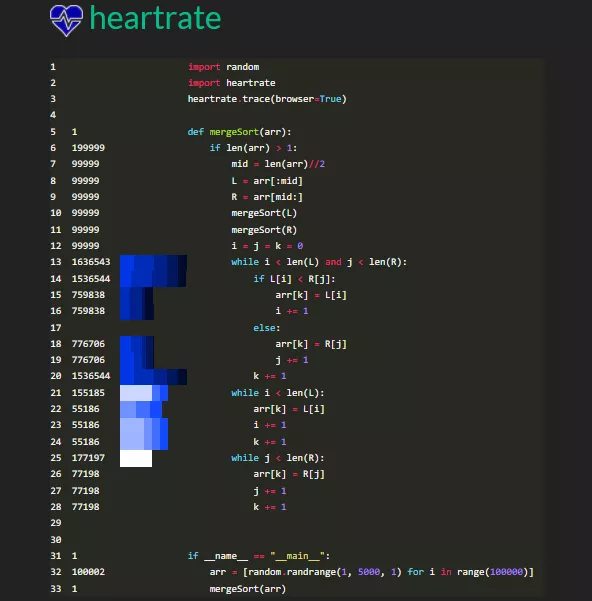
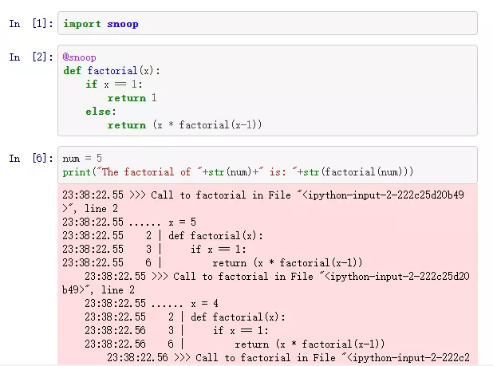

Python<br />由于 Python 的动态性和多功能性，它运行速度比其他语言要慢的多。复杂的计算或算法需要大量时间才能在 Python 中执行完成。因此需要跟踪代码的执行流，深入了解性能瓶颈。<br />Python 中的日志模块可用于跟踪代码的事件，并可用于确定代码崩溃的原因。日志记录可能很有用，但它技术性太强，需要适当的方法去实现。<br />分享3个这样的开源的Python库，它们只需要几行代码就可以帮助开发人员进行程序可视化。
<a name="ELwaR"></a>
### 1、Pyheat
Pyheat 是一个开源的 Python 库，帮助开发人员获得代码执行的逐行时间分布。Pyheat不是以表格格式显示，而是用热图表示运行每行代码所需的时间。<br />Pyheat 可以使用从 PyPl 安装
```bash
pip install py-heat
```
引入包
```python
from pyheat import PyHeat
```
<a name="hRTOY"></a>
#### 用法
Pyheat可用于为Python模块的每行代码生成时间编号的热图。将Python文件的路径作为参数传递给PyHeat函数。
```python
ph = PyHeat('merge_sort.py')
ph.create_heatmap()
ph.show_heatmap()
```
上面提到的代码生成了一个热图，表示 在merge_sort.py 模块中运行每一行代码所需的时间（秒）。<br /><br />从上面的热图来看，虽然第17行中的循环需要花费大部分时间（7秒）来执行。热图有助于开发人员识别花费大量时间执行的代码片段，这些代码片段可能会进一步优化。<br />更多详情：[https://github.com/csurfer/pyheat](https://github.com/csurfer/pyheat)

<a name="vaHAY"></a>
### 2、Heartrate
Heartrate 是一个开源的 Python 库，提供 Python 程序执行的实时可视化。它提供了一行一行的执行可视化，每个行的执行次数由数字决定。它在浏览器的单独窗口中显示代码的执行情况。<br />Heartrate 可以通过以下方式从PyPl安装：
```bash
pip install heartrate
```
<a name="hxNSz"></a>
#### 用法
导入包（`import heartrate`）后，请使用`heartrate.trace(browser=True)`函数，该函数将打开一个浏览器窗口，显示调用`trace()`的文件的可视化效果。<br />在执行代码时，浏览器中会弹出一个窗口，现在可以按照 http://localhost:9999 观察执行的输出可视化。<br /><br />每行最左边的数字表示执行特定行的次数。条形图显示了最近被点击的线条-较长的条形图表示点击次数较多，较浅的颜色表示点击次数较多。它还显示了一个活动堆栈跟踪。<br />更多详情：[https://github.com/alexmojaki/heartrate](https://github.com/alexmojaki/heartrate)
<a name="pholU"></a>
### 3、Snoop
Snoop 是另一个可以用作调试工具的包。Snoop 识别局部变量的值并跟踪程序的执行。Snoop 主要用作一种调试工具，用于找出 Python 代码为什么没有执行认为应该执行的操作。<br />所有这一切都是可能的，只需在想要跟踪的函数之前使用 snoop 装饰器。<br />可以使用以下方法从 PyPl 安装 Snoop 库：
```bash
pip install snoop
```
<a name="o9jfI"></a>
#### 用法
<br />更多详情：[https://github.com/alexmojaki/snoop](https://github.com/alexmojaki/snoop)
