Python<br />能够立即改善程序设计、写出“好”代码的知识有以下几点：

- 面向对象五个基本原则；
- 常见的三种架构；
- 绘图；
- 起一个好名字；
- 优化嵌套的 if else 代码；

当然，其他技术知识的丰富程度也决定了程序设计的好坏。例如通过引入消息队列解决双端性能差异问题、通过增加缓存层提高查询效率等。下面一起来看看，上面列出的知识点包含哪些内容，这些内容对代码和程序设计的改善有何帮助。
<a name="r74dO"></a>
## 面向对象五个基本原则
它的五个基本原则是：

- 单一职责原则；
- 开放封闭原则；
- 依赖倒置原则；
- 接口隔离原则；
- 合成复用原则；

下面将通过对比和场景假设的方式了解五个基本原则对代码质量的影响。
<a name="h5QxE"></a>
### 立竿见影的单一职责原则
以一个从文件内容中匹配关键数据并根据匹配结果发出网络请求的案例，看看大部分的写法：
```python
import re
import requests


FILE = "./information.fet"

def extract(file):
    fil = open(file, "r")
    content = fil.read()
    fil.close()
    find_object = re.search(r"url=\d+", content)
    find = find_object.group(1)
    text = requests.get(find)
    return text


if __name__ == "__main__":
    text = extract(FILE)
    print(text)
```
需求已经实现，这点毋庸置疑，但是问题来了：

- 如果读取文件的时候发生异常了怎么办？
- 如果数据源发生变化该如何处理？
- 如果网络请求返回的数据不符合最终要求怎么办？

如果第一个反应是改代码，那就要注意了。完成一件事中间的某个环节发生变化，改代码是在所难免的，但是如果按照上面这种写法，不仅代码越改越乱，连逻辑也会越来越乱。单一职责原则表达的是让一个函数尽量只做一件事，不要将多件事混杂在一个函数中。<br />上面的代码如果重新设计，至少应该是这样的：
```python
def get_source():
    """获取数据源"""
    return


def extract_(val):
    """匹配关键数据"""
    return


def fetch(val):
    """发出网络请求"""
    return


def trim(val):
    """修剪数据"""
    return


def extract(file):
    """提取目标数据"""
    source = get_source()
    content = extract_(source)
    text = trim(fetch(content))
    return text


if __name__ == "__main__":
    text = extract(FILE)
    print(text)
```
把原来放在一个函数中实现的多个步骤拆分成为多个更小的函数，每个函数只做一件事。当数据源发生变化时，只需要改动 get_source 相关的代码即可；如果网络请求返回的数据不符合最终要求，可以在 `trim` 函数中对它进行修剪。这样一来，代码应对变化的能力提高了许多，整个流程也变得更清晰易懂。改动前后的变化如下图所示：<br />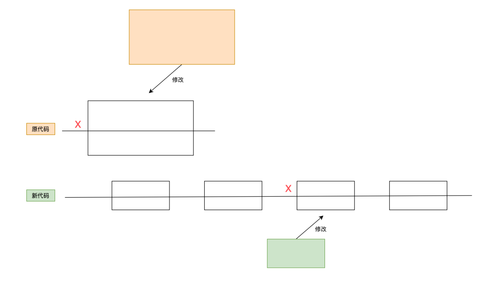<br />单一职责原则的核心是解耦和增强内聚力，如果一个函数承担的职责过多，等于把这些职责耦合在一起，这种耦合会导致脆弱的设计。当发生变化时，原本的设计会遭受到意想不到的破坏。单一职责原则实际上是把一件事拆分成多个步骤，代码修改造成的影响范围很小。
<a name="epUnj"></a>
### 让代码稳定性飞升的开放封闭原则和依赖倒置原则
开放封闭原则中的开放指的是对扩展开放，封闭指的是对修改封闭。需求总是变化的，业务方这个月把数据存储到 MySQL 数据库中，下个月就有可能导出到 Excel 表格里，这时候就得改代码了。这个场景和上面的单一职责原则很相似，同样面临代码改动，单一职责原则示例主要表达的是通过解耦降低改动的影响，这里主要表达的是通过对扩展开放、对修改封闭提高程序应对变化的能力和提高程序稳定性。<br />稳定这个词如何理解呢？<br />较少的改动或者不改动即视为稳定，稳定意味着调用这个对象的其它代码拿到的结果是可以确定的，整体是稳定的。<br />按照一般的写法，数据存储的代码大概是这样的：
```python
class MySQLSave:
    def __init__(self):
        pass

    def insert(self):
        pass

    def update(self):
        pass


class Business:
    def __init__(self):
        pass

    def save(self):
        saver = MySQLSave()
        saver.insert()
```
功能是能够实现的，这点毋庸置疑。来看看它如何应对变化，如果要更换存储，那么就意味着需要改代码。按照上面的代码示例，有两个选择：

- 重新写一个存储到 ExcelSave 的类；
- 对 MySQLSave 类进行改动；

上面的两种选择，无论怎么选都会改动 2 个类。因为不仅存储的类需要改动，调用处的代码也需要更改。这样一来，它们整体都是不稳定的。如果换一种实现方式，根据依赖倒置的设计指导可以轻松应对这个问题。边看代码边理解：
```python
import abc


class Save(metaclass=abc.ABCMeta):
    @abc.abstractmethod
    def insert(self):
        pass

    @abc.abstractmethod
    def update(self):
        pass


class MySQLSave(Save):

    def __init__(self):
        self.classify = "mysql"
        pass

    def insert(self):
        pass

    def update(self):
        pass


class Excel(Save):
    def __init__(self):
        self.classify = "excel"

    def insert(self):
        pass

    def update(self):
        pass


class Business:
    def __init__(self, saver):
        self.saver = saver

    def insert(self):
        self.saver.insert()

    def update(self):
        self.saver.update()


if __name__ == "__main__":
    mysql_saver = MySQLSave()
    excel_saver = Excel()
    business = Business(mysql_saver)
```
这里通过内置的 abc 实现了一个抽象基类，这个基类的目的是强制子类实现要求的方法，以达到子类功能统一。子类功能统一后，无论调用它的哪个子类，都是稳定的，不会出现调用方还需要修改方法名或者修改传入参数的情况。<br />依赖倒置中的倒置，指的是依赖关系的倒置。之前的代码是调用方 Business 依赖对象 MySQLSave，一旦对象 MySQLSave 需要被替换， Business 就需要改动。依赖倒置中的依赖指的是对象的依赖关系，之前依赖的是实体，如果改为后面这种依赖抽象的方式，情况就会扭转过来：<br />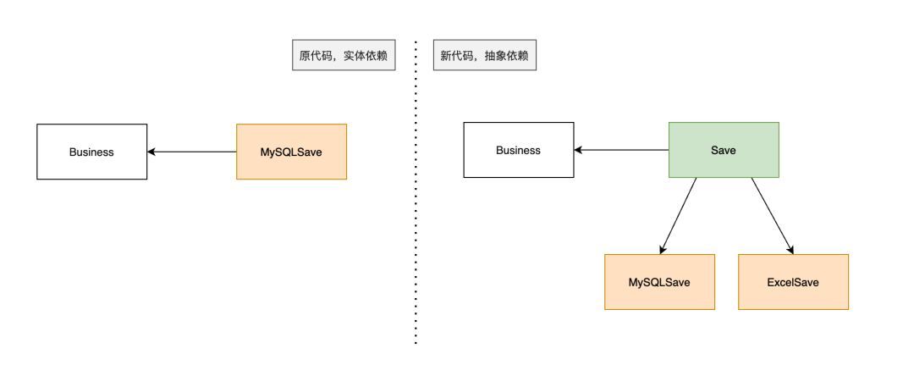<br />实体 Business 依赖抽象有一个好处：抽象稳定。相对于多变的实体来说，抽象更稳定。代码改动前后的依赖关系发生了重大变化，之前调用方 Business 直接依赖于实体 MySQLSave，通过依赖倒置改造后 Busines 和 ExcelSave、 MySQLSave 全都依赖抽象。<br />这样做的好处是如果需要更换存储，只需要创建一个新的存储实体，然后调用 Business 时传递进去即可，这样可以不用改动 Business 的代码，符合面向修改封闭、面向扩展开放的开放封闭原则；<br />依赖倒置的具体实现方式使用了一种叫做依赖注入的手段，实际上单纯使用依赖注入、不使用依赖倒置也可以满足开闭原则要求，感兴趣的读者不妨试一试。
<a name="M7NDe"></a>
### 挑肥拣瘦的接口隔离原则
接口隔离原则中的接口指的是Interface，而不是 Web 应用里面的 Restful 接口，但是在实际应用中可以将其抽象理解为相同的对象。接口隔离原则在设计层面看，跟单一职责原则的目的是一致的。接口隔离原则的指导思想是：

- 调用方不应该依赖它不需要的接口；
- 依赖关系应当建立在最小接口上；

这实际上是要给接口减肥，过多功能的接口可以选用拆分的方式优化。举个例子，现在为图书馆设计一个图书的抽象类：
```python
import abc

class Book(metaclass=abc.ABCMeta):
    @abc.abstractmethod
    def buy(self):
        pass

    @abc.abstractmethod
    def borrow(self):
        pass

    @abc.abstractmethod
    def shelf_off(self):
        pass

    @abc.abstractmethod
    def shelf_on(self):
        pass
```
图可以被购买、可以被借阅、可以下架、可以上架，这看起来并没有什么问题。但这样一来这个抽象只能提供给管理人员使用，用户操作时需要再设定一个新的抽象类，因为不可能让用户可以操纵图书上下架。接口隔离原则推荐的做法是把图书的上下架和图书购买、借阅分成 2 个抽象类，管理端的图书类继承 2 个抽象类，用户端的图书类继承 1 个抽象类。这么看起来是有点绕，看图理解：<br />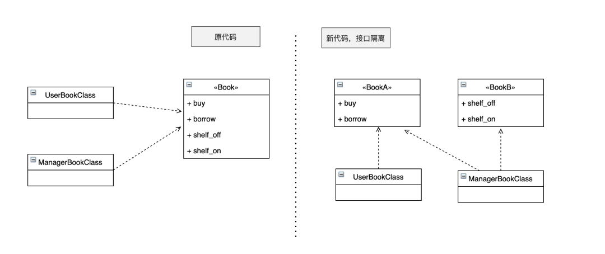<br />这样是不是一下就看懂了。这个指导思想很重要，不仅能够指导设计抽象接口，也能够指导设计 Restful 接口，还能够发现现有接口存在的问题，从而设计出更合理的程序。
<a name="fOcac"></a>
### 轻装上阵的合成复用原则
合成复用原则的指导思想是：尽量使用对象组合，而不是继承来达到复用的目的。合成复用的作用是降低对象之间的依赖，因为继承是强依赖关系，无论子类使用到父类的哪几个属性，子类都需要完全拥有父类。合成采用另一种方式实现对象之间的关联，降低依赖关系。<br />为什么推荐优先使用合成复用，而后考虑继承呢？<br />因为继承的强依赖关系，一旦被依赖的对象（父类）发生改变，那么依赖者（子类）也需要改变，合成复用则可以避免这样的情况出现。要注意的是，推荐优先使用复用，但并不是拒绝使用继承，该用的地方还得用。以一段代码为例，说明合成复用和继承的差异：
```python
import abc

class Car:
    def move(self):
        pass

    def engine(self):
        pass


class KateCar(Car):
    def move(self):
        pass

    def engine(self):
        pass


class FluentCar(Car):
    def move(self):
        pass

    def engine(self):
        pass
```
这里的 Car 作为父类，拥有 move 和 engine 2 个重要属性，这时候如果需要给汽车涂装颜色，那么就要新增一个 color 属性，3 个类都要增加。如果使用合成复用的方式，可以这么写：
```python
class Color:
    pass

class KateCar:
    color = Color()
    def move(self):
        pass

    def engine(self):
        pass

class FluentCar:
    color = Color()
    def move(self):
        pass

    def engine(self):
        pass
```
类对象合成复用的具体操作是在类中实例化一个类对象，然后在需要的时候调用它。代码可能没有那么直观，看图：<br />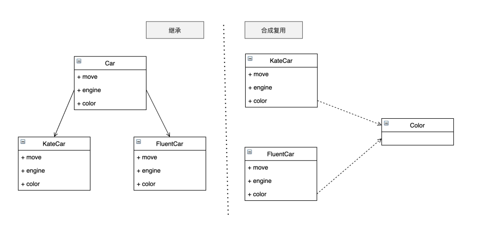<br />这个例子主要用于说明继承和合成复用的具体实现方式和前后变化，对于 Car 的继承无需深究，因为如果执着地讨论为什么右图中的 2 个 Car 不用继承，就会陷入牛角尖。<br />这里的合成复用选用的实现方式是在 2 个 Car 里面实例化另一个类 Color，其实也可以用依赖注入的手段在外部实例化 Color，然后把实例对象传递给 2 个 Car。
<a name="MoAak"></a>
## 常见的三种架构
了解多种不同的架构可以使开发者的知识面更宽广，面对一类问题的时候可以提出其它解决办法。同时，了解多种架构可以在设计阶段做好规划，避免后续频繁的重构。常见的三种架构分别是：

- 单体架构；
- 分布式架构；
- 微服务架构；
<a name="K6JaW"></a>
### 单体架构
单体架构是平时接触较多的架构，也是相对容易理解的架构。单体架构把所有功能都聚合在一个应用里，可以简单地将这种架构视作：<br />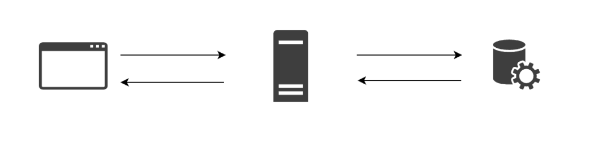<br />这种架构简单、容易部署和测试，大部分应用的初期都采用单体架构。单体架构也有几个明显缺点：

- 复杂性高，所有功能糅合在一个应用里，模块多、容易出现边界模糊，而且随着时间的推移和业务的发展，项目越来越大、代码越来越多，整体服务效率逐渐下降；
- 发布/部署频率低，牵一发而动全身，新功能或问题修复的发布上线需要多方协调，发布时间一拖再拖。项目大则构建时间长、构建失败的几率也会有所增加；
- 性能瓶颈明显，一头牛再厉害也抵不过多头牛合力的效果，随着数据量、请求并发的增加，读性能的不足最先暴露出来，接着就会发现其它方面也跟不上了；
- 影响技术创新：单体架构通常选用一类语言或一类框架统一开发，想要引入新技术或者接入现代化的服务是很困难的；
- 可靠性低，一旦服务出现问题，影响是巨大的。
<a name="GljOv"></a>
### 分布式架构
分布式架构相对于单体架构而言，通过拆分解决了单体架构面临的大部分问题，例如性能瓶颈。假如单体架构是一头牛，那么分布式架构就是多头牛：<br />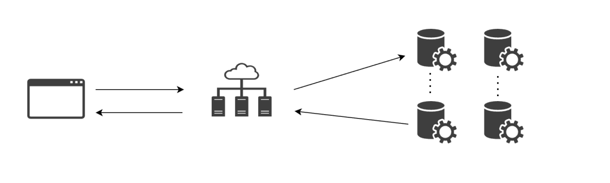<br />当单体架构出现性能瓶颈时，团队可以考虑将单体架构转换为分布式架构，以增强服务能力。当然，分布式并不是万能的，它解决了单体架构性能瓶颈、可靠性低的问题，但复杂性问题、技术创新问题和发布频率低依然存在，这时候可以考虑微服务。
<a name="dpHAM"></a>
### 微服务架构
微服务架构的关键字是拆，将原本糅合在一个应用中的多个功能拆成多个小应用，这些小应用串联起来组成一个与之前单体架构功能相同的完整应用。具体示意如下：<br />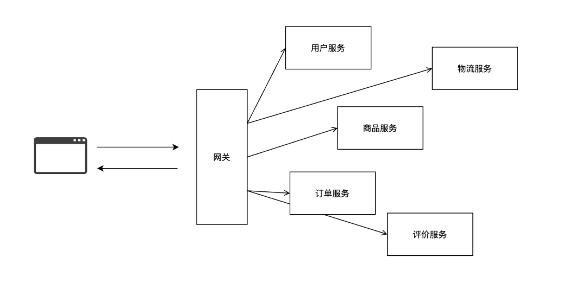<br />每个微服务可以独立运行，它们之间通过网络协议进行交互。每个微服务可以部署多个实例，这样一来就具备了跟分布式架构相同的性能。单个服务的发布/部署对其它服务的影响较小，在代码上没有关联，因此可以频繁的发布新版本。复杂性的问题迎刃而解，拆分之后架构逻辑清晰、功能模块职责单一，功能的增加和代码的增加也不会影响到整体效率。服务独立之后，项目就变得语言无关，评价服务可以用 Java 语言来实现也可以用 Golang 语言实现，不再受到语言或者框架的制约，技术创新问题得以缓解。<br />这是不是很像单一职责原则和接口隔离原则？
<a name="nZZCz"></a>
### 分布式和微服务并不是银弹
从上面的对比来看，似乎分布式架构比单体架构好，微服务架构比分布式架构好，这么说来微服务架构>分布式架构>单体架构？<br />这么理解是不对的，架构需要根据场景和需求选择，微服务架构和分布式架构看上去很美，但也衍生出了许多新问题。以微服务架构为例：

- 运维成本高，在单体架构时，运维只需要保证 1 个应用正常运行即可，关注的可能只是硬件资源消耗问题。但如果换成微服务架构，应用的数量成百上千，当应用出现问题或者多应用之间协调异常时，运维人员的头就会变大；
- 分布式系统固有的复杂性，网络分区、分布式事务、流量均衡对开发者和运维进行了敲打；
- 接口调整成本高，一个接口的调用方可能有很多个，如果设计时没有遵循开放封闭原则和接口隔离原则，那么调整的工作量会是非常大的；
- 接口性能受限，原本通过函数调用的方式交互，在内存中很快就完成了，换成接口后通过网络进行交互，性能明显下降；
- 重复劳动，虽然有公共模块，但如果语言无关且又要考虑性能（不用接口交互）就需要自己实现一份相同功能的代码；

到底用哪种架构，需要根据具体的场景来选择。如果系统复杂度并没有那么高、性能追求也没有那么高，例如一个日数据量只有几万的爬虫应用，单体架构就足以解决问题，不需要强行做成分布式或者微服务，因为这样只会增加自己的工作量。
<a name="QVbVW"></a>
## 画好图
在需要表达关系和逻辑梳理的场景里，图永远比代码好。业内流行这么一句话“程序开发，设计先行”，说的是在开发前，需要对程序进行构思和设计。试想，如果连对象关系和逻辑都说不清楚，写出的代码会是好代码吗？<br />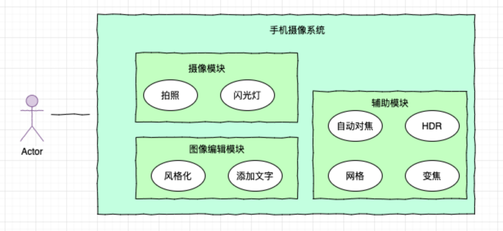<br />在构思项目时可以使用用例图挖掘需求和功能模块；在架构设计时可以使用协作图梳理模块关系；在设计接口或者类对象时可以使用类图做好交互计划；在功能设计时可以使用状态图挖掘功能属性……<br />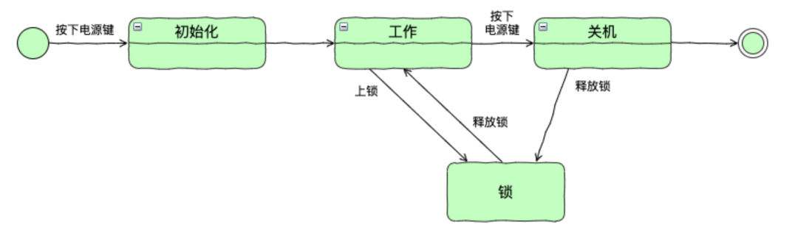
<a name="nRlHL"></a>
## 起一个好名字
还记得自己曾经起过的那些名字吗：

- reversalList
- get_translation
- get_data
- do_trim
- CarAbstract

起一个好的、合适的名字能够让代码风格更统一，看上去清晰了然。起一个好名字不单单是单词语法的问题，还会涉及风格选择和用途。
<a name="BKKHy"></a>
## 优化嵌套的 if else 代码
写代码的时候用一些控制语句是很正常的事，但是如果 if else 嵌套太多，也是非常头疼的，代码看上去就像下面这样。<br />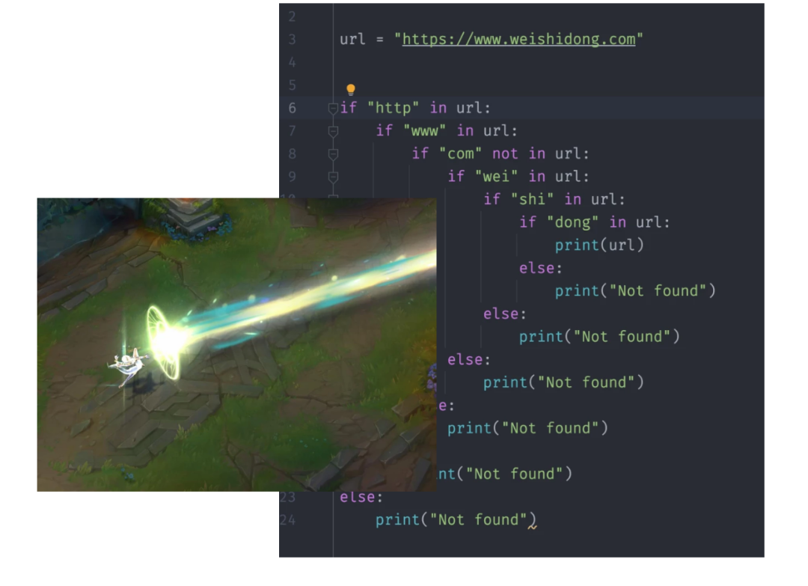<br />这种结构的产生是因为使用了 if 语句来进行先决条件的检查，如果负责条件则进入下一行代码，如果不符合则停止。既然这样，在先决条件的检查上进行取反即可，代码改动过后看起来像这样：
```python
if "http" not in url:
    return
if "www" not in url:
    return
```
这是平时常用的优化办法——卫语句。<br />当然，这种简单的逻辑处理和 if else 控制流用卫语句进行处理是很有效的，但如果逻辑再复杂一些，用卫语句的效果就不见的那么好了。假设汽车 4S 店有折扣权限限制，普通销售有权对 30 万以内金额的汽车授予一定折扣，超过 30 万但在 80 万以内需要精英销售进行授权，更高价格的车折扣需要店长授权。这个功能可以归纳为根据金额的大小来确定授权者，对应代码如下：
```python
def buying_car(price):
    if price < 300000:
        print("普通销售")
    elif price < 800000:
        print("精英销售")
    elif price < 1500000:
        print("店长")
```
代码思路清晰，但存在的问题也明显。如果以后扩展价格和定级，会增加更多的 if else 语句，代码将变得臃肿。控制语句的顺序是固定在代码中的，如果想要调整顺序，只能修改控制语句。<br />那么问题来了，有比 if else 更合适的办法吗？<br />这时候可以考虑一种叫做责任链的设计模式，责任链设计模式的定义为：为了避免请求发送者与多个请求处理者耦合在一起，于是将所有请求的处理者通过前一对象记住其下一个对象的引用而连成一条链；当有请求发生时，可将请求沿着这条链传递，直到有对象处理它为止。<br />看起来有点绕，通过代码图加深理解：<br />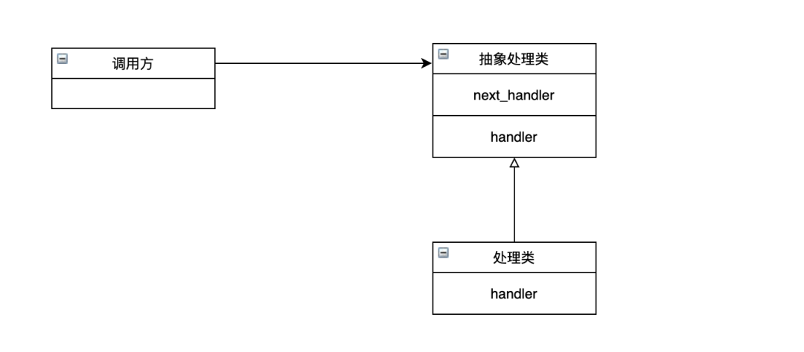<br />处理类执行前根据先决条件判断自身的 handler 是否能够处理，如果不能则交给 next_handler，也就是责任链的下一个节点。上面的用责任链实现为：
```python

class Manager:

    def __init__(self,):
        self.obj = None

    def next_handler(self, obj):
        self.obj = obj

    def handler(self, price):
        pass


class General(Manager):

    def handler(self, price):
        if price < 300000:
            print("{} 普通销售".format(price))
        else:
            self.obj.handler(price)


class Elite(Manager):

    def handler(self, price):
        if 300000 <= price < 800000:
            print("{} 精英销售".format(price))
        else:
            self.obj.handler(price)


class BOSS(Manager):

    def handler(self, price):
        if price >= 800000:
            print("{} 店长".format(price))
```
创建好抽象类和具体的处理类之后，它们还没有关联关系。需要将它们挂载到一起，成为一个链条：
```python
general = General()
elite = Elite()
boss = BOSS()
general.next_handler(elite)
elite.next_handler(boss)
```
这里建立的责任链顺序为 General -> Elite -> BOSS，调用方只需要传递价格给 General，如果它没有折扣的授予权它会交给 Elite 处理，如果 Elite 没有折扣授予权则会交给 BOSS 处理。对应代码如下:
```python
prices = [550000, 220000, 1500000, 200000, 330000]
for price in prices:
    general.handler(price)
```
