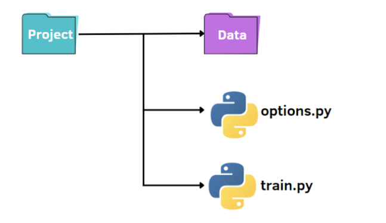
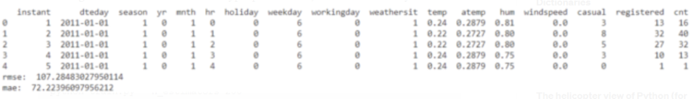
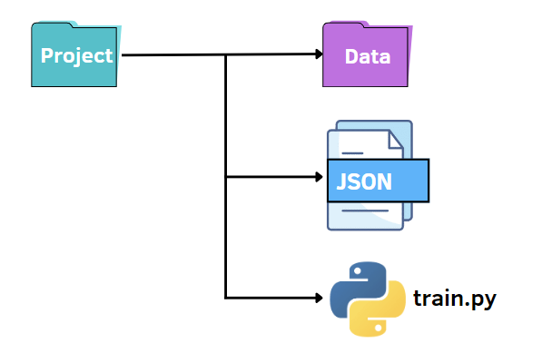
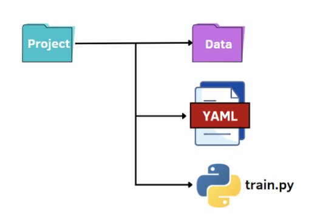

Pyhton<br />以机器学习当中的调参过程来进行实践，有三种方式可供选择。第一个选项是使用 argparse，它是一个流行的 Python 模块，专门用于命令行解析；另一种方法是读取 JSON 文件，可以在其中放置所有超参数；第三种也是鲜为人知的方法是使用 YAML 文件！
<a name="zrt8E"></a>
## **先决条件**
在下面的代码中，将使用 Visual Studio Code，这是一个非常高效的集成 Python 开发环境。这个工具的美妙之处在于它通过安装扩展支持每种编程语言，集成终端并允许同时处理大量 Python 脚本和 Jupyter 笔记本。<br />数据集，使用的是 Kaggle 上的共享自行车数据集，可以在这里下载<br />[https://www.kaggle.com/datasets/lakshmi25npathi/bike-sharing-dataset](https://www.kaggle.com/datasets/lakshmi25npathi/bike-sharing-dataset)
<a name="ySEz2"></a>
## **使用 argparse**
<br />就像上图所示，有一个标准的结构来组织小项目：

- **包含数据集的名为 data 的文件夹**
- **train.py 文件**
- **用于指定超参数的 options.py 文件**

首先，可以创建一个文件 train.py，在其中有导入数据、在训练数据上训练模型并在测试集上对其进行评估的基本程序：
```python
import pandas as pd
import numpy as np
from sklearn.ensemble import RandomForestRegressor
from sklearn.model_selection import train_test_split
from sklearn.preprocessing import StandardScaler
from sklearn.metrics import mean_squared_error, mean_absolute_error

from options import train_options

df = pd.read_csv('data\hour.csv')
print(df.head())
opt = train_options()

X=df.drop(['instant','dteday','atemp','casual','registered','cnt'],axis=1).values
y =df['cnt'].values
X_train, X_test, y_train, y_test = train_test_split(X, y, test_size=0.2)

if opt.normalize == True:
    scaler = StandardScaler()
    X = scaler.fit_transform(X)
    
rf = RandomForestRegressor(n_estimators=opt.n_estimators,max_features=opt.max_features,max_depth=opt.max_depth)
model = rf.fit(X_train,y_train)
y_pred = model.predict(X_test)
rmse = np.sqrt(mean_squared_error(y_pred, y_test))
mae = mean_absolute_error(y_pred, y_test)
print("rmse: ",rmse)
print("mae: ",mae)
```
在代码中，还导入了包含在 options.py 文件中的 train_options 函数。后一个文件是一个 Python 文件，可以从中更改 train.py 中考虑的超参数：
```python
import argparse

def train_options():
	parser = argparse.ArgumentParser()
	parser.add_argument("--normalize", default=True, type=bool, help='maximum depth')
	parser.add_argument("--n_estimators", default=100, type=int, help='number of estimators')
	parser.add_argument("--max_features", default=6, type=int, help='maximum of features',)
	parser.add_argument("--max_depth", default=5, type=int,help='maximum depth')
	opt = parser.parse_args()
    return opt
```
在这个例子中，使用了 argparse 库，它在解析命令行参数时非常流行。首先，初始化解析器，然后，可以添加想要访问的参数。<br />这是运行代码的示例：
```bash
python train.py
```
<br />要更改超参数的默认值，有两种方法。第一个选项是在 options.py 文件中设置不同的默认值。另一种选择是从命令行传递超参数值：
```bash
python train.py --n_estimators 200
```
需要指定要更改的超参数的名称和相应的值。
```bash
python train.py --n_estimators 200 --max_depth 7
```
<a name="hxbSL"></a>
## **使用 JSON 文件**
<br />和前面一样，可以保持类似的文件结构。在这种情况下，将 options.py 文件替换为 JSON 文件。换句话说，在 JSON 文件中指定超参数的值并将它们传递给 train.py 文件。与 argparse 库相比，JSON 文件可以是一种快速且直观的替代方案，它利用键值对来存储数据。下面创建一个 options.json 文件，其中包含稍后需要传递给其他代码的数据。
```json
{
	"normalize":true,
	"n_estimators":100,
	"max_features":6,
	"max_depth":5 
}
```
如上所见，它与 Python 字典非常相似。但是与字典不同的是，它包含文本/字符串格式的数据。此外，还有一些语法略有不同的常见数据类型。例如，布尔值是 false/true，而 Python 识别 False/True。JSON 中其他可能的值是数组，它们用方括号表示为 Python 列表。<br />在 Python 中使用 JSON 数据的美妙之处在于，它可以通过 load 方法转换成 Python 字典：
```python
f = open("options.json", "rb")
parameters = json.load(f)
```
要访问特定项目，只需要在方括号内引用它的键名：
```python
if parameters["normalize"] == True:
    scaler = StandardScaler()
    X = scaler.fit_transform(X)
rf=RandomForestRegressor(n_estimators=parameters["n_estimators"],max_features=parameters["max_features"],max_depth=parameters["max_depth"],random_state=42)
model = rf.fit(X_train,y_train)
y_pred = model.predict(X_test)
```
<a name="Zbs3k"></a>
## **使用 YAML 文件**
<br />最后一种选择是利用 YAML 的潜力。与 JSON 文件一样，将 Python 代码中的 YAML 文件作为字典读取，以访问超参数的值。YAML 是一种人类可读的数据表示语言，其中层次结构使用双空格字符表示，而不是像 JSON 文件中的括号。下面展示 options.yaml 文件将包含的内容：
```yaml
normalize: True 
n_estimators: 100
max_features: 6
max_depth: 5
```
在 train.py 中，打开 options.yaml 文件，该文件将始终使用 load 方法转换为 Python 字典，这一次是从 yaml 库中导入的：
```python
import yaml
f = open('options.yaml','rb')
parameters = yaml.load(f, Loader=yaml.FullLoader)
```
和前面一样，可以使用字典所需的语法访问超参数的值。
<a name="nPDD5"></a>
## **总结**
配置文件的编译速度非常快，而 argparse 则需要为添加的每个参数编写一行代码。<br />所以应该根据自己的不同情况来选择最为合适的方式<br />例如，如果需要为参数添加注释，JSON 是不合适的，因为它不允许注释，而 YAML 和 argparse 可能非常适合。
