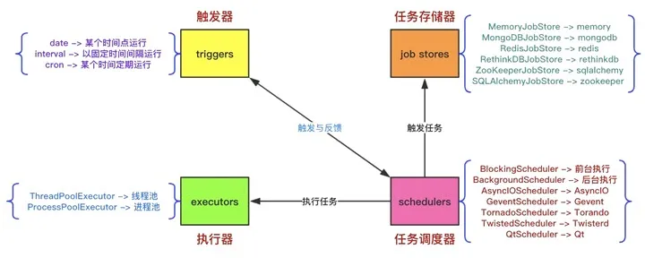
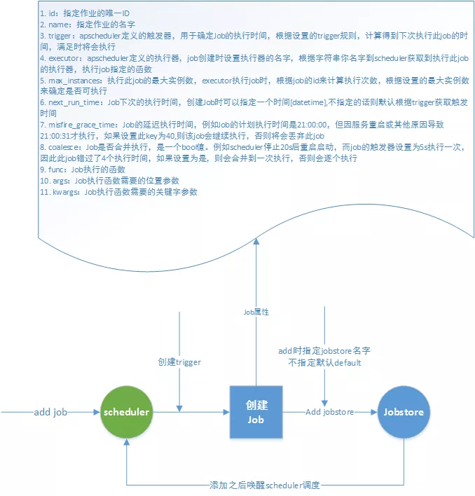
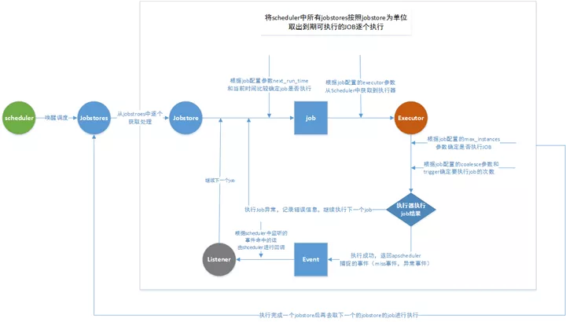
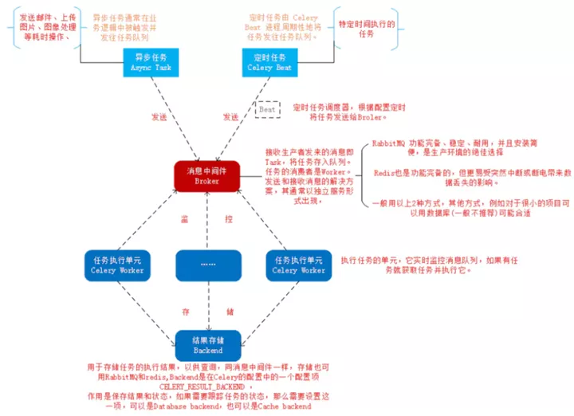
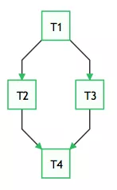
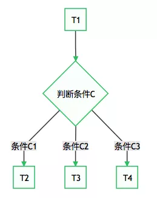
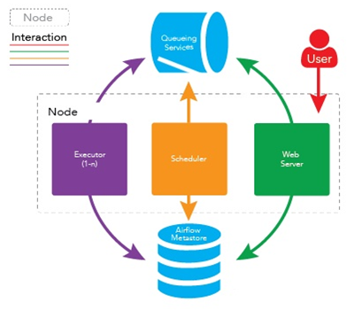
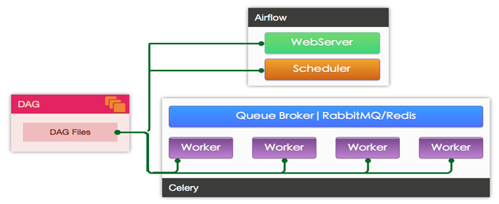
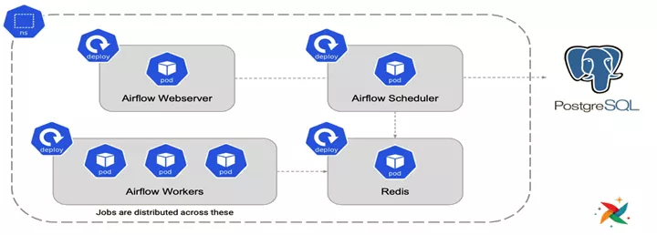

Python 定时任务<br />在日常工作中，常常会用到需要周期性执行的任务，一种方式是采用 Linux 系统自带的 crond 结合命令行实现。另外一种方式是直接使用Python。接下来整理的是常见的Python定时任务的实现方式。
<a name="dNuYv"></a>
## 目录

- 利用while True: + sleep()实现定时任务
- 使用Timeloop库运行定时任务
- 利用threading.Timer实现定时任务
- 利用内置模块sched实现定时任务
- 利用调度模块schedule实现定时任务
- 利用任务框架APScheduler实现定时任务
   - Job 作业
   - Trigger 触发器
   - Executor 执行器
   - Jobstore 作业存储
   - Event 事件
   - 调度器
   - APScheduler中的重要概念
   - Scheduler的工作流程
- 使用分布式消息系统Celery实现定时任务
- 使用数据流工具Apache Airflow实现定时任务
   - Airflow 产生的背景
   - Airflow 核心概念
   - Airflow 的架构
<a name="U5Ixc"></a>
## 利用`while True`: + `sleep()`实现定时任务
位于 `time` 模块中的` sleep(secs)` 函数，可以实现令当前执行的线程暂停 secs 秒后再继续执行。所谓暂停，即令当前线程进入阻塞状态，当达到 `sleep()` 函数规定的时间后，再由阻塞状态转为就绪状态，等待 CPU 调度。<br />基于这样的特性可以通过while死循环+`sleep()`的方式实现简单的定时任务。<br />代码示例：
```python
import datetime
import time


def time_printer():
    now = datetime.datetime.now()
    ts = now.strftime('%Y-%m-%d %H:%M:%S')
    print('do func time :', ts)


def loop_monitor():
    while True:
        time_printer()
        time.sleep(5)  # 暂停5秒


if __name__ == "__main__":
    loop_monitor()
```
主要缺点：

- 只能设定间隔，不能指定具体的时间，比如每天早上8:00
- sleep 是一个阻塞函数，也就是说 sleep 这一段时间，程序什么也不能操作。
<a name="ASK7h"></a>
## 使用Timeloop库运行定时任务
Timeloop是一个库，可用于运行多周期任务。这是一个简单的库，它使用decorator模式在线程中运行标记函数。<br />示例代码：
```python
import time

from timeloop import Timeloop
from datetime import timedelta

tl = Timeloop()

@tl.job(interval=timedelta(seconds=2))
def sample_job_every_2s():
    print "2s job current time : {}".format(time.ctime())

@tl.job(interval=timedelta(seconds=5))
def sample_job_every_5s():
    print "5s job current time : {}".format(time.ctime())


@tl.job(interval=timedelta(seconds=10))
def sample_job_every_10s():
    print "10s job current time : {}".format(time.ctime())
```
<a name="qEvta"></a>
## 利用`threading.Timer`实现定时任务
threading 模块中的 Timer 是一个非阻塞函数，比 sleep 稍好一点，timer最基本理解就是定时器，可以启动多个定时任务，这些定时器任务是异步执行，所以不存在等待顺序执行问题。<br />`Timer(interval, function, args=[ ], kwargs={ })`

- `interval`: 指定的时间
- `function`: 要执行的方法
- `args/kwargs`: 方法的参数

代码示例：
```python
import datetime
from threading import Timer


def time_printer():
    now = datetime.datetime.now()
    ts = now.strftime('%Y-%m-%d %H:%M:%S')
    print('do func time :', ts)
    loop_monitor()


def loop_monitor():
    t = Timer(5, time_printer)
    t.start()


if __name__ == "__main__":
    loop_monitor()
```
备注：Timer只能执行一次，这里需要循环调用，否则只能执行一次
<a name="UIJ9G"></a>
## 利用内置模块`sched`实现定时任务
sched模块实现了一个通用事件调度器，在调度器类使用一个延迟函数等待特定的时间，执行任务。同时支持多线程应用程序，在每个任务执行后会立刻调用延时函数，以确保其他线程也能执行。<br />`class sched.scheduler(timefunc, delayfunc)`这个类定义了调度事件的通用接口，它需要外部传入两个参数，timefunc是一个没有参数的返回时间类型数字的函数(常用使用的如time模块里面的time)，delayfunc应该是一个需要一个参数来调用、与`timefunc`的输出兼容、并且作用为延迟多个时间单位的函数(常用的如time模块的sleep)。<br />代码示例：
```python
import datetime
import time
import sched


def time_printer():
    now = datetime.datetime.now()
    ts = now.strftime('%Y-%m-%d %H:%M:%S')
    print('do func time :', ts)
    loop_monitor()


def loop_monitor():
    s = sched.scheduler(time.time, time.sleep)  # 生成调度器
    s.enter(5, 1, time_printer, ())
    s.run()


if __name__ == "__main__":
    loop_monitor()
```
scheduler对象主要方法：

- `enter(delay, priority, action, argument)`，安排一个事件来延迟delay个时间单位。
- `cancel(event)`：从队列中删除事件。如果事件不是当前队列中的事件，则该方法将跑出一个ValueError。
- `run()`：运行所有预定的事件。这个函数将等待(使用传递给构造函数的`delayfunc()`函数)，然后执行事件，直到不再有预定的事件。

点评：比`threading.Timer`更好，不需要循环调用。
<a name="Y2STG"></a>
## 利用调度模块`schedule`实现定时任务
`schedule`是一个第三方轻量级的任务调度模块，可以按照秒，分，小时，日期或者自定义事件执行时间。`schedule`允许用户使用简单、人性化的语法以预定的时间间隔定期运行Python函数(或其它可调用函数)。<br />先来看代码，是不是不看文档就能明白什么意思？
```python
import schedule
import time


def job():
    print("I'm working...")


schedule.every(10).seconds.do(job)
schedule.every(10).minutes.do(job)
schedule.every().hour.do(job)
schedule.every().day.at("10:30").do(job)
schedule.every(5).to(10).minutes.do(job)
schedule.every().monday.do(job)
schedule.every().wednesday.at("13:15").do(job)
schedule.every().minute.at(":17").do(job)

while True:
    schedule.run_pending()
    time.sleep(1)
```
<a name="RBLhg"></a>
###  装饰器：通过 `@repeat()` 装饰静态方法
```python
import time
from schedule import every, repeat, run_pending


@repeat(every().second)
def job():
    print('working...')


while True:
    run_pending()
    time.sleep(1)
```
<a name="VBz4G"></a>
### 传递参数
```python
import schedule


def greet(name):
    print('Hello', name)


schedule.every(2).seconds.do(greet, name='Alice')
schedule.every(4).seconds.do(greet, name='Bob')

while True:
    schedule.run_pending()
```
<a name="Opi8v"></a>
### 装饰器同样能传递参数
```python
from schedule import every, repeat, run_pending


@repeat(every().second, 'World')
@repeat(every().minute, 'Mars')
def hello(planet):
    print('Hello', planet)


while True:
    run_pending()
```
<a name="dtZLo"></a>
### 取消任务
```python
import schedule

i = 0


def some_task():
    global i
    i += 1
    print(i)
    if i == 10:
        schedule.cancel_job(job)
        print('cancel job')
        exit(0)


job = schedule.every().second.do(some_task)
while True:
    schedule.run_pending()
```
<a name="HDJMG"></a>
### 运行一次任务
```python
import time
import schedule


def job_that_executes_once():
    print('Hello')
    return schedule.CancelJob


schedule.every().minute.at(':34').do(job_that_executes_once)

while True:
    schedule.run_pending()
    time.sleep(1)
```
<a name="kGdsy"></a>
### 根据标签检索任务
```python
# 检索所有任务：schedule.get_jobs()
import schedule


def greet(name):
    print('Hello {}'.format(name))


schedule.every().day.do(greet, 'Andrea').tag('daily-tasks', 'friend')
schedule.every().hour.do(greet, 'John').tag('hourly-tasks', 'friend')
schedule.every().hour.do(greet, 'Monica').tag('hourly-tasks', 'customer')
schedule.every().day.do(greet, 'Derek').tag('daily-tasks', 'guest')

friends = schedule.get_jobs('friend')
print(friends)
```
<a name="cihQx"></a>
### 根据标签取消任务
```python
# 取消所有任务：schedule.clear()
import schedule


def greet(name):
    print('Hello {}'.format(name))
    if name == 'Cancel':
        schedule.clear('second-tasks')
        print('cancel second-tasks')


schedule.every().second.do(greet, 'Andrea').tag('second-tasks', 'friend')
schedule.every().second.do(greet, 'John').tag('second-tasks', 'friend')
schedule.every().hour.do(greet, 'Monica').tag('hourly-tasks', 'customer')
schedule.every(5).seconds.do(greet, 'Cancel').tag('daily-tasks', 'guest')

while True:
    schedule.run_pending()
```
<a name="KTAjI"></a>
### 运行任务到某时间
```python
import schedule
from datetime import datetime, timedelta, time


def job():
    print('working...')


schedule.every().second.until('23:59').do(job)  # 今天23:59停止
schedule.every().second.until('2030-01-01 18:30').do(job)  # 2030-01-01 18:30停止

schedule.every().second.until(timedelta(hours=8)).do(job)  # 8小时后停止
schedule.every().second.until(time(23, 59, 59)).do(job)  # 今天23:59:59停止
schedule.every().second.until(datetime(2030, 1, 1, 18, 30, 0)).do(job)  # 2030-01-01 18:30停止

while True:
    schedule.run_pending()
```
<a name="Gtoj5"></a>
### 马上运行所有任务（主要用于测试）
```python
import schedule


def job():
    print('working...')


def job1():
    print('Hello...')


schedule.every().monday.at('12:40').do(job)
schedule.every().tuesday.at('16:40').do(job1)

schedule.run_all()
schedule.run_all(delay_seconds=3)  # 任务间延迟3秒
```
<a name="mfeXF"></a>
### 并行运行：使用 Python 内置队列实现
```python
import threading
import time
import schedule

def job1():
    print("I'm running on thread %s" % threading.current_thread())
def job2():
    print("I'm running on thread %s" % threading.current_thread())
def job3():
    print("I'm running on thread %s" % threading.current_thread())

def run_threaded(job_func):
    job_thread = threading.Thread(target=job_func)
    job_thread.start()

schedule.every(10).seconds.do(run_threaded, job1)
schedule.every(10).seconds.do(run_threaded, job2)
schedule.every(10).seconds.do(run_threaded, job3)

while True:
    schedule.run_pending()
    time.sleep(1)
```
<a name="UbAnx"></a>
## 利用任务框架APScheduler实现定时任务
APScheduler（advanceded python scheduler）基于Quartz的一个Python定时任务框架，实现了Quartz的所有功能，使用起来十分方便。提供了基于日期、固定时间间隔以及crontab类型的任务，并且可以持久化任务。基于这些功能，可以很方便的实现一个Python定时任务系统。<br />它有以下三个特点：

- 类似于 Liunx Cron 的调度程序(可选的开始/结束时间)
- 基于时间间隔的执行调度(周期性调度，可选的开始/结束时间)
- 一次性执行任务(在设定的日期/时间运行一次任务)

APScheduler有四种组成部分：

- **触发器(trigger)** 包含调度逻辑，每一个作业有它自己的触发器，用于决定接下来哪一个作业会运行。除了他们自己初始配置意外，触发器完全是无状态的。
- **作业存储(job store)** 存储被调度的作业，默认的作业存储是简单地把作业保存在内存中，其他的作业存储是将作业保存在数据库中。一个作业的数据讲在保存在持久化作业存储时被序列化，并在加载时被反序列化。调度器不能分享同一个作业存储。
- **执行器(executor)** 处理作业的运行，他们通常通过在作业中提交制定的可调用对象到一个线程或者进城池来进行。当作业完成时，执行器将会通知调度器。
- **调度器(scheduler)** 是其他的组成部分。通常在应用只有一个调度器，应用的开发者通常不会直接处理作业存储、调度器和触发器，相反，调度器提供了处理这些的合适的接口。配置作业存储和执行器可以在调度器中完成，例如添加、修改和移除作业。通过配置executor、jobstore、trigger，使用线程池(ThreadPoolExecutor默认值20)或进程池(ProcessPoolExecutor 默认值5)并且默认最多3个(max_instances)任务实例同时运行，实现对job的增删改查等调度控制

<br />示例代码：
```python
from apscheduler.schedulers.blocking import BlockingScheduler
from datetime import datetime


# 输出时间
def job():
    print(datetime.now().strftime("%Y-%m-%d %H:%M:%S"))


# BlockingScheduler
sched = BlockingScheduler()
sched.add_job(my_job, 'interval', seconds=5, id='my_job_id')
sched.start()
```
<a name="hkfVV"></a>
### APScheduler中的重要概念
<a name="UqHyf"></a>
#### Job 作业
Job作为APScheduler最小执行单位。创建Job时指定执行的函数，函数中所需参数，Job执行时的一些设置信息。<br />构建说明：

- `id`：指定作业的唯一ID
- `name`：指定作业的名字
- `trigger`：`apscheduler`定义的触发器，用于确定Job的执行时间，根据设置的`trigger`规则，计算得到下次执行此job的时间， 满足时将会执行
- `executor`：`apscheduler`定义的执行器，job创建时设置执行器的名字，根据字符串名字到`scheduler`获取到执行此job的 执行器，执行job指定的函数
- `max_instances`：执行此job的最大实例数，executor执行job时，根据job的id来计算执行次数，根据设置的最大实例数来确定是否可执行
- `next_run_time`：Job下次的执行时间，创建Job时可以指定一个时间`[datetime]`，不指定的话则默认根据`trigger`获取触发时间
- `misfire_grace_time`：Job的延迟执行时间，例如Job的计划执行时间是21:00:00，但因服务重启或其他原因导致21:00:31才执行，如果设置此key为40,则该job会继续执行，否则将会丢弃此job
- `coalesce`：Job是否合并执行，是一个bool值。例如scheduler停止20s后重启启动，而job的触发器设置为5s执行一次，因此此job错过了4个执行时间，如果设置为是，则会合并到一次执行，否则会逐个执行
- `func`：Job执行的函数
- `args`：Job执行函数需要的位置参数
- `kwargs`：Job执行函数需要的关键字参数
<a name="iyBNf"></a>
#### Trigger 触发器
Trigger绑定到Job，在scheduler调度筛选Job时，根据触发器的规则计算出Job的触发时间，然后与当前时间比较确定此Job是否会被执行，总之就是根据trigger规则计算出下一个执行时间。<br />目前APScheduler支持触发器：

- 指定时间的DateTrigger
- 指定间隔时间的IntervalTrigger
- 像Linux的crontab一样的CronTrigger。

**触发器参数：date**<br />date定时，作业只执行一次。

- `run_date(datetime|str)` – the date/time to run the job at
- `timezone(datetime.tzinfo|str)` – time zone for run_date if it doesn’t have one already
```python
sched.add_job(my_job, 'date', run_date=date(2009, 11, 6), args=['text'])
sched.add_job(my_job, 'date', run_date=datetime(2019, 7, 6, 16, 30, 5), args=['text'])
```
**触发器参数：interval**<br />interval间隔调度

- weeks (int) –  间隔几周
- days (int) –  间隔几天
- hours (int) –  间隔几小时
- minutes (int) –  间隔几分钟
- seconds (int) –  间隔多少秒
- start_date (datetime|str) –  开始日期
- end_date (datetime|str) –  结束日期
- timezone (datetime.tzinfo|str) –  时区
```python
sched.add_job(job_function, 'interval', hours=2)
```
**触发器参数：cron**<br />cron调度

- (int|str) 表示参数既可以是int类型，也可以是str类型
- (datetime | str) 表示参数既可以是datetime类型，也可以是str类型
- year (int|str) – 4-digit year -（表示四位数的年份，如2008年）
- month (int|str) – month (1-12) -（表示取值范围为1-12月）
- day (int|str) – day of the (1-31) -（表示取值范围为1-31日）
- week (int|str) – ISO week (1-53) -（格里历2006年12月31日可以写成2006年-W52-7（扩展形式）或2006W527（紧凑形式））
- day_of_week (int|str) – number or name of weekday (0-6 or mon,tue,wed,thu,fri,sat,sun) – （表示一周中的第几天，既可以用0-6表示也可以用其英语缩写表示）
- hour (int|str) – hour (0-23) – （表示取值范围为0-23时）
- minute (int|str) – minute (0-59) – （表示取值范围为0-59分）
- second (int|str) – second (0-59) – （表示取值范围为0-59秒）
- start_date (datetime|str) – earliest possible date/time to trigger on (inclusive) – （表示开始时间）
- end_date (datetime|str) – latest possible date/time to trigger on (inclusive) – （表示结束时间）
- timezone (datetime.tzinfo|str) – time zone to use for the date/time calculations (defaults to scheduler timezone) -（表示时区取值）

CronTrigger可用的表达式：

| 表达式 | 参数类型 | 描述 |
| --- | --- | --- |
| * | 所有 | 通配符。例：minutes=*即每分钟触发 |
| * / a | 所有 | 每隔时长a执行一次。例：minutes=”* / 3″ 即每隔3分钟执行一次 |
| a – b | 所有 | a – b的范围内触发。例：minutes=“2-5”。即2到5分钟内每分钟执行一次 |
| a – b / c | 所有 | a – b范围内，每隔时长c执行一次。 |
| xth y | 日 | 第几个星期几触发。x为第几个，y为星期几 |
| last x | 日 | 一个月中，最后一个星期的星期几触发 |
| last | 日 | 一个月中的最后一天触发 |
| x, y, z | 所有 | 组合表达式，可以组合确定值或上述表达式 |

```python
# 6-8,11-12月第三个周五 00:00, 01:00, 02:00, 03:00运行
sched.add_job(job_function, 'cron', month='6-8,11-12', day='3rd fri', hour='0-3')
# 每周一到周五运行 直到2024-05-30 00:00:00
sched.add_job(job_function, 'cron', day_of_week='mon-fri', hour=5, minute=30, end_date='2024-05-30'
```
<a name="UQIn9"></a>
#### Executor 执行器
Executor在scheduler中初始化，另外也可通过scheduler的add_executor动态添加Executor。每个executor都会绑定一个alias，这个作为唯一标识绑定到Job，在实际执行时会根据Job绑定的executor找到实际的执行器对象，然后根据执行器对象执行Job。<br />Executor的种类会根据不同的调度来选择，如果选择AsyncIO作为调度的库，那么选择AsyncIOExecutor，如果选择tornado作为调度的库，选择TornadoExecutor，如果选择启动进程作为调度，选择ThreadPoolExecutor或者ProcessPoolExecutor都可以。<br />Executor的选择需要根据实际的scheduler来选择不同的执行器。目前APScheduler支持的Executor：

- executors.asyncio：同步io，阻塞
- executors.gevent：io多路复用，非阻塞
- executors.pool：线程ThreadPoolExecutor和进程ProcessPoolExecutor
- executors.twisted：基于事件驱动
<a name="XGnyE"></a>
#### Jobstore 作业存储
Jobstore在scheduler中初始化，另外也可通过scheduler的add_jobstore动态添加Jobstore。每个jobstore都会绑定一个alias，scheduler在Add Job时，根据指定的jobstore在scheduler中找到相应的jobstore，并将job添加到jobstore中。作业存储器决定任务的保存方式， 默认存储在内存中（MemoryJobStore），重启后就没有了。APScheduler支持的任务存储器有：

- jobstores.memory：内存
- jobstores.mongodb：存储在mongodb
- jobstores.redis：存储在redis
- jobstores.rethinkdb：存储在rethinkdb
- jobstores.sqlalchemy：支持sqlalchemy的数据库如mysql，sqlite等
- jobstores.zookeeper：zookeeper

不同的任务存储器可以在调度器的配置中进行配置（见调度器）
<a name="P6cjj"></a>
#### Event 事件
Event是APScheduler在进行某些操作时触发相应的事件，用户可以自定义一些函数来监听这些事件，当触发某些Event时，做一些具体的操作。常见的比如。Job执行异常事件 EVENT_JOB_ERROR。Job执行时间错过事件 EVENT_JOB_MISSED。<br />目前APScheduler定义的Event：

- EVENT_SCHEDULER_STARTED
- EVENT_SCHEDULER_START
- EVENT_SCHEDULER_SHUTDOWN
- EVENT_SCHEDULER_PAUSED
- EVENT_SCHEDULER_RESUMED
- EVENT_EXECUTOR_ADDED
- EVENT_EXECUTOR_REMOVED
- EVENT_JOBSTORE_ADDED
- EVENT_JOBSTORE_REMOVED
- EVENT_ALL_JOBS_REMOVED
- EVENT_JOB_ADDED
- EVENT_JOB_REMOVED
- EVENT_JOB_MODIFIED
- EVENT_JOB_EXECUTED
- EVENT_JOB_ERROR
- EVENT_JOB_MISSED
- EVENT_JOB_SUBMITTED
- EVENT_JOB_MAX_INSTANCES

Listener表示用户自定义监听的一些Event，比如当Job触发了EVENT_JOB_MISSED事件时可以根据需求做一些其他处理。
<a name="ye1rP"></a>
#### 调度器
Scheduler是APScheduler的核心，所有相关组件通过其定义。scheduler启动之后，将开始按照配置的任务进行调度。除了依据所有定义Job的trigger生成的将要调度时间唤醒调度之外。当发生Job信息变更时也会触发调度。<br />APScheduler支持的调度器方式如下，比较常用的为BlockingScheduler和BackgroundScheduler

- BlockingScheduler：适用于调度程序是进程中唯一运行的进程，调用start函数会阻塞当前线程，不能立即返回。
- BackgroundScheduler：适用于调度程序在应用程序的后台运行，调用start后主线程不会阻塞。
- AsyncIOScheduler：适用于使用了asyncio模块的应用程序。
- GeventScheduler：适用于使用gevent模块的应用程序。
- TwistedScheduler：适用于构建Twisted的应用程序。
- QtScheduler：适用于构建Qt的应用程序。
<a name="cQjSw"></a>
### Scheduler的工作流程
Scheduler添加job流程：<br /><br />Scheduler调度流程：<br />
<a name="sVwDL"></a>
## 使用分布式消息系统Celery实现定时任务
Celery是一个简单，灵活，可靠的分布式系统，用于处理大量消息，同时为操作提供维护此类系统所需的工具, 也可用于任务调度。Celery 的配置比较麻烦，如果只是需要一个轻量级的调度工具，Celery 不会是一个好选择。<br />Celery 是一个强大的分布式任务队列，它可以让任务的执行完全脱离主程序，甚至可以被分配到其他主机上运行。通常使用它来实现异步任务（async task）和定时任务（crontab）。异步任务比如是发送邮件、或者文件上传, 图像处理等等一些比较耗时的操作 ，定时任务是需要在特定时间执行的任务。<br />需要注意，celery本身并不具备任务的存储功能，在调度任务的时候肯定是要把任务存起来的，因此在使用celery的时候还需要搭配一些具备存储、访问功能的工具，比如：消息队列、Redis缓存、数据库等。官方推荐的是消息队列RabbitMQ，有些时候使用Redis也是不错的选择。<br />它的架构组成如下图：<br /><br />Celery架构，它采用典型的生产者-消费者模式，主要由以下部分组成：

- Celery Beat，任务调度器，Beat进程会读取配置文件的内容，周期性地将配置中到期需要执行的任务发送给任务队列。
- Producer：需要在队列中进行的任务，一般由用户、触发器或其他操作将任务入队，然后交由workers进行处理。调用了Celery提供的API、函数或者装饰器而产生任务并交给任务队列处理的都是任务生产者。
- Broker，即消息中间件，在这指任务队列本身，Celery扮演生产者和消费者的角色，brokers就是生产者和消费者存放/获取产品的地方(队列)。
- Celery Worker，执行任务的消费者，从队列中取出任务并执行。通常会在多台服务器运行多个消费者来提高执行效率。
- Result Backend：任务处理完后保存状态信息和结果，以供查询。Celery默认已支持Redis、RabbitMQ、MongoDB、Django ORM、SQLAlchemy等方式。

实际应用中，用户从Web前端发起一个请求，只需要将请求所要处理的任务丢入任务队列broker中，由空闲的worker去处理任务即可，处理的结果会暂存在后台数据库backend中。可以在一台机器或多台机器上同时起多个worker进程来实现分布式地并行处理任务。<br />Celery定时任务实例：

- Python Celery & RabbitMQ Tutorial
- Celery 配置实践笔记
<a name="gK7Ef"></a>
## 使用数据流工具Apache Airflow实现定时任务
Apache Airflow 是Airbnb开源的一款数据流程工具，目前是Apache孵化项目。以非常灵活的方式来支持数据的ETL过程，同时还支持非常多的插件来完成诸如HDFS监控、邮件通知等功能。Airflow支持单机和分布式两种模式，支持Master-Slave模式，支持Mesos等资源调度，有非常好的扩展性。被大量公司采用。<br />Airflow使用Python开发，它通过DAGs(Directed Acyclic Graph, 有向无环图)来表达一个工作流中所要执行的任务，以及任务之间的关系和依赖。比如，如下的工作流中，任务T1执行完成，T2和T3才能开始执行，T2和T3都执行完成，T4才能开始执行。<br /><br />Airflow提供了各种Operator实现，可以完成各种任务实现：

- BashOperator – 执行 bash 命令或脚本。
- SSHOperator – 执行远程 bash 命令或脚本（原理同 paramiko 模块）。
- PythonOperator – 执行 Python 函数。
- EmailOperator – 发送 Email。
- HTTPOperator – 发送一个 HTTP 请求。
- MySqlOperator, SqliteOperator, PostgresOperator, MsSqlOperator, OracleOperator, JdbcOperator, 等，执行 SQL 任务。
- DockerOperator, HiveOperator, S3FileTransferOperator, PrestoToMysqlOperator, SlackOperator…

除了以上这些 Operators 还可以方便的自定义 Operators 满足个性化的任务需求。<br />一些情况下，需要根据执行结果执行不同的任务，这样工作流会产生分支。如:<br /><br />这种需求可以使用BranchPythonOperator来实现。
<a name="ry1ik"></a>
### Airflow 产生的背景
通常，在一个运维系统，数据分析系统，或测试系统等大型系统中，会有各种各样的依赖需求。包括但不限于：

- 时间依赖：任务需要等待某一个时间点触发。
- 外部系统依赖：任务依赖外部系统需要调用接口去访问。
- 任务间依赖：任务 A 需要在任务 B 完成后启动，两个任务互相间会产生影响。
- 资源环境依赖：任务消耗资源非常多， 或者只能在特定的机器上执行。

crontab 可以很好地处理定时执行任务的需求，但仅能管理时间上的依赖。Airflow 的核心概念 DAG（有向无环图）—— 来表现工作流。

- Airflow 是一种 WMS，即：它将任务以及它们的依赖看作代码，按照那些计划规范任务执行，并在实际工作进程之间分发需执行的任务。
- Airflow 提供了一个用于显示当前活动任务和过去任务状态的优秀 UI，并允许用户手动管理任务的执行和状态。
- Airflow 中的工作流是具有方向性依赖的任务集合。
- DAG 中的每个节点都是一个任务，DAG 中的边表示的是任务之间的依赖（强制为有向无环，因此不会出现循环依赖，从而导致无限执行循环）。
<a name="tZDOx"></a>
### Airflow 核心概念

- DAGs：即有向无环图(Directed Acyclic Graph)，将所有需要运行的tasks按照依赖关系组织起来，描述的是所有tasks执行顺序。
- Operators：可以简单理解为一个class，描述了DAG中某个的task具体要做的事。其中，airflow内置了很多operators，如BashOperator 执行一个bash 命令，PythonOperator 调用任意的Python 函数，EmailOperator 用于发送邮件，HTTPOperator 用于发送HTTP请求， SqlOperator 用于执行SQL命令等等，同时，用户可以自定义Operator，这给用户提供了极大的便利性。
- Tasks：Task 是 Operator的一个实例，也就是DAGs中的一个node。
- Task Instance：task的一次运行。Web 界面中可以看到task instance 有自己的状态，包括”running”, “success”, “failed”, “skipped”, “up for retry”等。
- Task Relationships：DAGs中的不同Tasks之间可以有依赖关系，如 Task1 >> Task2，表明Task2依赖于Task2了。通过将DAGs和Operators结合起来，用户就可以创建各种复杂的 工作流（workflow）。
<a name="bSQck"></a>
### Airflow 的架构
在一个可扩展的生产环境中，Airflow 含有以下组件：

- **元数据库**：这个数据库存储有关任务状态的信息。
- **调度器**：Scheduler 是一种使用 DAG 定义结合元数据中的任务状态来决定哪些任务需要被执行以及任务执行优先级的过程。调度器通常作为服务运行。
- **执行器**：Executor 是一个消息队列进程，它被绑定到调度器中，用于确定实际执行每个任务计划的工作进程。有不同类型的执行器，每个执行器都使用一个指定工作进程的类来执行任务。例如，LocalExecutor 使用与调度器进程在同一台机器上运行的并行进程执行任务。其他像 CeleryExecutor 的执行器使用存在于独立的工作机器集群中的工作进程执行任务。
- **Workers**：这些是实际执行任务逻辑的进程，由正在使用的执行器确定。

<br />Worker的具体实现由配置文件中的executor来指定，airflow支持多种Executor:

- SequentialExecutor: 单进程顺序执行，一般只用来测试
- LocalExecutor: 本地多进程执行
- CeleryExecutor: 使用Celery进行分布式任务调度
- DaskExecutor: 使用Dask进行分布式任务调度
- KubernetesExecutor: 1.10.0新增, 创建临时POD执行每次任务

生产环境一般使用CeleryExecutor和KubernetesExecutor。<br />使用CeleryExecutor的架构如图:<br /><br />使用KubernetesExecutor的架构如图:<br />
