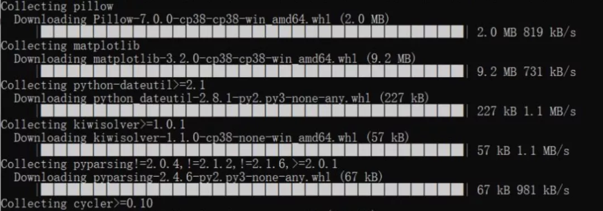
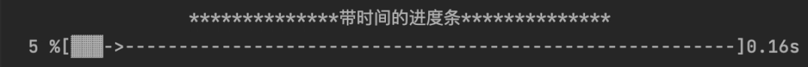
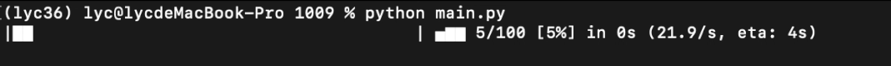
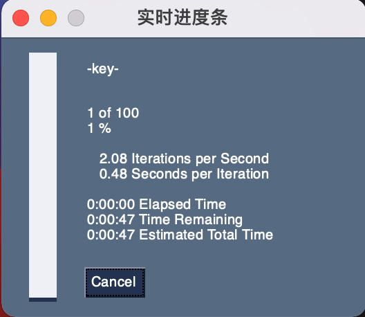
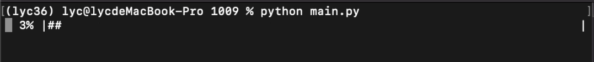

Python<br />在安装python库的时候可以看到下载的进度，此外在下载文件时也可以看到类似的进度条，比如下图这种：<br /><br />应用场景：下载文件、任务计时等<br />分享Python的6种不同的实现实时显示处理进度的方式。
<a name="AIbHw"></a>
## 第1种：普通进度条
利用打印功能`print`进行实时刷新显示
```python
for i in range(1, 101):
    print("\r", end="")
    print("进度: {}%: ".format(i), "▓" * (i // 2), end="")
    sys.stdout.flush()
    time.sleep(0.05)
```

<a name="dBdp8"></a>
## 第2种：带时间的普通进度条
第2种同样通过`print`进行打印进度条，不过还加入了time时间显示，显示进度过程中所需要的时间

```python
t = 60
print("**************带时间的进度条**************")
start = time.perf_counter()
for i in range(t + 1):
    finsh = "▓" * i
    need_do = "-" * (t - i)
    progress = (i / t) * 100
    dur = time.perf_counter() - start
    print("\r{:^3.0f}%[{}->{}]{:.2f}s".format(progress, finsh, need_do, dur), end="")
    time.sleep(0.05)
```

<a name="Oi5o8"></a>
## 第3种：tqdm库
tqdm是专门用于进度条的一个python库，详细的用法可以参考下方官方文档<br />[https://pypi.org/project/tqdm/#description](https://pypi.org/project/tqdm/#description)
```python

from tqdm import tqdm
for i in tqdm(range(1, 60)):
    """
    代码
    """
    # 假设这代码部分需要0.05s，循环执行60次
    time.sleep(0.05)
```

<a name="NoBtl"></a>
## 第4种：alive_progress库
alive_progress是一个动态的实时显示进度条库，详细的用法可以参考下方官方文档<br />[https://pypi.org/project/alive-progress/#description](https://pypi.org/project/alive-progress/#description)

---

```python
from alive_progress import alive_bar
# 假设需要执行100个任务
with alive_bar(len(range(100))) as bar:
    for item in range(100): # 遍历任务
        bar()  # 显示进度
        """
        代码
        """
        # 假设这代码部分需要0.05s
        time.sleep(0.05)
```

<a name="byO4j"></a>
## 第5种：PySimpleGUI库
PySimpleGUI也是一种动态进度条库，该库是自带GUI界面（基于PyQt，Tkinter等），详细的用法可以参考下方官方文档<br />[https://pypi.org/project/PySimpleGUI/#description](https://pypi.org/project/PySimpleGUI/#description)

---

```python
import PySimpleGUI as sg
count = range(100)
for i, item in enumerate(count):
    sg.one_line_progress_meter('实时进度条', i + 1, len(count), '-key-')
    """
    代码
    """
    # 假设这代码部分需要0.05s
    time.sleep(0.05)
```

<a name="PZhNo"></a>
## 第6种：`progressbar`库
[https://pypi.org/project/progressbar/#description](https://pypi.org/project/progressbar/#description)

---

```python
import progressbar
p = progressbar.ProgressBar()
# # 假设需要执行100个任务，放到ProgressBar()中
for i in p(range(100)):
    """
    代码
    """
    # 假设这代码部分需要0.05s
    time.sleep(0.05)
```

