Python 进度条<br />alive-progress是一个 Python 下的进度条库，不仅使用方便而且支持多种炫酷显示效果！先来看看示例效果：<br />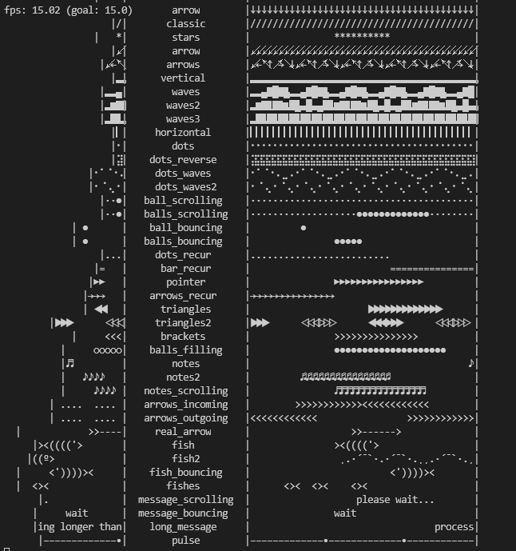
<a name="M95Rb"></a>
## 一、安装
在 Python 下使用 pip 进行安装：
```bash
pip install alive-progress
```
<a name="K8jf6"></a>
## 二、快速入门
<a name="DWoxk"></a>
### 2.1 直接使用
在循环中使用 alive-progress 是最常见的用法，脚本可以这样写：
```python
# 导入 alive-progress 库
from alive_progress import alive_bar
import time
# 使用 with 语句创建一个进度条
with alive_bar(100) as bar: # 给 alive_bar 传入进度条总数目（这里是 100）
    for item in range(100):
        # 等待 1s
        time.sleep(.1)
        #更新进度条，进度 +1
        bar()
```
> 请注意，如果无法正常显示动画则尝试在 alive_bar 中加上 `force_tty=True` 参数。

运行以上代码可以看到在终端中出现了一个还算华丽的动态进度条：<br />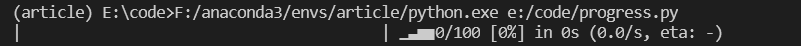
> 需要注意的是 alive-progress 并不像 tqdm 等进度条库一样会自动更新，只有程序调用了 bar 才会让进度条 +1.

当然，也可以不给进度条传入总数目这个参数，此时进度条将不显示进度，并进入**未定义**模式：<br /><br />有时候想直接操纵显示的位置，这时候可以设定 `alive_bar` 的 `manual` 参数为 `True`：
```python
from alive_progress import alive_bar
import time
total = 100
with alive_bar(total, manual=True) as bar: # total 可以不指定，这时候只有百分比
    bar(0.5) # 进度到 50%
    time.sleep(0.5)
    bar(0.1) # 进度到 10% 
    time.sleep(0.5)
    bar(0.75) # 进度到 75%
    time.sleep(0.5)
    bar(1.0) # 进度到 100%
    time.sleep(0.5)
    bar(10) # 进度到 1000%
    for i in range(1,101):
        bar(i/100) # 设定进度为 i%
        time.sleep(0.05)
```
<br />当然，在运行过程中也需要输出一些提示信息，直接使用 `print` 可以在不破坏进度条的情况下输出一行提示信息，`text` 方法则可以在进度条尾部添加后缀字符，而 `title` 参数则可以给进度条添加标题（前缀信息），具体使用方法及效果如下：
```python
from alive_progress import alive_bar
import time
# 定义标题（前缀字符）为 HelloGitHub
with alive_bar(10, title="HelloGitHub") as bar:
    for i in range(10):
        time.sleep(1)
        bar()   # 让进度 +1
        bar.text("Processing Work #%d"%(i+1))   # 更新进度条后缀
        print("Work #%d finished"%i)        # 输出一行信息
```
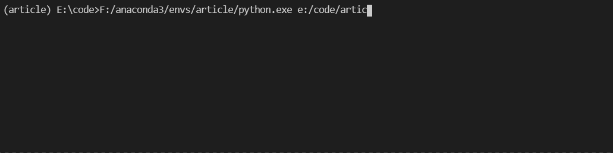
<a name="IkHyV"></a>
### 2.2 个性化定制进度条
看多了传统的进度条样式想换换花样？没问题，alive-progress 不仅内置了多种进度条样式，还支持自定义格式。<br />进度条可以自定义的样式分为两种：`bar` 和 `spinner`，只需要在调用 `alive_bar` 的时候传入对应的参数即可。<br />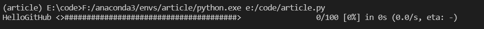<br />以这个进度条为例，中间最长的是 `bar`，旁边来回晃动的 `www.HelloGitHub.com` 是 `spinner`。<br />alive-progress 内置了多种 bar 和 spinner 样式，只需要调用 `show_bars` 或者 `show_spinners` 即可快速预览相应的样式，例如：
```python
from alive_progress import show_bars
show_bars() # 查看内置 bar 样式
```
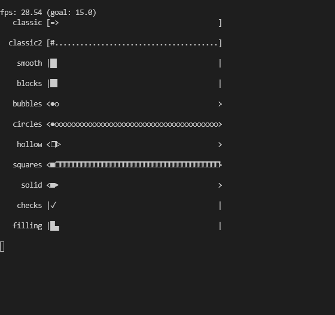
```python
from alive_progress import show_spinners
show_spinners() # 查看内置 spinner 样式
```
<br />默认样式使用起来非常简单，例如想使用 `bubbles` 这个 bar 和 `message_scrolling` 这个 spinner，直接传入对应名称即可：
```python
from alive_progress import alive_bar
import time
# 直接传入对应名字即可
with alive_bar(
            100,
            title="HelloGitHub", 
            bar="bubbles", spinner="message_scrolling"
            ) as bar:
    for i in range(100):
        time.sleep(.1)
        bar()
```
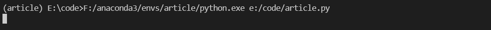<br />如果不知道 `total` 的数目，可以使用 `unknown` 参数（这时候将替换 bar 为 spinner）：
```python
from alive_progress import alive_bar
import time
with alive_bar(
            title="HelloGitHub", 
            # 注意：这里 bar 被换成了unknow，内置样式名称与 spinner 的相同
            unknown="stars", spinner="message_scrolling"
            ) as bar:
    for i in range(100):
        time.sleep(.1)
        bar()
```
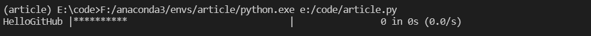
<a name="UKrkk"></a>
## 三、私人定制
或许比起直接使用内置模板如果更喜欢自己定制的进度条，对此 alive-progress 也提供了对应方法。
<a name="K2EGI"></a>
### 3.1 定制 bar
使用 `standard_bar_factory` 方法可以快速定制 bar，bar 可以设置的参数有五个：

- `chars`：正在执行单元的动画，按照进度依次显示。
- `borders`：进度条边界，显示在左右两边。
- `background`：未执行到单元显示的内容。
- `tip`：执行单元的前导符号。
- `errors`：出错时（进度未走全，超出 total 值等）时显示的字符。

例如想做一个如图所示的 bar：<br />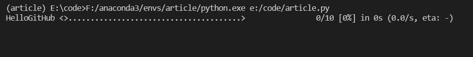<br />则可以这样来写：
```python
from alive_progress import alive_bar, standard_bar_factory
import time
##-------自定义 bar-------##
my_bar = standard_bar_factory( # 以下参数均有默认值，不必一次全部修改
                            chars="123456789#", # 加载时根据进度依次显示，长度任意
                            borders="<>",  # bar 两头的边界
                            background=".",  # 未加载部分用 "." 填充
                            tip=">",   # 指示进度方向的引导符号（分割 "#" 与 ".")
                            errors="⚠❌" # 发生错误时显示的内容（未完成，溢出） 
                            )
##-------自定义结束-------##
##--------动画演示-------##
with alive_bar(
            10,
            title="HelloGitHub", 
            bar=my_bar, # 这里传入刚刚自定义的 bar
      spinner="message_scrolling",
            manual=True
            ) as bar:
    for i in range(50):
        time.sleep(.1)
        bar(i/100)
    bar(.5)
    time.sleep(2)
    bar(10)
    print("上溢")
    time.sleep(1)
    bar(1)
    print("100% 完成")
    time.sleep(1)
    bar(.1)
    print("未完成")
```
<a name="OrhZy"></a>
### 3.2 定制 spinner
对于 spinner，alive-progress 提供了更多种的动画定义方式：<br />`frame_spinner_factory`：将传入的字符串挨个输出：
```python
from alive_progress import alive_bar, frame_spinner_factory
import time
my_spinner = my_spinner = frame_spinner_factory(
                                r'-----',
                                r'1----',
                                r'-2---',
                                r'--3--',
                                r'---4-',
                                r'----5'
                                ) # 直接传入字符串
with alive_bar(
            title="HelloGitHub",
            spinner=my_spinner
            ) as bar:
    while True:
        bar()
        time.sleep(.1)
```
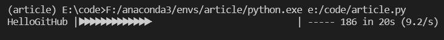<br />可以看到字符串挨个循环输出。<br />`scrolling_spinner_factory`：将字符串滚动播出
```python
from alive_progress import alive_bar, scrolling_spinner_factory
import time
my_spinner = scrolling_spinner_factory(
                                    chars="HelloGitHub", # 想要播放的字符串
                                    length=15, # spinner 区域宽度
                                    blank='.' # 空白部分填充字符
                                    )
with alive_bar(
            title="HelloGitHub",
            spinner=my_spinner
            ) as bar:
    while True:
        bar()
        time.sleep(.1)
```
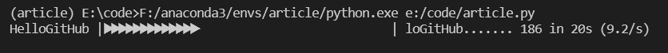<br />`bouncing_spinner_factory`：将两个字符串交替滚动播出
```python
from alive_progress import alive_bar, bouncing_spinner_factory
import time
my_spinner = bouncing_spinner_factory(
                                    right_chars="I love", # 从左边进入的字符串
                                    length=15, # spinner 区域长度
                                    left_chars="HelloGitHub", # 从右边进入的字符串
                                    blank='.',  # 空白区域填充字符
                                    )
with alive_bar(
            title="HelloGitHub",
            spinner=my_spinner
            ) as bar:
    while True:
        bar()
        time.sleep(.1)
```
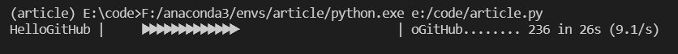
> 当然，也可以省略 left_chars 这个参数，其效果相当于 I love 将会像弹球一样左右弹动。

`unknown_bar_factory`：将 spinner 转换为能使用在未定义模式中的格式：
```python
from alive_progress import alive_bar, unknown_bar_factory, bouncing_spinner_factory
import time
my_spinner = bouncing_spinner_factory("www.HelloGitHub.com",15,hiding=False)
my_unknown_bar = unknown_bar_factory(my_spinner) # 传入定义的 spinner
with alive_bar(
            title="HelloGitHub",
            unknown=my_unknown_bar
            ) as bar:
    while True:
        bar()
        time.sleep(.1)
```
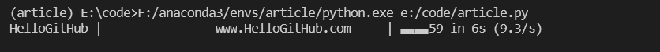
