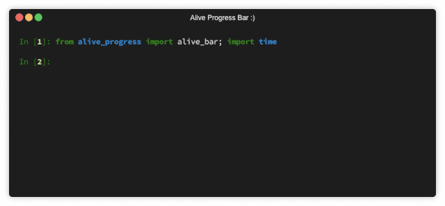
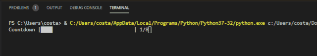
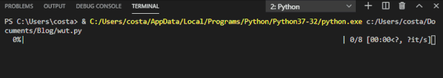
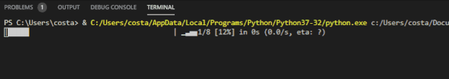
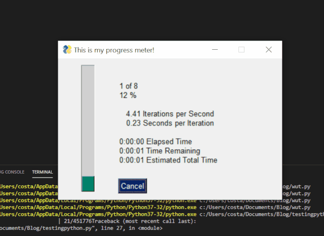
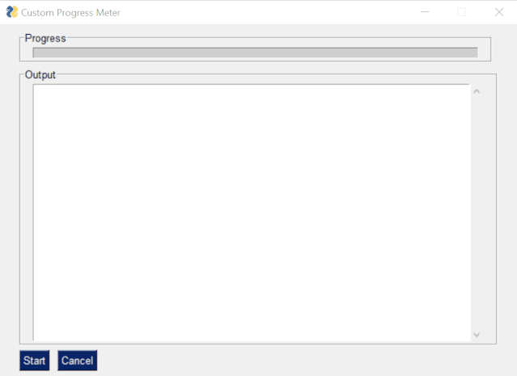

Python<br />如果之前没用过进度条，八成是觉得它会增加不必要的复杂性或者很难维护，其实不然。要加一个进度条其实只需要几行代码。<br /><br />在这几行代码中，可以看看如何在命令行脚本以及 PySimpleGUI UI 中添加进度条。<br /><br />下文将介绍 4 个常用的 Python 进度条库：
<a name="UOlr7"></a>
## **Progress**
第一个要介绍的 Python 库是 Progress。<br />只需要定义迭代的次数、进度条类型并在每次迭代时告知进度条。
```python
import timefrom progress.bar 
import IncrementalBarmylist = [1,2,3,4,5,6,7,8]
bar = IncrementalBar( Countdown, max = len(mylist))
for item in mylist: 
    bar.next() 
    time.sleep(1) 
    bar.finish()
```
相关文档：[https://pypi.org/project/progress/1.5/](https://pypi.org/project/progress/1.5/)
<a name="nAnAs"></a>
## **tqdm**
下面看一下 tqdm 库。<br />和之前见过的库差不多，这两行代码也非常相似，在设置方面有一点点不同：
```python
import timefrom tqdm 
import tqdmmylist = [1,2,3,4,5,6,7,8]
for i in tqdm(mylist): 
    time.sleep(1)
```
tqdm 实现的进度条效果如下：<br /><br />这个进度条也提供了几种选项。<br />相关文档：[https://tqdm.github.io/](https://tqdm.github.io/)
<a name="sKKZ4"></a>
## **Alive Progress**
顾名思义，这个库可以使得进度条变得生动起来，它比原来见过的进度条多了一些动画效果。<br />从代码角度来说比较相似：
```python
from alive_progress import alive_barimport 
timemylist = [1,2,3,4,5,6,7,8]
with alive_bar(len(mylist)) as bar: 
    for i in mylist: 
        bar() 
        time.sleep(1)
```
进度条的外观和预期差不多：<br /><br />这种进度条有一些与众不同的功能，使用起来会比较有趣，功能详情可见项目：[https://github.com/rsalmei/alive-progress](https://github.com/rsalmei/alive-progress)
<a name="sZSiG"></a>
## **PySimpleGUI**
**用 PySimpleGUI 得到图形化进度条**<br />可以加一行简单的代码，在命令行脚本中得到图形化进度条。<br /><br />为了实现上述内容，需要的代码是：
```python
import PySimpleGUI as sgimport 
timemylist = [1,2,3,4,5,6,7,8]
for i, item in enumerate(mylist): 
    sg.one_line_progress_meter( This is my progress meter! , i+1, len(mylist),  -key- ) 
    time.sleep(1)
```
PySimpleGUI 应用程序中的进度条项目作者之前曾经在 GitHub 上讨论过「如何快速启动 Python UI，然后使用 UI 创建比较工具」。<br />在这个项目里，作者还讨论了一下如何集成进度条。<br /><br />代码如下：
```python
import PySimpleGUI as sgimport 
timemylist = [1,2,3,4,5,6,7,8]
progressbar = [ [sg.ProgressBar(len(mylist), orientation= h , size=(51, 10), key= progressbar )]]
outputwin = [ [sg.Output(size=(78,20))]]
layout = [ [sg.Frame( Progress ,layout= progressbar)], [sg.Frame( Output , layout = outputwin)], [sg.Submit( Start ),sg.Cancel()]]
window = sg.Window( Custom Progress Meter , layout)
progress_bar = window[ progressbar ] while True: 
    event, values = window.read(timeout=10) 
    if event ==  Cancel  or event is None: 
        break 
    elif event ==  Start : 
        for i,item in enumerate(mylist): 
            print(item) 
            time.sleep(1) 
            progress_bar.UpdateBar(i + 1)window.close()
```
没错，在 Python 脚本中使用进度条只需要几行代码，一点也不复杂。有了进度条，以后也不用再猜测脚本运行的怎么样了。
