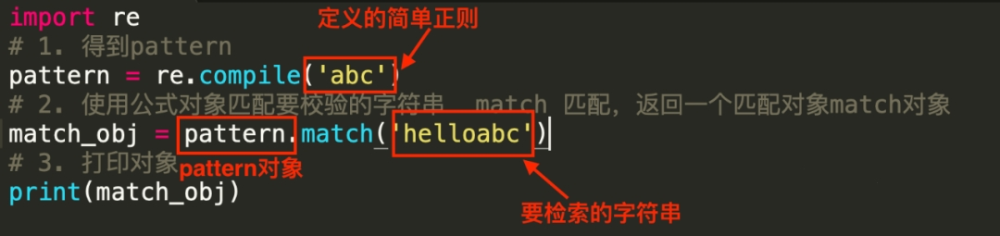

Python re
<a name="MWP0q"></a>
## 正则表达式与re模块
<a name="gyU0P"></a>
### 什么是正则表达式？
正则表达式（Regular Expression，简称Regex或RE）又称规则表达式，通常被用来检索、替换那些符合某个模式(规则)的文本，首先设定好了一些特殊的字及字符组合，通过组合的“规则字符串”来对字符串进行过滤，从而获取或匹配想要的特定内容。<br />它使用起来比较灵活、逻辑性和功能性比较强，能迅速地通过表达式从字符串中找到所需信息，但对于刚接触的人来说，比较晦涩难懂。<br />正则表达式不仅仅在Python中有，其他语言也是有正则表达式的，比如Java、JavaScript等等。<br />正则表达式进行检索的步骤：
<a name="HMMkv"></a>
### `re`模块
Python通过re模块提供了对正则表达式的支持，使用正则表达式之前需要导入该库。
```python
import re
```
特别提示：正则表达式使用时，对特殊字符进行转义，所以如果要使用原始字符串，需在字符串前面加一个r 前缀。
<a name="GBTz3"></a>
## `re`模块方法介绍
<a name="vBQGR"></a>
### `re`模块的常用方法

1. 使用 `re`模块下的`compile()` 函数将正则表达式的字符串形式编译为一个 Pattern 对象。
2. 通过 Pattern 提供的一系列方法可以对文本进行匹配查找，最后得到一个Match对象
3. 最后使用 Match 对象提供的属性和方法获得信息

首先认识一下`compile` 函数，它的一般使用形式如下：
```python
import re
# 将正则表达式编译成 Pattern 对象
pattern = re.compile(r'\w{3}')
print(pattern)
```
Pattern 对象的一些常用方法主要有：

- `match` 方法：从起始位置开始查找，一次匹配
- `search` 方法：从任何位置开始查找，一次匹配
- `findall` 方法：全部匹配，返回列表
- `finditer` 方法：全部匹配，返回迭代器
- `split` 方法：分割字符串，返回列表
- `sub` 方法：替换
<a name="dfnYn"></a>
#### `match`方法
`match`方法是从字符串的`pos`下标处起开始匹配`pattern`，如果`pattern`结束时已经匹配，则返回一个Match对象；<br />如果匹配过程中`pattern`无法匹配，或者匹配未结束就已到达`endpos`，则返回None。该方法原型如下：
```python
match(string[, pos[, endpos]]) 
# 或者 
re.match(pattern, string[, flags])
```
参数string表示字符串；`pos`表示下标，`pos`和`endpos`的默认值分别为`0`和`len(string)`；参数flags用于编译`pattern`时指定匹配模式。<br />三个常见的匹配模式：<br />(1) `re.I(re.IGNORECASE)`：忽略大小写（括号内是完整写法） <br />(2) `re.M(re.MULTILINE)`：允许多行模式 <br />(3) `re.S(re.DOTALL)`：支持点任意匹配模式
```python
import re
# 1. 得到pattern
pattern = re.compile('abc')
# 2. 使用公式对象匹配要校验的字符串  match 匹配，返回一个匹配对象match对象
match_obj = pattern.match('abcdef')
print(match_obj)
```
运行结果：
```python
<re.Match object; span=(0, 3), match='abc'> # 表示有匹配对象
```
```python
import re
# 1. 得到pattern
pattern = re.compile('abc')
# 2. 使用公式对象匹配要校验的字符串  match 匹配，返回一个匹配对象match对象
match_obj = pattern.match('helloabc')
print(match_obj)
```
运行结果是：`None`<br /><br />此时helloabc中明明是存在abc这个内容的，但是Match对象为什么是`None`呢？因为Match在匹配判断的时候都是从字符串的开头开始判断，如果开始没有匹配上就返回`None`了，但是如果代码改成下面这样就会返回一个Match对象
```python
import re
# 1. 得到pattern
pattern = re.compile('abc')
# 2. 使用公式对象匹配要校验的字符串  match 匹配，返回一个匹配对象match对象
match_obj = pattern.match('helloabc',5)
# 3. 打印对象
print(match_obj)
```
上面👆只是方便大家理解正则的检索过程，但是实际使用中可以直接通过`re.match(pattern,字符串)`进行检索。<br />比如
```python
import re
r = re.match('abc', 'helabclo')
print(r)
```
结果是`None`，因为还是从头开始比较的，但是事实上要检索的内容很有可能在字符串的中间或者后面，不可能每次都在前面。此时就要使用`search`方法了。
<a name="p6jyn"></a>
#### `search`方法
使用`search`表示从任何位置开始查找，一次匹配，**注意**：**是一次匹配，如果后面还有匹配的也不会查找了。**<br />它的一般使用形式如下：
```python
search(string[, pos[, endpos]])
```
其中，string 是待匹配的字符串，`pos` 和 `endpos` 是可选参数，指定字符串的起始和终点位置，默认值分别是 `0` 和 `len` (字符串长度)。<br />当匹配成功时，返回一个 Match 对象，如果没有匹配上，则返回 None。
```python
import re
r = re.search('abc', 'helabcloabc')
print(r)
```
此时返回的结果：
```python
<re.Match object; span=(3, 6), match='abc'>
```
Match对象有几个常用的方法：<br />`group()`: 用于获得一个或多个分组匹配的字符串，当要获得整个匹配的子串时，可直接使用 `group()` 或 `group(0)`<br />`span()`: 返回匹配字符串的起始位置<br />`start()`：用于获取分组匹配的子串在整个字符串中的起始位置（子串第一个字符的索引），参数默认值为 0；<br />`end()`：用于获取分组匹配的子串在整个字符串中的结束位置（子串最后一个字符的索引+1），参数默认值为 0
```python
import re
r = re.search('abc', 'helabcloabc')
if r:
    print(r.group())
    print(r.span())
    print(r.start())
    print(r.end())
```
结果是：
```python
abc
(3, 6)
3
6
```
如果正则定义复杂一些使用上面的匹配规则，使用方式也是这样吗？
```python
import re
match = re.search(r'([a-z]+) ([a-z]+)', 'hello Kitty hellobaby hello world')  # 注意此时是区分大小写的
if  match: 
    print(match.group(0))
    print(match.group(1)) # 获取第一个分组的字符串
    print(match.group(2)) # 获取第二个分组的字符串
    print(match.groups()) 
```
结果是：
```python
itty hellobaby
itty
hellobaby
('itty', 'hellobaby')
```
上面的正则表达式表示两组有多个a-z之间的任意字符组成的多个字符串，并且两组之间是有空格的。其中`match.groups()`表示的意思是(`m.group(1)`, `m.group(2)`, ...)，上面的代码只有两组，因此只能`match.group(2)`,但是如果`match.group(3)`则会报错。<br />可是问题又来了，`search`只要找到符合要求的字符串则不会继续查找，但是事实上后面仍然符合正则的仍然是存在的。<br />比如：hello world<br />要想所有的都获取到，考虑使用`findall()`。
<a name="I2iav"></a>
#### `findall`方法
```python
findall 方法的使用形式如下：
findall(string[, pos[, endpos]])
```
其中，string 是待匹配的字符串，`pos` 和 `endpos` 是可选参数，指定字符串的起始和终点位置，默认值分别是 0 和 `len` (字符串长度)。`findall` 以**列表形式返回** ，是全部能匹配的子串，如果没有匹配，则返回一个空列表。比如上面的代码使用`findall()`看看获取的结果是什么？
```python
import re
match_list = re.findall(r'([a-z]+) ([a-z]+)', 'hello Kitty hellobaby hello world')  # 注意此时是区分大小写的
if match_list: 
    print(match_list)
```
结果：
```python
[('itty', 'hellobaby'), ('hello', 'world')]
```
比如要求写一个正则，用于检索字符串所有两头是字母，中间全部是数字的字符串。
```python
import re
s = 'h88ex890loK123Jldkl90gd3o'

m = re.findall('[a-z][0-9]*[a-z]', s, re.I)

print(m)
```
结果：
```python
['h88e', 'x890l', 'oK', 'Jl', 'dk', 'l90g', 'd3o']
```
如果是判断一个字符串是否是数字开头呢？使用`match`、`search`、`findall`？
```python
import re
# 注意是数字开头,主要是判断开头，所以使用match
match = re.match(r'\d+.*','123admin')  # \d 在匹配规则上表示数字，+表示的是次数大于等于1，.表示任意字符，*表示长度是大于等于0
if match:
    print('是数字开头的')
else:
    print('不是数字开头的')
```
结果打印：是数字开头的，字符串换成：admin呢？<br />下面👇代码的结果会是什么呢？
```python
# 验证用户名 字母数字下划线  首字母不能是数字  长度必须6位以上
username = 'admin123'
m = re.match('[a-zA-Z_]\w{5,}$', username)
print(m.group())
```
<a name="PQjjW"></a>
#### `finditer` 方法
`finditer` 方法的行为跟 `findall` 的行为类似，也是搜索整个字符串，获得所有匹配的结果。但它返回一个顺序访问每一个匹配结果（Match 对象）的迭代器。大家可以将上面的代码改成`finditer`观察结果，此处不再展示代码。
<a name="NhXbF"></a>
#### `split` 方法
`split` 方法按照能够匹配的子串将字符串分割后返回列表，它的使用形式如下：
```python
split(string[, maxsplit])
```
其中，`maxsplit` 用于指定最大分割次数，不指定将全部分割。跟字符串的分隔类似，但是这个更加灵活。<br />比如：
```python
import re
s = 'hello Kitty    hellobaby hello world hello8hello'
m = re.split(r'[\s\d]+', s) # 表示遇到空白字符\s或者数字\d，都会切割,如果有多个空格也可以切割不仅是一个空格或者数字

print(m)
```
此时得到的结果是：
```python
['hello', 'Kitty', 'hellobaby', 'hello', 'world', 'hello', 'hello']
```
<a name="tW7Pb"></a>
#### `sub`方法
`sub` 方法用于替换。它的使用形式如下：
```python
sub(repl, string[, count])
```
`repl` 可以是字符串也可以是一个函数：

1. 如果 `repl` 是字符串，则会使用 `repl` 去替换字符串每一个匹配的子串，并返回替换后的字符串，另外，`repl` 还可以使用 id 的形式来引用分组，但不能使用编号 0；
2. 如果 `repl` 是函数，这个方法应当只接受一个参数（Match 对象），并返回一个字符串用于替换（返回的字符串中不能再引用分组）。

`count` 用于指定最多替换次数，不指定时全部替换
```python
import re

# 比如替换敏感词汇
s = '小明喜欢苍老师'
m = re.sub(r'(苍井空|苍老师)', '***', s)  # 括号里面的表示一组，可以是这一组中的任何一个。
print(m)

# 将里面的分数都替换成100分
msg = 'python=99,c=98,html=90'
m = re.sub(r'\d+', '100', msg)
print(m)
```
当然也可以使用函数，比如分数都加1分
```python
import re

def add(temp):
    print(temp) # 此处打印便于查看
    score = temp.group()  # 获取匹配的内容
    score = int(score) + 1
    return str(score)

m = re.sub(r'\d+', add, msg)
print(m)
```
当然在使用过程中还会涉及到分组、贪婪和非贪婪模式。
<a name="AnE8m"></a>
## `re`模块在爬虫中的应用
常用的正则表达式抓取网络数据的一些技巧。
<a name="mi1DN"></a>
### 抓取标签间的内容
urllib模块和requests模块是用来获取网络资源的两个模块，而获取的网络资源除了json的之外，都是跟HTML标签打交道。往往要做的就是获取标签的内容。<br />比如获取一下百度的title标题：
```python
import re  
import requests  
url = "http://www.baidu.com/"  
response = requests.get(url)
response.encoding='utf-8'
content = response.text
# 此处使用findall结合正则表达式完成
title = re.findall(r'<title>(.*?)</title>', content)
print(title[0])
```
<a name="SKyGG"></a>
### 抓取超链接标签间的内容
```python
import re  
import requests  
url = "http://www.baidu.com/"  
response = requests.get(url)
response.encoding='utf-8'
content = response.text
# 定义正则表达式获取所有网页的超链接
res = r"<a.*?href=.*?<\/a>"
urls = re.findall(res, content)
for u in urls:
    print(u)
```
当然如果想获取超链接中的内容也可以使用正则表达式，只不过使用了分组的内容就是`()`
```python
import re  
import requests  
url = "http://www.baidu.com/"  
response = requests.get(url)
response.encoding='utf-8'
content = response.text
#获取超链接<a>和</a>之间内容
res = r'<a .*?>(.*?)</a>'  
texts = re.findall(res, content, re.S|re.M)  
for t in texts:
    print(t)
```
<a name="uJsyx"></a>
### 抓取标签中的参数
HTML超链接的基本格式为“`<a href=URL>链接内容</a>`”，现在需要获取其中的**URL链接地址**，方法如下：
```python
import re  
import requests  
url = "http://www.baidu.com/"  
response = requests.get(url)
response.encoding='utf-8'
content = response.text
# 定义正则表达式获取所有网页的超链接
res = r"<a.*?href=.*?<\/a>"
urls = re.findall(res, content)
# 将所有的超级链接拼接成字符串
all_urls = '\n'.join(urls)
# 定义正则表达式
res = r"(?<=href=)http:.+?(?=\>)|(?<=href=)http:.+?(?=\s)"
# 查找符合规则的超级链接
urls = re.findall(res, content, re.I|re.S|re.M)
for url in urls:
    print(url) 
```
<a name="baaiy"></a>
### 抓取图片超链接标签的URL
HTML插入图片使用标签的基本格式为“”，则需要获取图片URL链接地址，下面👇案例不仅获取的图片链接而且将图片保存到了本地。
```python
import re
import requests

# 从网络获取一张图片的html标签
image = ''
# 使用正则表达式获取src后面的内容
m = re.match(r'<img class="currentImg" id="currentImg" src="(.+?)"', image)
print(m.group(1))
image_path = m.group(1)

# 如果想下载获取的图片链接我们结合requests和文件保存完成
response = requests.get(image_path)
# 获取响应信息的内容
result = response.content
# 获取图片名称
filename = image_path[image_path.rfind('%')+1:]
path = os.path.join(r'images', filename)
# 保存到本地将图片
with open(path, 'wb') as wstream:
    wstream.write(result)
print('文件下载结束！')
```
