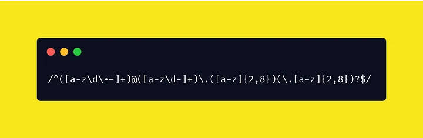

Python<br />以下函数参数中的pattern是正则表达式的字符串形式，string 是要进行匹配的字符串，flags 是可选的匹配模式。
<a name="RFqVr"></a>
## compile
`re.compile(pattern, flags=0)`：编译正则表达式并返回一个正则表达式对象。可以使用这个对象的方法进行匹配。<br />示例代码：
```python
import re

string = "The quick brown fox jumps over the lazy dog."
pattern = re.compile(r"\b\w{4}\b")
matches = pattern.findall(string)

print(matches)
```
输出结果：
```
['over', 'lazy']
```
这个例子先使用 re.compile() 函数将正则表达式编译为一个正则表达式对象，然后使用这个对象的 findall() 方法在字符串中查找所有匹配项。
<a name="M8dC6"></a>
## fullmatch
`re.fullmatch(pattern, string, flags=0)`：尝试将整个字符串与正则表达式进行匹配。<br />如果匹配成功，则返回一个匹配对象。如果匹配失败，则返回 None。<br />示例代码：
```python
import re

string = "123-45-6789"
match = re.fullmatch(r"\d{3}-\d{2}-\d{4}", string)

if match:
    print("Match found!")
else:
    print("Match not found.")
```
输出结果：
```
Match found!
```
这个例子使用 re.fullmatch() 函数来检查字符串是否与正则表达式完全匹配。如果匹配成功，则返回一个匹配对象。
<a name="laJ6V"></a>
## escape
`re.escape(string)`：对字符串中的正则表达式元字符进行转义，以便可以直接在正则表达式中使用。<br />示例代码：
```python
import re

string = "The quick brown fox (jumped) over the lazy dog."
pattern = re.compile(re.escape("("))

match = pattern.search(string)

if match:
    print("Match found!")
else:
    print("Match not found.")
```
输出结果：
```
Match found!
```
这个例子使用 re.escape() 函数对字符串中的左括号进行转义，以便可以直接在正则表达式中使用。<br />在这个例子中，正则表达式是 \(，表示匹配一个左括号。
<a name="KLga8"></a>
## search
`re.search(pattern, string, flags=0)`：在字符串中查找模式的第一个匹配项，并返回一个匹配对象。<br />如果没有找到匹配项，则返回 None。<br />示例代码：
```python
import re

string = "The quick brown fox jumps over the lazy dog."
match = re.search(r"fox", string)

if match:
    print("Match found!")
else:
    print("Match not found.")
```
输出结果：
```
Match found!
```
<a name="Ukx5s"></a>
## match
`re.match(pattern, string, flags=0)`：在字符串的开头查找模式的第一个匹配项，并返回一个匹配对象。如果没有找到匹配项，则返回 None。<br />示例代码：
```python
import re

string = "The quick brown fox jumps over the lazy dog."
match = re.match(r"The.*fox", string)

if match:
    print("Match found!")
    print(match.group())
else:
    print("Match not found.")
```
输出结果：
```
Match found!
The quick brown fox
```
这个例子中，正则表达式是 The.*fox，表示以 "The" 开头，以 "fox" 结尾，中间包含任意数量的字符。
<a name="X8l6o"></a>
## findall
re.findall(pattern, string, flags=0)：在字符串中查找所有匹配项，并以列表的形式返回它们。<br />如果没有找到匹配项，则返回一个空列表。<br />示例代码：
```python
import re

string = "The quick brown fox jumps over the lazy dog."
matches = re.findall(r"\w+", string)

print(matches)
```
输出结果：
```
['The', 'quick', 'brown', 'fox', 'jumps', 'over', 'the', 'lazy', 'dog']
```
<a name="lS3ZZ"></a>
## finditer
`re.finditer(pattern, string, flags=0)`：在字符串中查找所有匹配项，并以迭代器的形式返回它们。如果没有找到匹配项，则返回一个空迭代器。<br />示例代码：
```python
import re

string = "The quick brown fox jumps over the lazy dog."
pattern = re.compile(r"\b\w{4}\b")
matches = pattern.finditer(string)

for match in matches:
    print(match.group())
```
输出结果：
```
over
lazy
```
这个例子中，正则表达式是 \b\w{4}\b，表示匹配一个长度为 4 的单词。<br />re.compile() 函数将这个正则表达式编译为一个正则表达式对象，然后使用对象的 finditer() 方法在字符串中查找所有匹配项，并返回一个迭代器。
<a name="qbhIF"></a>
## sub
`re.sub(pattern, repl, string, count=0, flags=0)`：在字符串中查找所有匹配项，并将它们替换为 repl。<br />如果 count 被指定，则只替换前 count 个匹配项。返回一个新的字符串。<br />示例代码：
```python
import re

string = "The quick brown fox jumps over the lazy dog."
new_string = re.sub(r"\s", "-", string)

print(new_string)
```
输出结果：
```
The-quick-brown-fox-jumps-over-the-lazy-dog.
```
<a name="IFg10"></a>
## split
`re.split(pattern, string, maxsplit=0, flags=0)`：在字符串中查找所有匹配项，并使用它们作为分隔符将字符串拆分为子串。<br />如果 maxsplit 被指定，则最多拆分 maxsplit 次。返回一个列表。<br />示例代码：
```python
import re

string = "The quick brown fox jumps over the lazy dog."
words = re.split(r"\s", string)

print(words)
```
输出结果：
```
['The', 'quick', 'brown', 'fox', 'jumps', 'over', 'the', 'lazy', 'dog.']
```

