Python<br />正则表达式（Regular Expression）描述了一种字符串匹配的模式（Pattern），可以用来检查一个串是否含有某种子串、将匹配的子串替换或者从某个串中取出符合某个条件的子串等。对于初级简单的正则匹配还算比较容易掌握，但是稍微复杂一点的正则就会经常使人头晕。因为正则表达式不够直观，可读性较差，可能自己写的正则别人看不懂。<br />parse能够方便清晰地处理正则匹配的问题，非常适合一些简单的匹配问题。下面按照官方文档来整理一份parse的简单介绍。<br />首先是parse的安装，通过pip：
```bash
pip install parse
#清华镜像
pip install -i https://pypi.tuna.tsinghua.edu.cn/simple parse
```
安装成功后就可以导入了：
```python
from parse import parse
```
<a name="adamf"></a>
#### 最简单的匹配，若匹配上返回一个Result 实例
```python
print(parse('python', 'python'))
```
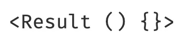
<a name="UkvUC"></a>
#### 若没有匹配上，则返回None
```python
print(parse('pthon', 'python'))
```
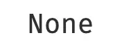
<a name="abAvu"></a>
#### 如果通过“{ }”进行匹配，最后会返回一个匹配到的可用下标索引的Result实例
```python
p = parse("With great {} there must come great {}", "With great power there must come great responsibility")
print(p)
```
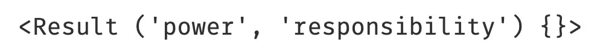
```python
print(p[0])
print(p[1])
```
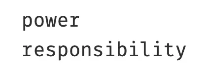
<a name="OV12j"></a>
#### 如果通过“{ }”进行匹配并为匹配字段定义了字段名，最后会返回一个匹配到的可用键索引的Result实例
```python
p = parse("With great {noun1} there must come great {noun2}", "With great power there must come great responsibility")
print(p)
```
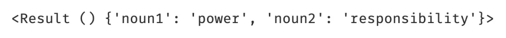
```python
print(p['noun1'])
print(p['noun2'])
```

<a name="OLL0I"></a>
#### 可以像`re.compile`一样编写`pattern`来复用规则：
```python
from parse import compile
 
pattern = compile("With great {noun1} there must come great {noun2}")
p = pattern.parse("With great power there must come great responsibility")
 
print(p)
```

<a name="fvrQ8"></a>
#### 在定义匹配规则时也可以设定好类型的转换（默认匹配出的类型为str）
```python
# 不定义类型转换
p = parse("My name is {name}, I have shot down {number} mobile suits.", "My name is Amuro Ray, I have shot down 72 mobile suits.")
print(p)
# 定义类型转换
p = parse("My name is {name}, I have shot down {number：d} mobile suits.", "My name is Amuro Ray, I have shot down 72 mobile suits.")
print(p)
```
<br />在匹配的“{ }”中加入“`:d`”就可以将字符串型转换为整数型。另外还有很多可以转换的类型：

| l | Letters (ASCII) | str |
| --- | --- | --- |
| w | Letters, numbers and underscore | str |
| W | Not letters, numbers and underscore | str |
| s | Whitespace | str |
| S | Non-whitespace | str |
| d | Digits (effectively integer numbers) | int |
| D | Non-digit | str |
| n | Numbers with thousands separators (, or .) | int |
| % | Percentage (converted to value/100.0) | float |
| f | Fixed-point numbers | float |
| F | Decimal numbers | Decimal |
| e | Floating-point numbers with exponent e.g. 1.1e-10, NAN (all case insensitive) | float |
| g | General number format (either d, f or e) | float |
| b | Binary numbers | int |
| o | Octal numbers | int |
| x | Hexadecimal numbers (lower and upper case) | int |
| ti | ISO 8601 format date/time e.g. 1972-01-20T10:21:36Z (“T” and “Z” optional) | datetime |
| te | RFC2822 e-mail format date/time e.g. Mon, 20 Jan 1972 10:21:36 +1000 | datetime |
| tg | Global (day/month) format date/time e.g. 20/1/1972 10:21:36 AM +1:00 | datetime |
| ta | US (month/day) format date/time e.g. 1/20/1972 10:21:36 PM +10:30 | datetime |
| tc | ctime() format date/time e.g. Sun Sep 16 01:03:52 1973 | datetime |
| th | HTTP log format date/time e.g. 21/Nov/2011:00:07:11 +0000 | datetime |
| ts | Linux system log format date/time e.g. Nov 9 03:37:44 | datetime |
| tt | Time e.g. 10:21:36 PM -5:30 | time |

<a name="XYZkw"></a>
#### 在提取匹配时直接去掉多余的空格
```python

p = parse("Stop talking, {}.", "Stop talking,    Char Aznable    .")
print(f"不去除空格的结果：{p}")
p = parse("Stop talking, {:^}.", "Stop talking,    Char Aznable    .")
print(f"去除空格的结果：{p}")
```
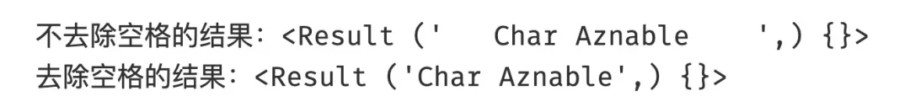<br />“`:^`”代表左边与右边的空格都去除，“`:<`”代表去除右边的空格，“`:>`”代表去除左边的空格。
<a name="Gjehq"></a>
#### 区分大小写
```python
# 默认不区分大小写
p = parse("char aznable", "Char Aznable")
print(p)
# case_sensitive=True区分大小写
p = parse("char aznable", "Char Aznable", case_sensitive=True)
print(p)
```
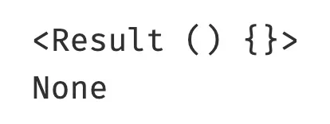<br />Result实例的属性（fixed、named、spans）：
```python
p = parse("How dare you {} me, {name}!", "How dare you scheme against me, Char Aznable!")
print(p)
```
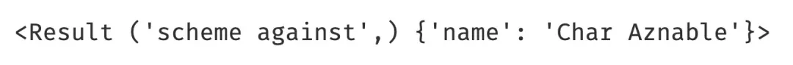
```python
p.fixed
```
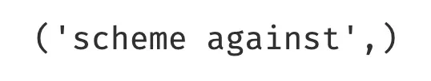
```python
p.named
```
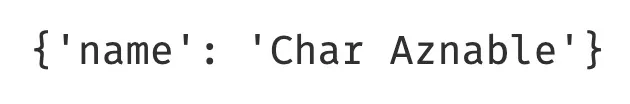<br />spans为每个匹配到的在原始字符串中的位置：
```python
p.spans
```
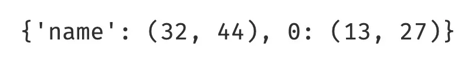
<a name="P3M7v"></a>
#### 自定义匹配的转换形式
```python
def add_five(x):
    return int(x)+5
 
p = parse("My name is {}, I am {} years old.", "My name is Banagher Links, I am 16 years old.")
print(p)
# 用add_five函数转换
p = parse("My name is {}, I am {:add_five} years old.", "My name is Banagher Links, I am 16 years old.", dict(add_five=add_five))
print(p)
```
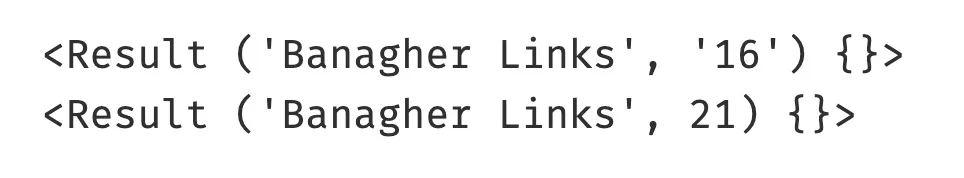
