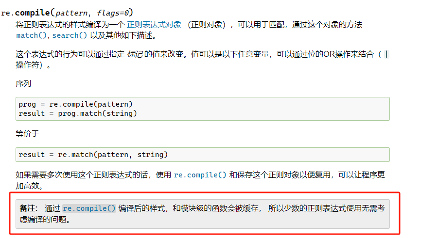

<a name="W0TkB"></a>
## `re.finditer` 代替 `re.findall`
在初学Python正则的时候，就发现`re.findall`特别好用而简便。<br />不用使用group方法提取数据，而且能做到“全匹配”。
```python
import re

text = "Hello, my phone numbers are 123-456-7890 and 987-654-3210."

phone_numbers_findall = re.findall(r'\d{3}-\d{3}-\d{4}', text)
print("findall:", phone_numbers_findall)

# 输出结果：findall: ['123-456-7890', '987-654-3210']
```
但是在匹配数据非常大的时候，`re.findall`返回的列表会特别占内存空间。<br />所以当已知匹配的数据非常大的情况下，优先考虑使用`re.finditer`才是正解，因为它执行后返回的是一个**迭代器对象**。
```python
import re

text = "Hello, my phone numbers are 123-456-7890 and 987-654-3210."

phone_numbers_finditer = re.finditer(r'\d{3}-\d{3}-\d{4}', text)

print(type(phone_numbers_finditer)) # <class 'callable_iterator'>
print("finditer:")
for match in phone_numbers_finditer:
    print(match.group())

    # 输出结果：
    # finditer:
    # 123-456-7890
# 987-654-3210
```
<a name="zNeHE"></a>
## `str.split` 性能比 `re.split` 更优
这俩除了写法不同之外没什么区别。相比之下`re.split`的写法稍微会复杂点（因为要写pattern）。
```python
import re

# 使用 re.split
text = "123-456-7890, 987-654-3210"
pattern = r'[-]'
result_re = re.split(pattern, text)
print("re.split:", result_re)
# re.split: ['123', '456', '7890, 987', '654', '3210']

# 使用 str.split
result_str = text.split('-')
print("str.split:", result_str)
# str.split: ['123', '456', '7890, 987', '654', '3210']
```
两者返回值也都是列表。<br />但...性能如何，需要测下。
```python
import re
import time

times = 100000
text = "123-456-7890, 987-654-3210"

start_time = time.time()
for _ in range(times):  
    result_re = re.split(r'[-]', text, maxsplit=1, flags=re.IGNORECASE)

end_time = time.time()
execution_time = (end_time - start_time)* 100
print("re.split execution time:", execution_time, "milliseconds")

start_time = time.time()
for _ in range(times):  
    result_str = text.split('-')

end_time = time.time()
execution_time = (end_time - start_time)* 100
print("str.split execution time:", execution_time, "milliseconds")
```
分别执行了split100000次，得到结果：
```python
re.split execution time: 5.420470237731934 milliseconds
str.split execution time: 1.855015754699707 milliseconds
```
分别执行了split10000000次，得到结果：
```python
re.split execution time: 718.4126615524292 milliseconds
str.split execution time: 231.18553161621094 milliseconds
```
结论：使用`str.split`性能更优。
<a name="mmtRS"></a>
## 复用的pattern，一定要预编译
这结论不是随口说说的，官方文档明确记载：<br />验证下结论是否是正确的：
```python
# 使用编译后的正则表达式
pattern_compiled = re.compile(r'\d{3}-\d{3}-\d{4}')

# 不使用编译的正则表达式
pattern_not_compiled = r'\d{3}-\d{3}-\d{4}'
```
完整测试代码：
```python
import re
import time

times = 100000
# 使用编译后的正则表达式
pattern_compiled = re.compile(r'\d{3}-\d{3}-\d{4}')

# 不使用编译的正则表达式
pattern_not_compiled = r'\d{3}-\d{3}-\d{4}'

# 测试字符串
text = "123-456-7890, 987-654-3210, 555-123-4567"

# 使用编译后的正则表达式
start_time_compiled = time.time()
for _ in range(times):
    result_compiled = pattern_compiled.findall(text)
end_time_compiled = time.time()
execution_time_compiled = (end_time_compiled - start_time_compiled) * 1000

# 不使用编译的正则表达式
start_time_not_compiled = time.time()
for _ in range(times):
    result_not_compiled = re.findall(pattern_not_compiled, text)
end_time_not_compiled = time.time()
execution_time_not_compiled = (end_time_not_compiled - start_time_not_compiled) * 1000

# 打印执行时间
print("使用预编译的执行时间:", execution_time_compiled, "毫秒")
print("不使用预编译的执行时间:", execution_time_not_compiled, "毫秒")
```
循环100000次代码执行时间：
```python
使用预编译的执行时间: 55.454254150390625 毫秒
不使用预编译的执行时间: 81.07376098632812 毫秒
```
循环10000000次代码执行时间：
```python
使用预编译的执行时间: 6629.4105052948 毫秒
不使用预编译的执行时间: 9879.02545928955 毫秒
```
