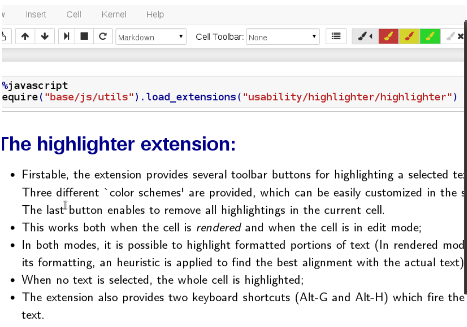

Jupyter Notebook
<a name="gGc4Z"></a>
### 准备工作
首先先下载好插件选择的工具栏，通过`pip install`来进行下载即可
```bash
pip install jupyter_contrib_nbextensions
```
然后将这个插件选项的工具栏添加到jupyter notebook的页面当中，运行下面这个的命令行
```bash
jupyter contrib nbextension install
```
打开jupyter notebook页面之后就可以看到有Nbextensions这个工具栏，如下图所示<br /><br />下面来介绍几个自认为十分好用的插件
<a name="waga6"></a>
### Hinterland
该插件的作用在于对代码有着自动填充的功能，对于很多程序员来说可以极大地提高编程效率，如下图所示<br />
<a name="Alw09"></a>
### Skip-Traceback
当所写的代码里面存在着例如语法错误等问题，一般jupyter notebook会报一大串错误，眼花缭乱的，该插件的作用就在于会省略很多繁杂、没有意义的错误提示，直接抛出问题的关键所在，如下图所示<br />
<a name="xWUvI"></a>
### Live Markdown Preview
该插件的作用在于方便程序员以及开发者们撰写Markdown内容，如下图所示<br />
<a name="rZQLv"></a>
### Highlighter
该插件的作用在于摘选出来的Markdown内容可以高亮显示出来，如下图所示<br />
<a name="dVayf"></a>
### Spell Checker
该插件的作用在于检查写的Markdown内容，拼写的语法错误、单词拼写是否准确，如下图所示<br />
<a name="U71Z4"></a>
### Code prettify
有时候程序员写的代码都是杂乱无章的，该插件的作用在于可以重新格式化、美化自己写的代码块，并且支持多种语言包括Python、R和JavaScript等等，如下图所示<br />
<a name="D4gL6"></a>
### Codefolding
该插件的作用在于可以将自己写的代码块折叠起来，如下图所示<br />
<a name="zSdxA"></a>
### Notify
有时候在jupyter notebook当中执行某个任务需要等待很长一段时间，该插件的作用在于任务执行完成的时候会提示，如下图所示<br />
<a name="WhoGc"></a>
### ExecuteTime
该插件的作用在于当代码块被执行的时候，显示出来代码块执行完成所需要的时间，如下图所示<br />
<a name="ZfvgO"></a>
### ScrollDown
当在打印`for`循环的时候，当输出的内容很多，该插件的作用在于会自动向下滚动输出内容，不需要人为地向下拖滚动条，如下图所示<br />
