Python Jupyter Lab<br />如果你是一个用 Python 的数据科学家，那么用 Jupyter Notebook 就是大概率事件了。作为 Jupyter Notebook 的「下一代」web 应用，Jupyter Lab 提供了相比以往更多的便捷功能，其中之一就是扩展。<br />下一代数据科学开发环境 Jupyter Lab 应该怎么用？从扩展工具开始。<br />现在，即使是 Jupyter Lab 开发者团队也对如此蓬勃发展的第三方扩展工具社区而感到兴奋了。在这篇文章中，机器学习工程师、计算机科学博士 Christopher Tao 将为读者介绍 10 种 Jupter Lab 扩展工具，它们对于典型的数据科学家 / 工程师来说可以大幅提高生产力。<br />
<a name="uT6O2"></a>
## 10 大 Jupyter Lab 扩展
目前，大多数在线资源都会使用以下命令来安装 Jupyter Lab 扩展：
```bash
jupyter labextension install @jupyterlab/...
```
当然，很多人都喜欢使用这种命令。如果是 VS-Code、Sublime 或 Atom 的用户，也许会希望在「管理器」中直接搜索要安装的内容。Jupyter Lab 却没有提供这些功能。<br />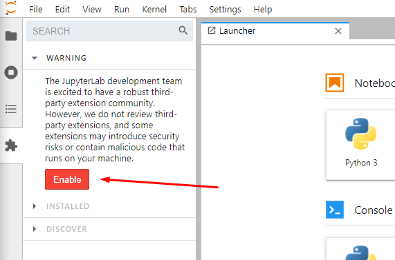<br />如上图所示，可以转到左侧导航栏第 4 个选项卡，即扩展管理器（extension manager）。然后就可以搜索到需要的扩展。<br />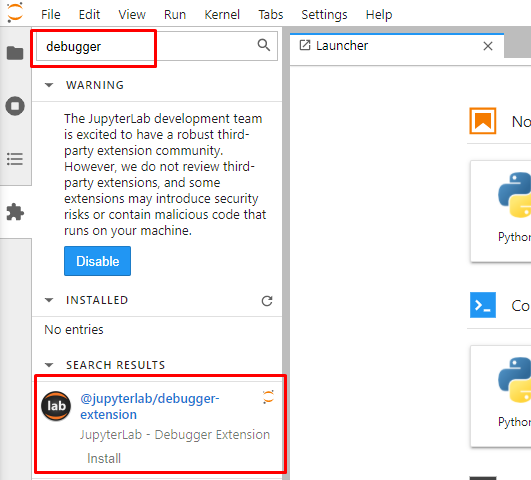<br />现在总结一下值得推荐的 10 个 Jupyter Lab 扩展。
<a name="vIeza"></a>
## JupyterLab 调试器
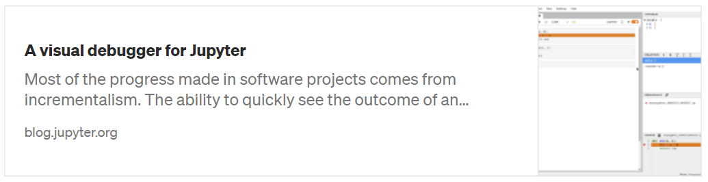<br />[JupyterLab 调试器指南项目地址](https://blog.jupyter.org/a-visual-debugger-for-jupyter-914e61716559)：[https://blog.jupyter.org/a-visual-debugger-for-jupyter-914e61716559](https://blog.jupyter.org/a-visual-debugger-for-jupyter-914e61716559)<br />由于 Jupyter 的交互性，它受到了很多人的喜欢。然而，调试功能是编码所必须的。例如，可以逐步调试 for 循环（for-loop ）来查看内部发生了什么。大多数 IDE 工具都支持这种带有「step over」和「step into」的调试特性，但遗憾的是，Jupyter 中没有这种特性。<br />「jupyterlab/debugger」就是这样一个扩展，可以补足 Jupyter Lab 中缺少的这个功能。<br />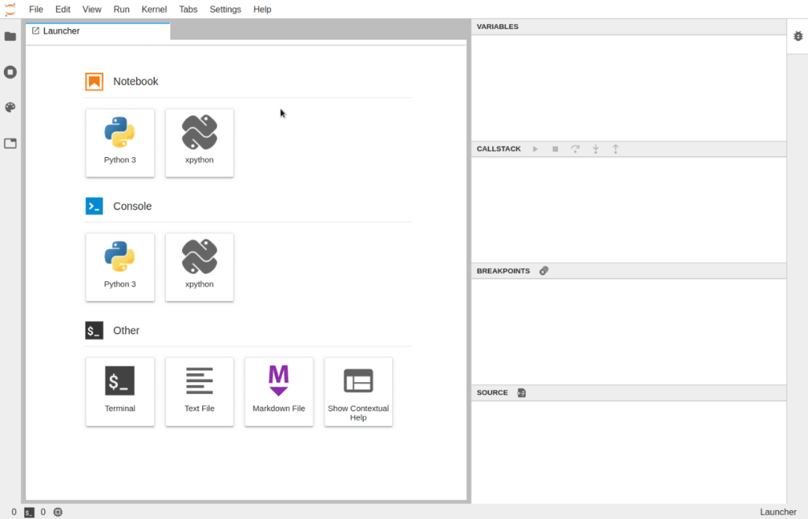
<a name="Jpx0D"></a>
## JupyterLab-TOC
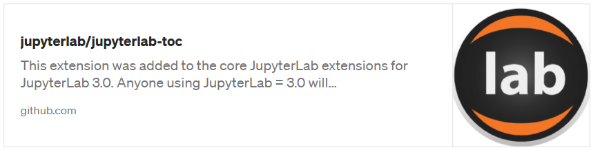<br />[JupyterLab-TOC 项目地址](https://github.com/jupyterlab/jupyterlab-toc)：[https://github.com/jupyterlab/jupyterlab-toc](https://github.com/jupyterlab/jupyterlab-toc)<br />notebook 太长？想让 notebook 看起来更漂亮？或者希望 notebook 有一个目录？「jupyterlab/toc」实现。<br />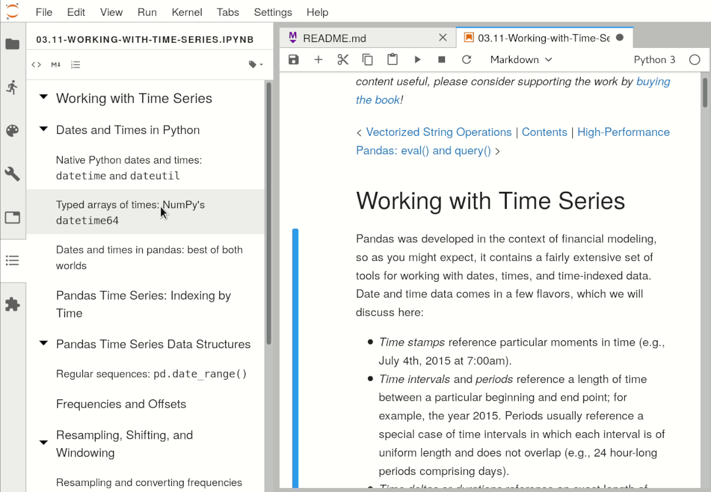<br />有了这个扩展，基于用标题标记的单元格会自动生成目录（确保使用标记 ## 来指定标题级别）。这也是使用 Jupyter Notebook 的好方法，让工作更有系统性和组织性。
<a name="PW6WT"></a>
## JupyterLab-DrawIO
<br />[JupyterLab-DrawIO 项目地址](https://github.com/QuantStack/jupyterlab-drawio)：[https://github.com/QuantStack/jupyterlab-drawio](https://github.com/QuantStack/jupyterlab-drawio)<br />Diagram.net（原名 Draw.IO）是绘制图表的工具，它确实是 MS Visio 完美的开源替代品。借助于 jupyterlab-drawio，可以在 Jupyter Lab 上使用该工具。<br />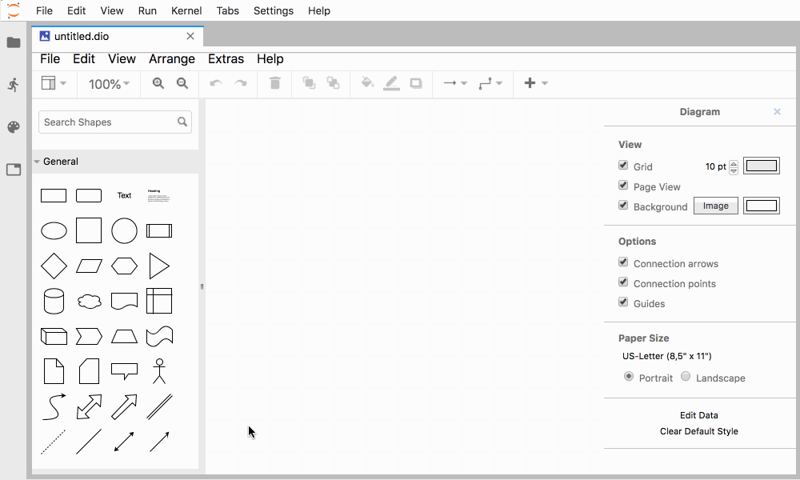
<a name="NUHSj"></a>
## JupyterLab Execution Time
<br />[JupyterLab Execution Time 项目地址](https://github.com/deshaw/jupyterlab-execute-time)：[https://github.com/deshaw/jupyterlab-execute-time](https://github.com/deshaw/jupyterlab-execute-time)<br />Jupyter Notebook/Lab 的一个惊人特性是它能提供许多有用的魔术命令（magic command）。例如可以使用「%timeit」测试代码运行时间。它将运行代码片段数百或数千次，并得到平均值，以确保给出一个公平和准确的结果。<br />但有时并不需要这样精确。只不过想知道每个单元运行的时间，在这种情况下，为每个单元使用「`%timeit`」变得不合适了。<br />在这种情况下，可以使用「jupyterlab-execute-time」。<br />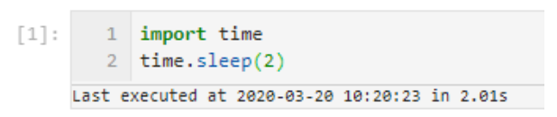<br />如上图所示，「jupyterlab-execute-time」不仅显示了执行单元的时间间隔，而且还显示了最后执行的时间。
<a name="Fvh6U"></a>
## JupyterLab Spreadsheet
<br />[JupyterLab Spreadsheet 项目地址](https://github.com/quigleyj97/jupyterlab-spreadsheet)：[https://github.com/quigleyj97/jupyterlab-spreadsheet](https://github.com/quigleyj97/jupyterlab-spreadsheet)<br />作为一名数据科学家或数据工程师，不得不与电子表格打交道。但是，Jupyter 本身不支持读取 Excel 文件，这需要打开多个工具，在 Jupyter 编码以及 Excel 之间不停地切换。<br />「jupyterlab-spreadsheet」可以很好地解决这类问题。它在 Jupyter Lab 中嵌入了 xls/xlsx 电子表格查看功能，因此可以在同一个地方获得所需的一切。<br />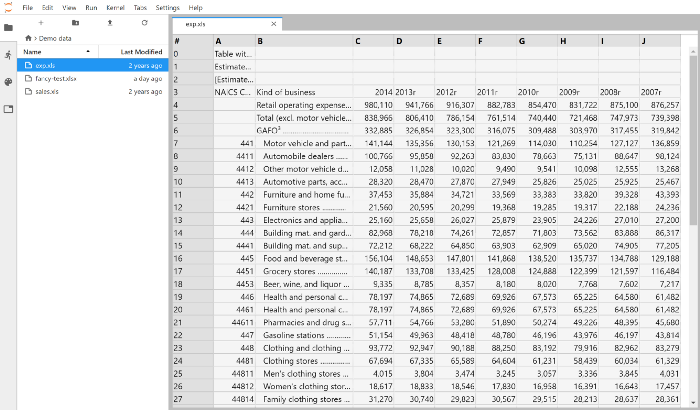
<a name="goNDP"></a>
## JupyterLab System Monitor
<br />[jupyterlab-system-monitor 项目地址](https://github.com/jtpio/jupyterlab-system-monitor)：[https://github.com/jtpio/jupyterlab-system-monitor](https://github.com/jtpio/jupyterlab-system-monitor)<br />Python 不是一种高效执行的编程语言，这意味着与其他语言相比，它可能会消耗更多的 CPU 和内存资源。Python 的最常见用例之一是数据科学。所以，可能想要监控自身系统硬件资源，从而注意到 Python 代码可能冻结了操作系统。<br />jupyterlab-topbar-extension 你想要拥有的扩展，它可以在 Jupyter Lab UI 的顶部栏显示 CPU 和内存使用情况，这样就可以实时监控了。如下动图所示：<br />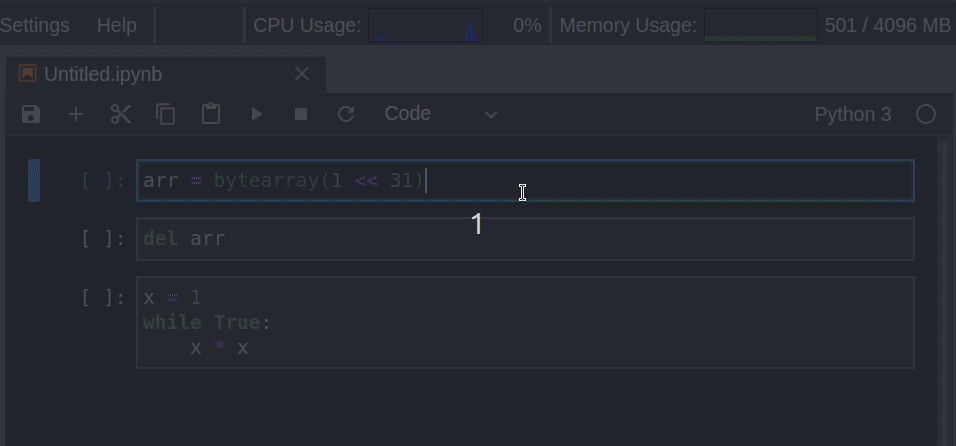
<a name="trpbZ"></a>
## JupyterLab Kite
<br />[jupyterlab-kite 项目地址](https://github.com/kiteco/jupyterlab-kite)：[https://github.com/kiteco/jupyterlab-kite](https://github.com/kiteco/jupyterlab-kite)<br />虽然很喜欢 Jupyter，但它不像其他经典 IDE 工具一样提供代码自动补全功能。Jupyter 的代码自动补全非常受限且速度很慢。<br />可能听说过免费的 AI 赋能代码补全服务 Kite，它在 Sublime、VS Code 和 PyCharm 等几乎所有流行的 IDE 工具中都可以使用。通过 jupyterlab-kite ([https://github.com/kiteco/jupyterlab-kite](https://github.com/kiteco/jupyterlab-kite)) 扩展，也可以在 Jupyter Lab 中使用这一功能。<br />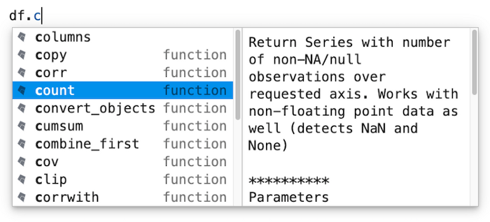
<a name="cdvUN"></a>
## JupyterLab Variable Inspector
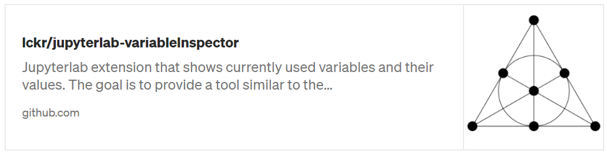<br />[jupyterlab-variableInspector 项目地址](https://github.com/lckr/jupyterlab-variableInspector)：[https://github.com/lckr/jupyterlab-variableInspector](https://github.com/lckr/jupyterlab-variableInspector)<br />如果是从 R studio 或 Matlab 转向使用 Jupyter Lab 的数据科学家，则可能对这些工具提供的变量检测器非常熟悉。但遗憾的是，Jupyter Lab 默认不支持这一功能。这时，jupyterlab-variableInspector 扩展可以重新支持该功能。<br />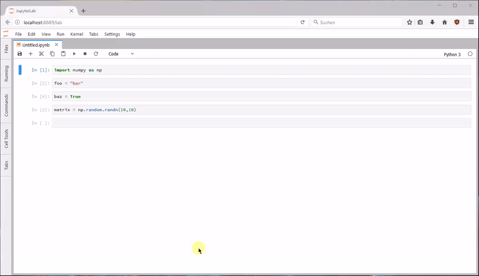
<a name="pFC7i"></a>
## JupyterLab Matplotlib
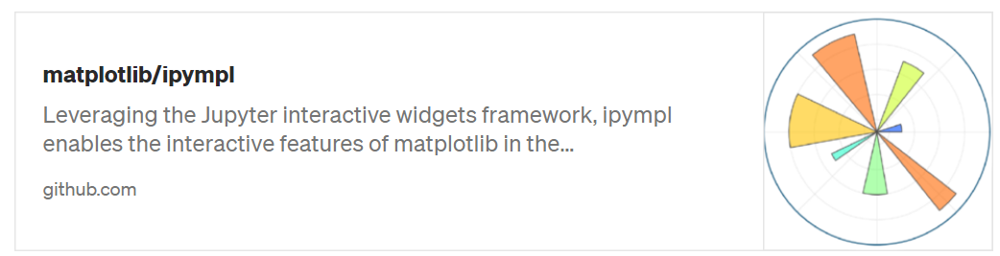<br />[Matplotlib/ipympl 项目地址](https://github.com/matplotlib/ipympl‘)：[https://github.com/matplotlib/ipympl](https://github.com/matplotlib/ipympl)<br />如果你是数据科学家，则 Matplotlib 是必须学习（must-learn）的 Python 库。该库是 Python 中一个基础但强大的数据可视化工具。但当使用 Jupyter Lab 时，交互特征消失了。<br />jupyter-matplotlib 扩展可以使 Matplotlib 再次具备交互性。只需要输入一个魔术命令 `%matplotlib widget` 来启动它，则你的精美 3D 图表就变成交互式的。如下动图所示：<br />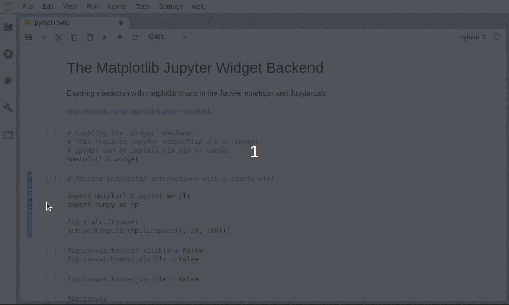
<a name="zkbtt"></a>
## JupyterLab Plotly
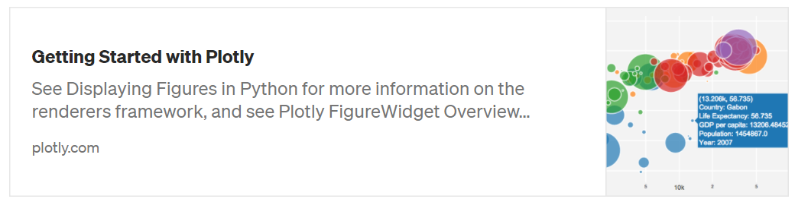<br />[Plotly 使用指南](https://plotly.com/python/getting-started/#jupyterlab-support-python-35)：[https://plotly.com/python/getting-started/#jupyterlab-support-python-35](https://plotly.com/python/getting-started/#jupyterlab-support-python-35)<br />虽然 Matplotlib 是最基础和强大的数据可视化库，但在这方面最喜欢的是 Plotly 库。该库封装了很多常见图表，可以通过数行代码生成令人惊叹的图表。<br />为使 Jupyter Lab 无缝支持和显示交互的 Plotly 图表，用户需要安装 jupyterlab-plotly。<br />原文链接：[https://towardsdatascience.com/10-jupyter-lab-extensions-to-boost-your-productivity-4b3800b7ca2a](https://towardsdatascience.com/10-jupyter-lab-extensions-to-boost-your-productivity-4b3800b7ca2a)
<a name="nSwcx"></a>
## 参考资料
Plotly 使用指南: [https://plotly.com/python/getting-started/#jupyterlab-support-python-35](https://plotly.com/python/getting-started/#jupyterlab-support-python-35)<br />JupyterLab调试器指南项目地址: [https://blog.jupyter.org/a-visual-debugger-for-jupyter-914e61716559](https://blog.jupyter.org/a-visual-debugger-for-jupyter-914e61716559)<br />JupyterLab-TOC 项目地址: [https://github.com/jupyterlab/jupyterlab-toc](https://github.com/jupyterlab/jupyterlab-toc)<br />JupyterLab-DrawIO 项目地址: [https://github.com/QuantStack/jupyterlab-drawio](https://github.com/QuantStack/jupyterlab-drawio)<br />JupyterLab Execution Time 项目地址: [https://github.com/deshaw/jupyterlab-execute-time](https://github.com/deshaw/jupyterlab-execute-time)<br />JupyterLab Spreadsheet 项目地址: [https://github.com/quigleyj97/jupyterlab-spreadsheet](https://github.com/quigleyj97/jupyterlab-spreadsheet)<br />jupyterlab-system-monitor 项目地址: [https://github.com/jtpio/jupyterlab-system-monitor](https://github.com/jtpio/jupyterlab-system-monitor)<br />jupyterlab-kite 项目地址: [https://github.com/kiteco/jupyterlab-kite](https://github.com/kiteco/jupyterlab-kite)<br />jupyterlab-variableInspector 项目地址: [https://github.com/lckr/jupyterlab-variableInspector](https://github.com/lckr/jupyterlab-variableInspector)<br />Matplotlib/ipympl 项目地址: [https://github.com/matplotlib/ipympl](https://github.com/matplotlib/ipympl)
