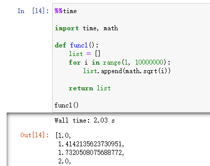

Python Jupyter Notebook
<a name="lZs40"></a>
## 魔法命令
何为魔法命令？<br />官方给出的定义是：IPython有一组预先定义好的所谓的魔法函数（Magic Functions），可以通过命令行的语法形式来访问它们。这些指令独立于Python语法，可以完成一些特殊的功能。<br />魔法命令共分为两类：

- 行魔法命令(line magic) : 前缀为"`%`"，且全部指令（包含主要参数）不可以换行。
- 单元格法术(cell magic): 前缀为"`%%`"，整个单元格都是魔法命令，单元格第一行必须是"%%"

在单元格Cell中输入`%lsmagic`即可查看所有的魔法命令，如果临时忘了某个函数名怎么拼写，可以用此查询。<br /><br />关于查询魔法命令，还有两个函数比较常用：

- `%quickref`：输出所有魔法命令的简单版帮助文档
- `%Magics_Name?`：输出某个魔法命令详细帮助文档

下面先罗列一下常见的魔法函数，并对其中五个进行详细演示讲解。<br /><br />注：由于IPython的内置`magic`函数，那么在Pycharm中是不会支持的。
<a name="oSVgP"></a>
## 计算运行时间
有时候需要进行代码优化，就需要计算对比一下函数或过程运行时间，以此来衡量代码的效率。<br />在Jupyter Notebook中有几个魔法函数可以实现，功能效果各有差异。<br /><br />这样就可以快速得到代码的运行时间，以此来对比代码的优化效果。<br />
<a name="AjjY1"></a>
## 查看当前变量
在Jupyter Notebook一行一行编写代码时，会发现自己定义的变量越来越多，到后面就不好想起来都在哪些单元格定义了哪些变量了。<br />其实可以使用魔法命令——`%who_ls`查看已经定义了哪些变量？<br /><br />包括导入的模块别名也在其中。<br />其中还可以指定变量类型查看，比如只想查看目前已经定义了哪些列表：
```python
%who_ls list
```

<a name="cMXbJ"></a>
## 保存单元格内容到文件
可以在Jupyter Notebook只保存部分内容为.py文件。这里需要使用魔法命令`%%writefile`，它的作用是将单元格中的内容保存到外部的文件中。<br />在下方的演示中，将代码
```python
message = "Hello World"
print(message)
```
保存为test.py文件<br /><br />打开当前工作目录，可以发现已生成test.py文件<br /><br />这时候想验证一下文件内容是否一致，有一个魔法命令`%pycat`，能够以弹出框的形式显示外部文件的内容。这样就不必离开Jupyter Notebook去查看.py文件了。<br />
<a name="sUB2n"></a>
## 设置环境变量
在机器学习/深度学习里，经常遇到使用环境变量的情况。<br />在Jupyter Notebook中，也是可以通过%魔术命令进行设置修改环境变量的。<br />例如`%env`或`%set_env`，用法也很简单`%env MY_VAR=MY_VALUE`或`%env MY_VAR MY_VALUE`。<br />另外，单独使用`%env`可以打印出当前的环境变量。
```python
%env THIS_IS_ENV_EXAMPLE "TEST2021"
```
其中`THIS_IS_ENV_EXAMPLE`是环境变量，它的值是字串 `TEST2021`<br />
<a name="T8S6R"></a>
## 代码分享
举个例子，正在Jupyter Notebook运行代码，遇到了一些问题想把代码分享出去。这时候要截图，还是另存为代码文件再发送文件呢？<br />其实还有另外一种选择——以链接的形式分享代码。
```python
%pastebin
```
该魔法命令可以将代码上传到Pastebin并返回一个链接。其中Pastebin是一个线上内容托管服务，可以在上面存储纯文本，如源代码片段，所形成的链接也可以分享给他人。<br />还可以指定分享的cell（单元格），比如：
```python
%pastebin 1-4
```
这样就生成了一个隐私的链接url供分享代码。<br /><br />网页打开链接，即可得到下图的界面。需要注意，生成的链接有效期只有7天。<br />
