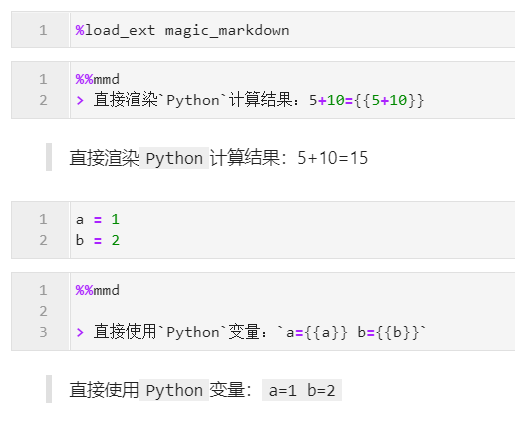
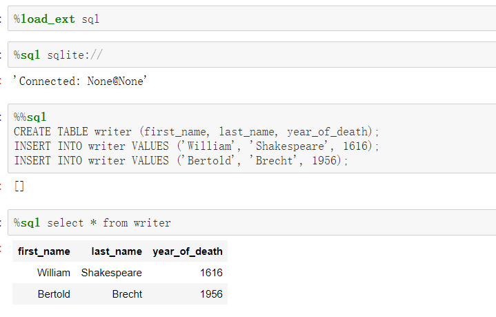
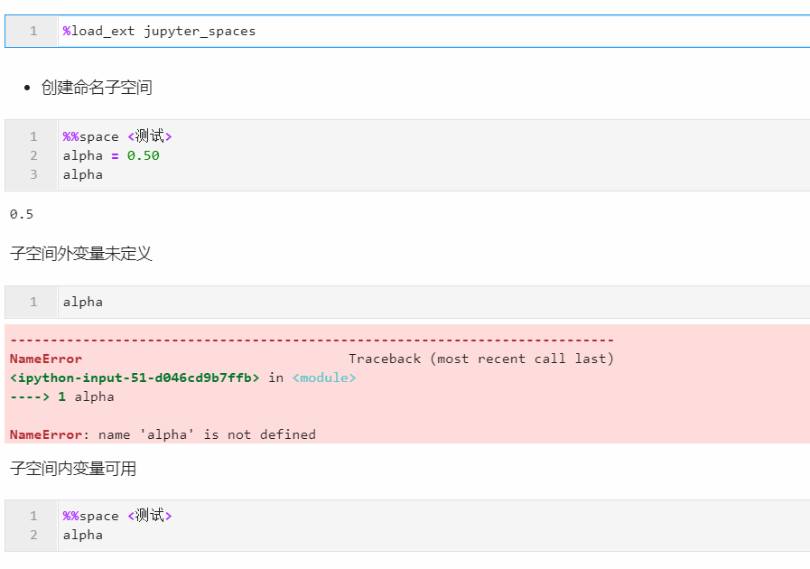
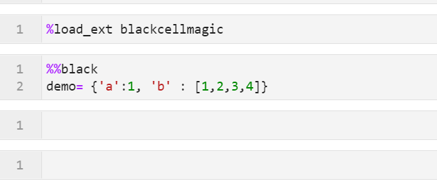
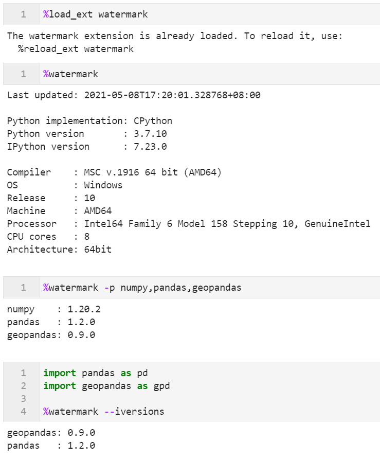
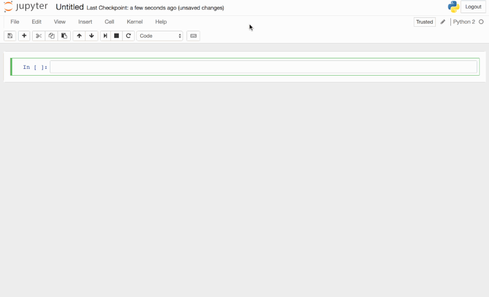

# Python Jupyter

## 1、简介
无论是jupyter notebook还是jupyter lab，都可以使用ipython中的众多自带「魔术命令」来实现丰富的辅助功能，诸如`%time`之类的。 介绍一些实用的基于「第三方拓展」的魔术命令，从而极大程度上扩展jupyter的功能。 

## 2、jupyter中实用的第三方魔术命令拓展
在jupyter中使用外部的拓展魔术命令，需要先像安装常规的Python库一样用pip等进行安装，再在使用前执行一次`%load_ext` 拓展名称或者import 拓展名称，之后在当前kernel还保持活跃的情况下，就可以随意在单元格内使用对应的拓展魔术命令。 下面来介绍一些常用的第三方魔术命令拓展。

### 2.1 用magic_markdown玩转markdown
虽然在jupyter中单元格有自带的markdown模式，但其功能比较有限，而利用magic_markdown，可以实现更多惊人的功能。 使用`pip install magic-markdown`完成安装之后，就可以使用魔术命令`%%mmd`按照下面的格式实现在markdown中嵌入Python变量：  更多示例见[https://github.com/transfluxus/magic_markdown](https://github.com/transfluxus/magic_markdown)。

### 2.2 用ipython-sql执行sql查询
使用`pip install ipython-sql`完成安装后，可以直接在jupyter单元格中完成数据库的连接及查询：  更多使用方法见[https://pypi.org/project/ipython-sql/](https://pypi.org/project/ipython-sql/)。

### 2.3 用jupyter_spaces创建命名子空间
使用`pip install jupyter_spaces`安装完成后，就可以参考下图来创建和移除不同的命名子空间，这在调试代码时很受用：  更多使用方法见[https://github.com/davidesarra/jupyter_spaces](https://github.com/davidesarra/jupyter_spaces)。

### 2.4 用blackcellmagic实现代码美化
通过`pip install blackcellmagic`之后，可以按照下图的方式使用blackcellmagic魔术命令，从而实现代码的格式化，且格式化时不会执行对应单元格内的代码，非常方便：  更多使用方法见[https://github.com/csurfer/blackcellmagic](https://github.com/csurfer/blackcellmagic)。

### 2.5 用watermark记录系统、版本等信息
接下来要介绍的watermark，可以记录诸如系统硬件信息、导入的包的版本、时间戳等信息，帮助日常管理程序。 同样利用`pip install watermark`进行安装之后，就可以利用`%watermark`命令记录下很多信息：  更多使用方法见[https://github.com/rasbt/watermark/blob/master/docs/watermark.ipynb](https://github.com/rasbt/watermark/blob/master/docs/watermark.ipynb)。

### 2.6 用heat对代码执行耗时分布进行可视化
通过`pip install py-heat-magic`之后，可以使用`%%heat`魔术命令对单元格内代码的执行耗时分布进行热图可视化，更加直观地找到性能待提升的代码块，就像下图示例那样： 

