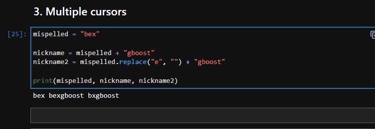

PythonJupyter Lab<br />JupyterLab是 Jupyter Notebook「新」界面。它包含了jupyter notebook的所有功能，并升级增加了很多功能。它最大的更新是模块化的界面，可以在同一个窗口以标签的形式同时打开好几个文档，同时插件管理非常强大，使用起来要比jupyter notebook高大尚许多。
<a name="gADxM"></a>

## 1、拼写检查
拼写检查可以文档保持更高的质量，默认情况下，拼错的单词会以红色背景突出显示，但是这里将其设置为下划线。<br /><br />使用这个功能只要安装以下的插件：
```bash
pip install jupyterlab-spellchecker
```
<a name="Wyt5e"></a>

## 2、代码格式化
这里需要安装几个包，一个是提供格式化功能，另外一个是jupyterlab插件
```bash
# Install the formatters
$ pip install black isort
# Install the extension
$ pip install jupyterlab-code-formatter
```
通过Jupyter Lab Code Formatter扩展可以获得很多的格式化功能<br /><br />安装完成后，顶部会出现一个奇怪但看起来很酷的图标。如果您不想使用该按钮，您可以将扩展配置为保存时自动格式化(在 Advanced Settings Editor 设置)。
<a name="hYQ84"></a>

## 3、多行选择
这个功能与jupyter notebook一样，点击时按住Ctrl键可以多选。只能在单个单元格内进行多选。<br />
<a name="m2vG1"></a>

## 4、添加虚拟环境
使用以下命令将虚拟环境作为内核添加到Jupyter Lab，这样就可以作为一个选项出现在Launcher或内核列表的右上角:
```bash
$ pip install ipykernel
$ ipython kernel install --user --name=new_or_existing_env_name
```
注意：以上代码需要在你需要添加的虚拟环境使用，而不是jupyter lab的环境
<a name="C1UMg"></a>

## 5、像运行脚本一样运行notebook
Jupyter notebook用于探索和互动输出。但是使用jupyter run命令，可以像Python脚本一样顺序执行每个笔记本单元格。
```bash
jupyter run path_to_notebook.ipynb
```
该命令会以JSON的形式返回每个单元格的输出，所以如果有大量文本输出可能会卡顿。可以将不同的超参数保存到单个笔记本中然后运行，这样可以保存运行记录。
<a name="JrC3j"></a>

## 6、分割编辑器窗口
Jupyter Lab的窗口以标签的形式展示，一次可以打开好几个编辑窗口，并且可以拖动窗口，将编辑器窗口分割，演示如下：<br />


## 7、随时查看文档
有三种方法可以直接从编辑器中查找几乎任何函数或魔法命令的文档。<br />第一个是使用Shift + Tab键盘快捷键（默认），它会显示一个弹出窗口，其中包含光标所在的函数或类的文档：<br /><br />如果不喜欢点击其他地方后弹出窗口消失，还可以使用上下文帮助，它可以通过帮助菜单或Ctrl + I键盘快捷键访问。上下文帮助显示游标指向的函数或类的实时文档。<br /><br />最后，一种方法可以简单地在函数或类名的末尾添加一个问号(不带括号)：<br />
<a name="sTKaH"></a>

## 8、终端命令和Python代码混合开发
这个功能看起来有点古怪，但它非常有用。使用感叹号(!)，可以在代码单元格中运行任何终端命令。<br />还可以将这些命令的输出存储在Python变量中。例如使用`!pwd`的输出将当前工作目录存储在path变量中：
```python
path = !pwd
```
这里有一个更实际的例子。假设有一个数据文件夹，其中包含用于模型训练的图像。所有图像都根据它们的类被分类到目录中。<br />问题是有太多的图像类别，无法手动计数。需要使用一个快速的方法来计算data/raw/train内部的目录数量，并将其输出存储在number_of_classes中：
```python
number_of_classes = !ls -1 data/raw/train | wc -l

>>> print(number_of_classes)
43
```
一句shell命令就能解决问题，这样就不用写python的目录遍历代码了

## 9、通知执行
即使你不是谷歌Colab的用户，你也一定会喜欢它的单元格执行通知。使用winsound内置Python库，可以在Jupyter Lab上模仿该功能：
```python
import winsound

# Create a beep that lasts five seconds
duration = 5000
frequency = 440

winsound.Beep(frequency, duration)
```


## 10、自动重载修改后的Python脚本
将脚本与笔记本混合使用是非常不好的，但是有时候的确需要这样做，如果更新了导入的脚本，除非重新启动内核，否则Jupyter将不会自动检测到更改，这会产生很多问题。所以可以使用autoreload 命令来避免这个问题：
```python
%load_ext autoreload
%autoreload 1
```
上述代码将每秒钟检测并刷新一次内核。它不仅会检测脚本更改，还会检测对所有文件的更改。<br />对于python脚本，还可以使用pycat 命令来以语法高亮的形式显示Python脚本的内容：<br /><br />对于其他文件格式，也可以使用cat命令，这是linux的标准命令

## 总结
介绍了几个常用且好用的jupyter技巧，如果还想了解个更多的魔法命令，可以运行lsmagic。它将列出所有内联和单元格魔术命令。
