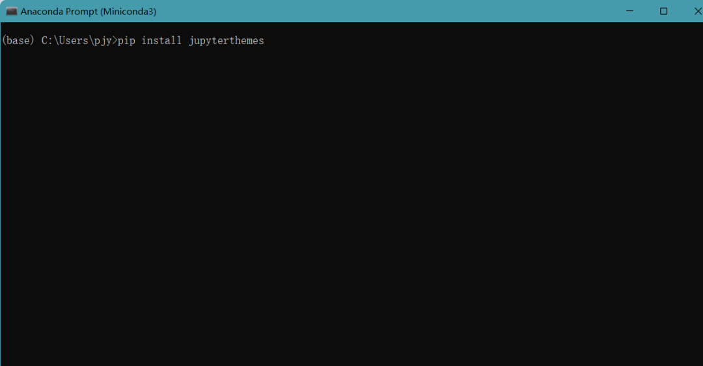

Jupyter Notebook<br />在使用Jupyter notebook的时候，总是看着白色的默认主题，久而久之可能会感到有些乏味。毕竟默认主题太普通，也不够酷炫，如下图所示：<br />
<a name="dRDFR"></a>
### 安装主题
首先，通过命令行窗口或Anaconda Prompt窗口，输入如下命令安装主题：
```bash
pip install jupyterthemes
```

<a name="MKCui"></a>
### 查看主题
```bash
jt -l
```
<br />可选主题如下：
```bash
Available Themes:
   chesterish
   grade3
   gruvboxd
   gruvboxl
   monokai
   oceans16
   onedork
   solarizedd
   solarizedl
```
<a name="mEfwe"></a>
### 更换主题
`-t 主题 -f(字体) -fs(字体大小) -cellw(占屏比或宽度) -ofs(输出段的字号) -T(显示工具栏) -T(显示自己主机名)`
```bash
jt -t oceans16
```

```bash
jt -t monokai
```

```bash
jt -t monokai -f fira -fs ``16` `-cellw ``90``% -ofs ``15` `-dfs ``15` `-T -T
```
更改多个主题参数
<a name="ezjEQ"></a>
### 恢复默认主题
```bash
jt -r
```

