Jupyter NoteBook

## 一、jupyter notebook两种模式

### command mode（命令模式）
Esc进入该模式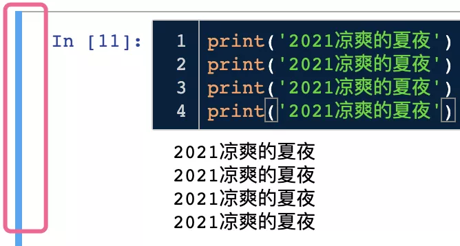

### edit mode（编辑模式）
Enter进入该模式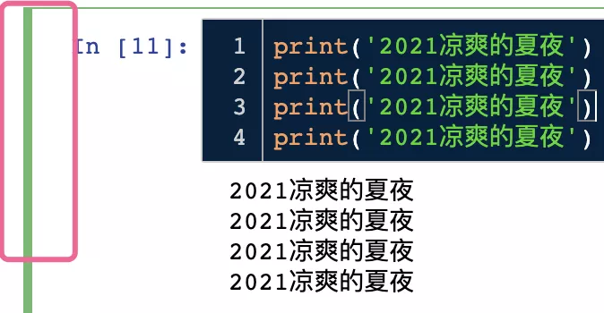

### 两种模式区别
不同模式下cell前颜色会变化，见上面两图红圈部分； edit mode（编辑模式）下，可直接在cell中写代码； command mode（命令模式）下可以使用一些快捷键; 下文介绍时，快捷键前添加了Esc为command mode。

---

## 二、jupyter notebook好用的快捷键

### 快速调出所有快捷键
苹果系统：Command + ⇧ + P Windows系统：Ctrl + Shift + P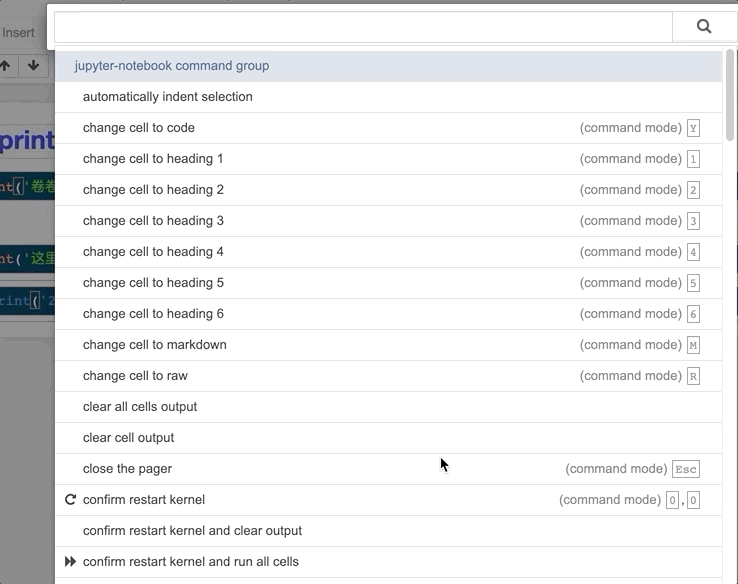

### 运行代码
苹果系统：⇧ + Enter Windows系统：Shift + Enter

### 折叠当前cell输出结果
Esc + O 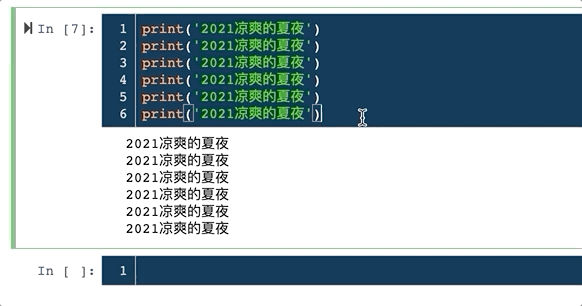

### 折叠所有cell输出结果
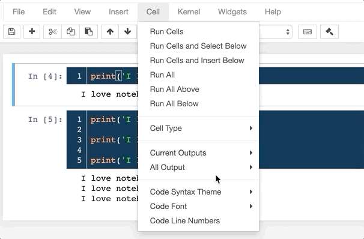

### 清空当前cell输出结果
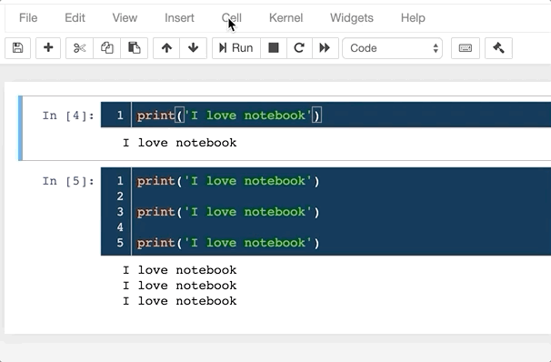

### 清空所有cell输出结果
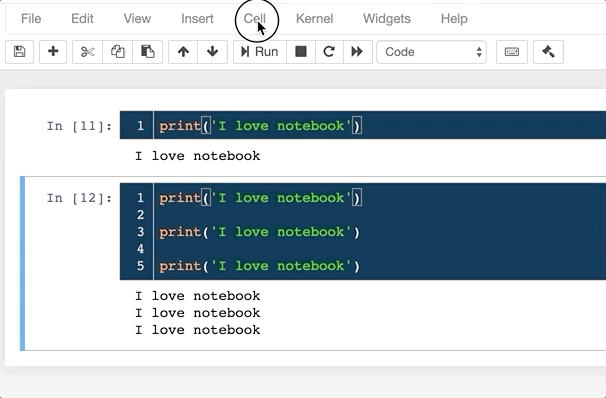

### 查找、替换字符
Esc + F 

### cell复制
Esc + C

### cell剪切
Esc + X

### cell粘贴
Esc + V

### cell删除
Esc + DD

### cell撤销删除
Esc + Z

### 多个cell选取
Esc + UP：向上选取多个cellEsc + DOWN：向下选取多个cell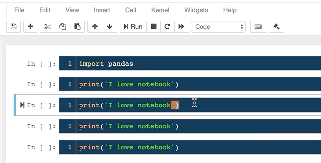 选取多个后，可对多个进行复制/删除等操作

### 多个cell合并
苹果系统：Esc + ⇧ + M Windows系统：Esc + Shift + M 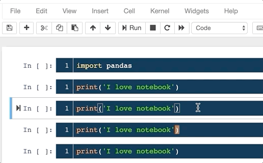

### cell上方插入空cell
Esc + A

### cell下方插入cell
Esc + B

### cell格式切换为代码
Esc + Y

### cell格式切换为Markdown
Esc + M

### cell格式切换为1,2,3,4,5,6级标题
Esc +1,2,3,4,5,6 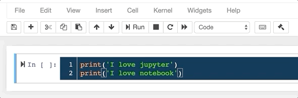

### 关闭当前cell行号
Esc + L 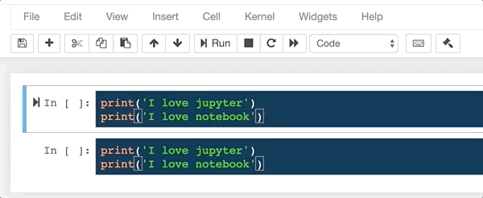

### 关闭所有cell行号
苹果系统：Esc + ⇧ + L Windows系统：Esc + Shift + L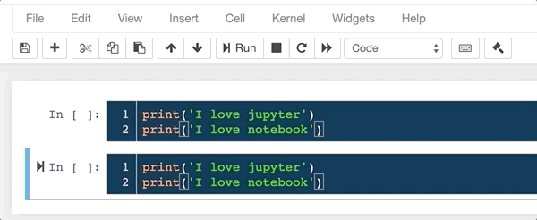

### 快速注释代码
Ctrl + / 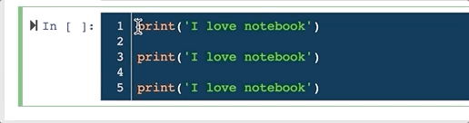
