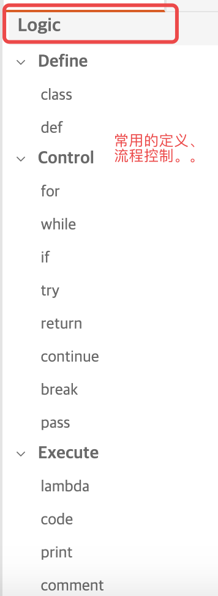
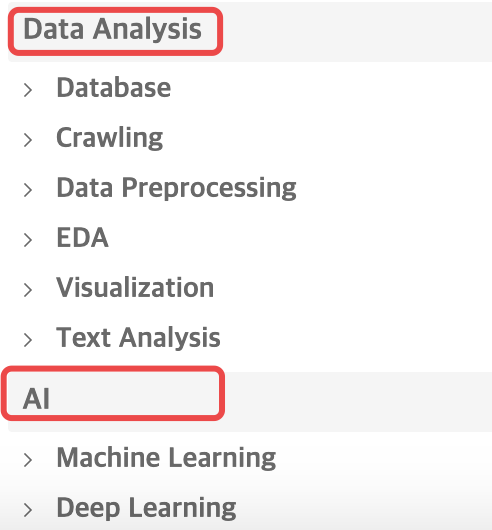
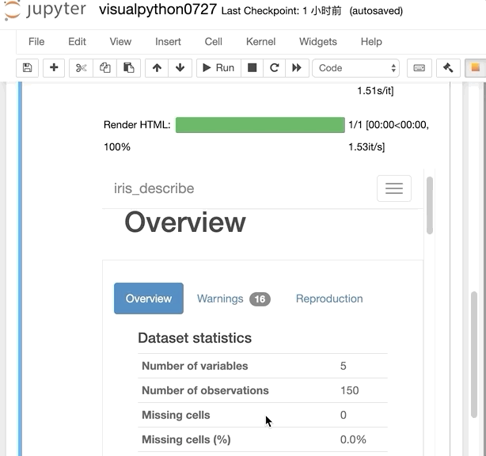

Python Jupyter<br />分享一个Jupyter Notebook插件visualpython，有以下需求可以试一下：

- 通过界面拖拽生成Python代码，以最少的编码技能即可把玩爬虫、数据分析、AI等；
- 面向非专业程序员，减少学习编码技能的时间；
- 轻松保存和重用代码。
<a name="RuZrs"></a>
## 1、安装
在终端操作，输入以下命令行，安装visualpython
```bash
pip install visualpython
```
<a name="j6KAN"></a>
## 2、激活
在终端操作，输入以下命令行，激活visualpython
```bash
visualpy install
```
打开jupyter notebook，出现图中橙色按钮表示安装成功～<br />
<a name="h8jkh"></a>
## 3、主界面介绍
单击橙色按钮出现下面visualpython主界面，功能还是很强大的<br /><br />仔细看看<br />
<a name="p6Itu"></a>
## 4、使用案例
<a name="vaKgA"></a>
### 导入常用package

<a name="cctKv"></a>
### 导入数据集

<a name="ijtmm"></a>
### `pandas_profiling`快速探索数据
<br />生成的详细探索报告：<br />

- 数据可视化-使用matplotlib


<a name="bAJR2"></a>
### 数据可视化-使用pandas
<br />Git：[https://github.com/visualpython/visualpython](https://github.com/visualpython/visualpython)
