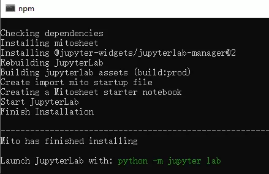
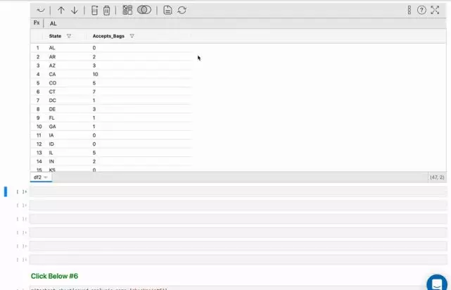
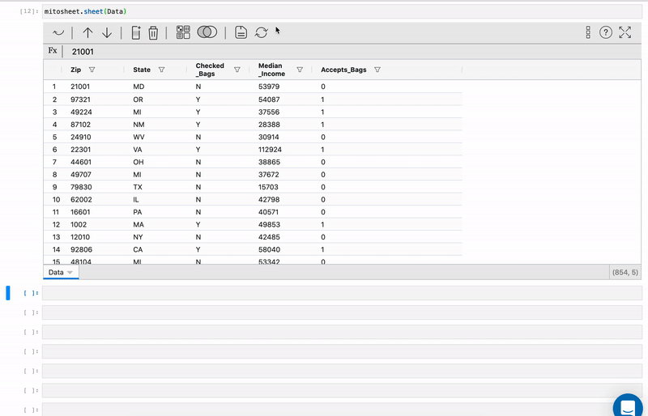
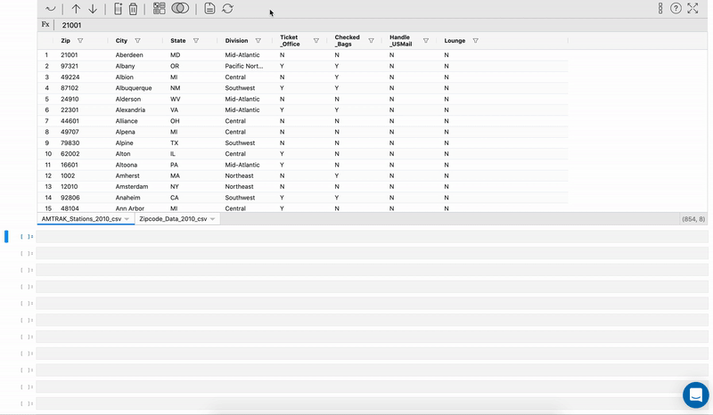
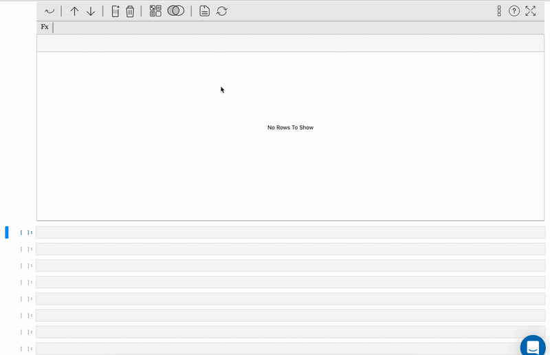

Python JupyterLab<br /><br />Mito是Jupyter Lab的一个可编辑电子表格插件，在编辑.csv表格（带格式转换功能）时，就能生成相关Python代码。还没有配置Jupyter Lab 环境的同学需要先安装一下
<a name="w2cXV"></a>
## 安装 jupyterlab
建议采用conda方式安装，以管理员身份运行Anaconda Prompt 
```bash
conda install -c conda-forge jupyterlab
```
静待片刻，安装完成！
<a name="hrt4Q"></a>
### 安装mito
```bash
# 记得用管理员运行Anaconda Prompt
python -m pip install mitoinstaller   
python -m mitoinstaller install
```
<br />安装完毕之后，执行`python -m jupyter lab` 打开jupyter lab<br />在jupyter lab新建一个notebook，执行：
```python
import mitosheet
mitosheet.sheet()
```
然后就可以看到Mito的工作页面，和Excel非常相似，可以在图形界面进行操作，比如合并、数据透视表、筛选、排序、可视化等，如果对公式熟练，直接敲入函数即可，比如sum、sumif等。<br /><br /><br />
<a name="eiRQ4"></a>
### 代码自动生成，可重复执行任务
在图形界面上的所有手动操作都可以自动生成代码，供后续批量化操作。要想重复上面的步骤的话，一键就能用同样的方法分析其他数据。<br />
<a name="ZCuNf"></a>
## Mito的局限
Mito弥补了Excel在数据分析上的几个缺陷：

- 无法做大数据分析（大型数据集处理得不好）
- 运行缓慢
- 无法轻松创建可重复流程

但是它的局限也很明显：适用的场景不多
