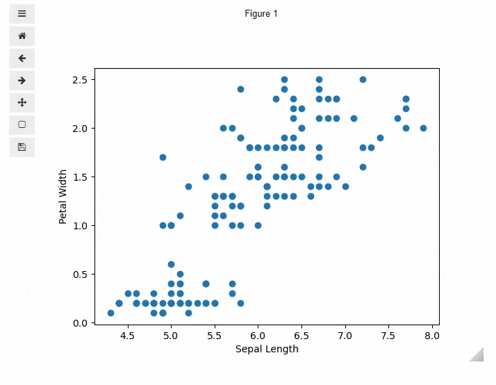

Jupyter<br />在Jupyter当中使用的小插件名叫ipympl，能够使得matplotlib绘制出来的图表也能够具备交互性的特征，在使用之前，安装该插件<br />通过pip来安装
```bash
pip install ipympl
```
也可以通过conda来进行安装
```bash
conda install -c conda-forge ipympl
```
然后涉及到具体的使用，导入相关的模块
```python
%matplotlib widget
import pandas as pd
import matplotlib.pyplot as plt
```
使用常用的iris.csv来进行图表的绘制
```python
plt.scatter('sepal_length(cm)', 'petal_width(cm)', data=iris)
plt.xlabel('Sepal Length')
plt.ylabel('Petal Width')
plt.show()
```
output<br /><br />从上面的结果来看，绘制出来的图表具备交互性，并且可以任意放大、缩小以及拖拽，并且可以将绘制好的图表下载到本地，而针对具有多个子图的图表，也能够实现交互式的绘制
```python
np.random.seed(0)

n_bins = 20
x = np.random.randn(1000, 3)

fig, axes = plt.subplots(nrows=2, ncols=2)
ax0, ax1, ax2, ax3 = axes.flatten()

colors = ['red', 'blue', 'yellow']
ax0.hist(x, n_bins, density=1, histtype='bar', color=colors, label=colors)
ax0.legend(prop={'size': 10})
ax0.set_title('bars with legend')

ax1.hist(x, n_bins, density=1, histtype='bar', stacked=True, color=colors)
ax1.set_title('stacked bar')

ax2.hist(x, n_bins, histtype='step', stacked=True, fill=False)
ax2.set_title('stack step (unfilled)')

x_multi = [np.random.randn(n) for n in [10000, 5000, 2000]]
ax3.hist(x_multi, n_bins, histtype='bar', color=colors)
ax3.set_title('different sample sizes')

fig.tight_layout()
plt.show()
```
output<br />
