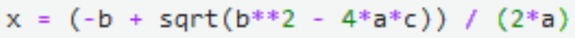

Python<br />数学是数据科学和机器学习的重要基础，数学运算的结果对于机器学习项目而言是至关重要的。在编写代码时，常常需要定义数学公式的计算形式。像 S=r^2 这样简单的数学公式，大概不会出现拼写错误。但如果是下面这样的公式呢？<br /><br />人们习惯于手写公式的运算过程。而如果计算机编程语言能够显示出类似于手写公式的计算过程，检查公式运算是否准确就可以轻松多了吧。<br />近日，GitHub 上一个名叫 handcalcs 的开源库就解决了这个问题。<br />项目地址：[https://github.com/connorferster/handcalcs](https://github.com/connorferster/handcalcs)
<a name="vIJVN"></a>
## handcalcs 库：将 Python 计算代码转换为 Latex 公式
handcalcs 库可将 Python 计算代码自动渲染为 Latex 公式，呈现方式类似于手写的公式计算：先编写符号公式，再代入具体数字，最后得出结果。<br /><br />正如上面的演示样例所示，计算机能够识别的公式形式是：<br /><br />而人们更习惯的是如下形式的数学公式：<br /><br />handcalcs 的功能就是，将数学公式和运算过程以人们更容易理解的形式展示出来。<br />数学计算的结果往往会影响后续代码的运行过程，而复杂的数学公式更容不得一点错漏，因此对于包含较多复杂数学公式的 Python 代码，用 handcalcs 进行自查或许是有必要的。
<a name="w1YBZ"></a>
## 使用 handcalcs
那么，这个开源库要如何应用呢？
<a name="C5zO6"></a>
### 基本用法 1：Jupyter 单元格魔法函数
handcalcs 的设计初衷是在 Jupyter Notebook 或 Jupyter Lab 中作为单元格魔法函数来使用。<br />首先，引入 handcalcs 模块并运行单元格：
```java
import handcalcs.render
```
接下来，在想要使用 handcalcs 的单元格上面添加一行魔法函数 `%%render`：
```java
%%render
```
例如：
```java
%%rendera = 2b = 3c = 2*a + b/3
```
如果系统安装了 Latex 环境，还可以将 notebook 导出成 pdf 格式文件。
<a name="eBLDb"></a>
### 基本用法 2：函数装饰器 `@handcalc()`
除了在 Jupyter cell 中使用外，在 Python 的函数中也可以使用 handcalcs。<br />首先导入 `@handcalc()` 装饰器：
```java
from handcalcs.decorator import handcalc
```
然后编写函数。注意：函数必须 `return locals()`：
```java
@handcalc()
def my_calc(x, y, z):
	a = 2*x / y
	b = 3*a
	c = (a + b) / z
	return locals()
```
```python
@handcalc(left: str = "", right: str = "", jupyter_display: bool = False)
```
返回一个由 (latex_code: str, locals: dict) 组成的元组，其中 locals 是函数命名空间范围内所有变量的字典。
<a name="BJasw"></a>
## 其他功能
有些公式的参数量较多，如果按照常规的格式显示在一列，会浪费大量空间。而使用 handcalcs，只需添加注释标签`# Parameters` 就能让参数以三列的形式显示出来：<br /><br />而有些公式的计算过程非常繁琐，也会占用大量显示空间，只需使用标签# Short 就能让运算过程的显示行数减少：<br /><br />反之，如果比较喜欢推导等式对齐的方式，可以使用`# Long` 标签显示。<br />有时并不需要代入数值计算，只需要以符号的形式显示数学计算公式。那么，需要使用`# Symbolic` 标签：<br /><br />handcalcs 的功能本身还可以解决编程中的小问题，即在 Python 中，显示多个变量的值通常需要多个 `print()` 语句，而使用 handcalcs 能让事情变得简单许多：<br /><br />很多开发者喜欢用_表示公式中的下标，handcalcs 可以将其显示出来，甚至多级下标也可以通过嵌套的形式得到显示。<br /><br />数学公式中经常出现希腊字母（如「pi」、「eta」等），只要在代码中编写出对应的英文名，比如 alpha、beta，handcalcs 就可以显示出希腊字母：<br /><br />不只是简单的数学公式，复杂公式也不在话下，比如含有积分的公式：<br />
<a name="tyxzz"></a>
## 缺陷
虽然用处多多，但项目作者表示，handcalcs 仍存在一些小缺陷。<br />首先，handcalcs 并不适用于 collections 这种数据类型，例如 list、tuple、dict 等。<br />其次是在变量名方面，handcalcs 是针对 Jupyter 环境设计的。如果在 notebook 上重复使用变量名，则可能导致错误的数学运算。
