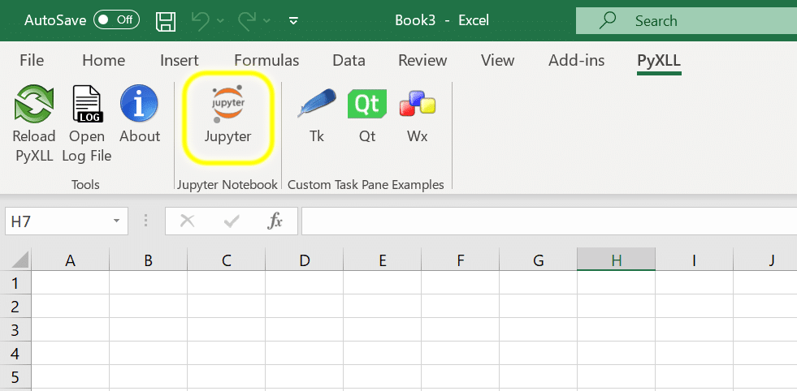
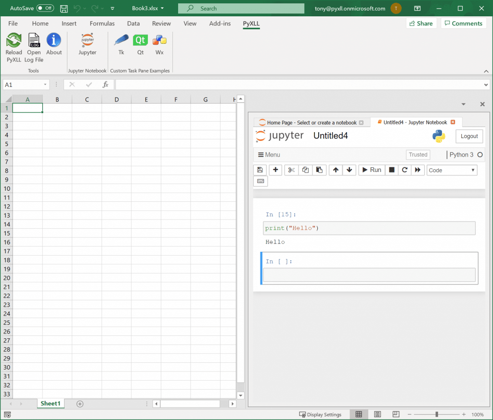
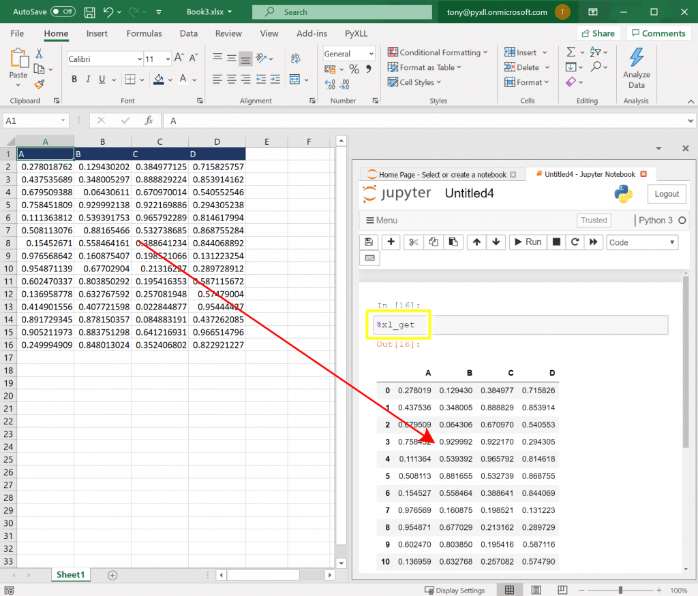
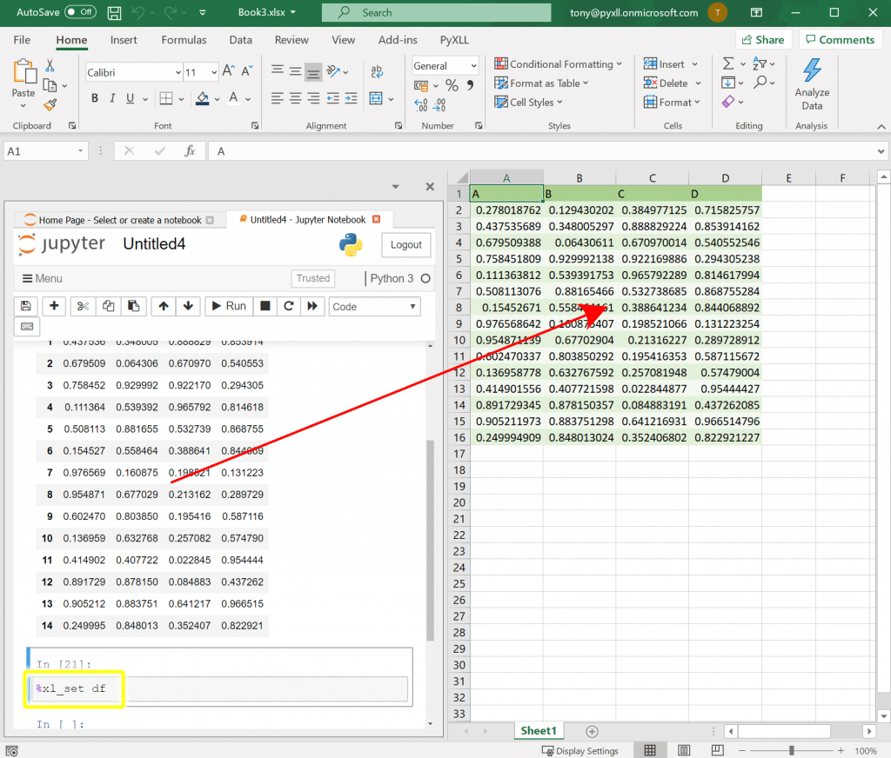
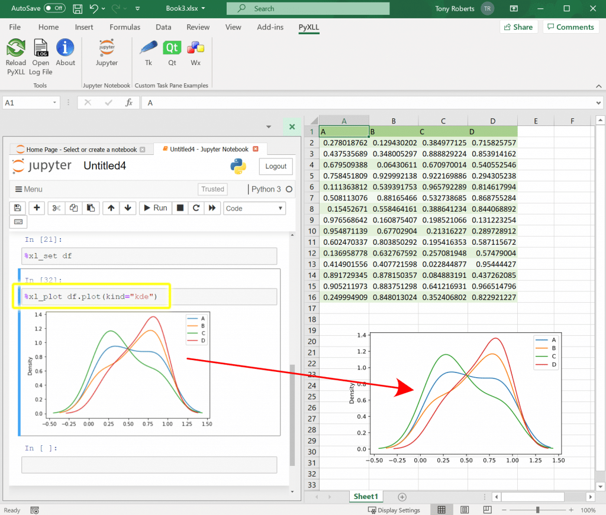
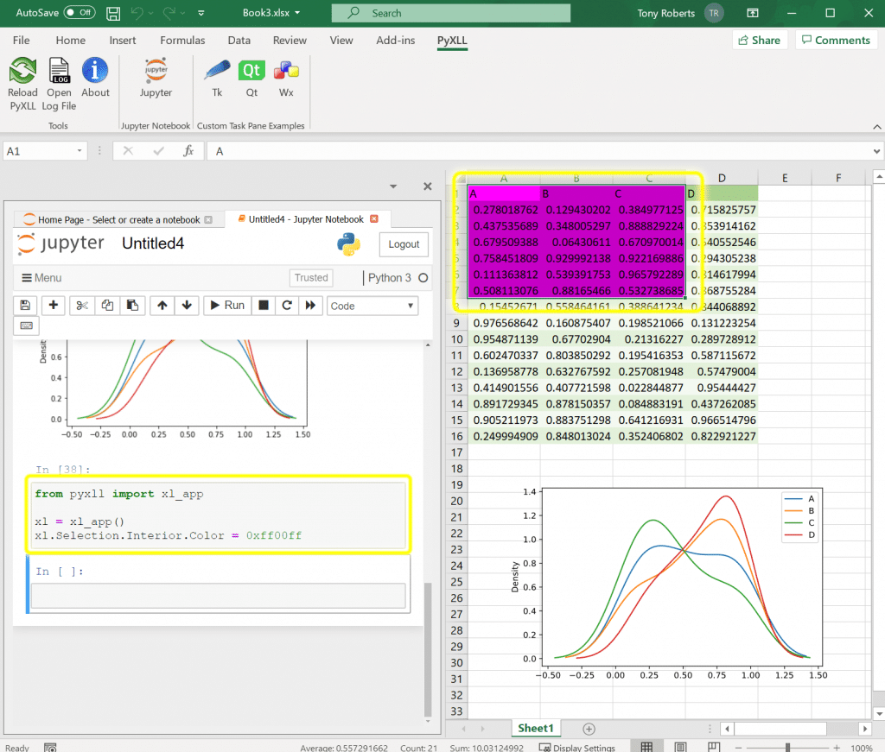

Python Jupyter Notebok<br />在GitHub发现了一款神器「PyXLL-Jupyter」，它可以完美将Jupyter Notebook嵌入到Excel中！使用它就可在Excel中运行Jupyter Notebook，调用Python函数，实现数据共享。
<a name="BCcJ2"></a>
## 一、安装
首先，要在Excel中运行Python代码，需要安装PyXLL插件。PyXLL可以将Python集成到Excel中，用Python替代VBA。<br />先用 pip 安装 PyXLL。
```python
pip install pyxll
```
然后再用PyXLL独特的命令行工具安装Excel插件。
```bash
>> pyxll install
```
安装好了PyXLL在 Excel中的插件，下一步就是安装pyxll-jupyter软件包了。使用pip安装pyxll-jupyter软件包：
```bash
pip install pyxll-jupyter
```
安装完毕后，启动Excel，将在PyXLL选项卡中看到一个新的Jupyter按钮。<br /><br />单击此按钮可在Excel工作簿的侧面板中打开Jupyter Notebook。该面板是Excel界面的一部分，可以通过拖放操作取消停靠或停靠在其他位置。<br />在Jupyter面板中，可以选择一个现有的Notebook或创建一个新的Notebook。创建一个新的Notebook，选择新建按钮，然后选择Python 3。<br />
<a name="WJFmG"></a>
## 二、使用方法
这样做有什么用处呢？
<a name="r0U17"></a>
### 1、Excel和Python共享数据
比如，要将数据从Excel导入Python。<br />由于Excel和Python已经在同一进程中运行了，所以在Python中访问Excel数据以及在Python和Excel之间切换非常快。<br />更牛X的是，pyxll-jupyter还单独附带了一些IPython魔法函数，输入后一键即可完成同步。
<a name="YY5zc"></a>
#### `%xl_get`
<br />将Python中的数据移到Excel，也是同理，非常简单。<br />无论是使用Python先加载数据集，再传输到Excel，还是其它形式，从Python复制数据到Excel非常容易。
<a name="BsLud"></a>
#### `%xl_set`
<br />当然，`%xl_get`和`%xl_set`都附带参数选项可以自定义导入导出规则。
<a name="CtsTS"></a>
### 2. 在Excel中使用Python绘图
PyXLL的另一大用处就是它集成了几乎所有主流的可视化包，因此可以在Excel中利用这些可视化包随意绘图，包括matplotlib、plotly、bokeh和altair等。
<a name="Jvjl3"></a>
#### `%xl_plot`
<br />同样，使用魔法函数`％xl_plot`在Excel中可以绘制任何的Python图。任何一个受支持的可视化包也可进行绘图然后传递图形对象到Excel中，比如上图中使用pandas的绘图效果就很好。<br />`%xl_plot df.plot(kind='scatter')`
<a name="ie7Pd"></a>
### 3. 从Excel调用Python函数
使用Excel离不开函数，而当需要一些复杂功能时，自带函数未必能满足需求。<br />通过PyXLL，可以直接在Excel中调用Python函数，并对其进行实时测试。这就避免了Excel和Jupyter之间的来回切换成本，有点像dataframe的apply用法，写个函数直接与Excel完美融合。<br />函数写好后，还可将其添加到PyXLL Python项目中。这样以后每次都可以复用实现相同功能！
```python
from pyxll import xl_func

@xl_func
def test_func(a, b, c):
    return (a * b) + c
```
比如，输入以上代码在Jupyter中运行后，Python函数将立即可被Excel工作簿调用。<br />不只是简单的函数，还可以将整个数据作为`pandas`的`DataFrames`传给函数，并返回任何的Python类型，比如numpy array、DataFrames，甚至还可以通过给`@xl_func`装饰器一个签名字符串来告诉PyXLL输出什么类型。例如，以下函数：
```python
from pyxll import xl_func

# 装饰器签名告诉 PyXLL 如何转换函数参数和返回的值
@xl_func("dataframe df: dataframe<index=True>", auto_resize=True)
def df_describe(df):
    # df 是一个从数据集里创建的 pandas DataFrame 传递给函数
    desc = df.describe()
    # desc 是新的 DataFrame（PyXLL转换为一组值并返回给Excel所创建的）
    return desc
```
现在可以编写复杂的Python函数来进行数据转换和分析，但是可以协调在Excel中如何调用或排序这些函数。更改输入会导致调用函数，并且计算出的输出会实时更新，这与期望的一样。
<a name="eYofK"></a>
### 4. 替代VBA
VBA脚本所需的功能函数，在Python中均有相同的API。这对于熟悉Python但不熟悉VBA的同学绝对是个好消息。<br />官网还给出了和VBA功能一样的API说明文档。<br />[https://www.pyxll.com/docs/userguide/vba.html](https://www.pyxll.com/docs/userguide/vba.html)<br />Jupyter Notebook在Excel中运行，整个Excel对象都可用，所有操作就像在VBA编辑器中编写Excel脚本一模一样。<br />由于PyXLL在Excel进程内运行Python ，因此从Python调用Excel不会对性能造成任何影响。当然，也可以从外部Python进程调用Excel，但这通常要慢很多。在Excel中运行Jupyter Notebook，一切变得就不一样了！<br />使用PyXLL的xl_app函数获取Excel.Application对象，该对象等效于VBA中的Application对象。弄清楚如何使用Excel对象模型进行操作的一种好方法是记录VBA宏，然后将该宏转换为Python。<br />下图中尝试将当前选择单元格更改颜色。<br />
<a name="zEVY7"></a>
## 三、总结
PyXLL将完美融合Python和Excel，实现了以下功能，为表格数据处理提升一个全新的高度。

- Excel和Python共享数据
- 在Excel中使用Python绘图
- 从Excel调用Python函数
- 替代VBA脚本
