Python Jupyter Notebook
<a name="u4nhg"></a>
## 安装anaconda
首先打开命令行（Windows）或者终端（macOS），输入下面的代码，远程连接服务器
```bash
ssh root@服务器外网ip 
```
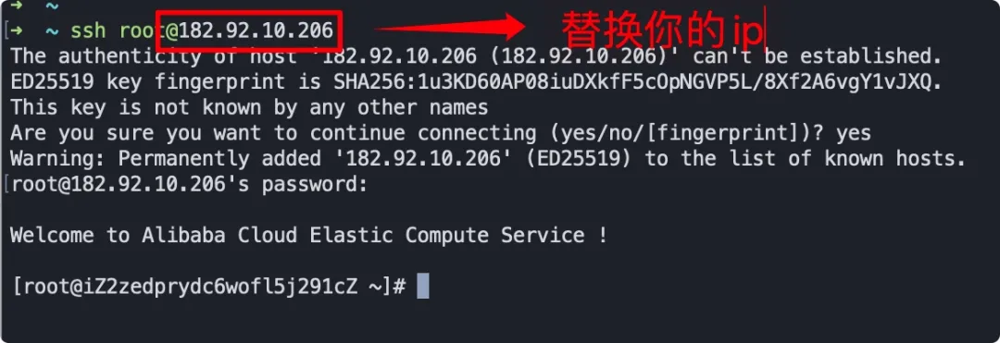<br />之后要输入刚刚设置的密码，按下回车后就成功登陆到远程的服务器！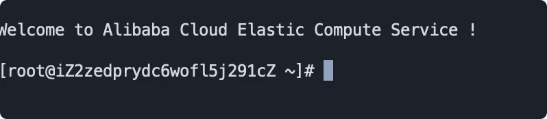<br />接下来依次输入下面四条命令并执行，输入一行执行一行
```bash
yum update -y
yum -y groupinstall "Development tools"
yum install openssl-devel bzip2-devel expat-devel gdbm-devel readline-devel sqlite-devel
wget https://repo.anaconda.com/archive/Anaconda3-2021.05-Linux-x86_64.sh
```
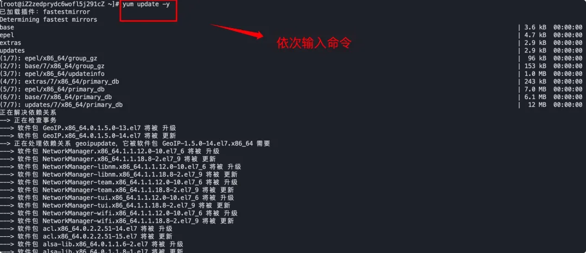<br />耐心等待命令全部执行完毕之后，再执行下方命令安装anaconda
```bash
bash Anaconda3-2021.05-Linux-x86_64.sh
```
之后继续等待页面滚动，期间可能会提示输入yes或者按下回车，总之一路按照提示进行，就像安装软件时一路点击同意一样，直到出现下方结果提示完成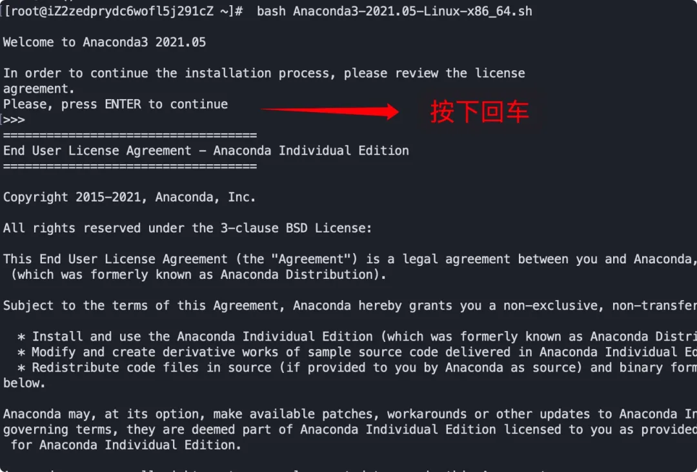<br />现在 anaconda 就已经安装完毕了，下来激活环境变量！执行下面一行代码即可
```bash
source ~/.bashrc
```
至此，anaconda 就已经安装与激活完毕，可以执行 python 来验证，如果显示启动的是python3.8 则证明配置成功，否则就要检查刚才哪一步有问题～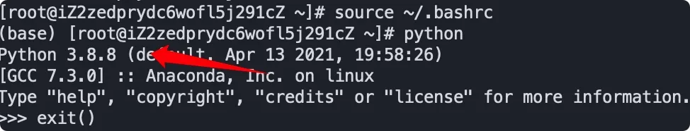
<a name="nYKTj"></a>
## 启动远程jupyter notebook
现在已经在服务器上配置好Python开发环境，下来就是开启远程Jupyter Notebook，如果上面的步骤成功完成那么下面的步骤将更简单。<br />首先执行下面一行命令
```bash
jupyter notebook --generate-config
```
执行成功后会生成以下信息，也就是生成了一个配置文件在显示的目录下<br />接下来输入 ipython 进入 ipython ，依次运行下面两条命令
```python
from notebook.auth import passwd
passwd()
```
这时候会提示输入两次密码，输入完毕后会生成一个密钥，一定要复制粘贴到其他地方备用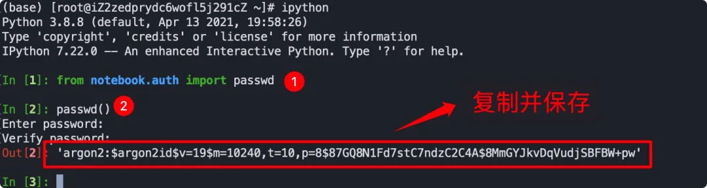<br />之后执行`exit()`退出ipython后执行下面一行命令
```bash
vim /root/.jupyter/jupyter_notebook_config.py
```
按i开始编辑，并修改下面四处设置
```
c.NotebookApp.password = '刚刚生成的密钥'

c.NotebookApp.ip='0.0.0.0'

c.NotebookApp.open_browser = False

c.NotebookApp.port =8888
```
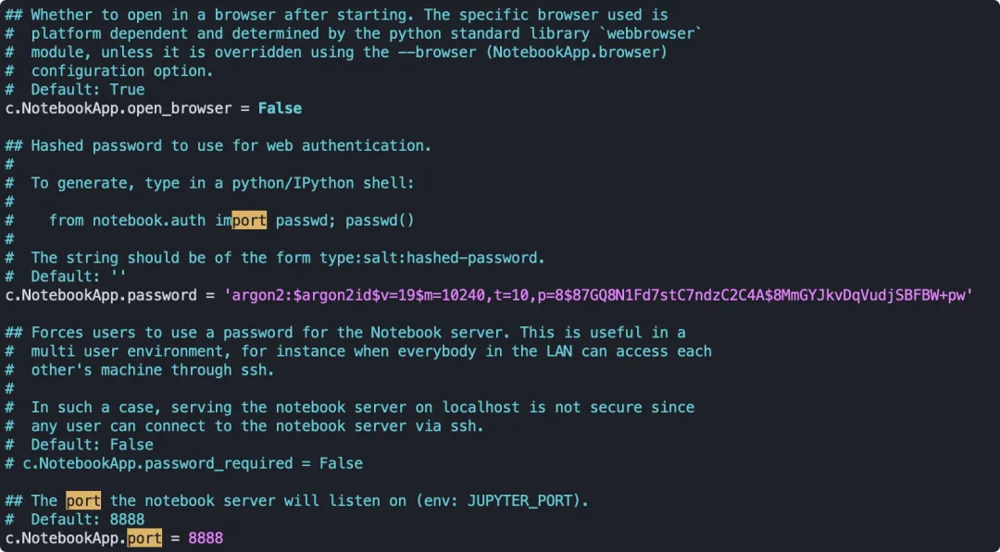<br />其中第一个需要替换成刚刚保存的密钥，其他的该修改的修改，该取消注释的取消注释，大概在100多行，为了方便可以使用`/`来搜索，比如使用/c.NotebookApp.password来找到第一个需要修改的位置。修改完毕之后按一下ESC，并输入`:wq`按回车退出。现在只剩下最后一步了，回到命令行执行下方代码
```bash
jupyter notebook --allow-root
```
出现这些提示表示开启成功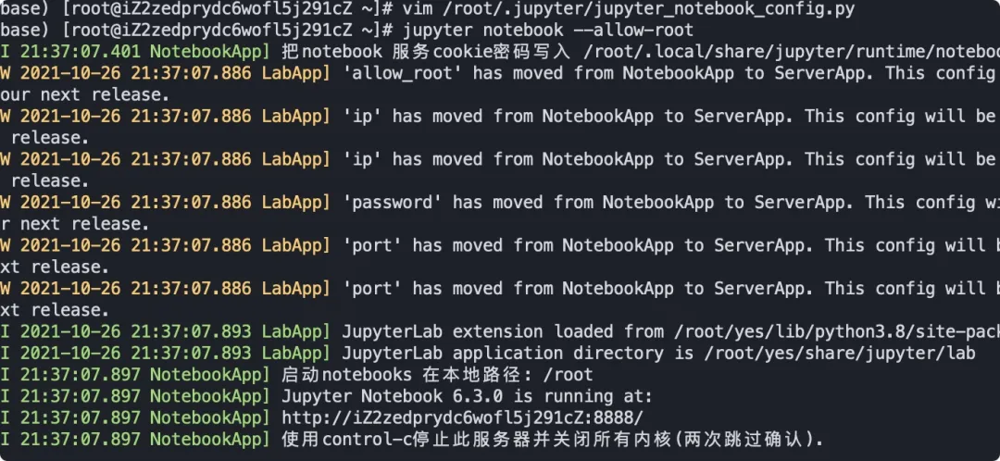<br />现在远程notebook就成功启动在服务器的8888端口，但由于服务器安全设置，不是所有设备都能访问8888端口，所以还需要回到阿里云控制台，按照下面示例设置安全组开放8888端口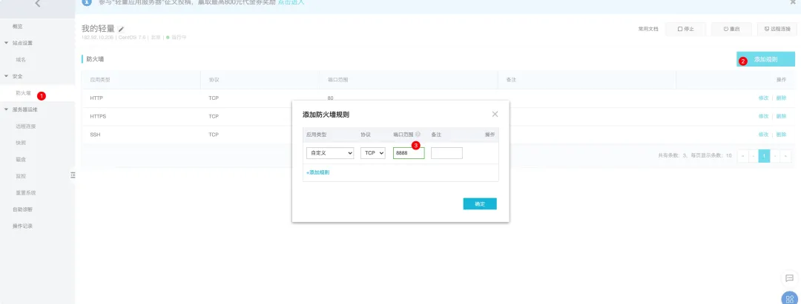<br />设置完毕后，打开任意浏览器，输入ip:8888 就能访问到专属于自己的远程notebook！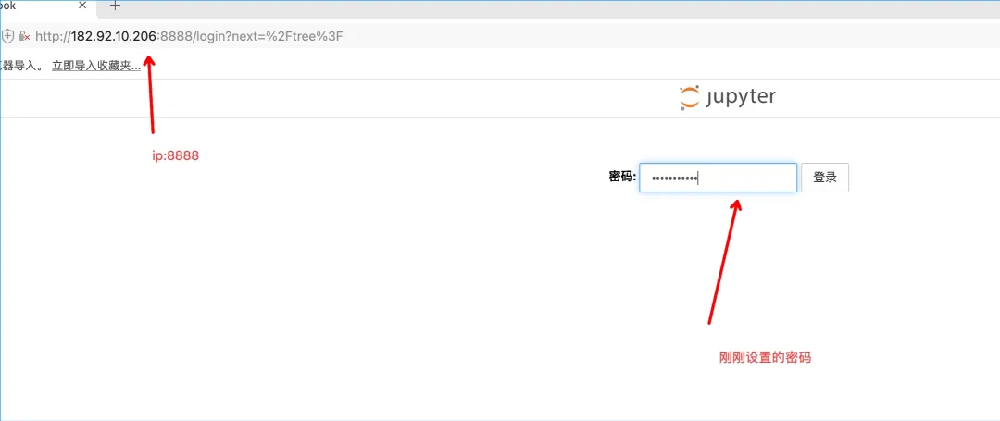<br />输入刚刚设置的密码后，即可进入专属于自己的远程notebook，随时随地coding！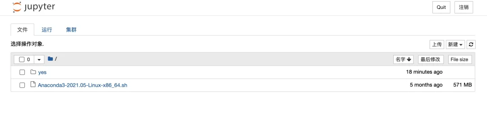<br />之后的操作就不用多说了，按照平时操作notebook方法写代码就行了，由于已经安装了anaconda所以像`pandas`、`requests`之类的库都自带了，如果需要额外安装第三方库回到命令行pip安装即可。<br />当然上面的命令如果现在把命令行关了就不能再使用远程notebook，所以在确认可以成功开启之后结束刚刚的命令，回到命令行执行
```bash
nohup jupyter notebook --allow-root &
```
即可将命令挂载在后台运行，关掉窗口也没事，现在可以不借助任何第三方软件在任何场景、任何一台连接到互联网的设备上访问远程jupyter notebook并写代码。
