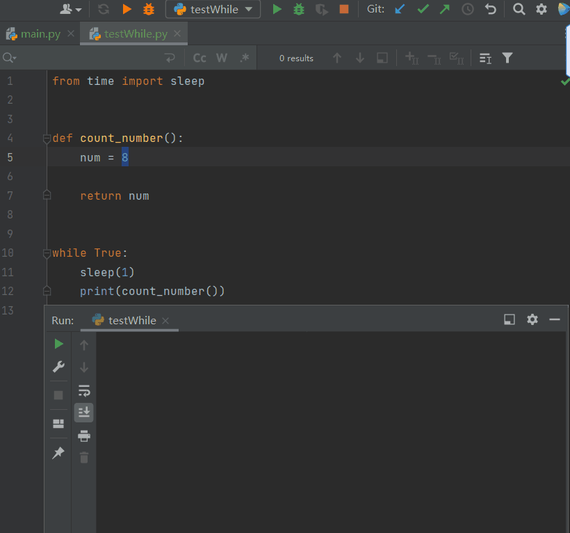

Python
<a name="Nymys"></a>
## 简介
Reloadium是Python 热重载调试工具。它可以在不重新运行程序的前提下，查看程序修改后的运行效果（包括错误提示）及每行代码的耗时，大大提高了调试的效率和质量。
<a name="xsBRw"></a>
## 安装（Pycharm为例）
<a name="uCTmJ"></a>
### 方法一：通过MarketPlace安装

<a name="ue0Ut"></a>
### 方法二：pip安装
```bash
pip install reloadium
```
**推荐用方法一安装更便捷**
<a name="FuQwC"></a>
## 功能（Pycharm为例）
<a name="RBUIC"></a>
### Run模式下
<br />虽然Reloadium是一款调试工具，但在Run模式下也使用，前提时要保证程序处于运行模式下（如无限循环），一旦程序退出运行，该模式就不能使用。
<a name="xl4cn"></a>
### Debug模式下
<a name="ZQQWd"></a>
#### 单文件调试
<br />在Debug模式下，工具会显示每行赋值代码的结果，当修改了某项数据并刷新后，相对应的地方就会更新结果，并以醒目的橘红色显示出来，一目了然。
<a name="hfRlT"></a>
#### 多文件调试
<br />Reloadium能够对整个项目的文件进行加载，实现关联文件之间的实时更新的效果。
<a name="UvuzQ"></a>
#### 错误提示处理
<br />这项功能直接将错误信息显示在对应代码行下，快速定位问题，提高调试效率
<a name="xfnFB"></a>
#### 耗时统计
<br />统计结果以不同颜色区分各行代码的运行时间。
<a name="zd9uJ"></a>
## 项目地址
[https://github.com/reloadware/reloadium](https://github.com/reloadware/reloadium)
<a name="xlOQE"></a>
## 小结
Reloadium还支持Django,Flask,Pygame等框架，感兴趣的可以到官网浏览。<br />[https://reloadium.io/](https://reloadium.io/)
