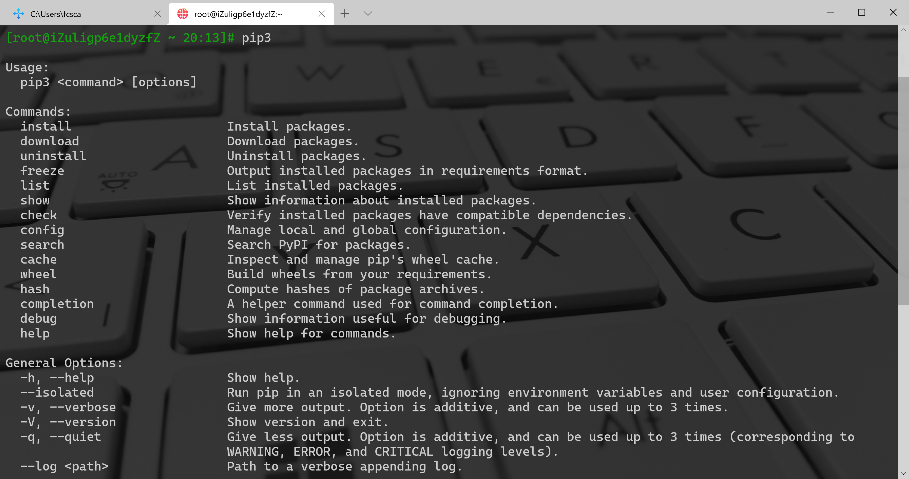

pip
:::info
Python3使用pip3命令使用，pip是Python的包管理命令，在使用上相差不大
:::
直接输入pip即可查看pip的使用参数及可选项
```bash
# pip3

Usage:
  pip3 <command> [options]

Commands:
  install                     Install packages.
  download                    Download packages.
  uninstall                   Uninstall packages.
  freeze                      Output installed packages in requirements format.
  list                        List installed packages.
  show                        Show information about installed packages.
  check                       Verify installed packages have compatible dependencies.
  config                      Manage local and global configuration.
  search                      Search PyPI for packages.
  cache                       Inspect and manage pip's wheel cache.
  wheel                       Build wheels from your requirements.
  hash                        Compute hashes of package archives.
  completion                  A helper command used for command completion.
  debug                       Show information useful for debugging.
  help                        Show help for commands.

General Options:
  -h, --help                  Show help.
  --isolated                  Run pip in an isolated mode, ignoring environment variables and user configuration.
  -v, --verbose               Give more output. Option is additive, and can be used up to 3 times.
  -V, --version               Show version and exit.
  -q, --quiet                 Give less output. Option is additive, and can be used up to 3 times (corresponding to
                              WARNING, ERROR, and CRITICAL logging levels).
  --log <path>                Path to a verbose appending log.
  --no-input                  Disable prompting for input.
  --proxy <proxy>             Specify a proxy in the form [user:passwd@]proxy.server:port.
  --retries <retries>         Maximum number of retries each connection should attempt (default 5 times).
  --timeout <sec>             Set the socket timeout (default 15 seconds).
  --exists-action <action>    Default action when a path already exists: (s)witch, (i)gnore, (w)ipe, (b)ackup,
                              (a)bort.
  --trusted-host <hostname>   Mark this host or host:port pair as trusted, even though it does not have valid or any
                              HTTPS.
  --cert <path>               Path to alternate CA bundle.
  --client-cert <path>        Path to SSL client certificate, a single file containing the private key and the
                              certificate in PEM format.
  --cache-dir <dir>           Store the cache data in <dir>.
  --no-cache-dir              Disable the cache.
  --disable-pip-version-check
                              Don't periodically check PyPI to determine whether a new version of pip is available for
                              download. Implied with --no-index.
  --no-color                  Suppress colored output
  --no-python-version-warning
                              Silence deprecation warnings for upcoming unsupported Pythons.
  --use-feature <feature>     Enable new functionality, that may be backward incompatible.
  --use-deprecated <feature>  Enable deprecated functionality, that will be removed in the future.
```

<a name="cVBX9"></a>
## pip的更新
```bash
pip install --upgrade pip
```
<a name="w9I8b"></a>
## pip配置稳定的国内镜像源
下面是一些比较稳定且速度比较快的国内镜像
:::tips
清华：[https://pypi.tuna.tsinghua.edu.cn/simple](https://pypi.tuna.tsinghua.edu.cn/simple)<br />阿里云：[http://mirrors.aliyun.com/pypi/simple/](http://mirrors.aliyun.com/pypi/simple/)<br />中国科技大学 [https://pypi.mirrors.ustc.edu.cn/simple/](https://pypi.mirrors.ustc.edu.cn/simple/)<br />华中理工大学：[http://pypi.hustunique.com/](http://pypi.hustunique.com/)<br />山东理工大学：[http://pypi.sdutlinux.org/](http://pypi.sdutlinux.org/) <br />豆瓣：[http://pypi.douban.com/simple/](http://pypi.douban.com/simple/)
:::
<a name="2CzQu"></a>
### 临时使用镜像源下载
```bash
pip install -i https://pypi.tuna.tsinghua.edu.cn/simple some-package
```
<a name="21C21"></a>
### 配置镜像源的永久使用
由于在使用 pip 安装一些包时，默认会使用 pip 的官方源，所以经常会报网络超时失败。<br />常用的解决办法是，在安装包时，使用`-i`参数指定一个国内的镜像源。但是每次指定就很麻烦，还要输入超长的一串字母。<br />这时候，其实可以将这个源写进 pip 的配置文件里。以后安装的时候，就默认从配置的这个源里安装了。
<a name="abUag"></a>
#### pip命令配置镜像源
```bash
pip config --global set global.index-url http://pypi.douban.com/simple
pip config --global set install.trusted-host pypi.douban.com
```
<a name="d5v5W"></a>
#### Window系统中配置永久镜像源
Window系统用户都是在用户目录下修改 `~/pip/pip.ini` 文件，如果不存在则创建相关的文件或目录。
<a name="FOpE7"></a>
##### .pip/pip.ini配置文件的内容
```bash
[global]
time-out = 60
index-url = https://pypi.tuna.tsinghua.edu.cn/simple/

[install]
trusted-host = tsinghua.edu.cn
```
<a name="510yW"></a>
#### Linux或Mac系统中配置永久镜像源
Linux或者Mac用户都是在用户目录下修改 `~/.pip/pip.conf` 文件，如果不存在则创建相关的文件或目录。
```bash
cd ~
mkdir .pip
vim .pip/pip.conf
```
<a name="cshvN"></a>
##### .pip/pip.conf配置文件的内容
```bash
[global］
index-url = https://pypi.doubanio.com/simple/
timeout = 1000
[install]
use-mirrors = true
mirrors = https://pypi.doubanio.com//
```
<a name="8SHzX"></a>
#### Pycharm中修改下载的源
首先打开Pycharm的设置，然后选择任一包双击<br /><br />可以看到Manage Repositories，点击即可进入源配置管理的界面<br /><br />添加后保存即可。
<a name="5XJru"></a>
## pip安装库
<a name="ufqpI"></a>
### pip安装库的基本方式
```bash
# 默认安装最新版
pip install flask
# 指定要安装flask库的版本
pip install flask==版本号
# 安装第三方库时可能会很慢，甚至会发生超时报错(Read timed out)
# 解决办法有两种
# 第一种使用timeout参数增加访问超时的时间：
pip install flask --timeout 6000
# 第二种就是利用国内的一些镜像，使用格式如下：
pip install flask -i 镜像源
```
<a name="QTMUq"></a>
### 只从本地安装，而不从 pypi 安装
```bash
# 前提得保证已经下载 pkg 包到 /local/wheels 目录下
$ pip install --no-index --find-links=/local/wheels pkg
```
<a name="HJGhI"></a>
### 限定版本进行软件包安装
指定版本号有以下几种方式：

- 不指定的情况下，默认安装最新的
- == 指定具体版本号
- <= 指定最高版本号
- >= 指定最低版本号
- < 不高于某版本号
- > 不低于某版本号

对于非指定具体版本号的情况，需要注意命令形式稍有不同：第三方库及版本号关系需要用引号("")，否则会出现报错。
```bash
pip install "plotly<4.14"
```
以下三种，对单个 Python 包的版本进行了约束
```bash
# 所安装的包的版本为 2.1.2
$ pip install pkg==2.1.2

# 所安装的包必须大于等于 2.1.2
$ pip install pkg>=2.1.2

# 所安装的包必须小于等于 2.1.2
$ pip install pkg<=2.1.2
```
以下命令用于管理/控制整个 Python 环境的包版本
```bash
# 导出依赖包列表
pip freeze >requirements.txt

# 从依赖包列表中安装
pip install -r requirements.txt

# 确保当前环境软件包的版本(并不确保安装)
pip install -c constraints.txt
```
<a name="VUMPa"></a>
#### `pip install -r requirements.txt` - pip从指定的文件中安装需要的依赖
使用场景：比如新建了一个虚拟环境，这里面什么库都没有，但一个一个库安装是非常麻烦的，就可以将全局环境中的包导入文件，然后在虚拟环境中一次性安装，剩下的只需要再安装一些虚拟环境中需要的库即可。<br />这条指令会生成一个文本文件，文件中就是环境中安装的所有库及对应的版本：
```bash
pip freeze > requirements.txt
```
<br />然后通过 `pip install` 命令指定读取配置安装包的文件，即可自动安装
```bash
pip install -r requirements.txt
```
<a name="X1s72"></a>
### 限制不使用二进制包安装
由于默认情况下，wheel 包的平台是运行 `pip download` 命令的平台，所以可能出现平台不适配的情况。<br />比如在 MacOS 系统下得到的 pymongo-2.8-cp27-none-macosx_10_10_intel.whl 就不能在 linux_x86_64 安装。<br />使用下面这条命令下载的是 tar.gz 的包，可以直接使用 `pip install` 安装。<br />比 wheel 包，这种包在安装时会进行编译，所以花费的时间会长一些。
```bash
# 下载非二进制的包
$ pip download --no-binary=:all: pkg

#　安装非二进制的包
$ pip install pkg --no-binary
```
<a name="SrFtT"></a>
### pip安装.tar.gz包
在不能连接外网的机器上安装python的各种包，比如安装Flask-WTF-0.10.0.tar.gz，是一种需求。
<a name="gB6bu"></a>
#### 使用python命令安装
```bash
tar -zxvf Flask-WTF-0.10.0.tar.gz
cd Flask-WTF-0.10.0
python setup.py build
python setup.py install
```
<a name="HFvFM"></a>
#### 使用pip安装
```bash
pip install Flask-WTF-0.10.0.tar.gz
```
<a name="reyX3"></a>
#### 安装到指定路径
```bash
pip install --target=/usr/lib/python2.7/site-packages/ package_name
```
<a name="SjjcT"></a>
### 指定代理服务器安装
当身处在一个内网环境中时，无法直接连接公网。这时候使用`pip install`安装包，就会失败。<br />面对这种情况，可以有两种方法：

1. 下载离线包拷贝到内网机器中安装
2. 使用代理服务器转发请求

第一种方法，虽说可行，但有相当多的弊端

- 步骤繁杂，耗时耗力
- 无法处理包的依赖问题

这里重点来介绍，第二种方法：
```bash
$ pip install --proxy [user:passwd@]http_server_ip:port pkg
```
每次安装包就发输入长长的参数，未免有些麻烦，为可以将其写入配置文件中：`$HOME/.config/pip/pip.conf`<br />对于这个路径，说明几点

- 不同的操作系统，路径各不相同
```bash
# Linux/Unix:
/etc/pip.conf
~/.pip/pip.conf
~/.config/pip/pip.conf

# Mac OSX:
~/Library/Application Support/pip/pip.conf
~/.pip/pip.conf
/Library/Application Support/pip/pip.conf

# Windows:
%APPDATA%\pip\pip.ini
%HOME%\pip\pip.ini
C:\Documents and Settings\All Users\Application Data\PyPA\pip\pip.conf (Windows XP)
C:\ProgramData\PyPA\pip\pip.conf (Windows 7及以后) 
```

- 若在电脑上没有此文件，则自行创建即可

配置示例：
```bash
[global]
index-url = http://mirrors.aliyun.com/pypi/simple/ 

# 替换出自己的代理地址，格式为[user:passwd@]proxy.server:port
proxy=http://xxx.xxx.xxx.xxx:8080 

[install]
# 信任阿里云的镜像源，否则会有警告
trusted-host=mirrors.aliyun.com 
```
<a name="eozbr"></a>
### 安装用户私有软件包
很多人可能还不清楚，Python 的安装包是可以用户隔离的。<br />如果拥有管理员权限，可以将包安装在全局环境中。在全局环境中的这个包可被该机器上的所有拥有管理员权限的用户使用。<br />如果一台机器上的使用者不只一样，自私地将在全局环境中安装或者升级某个包，是不负责任且危险的做法。<br />面对这种情况，能否安装单独为当前用户所用的包呢？<br />庆幸的是，还真有。<br />能想到的有两种方法：

1. 使用虚拟环境
2. 将包安装在用户的环境中

安装用户私有包的命令也很简单，只要加上`--user`参数，pip 就会将其安装在当前用户的`~/.local/lib/python3.x/site-packages`下，而其他用户的 Python 则不会受影响。
```bash
pip install --user pkg
```
来举个例子
```bash
# 在全局环境中未安装 requests
[root@localhost ~]# pip list | grep requests   
[root@localhost ~]# su - wangbm
[root@localhost ~]# 

# 由于用户环境继承自全局环境，这里也未安装
[wangbm@localhost ~]# pip list | grep requests 
[wangbm@localhost ~]# pip install --user requests  
[wangbm@localhost ~]# pip list | grep requests 
requests (2.22.0)
[wangbm@localhost ~]# 

# 从 Location 属性可发现 requests 只安装在当前用户环境中
[wangbm@ws_compute01 ~]$ pip show requests
---
Metadata-Version: 2.1
Name: requests
Version: 2.22.0
Summary: Python HTTP for Humans.
Home-page: http://python-requests.org
Author: Kenneth Reitz
Author-email: me@kennethreitz.org
Installer: pip
License: Apache 2.0
Location: /home/wangbm/.local/lib/python2.7/site-packages
[wangbm@localhost ~]$ exit
logout

# 退出 wangbm 用户，在 root 用户环境中发现 requests 未安装
[root@localhost ~]$ pip list | grep requests
[root@localhost ~]$ 
```
当身处个人用户环境中，Python 导包时会先检索当前用户环境中是否已安装这个包，已安装则优先使用，未安装则使用全局环境中的包。<br />验证如下：
```bash
>>> import sys
>>> from pprint import pprint 
>>> pprint(sys.path)
['',
 '/usr/lib64/python27.zip',
 '/usr/lib64/python2.7',
 '/usr/lib64/python2.7/plat-linux2',
 '/usr/lib64/python2.7/lib-tk',
 '/usr/lib64/python2.7/lib-old',
 '/usr/lib64/python2.7/lib-dynload',
 '/home/wangbm/.local/lib/python2.7/site-packages',
 '/usr/lib64/python2.7/site-packages',
 '/usr/lib64/python2.7/site-packages/gtk-2.0',
 '/usr/lib/python2.7/site-packages',
 '/usr/lib/python2.7/site-packages/pip-18.1-py2.7.egg',
 '/usr/lib/python2.7/site-packages/lockfile-0.12.2-py2.7.egg']
>>> 
```
<a name="ZcTBw"></a>
### 延长超时时间
若网络情况不是很好，在安装某些包时经常会因为 ReadTimeout 而失败。<br />对于这种情况，一般重试几次就好了。<br />但是这样难免有些麻烦，有没有更好的解决方法呢？<br />有的，可以通过延长超时时间。
```bash
$ pip install --default-timeout=100 <packages>
```
<a name="aXvoG"></a>
### pip离线安装whl包
有时候，直接采用pip在线安装的时候不太能安装到需要的第三方库版本，又或者没有联网环境进行pip在线安装。这个时候就可以先下载第三方，然后再用pip进行离线安装。<br />比如，以plotly为例，现在某网站下载其文件，然后再本地离线安装。<br /><br />安装指令如下：
```bash
pip install D:\python\自动安装库\plotly-4.14.3-py3-none-any.whl
```
<br />推荐下载第三方库文件的网站：[https://www.lfd.uci.edu/~gohlke/pythonlibs/](https://www.lfd.uci.edu/~gohlke/pythonlibs/)<br />Pypi ：[https://pypi.org/](https://pypi.org/)<br />
<a name="tPk2t"></a>
### pip.main自动安装
以上熟悉了Python在安装、卸载、升级以及设置国内源等。一般来说，编写的python代码都会依赖很多现有的第三方库，这也是学习Python相对简单的原因。<br />大多数情况下，需要依赖的库并不直接存在于当前的环境，需要先进行安装之后才能正常运行代码。所以，每次拿到别人编写好的代码的时候，直接运行的时候可能就会出现报错。<br />其实，在引用库的时候，只需要做以下操作，就可以不需要手动进行依赖库的安装了。<br />核心：使用`pip.main()`方法进行依赖库的安装（这里穷举了需要用到的库）
```python
# 如果需要引用的库未安装，则自动安装 
try:
    import requests
    import pandas as pd
    from bs4 import BeautifulSoup
    import jieba
    import jieba.analyse
    import matplotlib.pyplot as plt
    from wordcloud import WordCloud,STOPWORDS
    import numpy as np
    from PIL import Image
# 使用pip.main()方法进行依赖库的安装（这里穷举了需要用到的库）   
except  ImportError:
    import pip
    pip.main(["install", "--user", "requests","beautifulsoup4","jieba","matplotlib","wordcloud","pandas","pillow"])
    import requests
    import pandas as pd
    from bs4 import BeautifulSoup
    import jieba
    import jieba.analyse
    import matplotlib.pyplot as plt
    from wordcloud import WordCloud,STOPWORDS
    import numpy as np    
    from PIL import Image 
```
执行以上代码，如果有库未安装则运行结果如下：<br />
<a name="vyvHV"></a>
### 其他
除了上述这种自动安装第三方库的方式，还可以通过以下方式处理：
```python
import os

libs = ["requests","beautifulsoup4","jieba","matplotlib","wordcloud","pandas","pillow"]

for lib in libs:
    os.system("pip install " + lib)
```

<a name="uZSAe"></a>
#### 一些报错提示
报错提示 某某库需要某某库的什么版本号等等<br /><br />问题1：依赖库匹配<br />报错提示`Consider using the --user option or check the permissions.`<br /><br />问题2：--user<br />这种情况下，不要惊慌，添加`--user`参数即可，参考案例：
```python
pip install --user 第三方库名称
```
<a name="GiBeY"></a>
## 查看安装的包
<a name="MrGZl"></a>
### `pip list` - 查看安装的安装包的名称及版本信息
```bash
pip list
```
<br />但是当前内建命令并不支持升级所有已安装的Python模块，不过可以写一个：
```python
import pip
from subprocess import call
from pip._internal.utils.misc import get_installed_distributions
for dist in get_installed_distributions():
    call("pip install --upgrade " + dist.project_name, shell=True)
```
替代方案是使用pip-review，这是一个分叉pip-tools，升级包方便了。安装和使用方法：
```bash
pip install pip-review
#查看可更新 
pip-review
#自动批量升级 
pip-review --auto
#以交互方式运行，对每个包进行升级 
pip-review --interactive
```
<a name="1J3zV"></a>
### `pip freeze` - 查看安装的包并可以导出文件
查看本地安装的库并导出包配置文件，然后在其他环境使用该配置文件安装，这在切换环境时尤为有效
```bash
pip3 freeze
pip3 freeze > install_package.txt
```

<a name="dWpC2"></a>
### `pip show <PACKAGE_NAME>` - 查看某个安装包的详情
```bash
pip3 show idna
```

<a name="2MJBf"></a>
### `pip show -f <PACKAGE_NAME>` - 查看某个安装包的更多详细信息
```bash
pip3 show -f idna
```

<a name="ScnJ5"></a>
## 升级软件包
想要对现有的 Python 进行升级，其本质上也是先从 pypi 上下载最新版本的包，再对其进行安装。所以升级也是使用`pip install`，只不过要加一个参数`--upgrade`。
```bash
$ pip install --upgrade pkg
```
在升级的时候，其实还有一个不怎么用到的选项`--upgrade-strategy`，它是用来指定升级策略。<br />它的可选项只有两个：

- `eager`：升级全部依赖包
- `only-if-need`：只有当旧版本不能适配新的父依赖包时，才会升级。

在 pip 10.0 版本之后，这个选项的默认值是`only-if-need`，因此如下两种写法是一互致的。
```bash
pip install --upgrade pkg1 
pip install --upgrade pkg1 --upgrade-strategy only-if-need
```
<a name="5HgW9"></a>
## `pip list --outdated` - 检查本地安装包的更新
查询有哪些库需要更新，会返回这个库现在的版本、最新版本已经库的类型：
```bash
pip list --outdated
# 简写如下
pip list -o
```
升级指定的包，也可以指定想要的版本号：
```bash
pip install --upgrade flask
# 简写如下
pip install -U flask
```
<a name="8AncP"></a>
## `pip uninstall` - 卸载第三方库
卸载某个第三方库，需要注意的是pip中有些库是自带的，它们是不支持卸载的。
```bash
pip uninstall flask
```
与安装原理一样，pip卸载也支持通过文件一次性卸载多个库。卸载pip本身：
```bash
python -m pip uninstall pip
```
<a name="qgVa8"></a>
## pip cache
用pip安装python模块的时候，重复安装某一模块会经常出现“Using cache”，这样很容易装错版本。而且cache还会占用不少C盘空间，如果空间不足，可以直接删除这些缓存。 方法：<br />Win + R ，输入%LocalAppData%\pip\Cache<br />删掉 cache/ 目录下的所有文件夹就好了
<a name="ibzuG"></a>
## 下载软件包
在不安装软件包的情况下下载软件包到本地
```bash
$ pip download --destination-directory /local/wheels -r requirements.txt
```
从指定这个目录中安装软件包，而不从 pypi 上安装。
```bash
$ pip install --no-index --find-links=/local/wheels -r requirements.txt
```
当然也从下载的包中，自己构建生成 wheel 文件
```bash
$ pip install wheel
$ pip wheel --wheel-dir=/local/wheels -r requirements.txt
```
