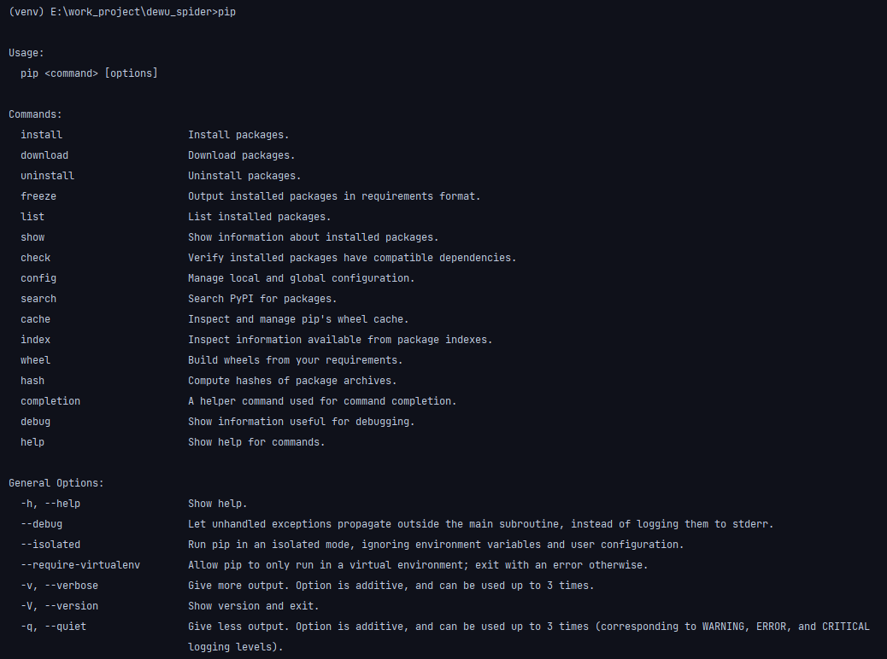
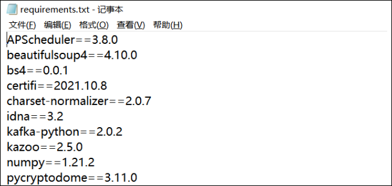

Python
<a name="uOQ6E"></a>
## 安装
当然在Python 3.4版本之后以及Python 2.7.9版本之后，官网的安装包当中就已经自带了pip，用户直接在安装完Python之后就可以直接使用，要是使用由virtualenv或者pyvenv创建的虚拟环境，那么pip也是被默认安装的<br />如果是需要自己另外安装pip包的，在已经配置好Python的环境当中运行下面这个命令行
```bash
py -m ensurepip --upgrade
```
另外一种方式是从官网上([https://bootstrap.pypa.io/get-pip.py](https://bootstrap.pypa.io/get-pip.py))直接下载get-pip.py脚本，然后直接运行`python get-pip.py`脚本即可
<a name="RfBLy"></a>
## 如何使用
安装后，在命令行中输入pip，然后按下回车，就会出现下图所示的使用说明：<br />
<a name="JA3VD"></a>
### 升级
要是觉得自己的pip版本有点低，想要升级一下的话，在命令行中输入以下命令
```bash
pip install --upgrade pip
```
或者是
```bash
pip install -U pip
```
<a name="wuW8f"></a>
### 安装某个版本的包
如果打算用pip来安装第三方的包，用的是以下的命令行
```bash
pip install package-name
```
例如想要安装指定版本的第三方的包，例如安装3.4.1版本的matplotlib，
```bash
pip install matplotlib==3.4.1
```
<a name="m6njG"></a>
### 卸载或者是更新包
要是打算想要卸载某个包，该要输入的命令行是
```bash
pip uninstall package_name
```
而如果打算更新某个包，对应的命令行是
```bash
pip install --upgrade package_name  
# 或者是  
pip install -U package_name
```
<a name="Pcjdq"></a>
### **查看某个包的信息**
可以通过以下的这个命令行来查看指定包的信息，
```bash
pip show -f requests
```
**output**
```
Name: requests  
Version: 2.24.0  
Summary: Python HTTP for Humans.  
Home-page: https://requests.readthedocs.io  
Author: Kenneth Reitz  
Author-email: me@kennethreitz.org  
License: Apache 2.0  
Location: c:\users\pc120\pycharmprojects\pythonproject1\venv\lib\site-packages  
Requires: certifi, chardet, idna, urllib3  
Required-by: etelemetry, gTTS, pandas-datareader, pandas-profiling, pyler, pywhatkit, pyxnat, streamlit, tushare, wikipedia, yfinance  
Files:  
  requests-2.24.0.dist-info\DESCRIPTION.rst  
  requests-2.24.0.dist-info\INSTALLER  
  .......
```
<a name="YHqji"></a>
### **查看需要被升级的包**
需要查看一下现有的这些包中，哪些是需要是被升级的，可以用下面这行命令行来查看，
```bash
pip list -o
```
**output**
```
Package    Version Latest Type  
---------- ------- ------ -----  
docutils   0.15.2  0.18.1 wheel  
PyYAML     5.4.1   6.0    wheel  
rsa        4.7.2   4.8    wheel  
setuptools 56.0.0  62.1.0 wheel
```
<a name="QHYRr"></a>
### **查看兼容问题**
在下载安装一些标准库的时候，需要考虑到兼容问题，一些标准库的安装可能需要依赖其他的标准库，会存在版本相冲突等问题，先用下面这条命令行来检查一下是否会有冲突的问题存在
```bash
pip check package_name
```
当然要是不指定是哪个标准库的话，会检查现在已经安装的所有包中的是否存在版本冲突等问题
```bash
pip check
```
**output**
```
yfinance 0.1.70 has requirement requests>=2.26, but you have requests 2.24.0.  
selenium 4.1.0 has requirement urllib3[secure]~=1.26, but you have urllib3 1.25.11.
```
<a name="m9oap"></a>
### **指定国内源来安装**
要是感觉到安装的速度有点慢，可以指定国内的源来安装某个包，例如
```bash
pip install -i https://pypi.douban.com/simple/ package_name
```
国内源有
```
清华：https://pypi.tuna.tsinghua.edu.cn/simple  
阿里云：http://mirrors.aliyun.com/pypi/simple/  
中国科技大学 https://pypi.mirrors.ustc.edu.cn/simple/  
华中理工大学：http://pypi.hustunique.com/  
山东理工大学：http://pypi.sdutlinux.org/   
豆瓣：http://pypi.douban.com/simple/
```
<a name="NmMhO"></a>
### **下载包但是不安装**
要是想要下载某个包到指定的路径下，命令行如下
```bash
pip download package_name -d "某个路径"
```
例如
```bash
pip download requests -d "."
```
就是在当前的目录下下载requests模块以及其他所要依赖的模块
<a name="uB1rG"></a>
### **批量安装软件包**
一般在看到别人的项目时，都会包含一个requirements.txt文件，里面包含了一些Python项目当中需要用到的第三方库<br /><br />要生成这种txt文件，需要这么来做
```bash
pip freeze > requirements.txt
```
而如果需要来批量安装第三方库，在命令行中输入以下这个命令
```bash
pip install -r requirements.txt
```
