Python<br />安装 Python 很容易，但或许你正在用智能手机/平板电脑，在用不允许安装软件的电脑，或者因为其它原因无法安装 Python。那么，如何通过免安装的方式使用 Python 呢？<br />这里介绍 17 个免费的 Python 解释器和交互式 Shell（也称为 REPL），可以从 Web 浏览器中直接访问。（译注：国内访问部分网站不稳定，可以多试试，或者借助其它辅助上网的工具）<br />基于浏览器的 Python 解释器有一些缺点：

- 不能使用 `open()` 函数读写文件，不能建立网络连接。
- 不允许运行长时间的或者耗费大量内存的程序。
- 无法安装第三方模块，如 NumPy、Pandas、Requests、PyAutoGUI 或 Pygame（尽管有些会预装这些模块）。
- 有些 Python 特性可能被禁用了；在使用时需要个别注意。
- 有些服务需要注册一个免费帐户；如果不想处理垃圾邮件，可以用 10 Minute Email 创建一次性的邮件帐户。

尽管有以上缺点，但是用它们来练习编写 Python 代码是足够的。<br />下面就是 Python 在线服务网站的列表。<br />注：本文不包含 Pypy、Jython、Nutika、IronPython 等知名的 Python 解释器，因为它们都不是在线服务。
<a name="cV8MO"></a>
## 1、Python Tutor
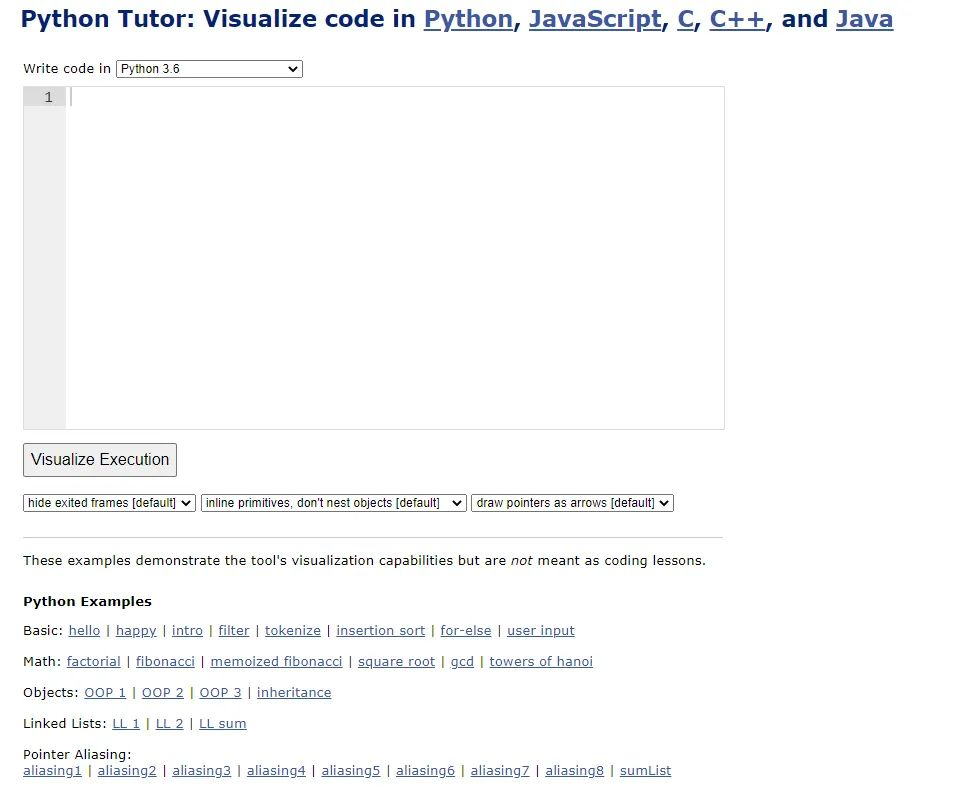<br />[https://pythontutor.com](https://pythontutor.com)<br />最喜欢的基于浏览器的 Python 文件编辑器就是 Python Tutor（Python 导师）。Python Tutor 内置了一个调试器，允许每次执行一行，并查看程序的单步执行情况。不仅如此，它还记录了程序在每一步的状态，因此也可以后退。这是大多数调试器没有的特性。<br />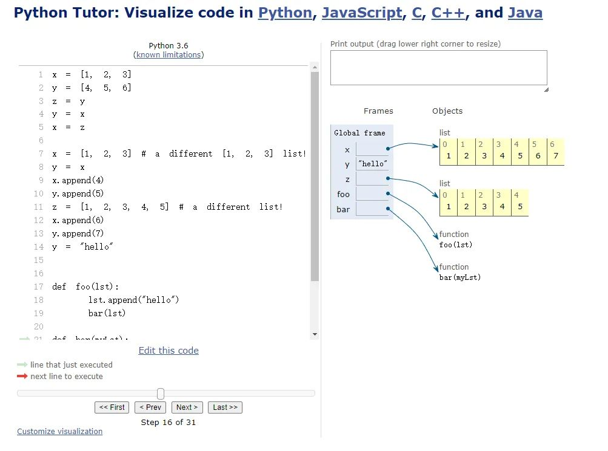<br />Python Tutor 网站还支持 Java 8、Javascript ES6 和 C/C++（使用 GCC 9.3 编译器）。主要的缺点是，程序在运行时会有所限制（因为在结果返回到浏览器之前，程序是在它们的服务器上运行的），但是在大多数的练习例子中，不会遇到什么问题。
<a name="jQ2RP"></a>
## 2、Python Anywhere
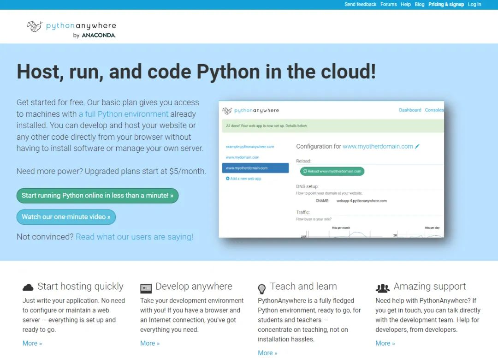<br />[https://www.pythonanywhere.com](https://www.pythonanywhere.com)<br />PythonAnywhere 是最流行的基于浏览器的解释器之一。必须先注册，是免费的。可以存储 Python 脚本，或者无需登录而只使用它们的 IPython 交互式 Shell。（译注：毕竟是 Anaconda 出品，能秒杀大部分竞品）<br />这个服务允许从一个虚拟硬盘中读写文件，它已经安装了许多流行的 Python 第三方模块。<br />它支持几个不同的 Python 版本，另外，它还被用于 www.python.org 网站上的交互式 Shell。
<a name="F6joA"></a>
## 3、Replit
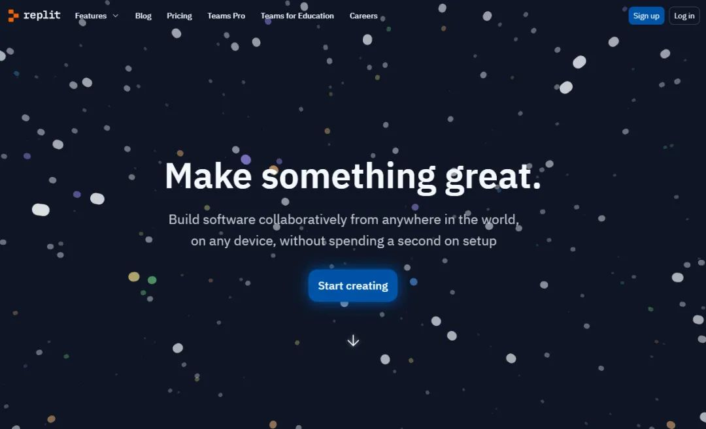<br />[https://replit.com](https://replit.com)<br />Replit 需要注册一个帐户才能使用。用户界面有点复杂，因为它们有好几块功能，包括导航网站的帮助系统。该站点还有用于 C、C++、Java、Javascript 和其他几种语言的在线编译器。<br />Replit 还有一个 APP，可以在智能手机和平板电脑上使用。
<a name="tekFI"></a>
## 4、Brython
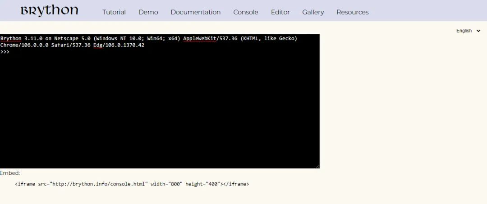<br />[https://brython.info/tests/console.html?lang=en](https://brython.info/tests/console.html?lang=en)<br />Brython 可以让 Web 浏览器像运行 JavaScript 一样运行 Python。一般在 Web 页面上用 JavaScript 做的事情，都可以用 Brython 来做。这意味着在运行程序时没有内存或 runtime 的限制，因为它们是在自己的计算机上运行。缺点是浏览器在加载网页时，必须先下载 6 M 的 Brython 代码。<br />可以提前下载 Brython 到电脑上，并离线运行。首先，从 GitHub 上的 Brython 发布页面下载最新的版本（例如目前的 Brython-3.11.0.zip）。在解压后的目录中，创建一个名为 console.html 的文本文件（或任意以 .html 为后缀的名称），并写入以下内容：
```html
<!doctype html>
<html>
  <head>
    <script type="text/javascript" src="brython.js"></script>
    <script type="text/javascript" src="brython_stdlib.js"></script>
    <style>
      .codearea {
        background-color:#000;
        color:#fff;
        font-family:'Oxygen Mono', Consolas, 'Liberation Mono', 'DejaVu Sans Mono', monospace;
        font-size:14px;
        overflow:auto
      }
    </style>
  </head>

  <body onload=brython({"debug":1}) ><!-- remove the 1 to leave debug mode -->
    <noscript>Please enable Javascript to view this page correctly</noscript>

    <textarea id="code" class="codearea" rows="20" cols="100"></textarea>

    <script type="text/python3">
      from interpreter import Interpreter

      # Start an interactive interpreter in textarea with id "code"
      Interpreter("code")
    </script>
  </body>
</html>
```
当在计算机上打开这个 .html 文件时，将得到一个可运行的 Python 交互式 Shell。
<a name="RaybY"></a>
## 5、Google Colab
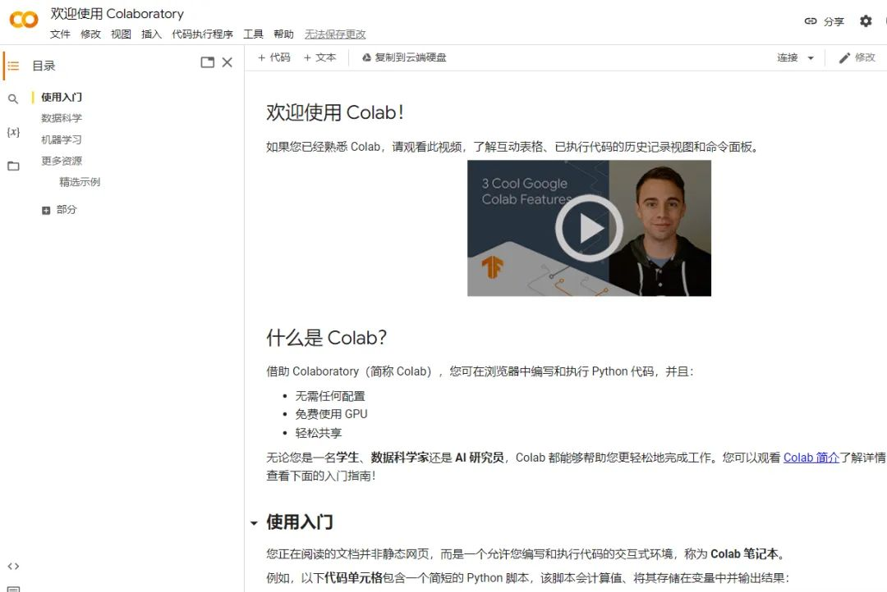<br />[https://colab.research.google.com](https://colab.research.google.com)<br />使用 Google 或 GMail 帐户，可以访问这个 Jupyter Notebook 风格的 REPL，它提供了大量的内存和 CPU 资源。
<a name="rsWZT"></a>
## 6、Trinket
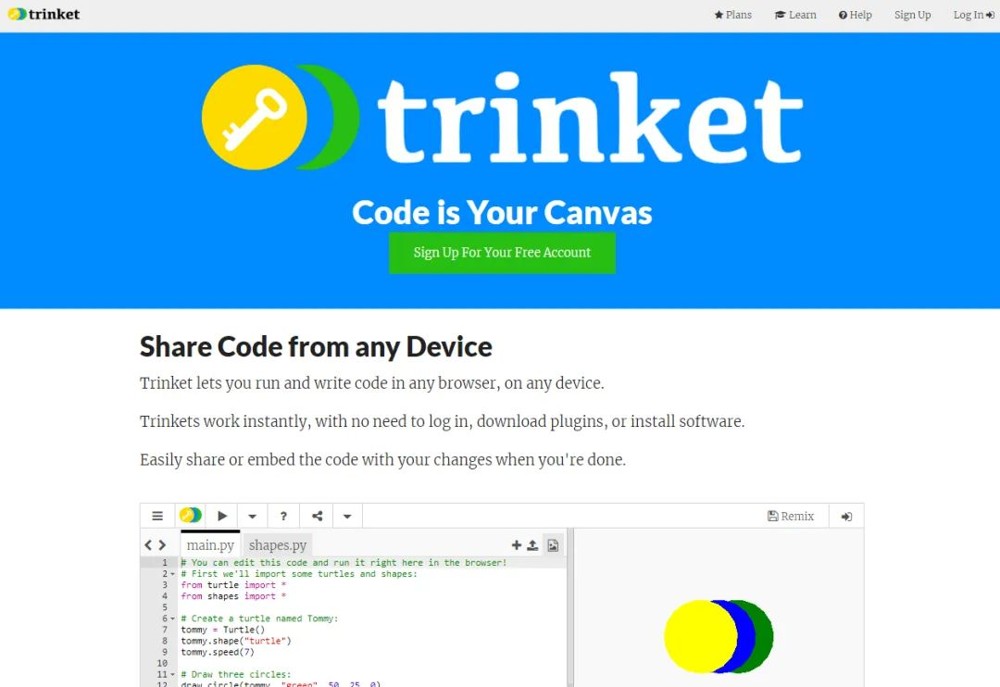<br />[https://trinket.io](https://trinket.io)<br />Trinket 是一个以教育为主的网站。需要注册一个免费的帐户才能使用它，他们的交互式 Shell 还支持Turtle、Matplotlib 和其他模块，而许多在线 REPL 都不支持这些模块。
<a name="K3fRo"></a>
## 7、Python Fiddle
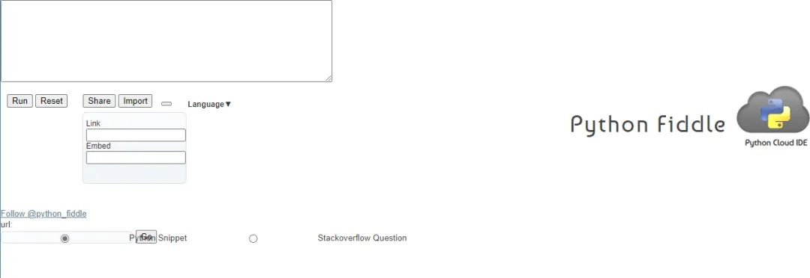<br />[http://pythonfiddle.com](http://pythonfiddle.com)<br />Python Fiddle 是一个简单的编辑器，允许创建和运行 Python 脚本。它的用户界面太过丑陋了。。。（译注：不忍直视的页面！网站竟然支持两种语言，English与中文，不经怀疑开发者的身份是……）
<a name="peI9a"></a>
## 8、Programiz
[https://www.programiz.com/python-programming/online-compiler](https://www.programiz.com/python-programming/online-compiler)<br />Programiz 有一个简单的文件编辑器。它不能写文件，运行资源也有限。该网站还有用于 C、C++、Java、C#、Javascript 的编译器，以及一个用于 SQL 数据库和 HTML/CSS 的沙箱。
<a name="z5zkp"></a>
## 9、Ideone
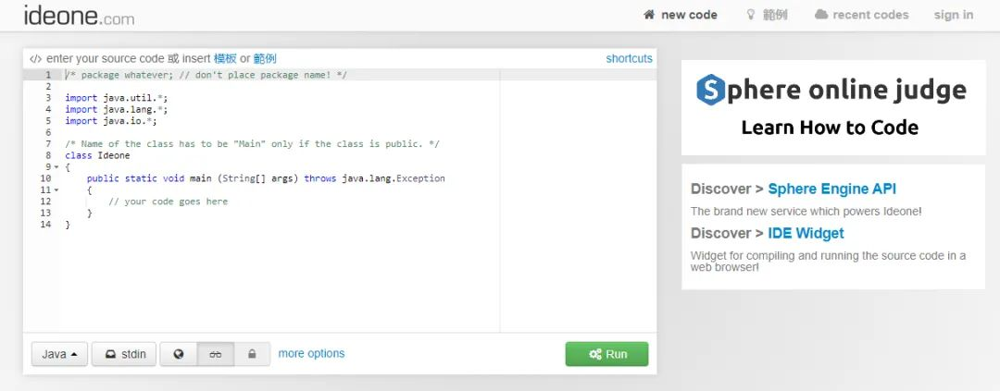<br />[https://ideone.com](https://ideone.com)<br />Ideaone 有一个丰富的编辑器，支持包括 Python 在内的多种编程语言（甚至有 Pascal、Fortran、Prolog 和 Cobol 等较老的语言，以及 Brainfuck 和 Intercal 等深奥的编程语言）。<br />它只有一个支持编写和运行程序的编辑器（有 5 秒的运行时长限制），但没有交互式 Shell。相比于用它写 Python，如果想练习不太流行的语言，Ideaone 会是个不错的选择。
<a name="dNTMD"></a>
## 10、SymPy Live Shell
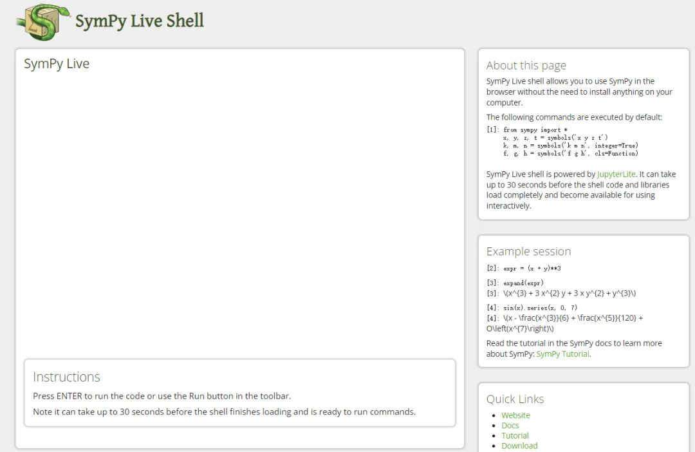<br />[https://live.sympy.org](https://live.sympy.org)<br />一个 Jupyter Notebook 风格的 REPL，带有一个很小的用户界面，非常适合简略的代码。它完全在浏览器中使用 JupyterLite 运行 JupyterLab，而不是在服务器上运行。
<a name="Nd994"></a>
## 11、OnlineGDB
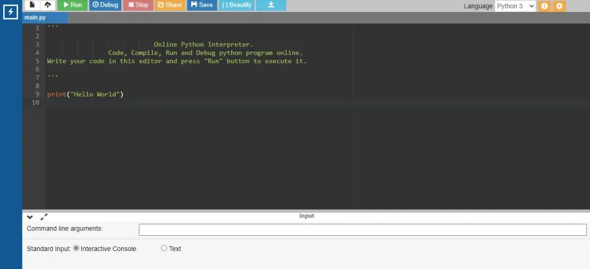<br />[https://www.onlinegdb.com/online_python_interpreter](https://www.onlinegdb.com/online_python_interpreter)<br />一个不错的编辑器，有一个很好的用户界面，不会让人不知所措。运行时和内存似乎也相当多。推荐这个。
<a name="DXPN7"></a>
## 12、W3Schools Python Shell
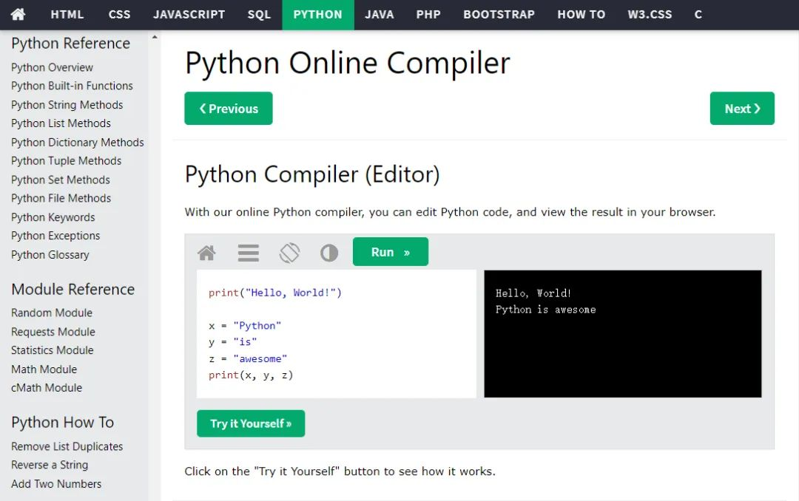<br />[https://www.w3schools.com/python/python_compiler.asp](https://www.w3schools.com/python/python_compiler.asp)<br />W3Schools 有一个简单的 Python 编辑器，支持基本的语法高亮。它有大约 10 秒的运行时间限制，但是如果程序超出时间，它不会报错。如果是简单的例子，用起来很好。
<a name="VjkPA"></a>
## 13、Python原理在线解释器
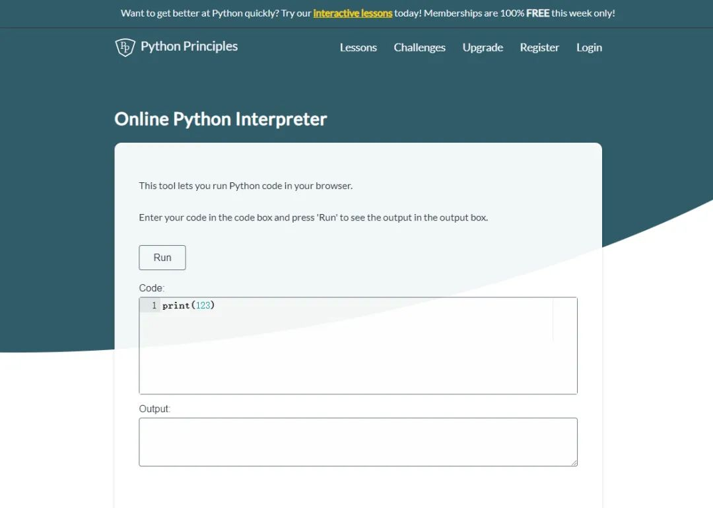<br />[https://pythonprinciples.com/online-python-interpreter](https://pythonprinciples.com/online-python-interpreter)<br />一个简单的文件编辑器，只能运行一些较为简单的代码。
<a name="p1E3M"></a>
## 14、Online Python 测试版
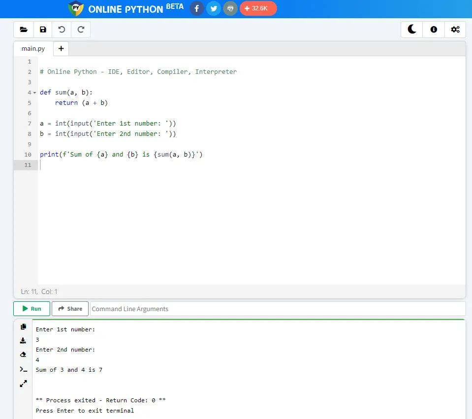<br />[https://www.online-python.com](https://www.online-python.com)<br />一个简单明了的 Python 编辑器，只能运行一些较为简单的代码。
<a name="yykwQ"></a>
## 15、TutorialsPoint
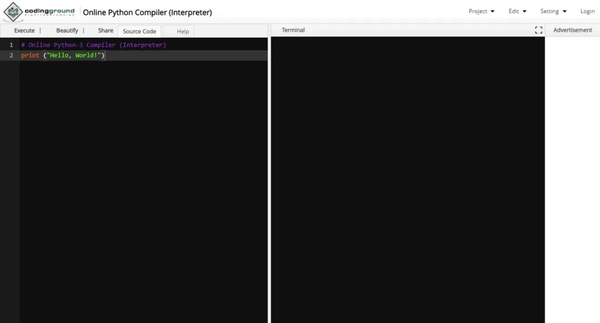<br />[https://www.tutorialspoint.com/execute_python_online.php](https://www.tutorialspoint.com/execute_python_online.php)<br />一个简单易懂的编辑器，有较多运行资源。
<a name="x8XBg"></a>
## 16、RexTester
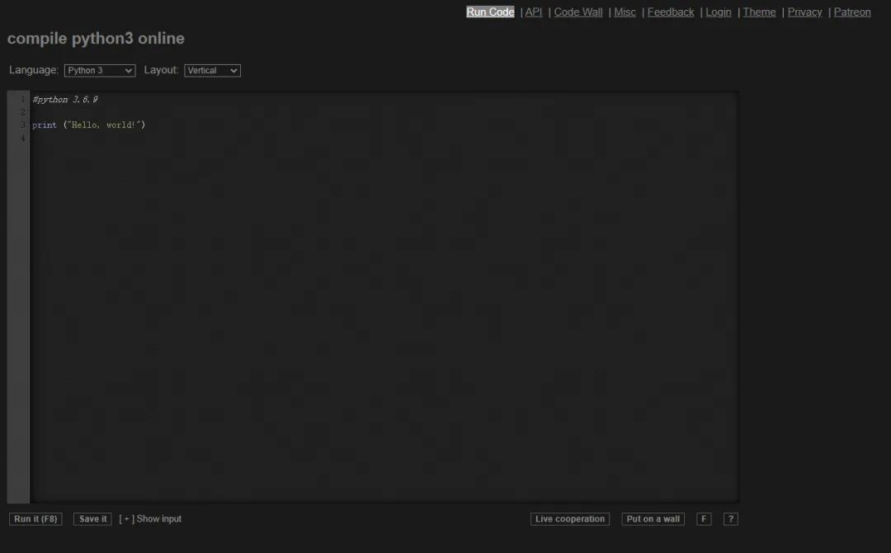<br />[https://rextester.com/l/python3_online_compiler](https://rextester.com/l/python3_online_compiler)<br />这像一个业余项目，仅有极简的编辑器，有 5 秒的运行时间限制。它有其他语言的编译器，但网站难于浏览。
<a name="H7xwn"></a>
## 17、Portable Python
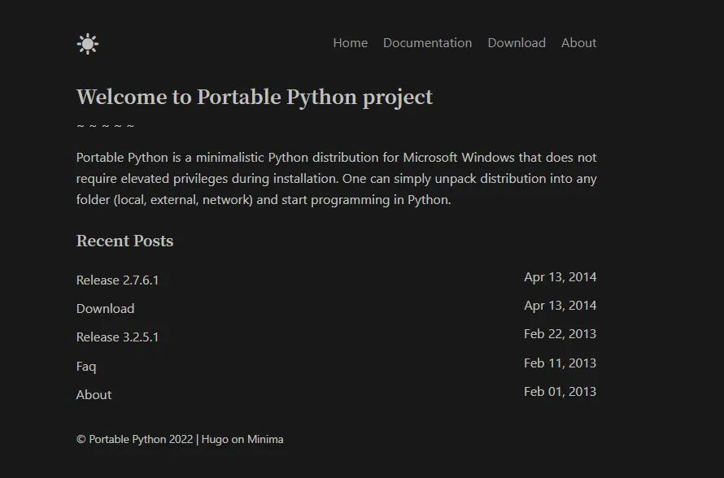<br />[https://portablepython.com](https://portablepython.com) （不推荐）<br />这不是一个基于浏览器的 REPL，而是一个 .exe 文件，可以在 Windows 上运行 Python，而无需安装任何东西。然而，该网站自 2013 年（以及 Python 3.2）以来就没有更新过，下载页面也不使用 HTTPS。由于可能有恶意软件，不建议使用它。
<a name="G4kzn"></a>
## 18、在线版 VS Code
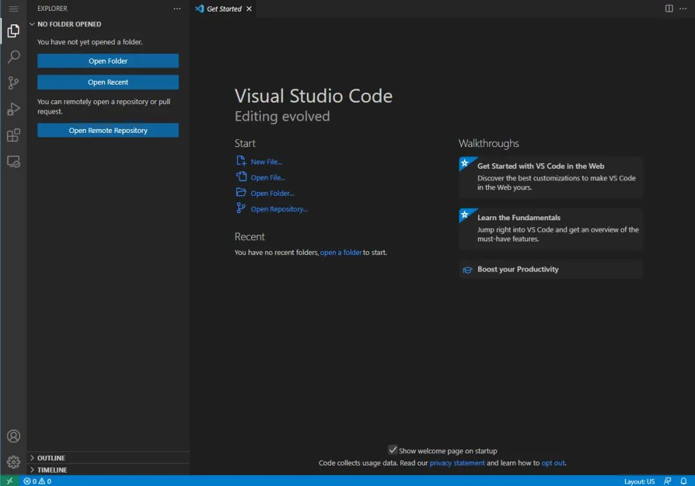<br />[https://vscode.dev](https://vscode.dev)<br />Visual Studio Code 是一个 Electron app，这意味着它可以作为一个普通的桌面应用程序，也可以基于浏览器来运行。浏览器版本有点受限，相比于其它在线解释器，使用这个在线 IDE 需要更陡的学习曲线。<br />不过，如果愿意深入了解它，或者已经使用过 Visual Studio Code，那么可以试试这个基于浏览器的版本。
