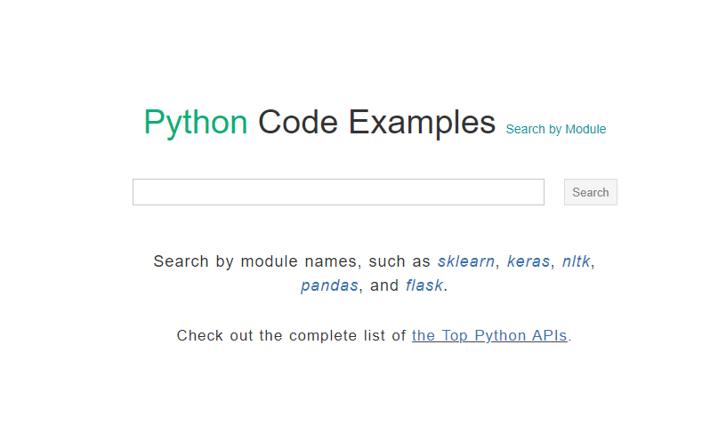

## pythontutor
[https://pythontutor.com/](https://pythontutor.com/) 这个网站对于新手同学理解代码的运行逻辑简直是太好用了 首先进入网站看到的就是如下这个页面  左边是一段 Python 代码，右边则是对应的运行逻辑、变量值等信息，点击下方的Prev和Next按钮，就会产生联动的效果  是不是很清晰呢，代码运行到哪里、变量是多少都展示的一清二楚，这对于初学者来说，可以省去很多弯路，也能够加深对代码运行的理解 该网站有两种运行模式：在线编辑模式和动态演示模式，总体来说还是对于新手的福利网站，大家可以自行体验更多功能！

## Python 代码例子
[https://www.programcreek.com/python](https://www.programcreek.com/python) 该网站就是通过代码例子更快的学习各种库的使用，毕竟有的时候某些类库的官方文档不健全，网上一些博客又喜欢断章取义，此时对于新手来说，除了去各种咨询前辈之外，这个网站就是非常好的去处了！  比如搜索 IPy ，就可以得到如下结果，真的非常全面  选择 IPy，就可以看到各种使用例子了，真的好用啊 

## 动画算法
[https://visualgo.net/](https://visualgo.net/) 这是一个非常有意思的网站，以动画的形式展示了多种算法的实现过程  就来看看最常用的排序算法吧  看到有冒泡排序、选择排序、插入排序，并归排序等等 就来看看冒泡排序的效果吧  效果还是非常赞的，支持自己设置排序数值，还可以在运行的同时通过右下角实时查看当前排序算法的状态，贴心~ 当然还有更多的动画算法展示，大家自己去探索吧
