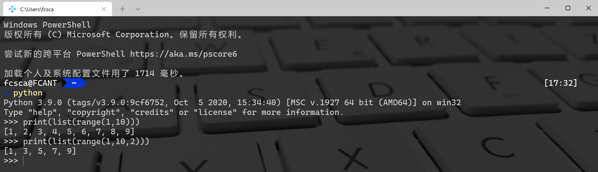

Python 内置函数<br />截止到Python版本3.6.2 ，一共提供了68个内置函数，具体如下👇
```python
abs()           dict()        help()         min()         setattr()
all()           dir()         hex()          next()        slice() 
any()           divmod()      id()           object()      sorted() 
ascii()         enumerate()   input()        oct()         staticmethod() 
bin()           eval()        int()          open()        str() 
bool()          exec()        isinstance()   ord()         sum() 
bytearray()     filter()       issubclass()   pow()         super() 
bytes()         float()        iter()         print()       tuple() 
callable()      format()      len()          property()    type() 
chr()           frozenset()   list()         range()       vars() 
classmethod()   getattr()     locals()       repr()        zip() 
compile()       globals()     map()          reversed()    __import__() 
complex()       hasattr()     max()          round() 
delattr()       hash()        memoryview()   set()
```

---

**和数字相关**

1. 数据类型
2. 进制转换
3. 数学运算

**和数据结构相关**

1. 序列
2. 数据集合
3. 相关内置函数

**和作用域相关**<br />**和迭代器生成器相关**<br />**字符串类型代码的执行**<br />**输入输出**<br />**内存相关**<br />**文件操作相关**<br />**模块相关**<br />**帮  助**<br />**调用相关**<br />**查看内置属**性
<a name="Avzzn"></a>
## 和数字相关
<a name="9Rcqm"></a>
### 1、数据类型

- `bool`：布尔型(`True`,`False`)
- `int`：整型(整数)
- `float`：浮点型(小数)
- `complex`：复数
<a name="oho3b"></a>
### 2、进制转换

- `bin()` 将给的参数转换成二进制
- `otc()` 将给的参数转换成八进制
- `hex()` 将给的参数转换成十六进制
```python
print(bin(10))  # 二进制:0b1010
print(hex(10))  # 十六进制:0xa
print(oct(10))  # 八进制:0o12
```
<a name="jTPBv"></a>
### 3、数学运算

- `abs()` 返回绝对值
- `divmode()` 返回商和余数
- `round()` 四舍五入
- `pow(a, b)` 求a的b次幂, 如果有三个参数，则求完次幂后对第三个数取余
- `sum()` 求和
- `min()` 求最小值
- `max()` 求最大值
```python
print(abs(-2))  # 绝对值:2
print(divmod(20,3)) # 求商和余数:(6,2)
print(round(4.50))   # 五舍六入:4
print(round(4.51))   #5
print(pow(10,2,3))  # 如果给了第三个参数. 表示最后取余:1
print(sum([1,2,3,4,5,6,7,8,9,10]))  # 求和:55
print(min(5,3,9,12,7,2))  #求最小值:2
print(max(7,3,15,9,4,13))  #求最大值:15
```
<a name="QSWBb"></a>
## 和数据结构相关
<a name="Kz3bH"></a>
### 1、序列
<a name="3YJMg"></a>
#### （1）列表和元组

- `list()` 将一个可迭代对象转换成列表
- `tuple()` 将一个可迭代对象转换成元组
```python
print(list((1,2,3,4,5,6)))  #[1, 2, 3, 4, 5, 6]
print(tuple([1,2,3,4,5,6]))  #(1, 2, 3, 4, 5, 6)
```
<a name="4LbdN"></a>
#### （2）相关内置函数

- `reversed()` 将一个序列翻转，返回翻转序列的迭代器
- `slice()` 列表的切片
```python
lst = "你好啊"
it = reversed(lst)   # 不会改变原列表. 返回一个迭代器, 设计上的一个规则
print(list(it))  #['啊', '好', '你']
lst = [1, 2, 3, 4, 5, 6, 7]
print(lst[1:3:1])  #[2,3]
s = slice(1, 3, 1)  #  切片用的
print(lst[s])  #[2,3]
```
<a name="vOyhh"></a>
#### （3）字符串
`str()` 将数据转化成字符串
```python
print(str(123)+'456')  #123456
```
`format()` 与具体数据相关，用于计算各种小数，精算等
```python
s = "hello world!"
print(format(s, "^20"))  #剧中
print(format(s, "<20"))  #左对齐
print(format(s, ">20"))  #右对齐
#     hello world!    
# hello world!        
#         hello world!
print(format(3, 'b' ))    # 二进制:11
print(format(97, 'c' ))   # 转换成unicode字符:a
print(format(11, 'd' ))   # ⼗进制:11
print(format(11, 'o' ))   # 八进制:13 
print(format(11, 'x' ))   # 十六进制(⼩写字母):b
print(format(11, 'X' ))   # 十六进制(大写字母):B
print(format(11, 'n' ))   # 和d⼀样:11
print(format(11))         # 和d⼀样:11
print(format(123456789, 'e' ))      # 科学计数法. 默认保留6位小数:1.234568e+08
print(format(123456789, '0.2e' ))   # 科学计数法. 保留2位小数(小写):1.23e+08
print(format(123456789, '0.2E' ))   # 科学计数法. 保留2位小数(大写):1.23E+08
print(format(1.23456789, 'f' ))     # 小数点计数法. 保留6位小数:1.234568
print(format(1.23456789, '0.2f' ))  # 小数点计数法. 保留2位小数:1.23
print(format(1.23456789, '0.10f'))  # 小数点计数法. 保留10位小数:1.2345678900
print(format(1.23456789e+3, 'F'))   # 小数点计数法. 很大的时候输出INF:1234.567890
print("{0} {1}".format("hello", "world"))
```
`bytes()` 把字符串转化成bytes类型
```python
bs = bytes("今天吃饭了吗", encoding="utf-8")
print(bs)  #b'\xe4\xbb\x8a\xe5\xa4\xa9\xe5\x90\x83\xe9\xa5\xad\xe4\xba\x86\xe5\x90\x97'
```
`bytearray()` 返回一个新字节数组。这个数字的元素是可变的，并且每个元素的值得范围是[0,256)
```python
ret = bytearray("alex" ,encoding ='utf-8')
print(ret[0])  #97
print(ret)  #bytearray(b'alex')
ret[0] = 65  #把65的位置A赋值给ret[0]
print(str(ret))  #bytearray(b'Alex')
```
`ord()` 输入字符找带字符编码的位置<br />`chr()` 输入位置数字找出对应的字符<br />`scii()` 是ascii码中的返回该值不是就返回u
```python
print(ord('a'))  # 字母a在编码表中的码位:97
print(ord('中'))  # '中'字在编码表中的位置:20013
print(chr(65))  # 已知码位,求字符是什么:A
print(chr(19999))  #丟
for i in range(65536):  #打印出0到65535的字符
    print(chr(i), end=" ")
print(ascii("@"))  #'@'
```
`repr()` 返回一个对象的`string`形式
```python
s = "今天\n吃了%s顿\t饭" % 3
print(s)#今天# 吃了3顿    饭
print(repr(s))   # 原样输出,过滤掉转义字符 \n \t \r 不管百分号%
#'今天\n吃了3顿\t饭'
```
<a name="oNj6g"></a>
### 2、数据集合

- 字典：dict 创建一个字典
- 集合：set 创建一个集合

`frozenset()` 创建一个冻结的集合，冻结的集合不能进行添加和删除操作。
<a name="rwkc1"></a>
### 3、相关内置函数
<a name="cmPOd"></a>
#### `len()` 返回一个对象中的元素的个数
<a name="oEfo4"></a>
#### `sorted()` 对可迭代对象进行排序操作 (lamda)
语法：`sorted(Iterable, key=函数(排序规则), reverse=False)`

- `Iterable`：可迭代对象
- `key`：排序规则(排序函数)，在`sorted`内部会将可迭代对象中的每一个元素传递给这个函数的参数. 根据函数运算的结果进行排序
- `reverse`：是否是倒叙。`True`：倒叙, `False`：正序
```python
lst = [5,7,6,12,1,13,9,18,5]
lst.sort()  # sort是list里面的一个方法
print(lst)  #[1, 5, 5, 6, 7, 9, 12, 13, 18]
ll = sorted(lst) # 内置函数. 返回给你一个新列表  新列表是被排序的
print(ll)  #[1, 5, 5, 6, 7, 9, 12, 13, 18]
l2 = sorted(lst,reverse=True)  #倒序
print(l2)  #[18, 13, 12, 9, 7, 6, 5, 5, 1]
```
```python
#根据字符串长度给列表排序
lst = ['one', 'two', 'three', 'four', 'five', 'six']
def f(s):
    return len(s)
l1 = sorted(lst, key=f, )
print(l1)  #['one', 'two', 'six', 'four', 'five', 'three']
```
<a name="xAme0"></a>
#### `enumerate()` 获取集合的枚举对象
```python
lst = ['one','two','three','four','five']
for index, el in enumerate(lst,1):    # 把索引和元素一起获取,索引默认从0开始. 可以更改
    print(index)
    print(el)
# 1
# one
# 2
# two
# 3
# three
# 4
# four
# 5
# five
```
<a name="U7lLR"></a>
#### `all()` 可迭代对象中全部是True，结果才是True
<a name="Eytgl"></a>
#### `any()` 可迭代对象中有一个是True，结果就是True
```python
print(all([1,'hello',True,9]))  #True
print(any([0,0,0,False,1,'good']))  #True
```
<a name="qeEm0"></a>
#### `zip()` 函数用于将可迭代的对象作为参数，将对象中对应的元素打包成一个元组，然后返回由这些元组组成的列表。如果各个迭代器的元素个数不一致，则返回列表长度与最短的对象相同
```python
lst1 = [1, 2, 3, 4, 5, 6]
lst2 = ['醉乡民谣', '驴得水', '放牛班的春天', '美丽人生', '辩护人', '被嫌弃的松子的一生']
lst3 = ['美国', '中国', '法国', '意大利', '韩国', '日本']
print(zip(lst1, lst1, lst3))  #<zip object at 0x00000256CA6C7A88>
for el in zip(lst1, lst2, lst3):
    print(el)
# (1, '醉乡民谣', '美国')
# (2, '驴得水', '中国')
# (3, '放牛班的春天', '法国')
# (4, '美丽人生', '意大利')
# (5, '辩护人', '韩国')
# (6, '被嫌弃的松子的一生', '日本')
```
<a name="lc4Ag"></a>
#### `fiter()` 过滤 (lamda)
语法：`fiter(function, Iterable)`<br />`function`：用来筛选的函数. 在filter中会自动的把`iterable`中的元素传递给`function`。然后根据`function`返回的`True`或者`False`来判断是否保留此项数据，`Iterable`：可迭代对象
```python
def func(i):    # 判断奇数
    return i % 2 == 1
    lst = [1,2,3,4,5,6,7,8,9]
l1 = filter(func, lst)  #l1是迭代器
print(l1)  #<filter object at 0x000001CE3CA98AC8>
print(list(l1))  #[1, 3, 5, 7, 9]
```
<a name="W29Q4"></a>
#### `map()` 会根据提供的函数对指定序列列做映射(lamda)
语法：`map(function, iterable)`<br />可以对可迭代对象中的每一个元素进行映射，分别去执行 `function`
```python
def f(i):    
  return i
list = [1,2,3,4,5,6,7,]
it = map(f, list) # 把可迭代对象中的每一个元素传递给前面的函数进行处理. 处理的结果会返回成迭代器print(list(it))  #[1, 2, 3, 4, 5, 6, 7]
```
<a name="b9seO"></a>
## 和作用域相关
<a name="mk5TJ"></a>
### `locals()` 返回当前作用域中的名字
<a name="yhLk0"></a>
### `globals()` 返回全局作用域中的名字
```python
def func():
    a = 10
    print(locals())  # 当前作用域中的内容
    print(globals())  # 全局作用域中的内容
    print("今天内容很多")
func()
# {'a': 10}
# {'__name__': '__main__', '__doc__': None, '__package__': None, '__loader__': 
# <_frozen_importlib_external.SourceFileLoader object at 0x0000026F8D566080>, 
# '__spec__': None, '__annotations__': {}, '__builtins__': <module 'builtins' 
# (built-in)>, '__file__': 'D:/pycharm/练习/week03/new14.py', '__cached__': None,
#  'func': <function func at 0x0000026F8D6B97B8>}
# 今天内容很多
```
<a name="GxuY6"></a>
## 和迭代器生成器相关
<a name="WUFk1"></a>
### `range()` 生成数据
在Python3中，该函数返回的是一个可迭代对象（类型是对象），而不是列表类型， 所以打印的时候不会打印列表。
```python
list(range(1,10))

list(range(1,10,2)) # 指定步长
```

<a name="jUNup"></a>
### `next()` 迭代器向下执行一次，内部实际使用了`__next__()`方法返回迭代器的下一个项目
<a name="V4em3"></a>
### `iter()` 获取迭代器，内部实际使用的是`__iter__()`方法来获取迭代器
```python
for i in range(15,-1,-5):
    print(i)
# 15
# 10
# 5
# 0
lst = [1,2,3,4,5]
it = iter(lst)  #  __iter__()获得迭代器
print(it.__next__())  #1
print(next(it)) #2  __next__()  
print(next(it))  #3
print(next(it))  #4
```
<a name="cIGeB"></a>
## 字符串类型代码的执行
<a name="Y0L1g"></a>
### `eval()` 执行字符串类型的代码，并返回最终结果
```python
x = 50
eval( '3 * x' )

x = 'print("打印这个字符串")'
eval(x)
```
<a name="U1Cdx"></a>
### `exec()` 执行字符串类型的代码
<a name="AT4lH"></a>
### `compile()` 将字符串类型的代码编码。代码对象能够通过`exec`语句来执行或者`eval()`进行求值
```python
s1 = input("请输入a+b:")  #输入:8+9
print(eval(s1))  # 17 可以动态的执行代码. 代码必须有返回值
s2 = "for i in range(5): print(i)"
a = exec(s2) # exec 执行代码不返回任何内容
# 0
# 1
# 2
# 3
# 4
print(a)  #None
# 动态执行代码
exec("""
def func():
    print(" 我是周杰伦")
""" )
func()  #我是周杰伦
code1 = "for i in range(3): print(i)"
com = compile(code1, "", mode="exec")   # compile并不会执行你的代码.只是编译
exec(com)   # 执行编译的结果
# 0
# 1
# 2
code2 = "5+6+7"
com2 = compile(code2, "", mode="eval")
print(eval(com2))  # 18
code3 = "name = input('请输入你的名字:')"  #输入:hello
com3 = compile(code3, "", mode="single")
exec(com3)
print(name)  #hello
```
<a name="XZaoq"></a>
## 输入输出
<a name="hlAZ9"></a>
### `print()`：打印输出
```python
print("hello", "world", sep="*", end="@") # sep:打印出的内容用什么连接,end:以什么为结尾
#hello*world@
```
<a name="Elkin"></a>
### `input()`：获取用户输出的内容
`input()`：该函数接受一个标准输入数据，返回为 string 类型。
```python
x = input("请输入你的姓姓名：")
print(f"我的名字是{x}")
```
<a name="6OWXq"></a>
## 内存相关
<a name="EavU4"></a>
### `hash()`：获取到对象的哈希值(int, str, bool, tuple). 
hash算法：(1) 目的是唯一性 (2) dict 查找效率非常高, hash表.用空间换的时间 比较耗费内存
```python
s = 'alex'
print(hash(s))  #-168324845050430382
lst = [1, 2, 3, 4, 5]
print(hash(lst))  #报错,列表是不可哈希的
  id() :  获取到对象的内存地址
s = 'alex'
print(id(s))  #2278345368944
```
<a name="AbvZR"></a>
## 文件操作相关
<a name="Xbi6G"></a>
### `open()`：用于打开一个文件, 创建一个文件句柄
```python
f = open('file',mode='r',encoding='utf-8')
f.read()
f.close()
```
<a name="nJJXD"></a>
## 模块相关
<a name="gOVmT"></a>
### `__import__()`：用于动态加载类和函数
```
# 让用户输入一个要导入的模块
import os
name = input("请输入你要导入的模块:")
__import__(name)    # 可以动态导入模块
```
<a name="fqAG9"></a>
## 帮  助
<a name="yHlDo"></a>
### `help()`：函数用于查看函数或模块用途的详细说明
```python
print(help(str))  #查看字符串的用途
```
<a name="OU0NA"></a>
## 调用相关
<a name="RBgeP"></a>
### `callable()`：用于检查一个对象是否是可调用的，如果返回`True`, `object`有可能调用失败，但如果返回`False`，那调用绝对不会成功
```python
a = 10
print(callable(a))  #False  变量a不能被调用
#
def f():
    print("hello")
    print(callable(f))   # True 函数是可以被调用的
```
<a name="0KAIo"></a>
## 查看内置属性
<a name="v1tO1"></a>
### `dir()`：查看对象的内置属性, 访问的是对象中的`__dir__()`方法
```python
print(dir(tuple))  #查看元组的方法
```
