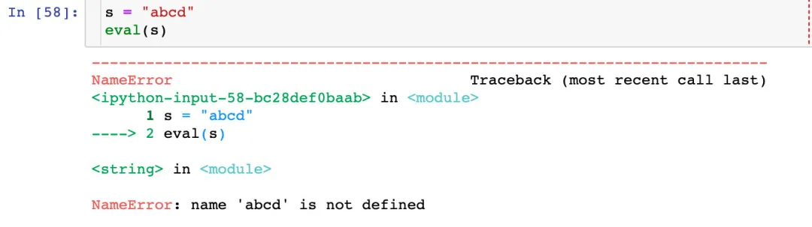

Python 内置函数 zip filter enumberate reversed/reverse eval<br />Python 中 5 个高阶内置函数，它们不仅能够帮助我们了解 Python 的数据结构，同时也能加快数据处理的速度。

- zip<br />
- filter<br />
- enumberate<br />
- reversed/reverse<br />
- eval<br />


<a name="97s7Z"></a>
## 1、zip
<a name="8lJt7"></a>
### 引例
 `zip` ：
> 需求：如果想对两个列表对应位置上的数字一一求和，该如何操作？

```python
x = [1,2,3]
y = [4,5,6]
```
<a name="ig8bi"></a>
#### for循环实现

<a name="QoqpY"></a>
#### zip实现
<br />**具体实现过程**：<br />
<a name="uJQ8s"></a>
### 查看使用文档
```python
help(zip)
```

<a name="4IfUg"></a>
### zip接受一个序列
<a name="dDS8t"></a>
#### 空序列

<a name="d1Z53"></a>
#### 接受列表、元组、集合、字符串

<a name="V74X6"></a>
### zip接受多个序列
接受列表、元组、集合、字符串的任意组合：
```python
## 列表、元组、集合、字符串的随意组合
a = [1,2,3]
b = {4,5,6}
c = (7,8,9)
d = "zip"
print(list(zip(a,b)))  # 列表+集合
print("------------")
print(list(zip(a,c)))  # 列表+元组
print("------------") 
print(list(zip(b,d)))  # 集合+元组
print("------------")
print(list(zip(c,d)))  # 元组+字符串
print("------------")
print(list(zip(a,b,c)))  # 列表+集合+字符串
```

<a name="2xq7b"></a>
### zip处理不同长度
上面的多个元素的长度都是相同的，下面的例子来展示 `zip`处理不同长度的序列。<br />**zip会选择最小长度的序列进行合并**<br />
<a name="9FxmS"></a>
## 2、filter
`filter`本身是 `过滤`的意思：**就是将那些不符合要求的数据直接过滤舍弃掉，剩下那些符合要求的数据。**
<a name="3UwUq"></a>
### 查看帮助文档
将序列中的每个元素传递给函数，执行的结果为 `True`或者 `False`，将结果为 `True`的元素放入新的列表中。<br />返回的是 `filter`对象。如果想看具体的数据，需要使用 `list`来展开。
```python
help(filter)
```

<a name="OwGE9"></a>
### 使用自定义函数

<a name="5RDcB"></a>
### 使用匿名函数lambda

<a name="jNQfv"></a>
### 直接筛选条件
```python
list(filter(lambda x: x>1, [0,1,9,-4,8,100]))
```
具体结果为：
```python
[9, 8, 100]
```
<a name="nRiDk"></a>
### 字符筛选
```python
list(filter(lambda x: x!="shenzhen", ["guangzhou","shanghai","shenzhen","changsha"])) # 筛选不满足要求的字符串
['guangzhou', 'shanghai', 'changsha']
```
<a name="hwmfq"></a>
## 3、enumerate
`enumerate`是 `Python`的一个重要内置函数，返回的是可迭代序列的元素和下标，对列表、集合、字典、字符串等都适用的。<br />在 `Python`的 `for`循环中使用的非常广泛。<br />**如果想查看结果，需要使用list函数来进行显示。**
<a name="TGY9h"></a>
### 查看帮助文档
```python
help(enumerate)
```

<a name="QiVK1"></a>
### 用于列表、集合、元组、字符串、字典
<br />
<a name="b8wns"></a>
## 4、reversed
`reversed()`函数是返回序列 `seq`的**反向访问**的迭代器。<br />参数可以是 `列表，元组，字符串，不改变原对象`均可。下面通过具体的例子来说明：
<a name="0LtYL"></a>
### 查看帮助文档
```python
help(reversed)
```

<a name="xFpJN"></a>
### 用于列表

<a name="K11v5"></a>
### 用于元组

<a name="FzIyD"></a>
### 用于字符串

<a name="FOAkD"></a>
## 4.1 reverse
用于对**列表中的元素反向排序**，方法没有返回值，只是对列表中的元素进行反向排序<br />**只针对列表**！
<a name="1vlS9"></a>
### demo

<a name="e4sqc"></a>
### 集合不能用reverse
**方法只针对列表**
```python
# 集合反向
set1 = {1,"python",3,"java",5}
set1.reverse()  # 集合没有reverse方法，该方法只针对列表
```

<a name="065rI"></a>
## 5、eval
<a name="KNeBK"></a>
### 语法
`eval` 直接返回传入字符串的表达式的结果，语法为：
```python
eval(expression[, globals[, locals]])
```
下面通过几个例子来直接讲解该方法的使用
<a name="Z9nZI"></a>
### 例子
**字符串和列表、字典、集合的转化**<br />
<a name="ZPNae"></a>
### 带上参数
三个参数的意义：

- expression ： 字符串<br />
- globals ： 变量作用域，全局命名空间；**如果被提供，则必须是一个字典对象**<br />
- locals ： 变量作用域，局部命名空间；**如果被提供，可以是任何映射对象**<br />
> 当它和globals中有重复的部分时，locals里的定义会覆盖掉globals中的：当globals和locals中有冲突的部分时，locals有决定权。
> 如果locals没有被 提供的话，则默认为globals。


<a name="4IMhq"></a>
### 理解expressions
```python
s = "abcd"
eval(s)
```

```python
# eval先将‘s’的引号剥去，得到s.不可以进行计算，开始查找s是否是一个变量的名字，查找到s是一个字符串，所以程序输出了s中的内容
s = "abcd"  
eval('s')
# 结果为：
'abcd'
```
<a name="Qkjkr"></a>
### 单引号和双引号区别
**最外层一定要使用单引号**<br /><br />
