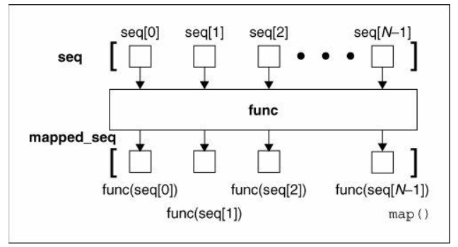

Python函数式编程<br />这里对 Python 中的函数式编程技术进行简单的入门介绍。<br />
<a name="LoEYE"></a>
## 头等函数
在 Python 中，函数是「头等公民」（first-class）。也就是说，函数与其他数据类型（如 int）处于平等地位。<br />因而，可以将函数赋值给变量，也可以将其作为参数传入其他函数，将它们存储在其他数据结构（如 dicts）中，并将它们作为其他函数的返回值。
<a name="bikD7"></a>
### 把函数作为对象
由于其他数据类型（如 string、list 和 int）都是对象，那么函数也是 Python 中的对象。来看示例函数 foo，它将自己的名称打印出来：
```python
def foo():
   print("foo")
```
由于函数是对象，因此可以将函数 foo 赋值给任意变量，然后调用该变量。例如，可以将函数赋值给变量 bar：
```python
bar = foo
bar()
#will print "foo" to the console
```
语句 `bar = foo` 将函数 foo 引用的对象赋值给变量 bar。
<a name="pP4mN"></a>
### 把对象作为函数
当对象可调用时（callable），它们与函数一样，如 `object()`。这是通过 `__call__` 方法实现的。<br />示例如下：
```python
class Greeter:
   def __init__(self, greeting):
      self.greeting = greeting
   def __call__(self, name):
      return self.greeting + " " + name
```
每一次配置 Greeter 类的对象时，都会创建一个新的对象，即打招呼时可以喊的新名字。如下所示：
```python
morning = Greeter("good morning") #creates the callable object
morning("john") # calling the object
#prints "good morning john" to the console
```
可以调用 morning 对象的原因在于，已经在类定义中使用了 `__call__` 方法。为了检查对象是否可调用，使用内置函数 callable：
```python
callable(morning) #true
callable(145) #false. int is not callable. 
```
<a name="gE2Tl"></a>
### 数据结构内的函数
函数和其他对象一样，可以存储在数据结构内部。例如，可以创建 int to func 的字典。当 int 是待执行步骤的简写时，这就会派上用场。
```python
# store in dictionary
mapping = {
   0 : foo,
   1 : bar
}
x = input() #get integer value from user
mapping[x]() #call the func returned by dictionary access
```
类似地，函数也可以存储在多种其他数据结构中。
<a name="w6jZk"></a>
### 把函数作为参数和返回值
函数还可以作为其他函数的参数和返回值。接受函数作为输入或返回函数的函数叫做高阶函数，它是函数式编程的重要组成部分。<br />高阶函数具备强大的能力。就像《Eloquent JavaScript》中解释的那样：
> 「高阶函数允许我们对动作执行抽象，而不只是抽象数值。」

来看一个例子。假设想对一个项目列表（list of items）执行迭代，并将其顺序打印出来。可以轻松构建一个 iterate 函数：
```python
def iterate(list_of_items):
    for item in list_of_items:
        print(item)
```
看起来很酷吧，但这只不过是一级抽象而已。如果想在对列表执行迭代时进行打印以外的其他操作要怎么做呢？<br />这就是高阶函数存在的意义。可以创建函数 iterate_custom，待执行迭代的列表和要对每个项应用的函数都是 iterate_custom 函数的输入：
```python
def iterate_custom(list_of_items, custom_func):
   for item in list_of_items:
        custom_func(item)
```
这看起来微不足道，但其实非常强大。<br />已经把抽象的级别提高了一层，使代码具备更强的可重用性。现在，不仅可以在打印列表时调用该函数，还可以对涉及序列迭代的列表执行任意操作。<br />函数还能被返回，从而使事情变得更加简单。就像在 dict 中存储函数一样，还可以将函数作为控制语句，来决定适合的函数。例如：
```python
def add(x, y):
    return x + y
def sub(x, y):
    return x - y
def mult(x, y):
    return x * y
def calculator(opcode):
    if opcode == 1:
       return add
    elif opcode == 2:
       return sub
    else:
       return mult 
my_calc = calculator(2) #my calc is a subtractor
my_calc(5, 4) #returns 5 - 4 = 1 
my_calc = calculator(9) #my calc is now a multiplier
my_calc(5, 4) #returns 5 x 4 = 20. 
```
<a name="YW7fs"></a>
### 嵌套函数
函数还可以在其他函数内部，这就是「内部函数」。内部函数在创建辅助函数时非常有用，辅助函数即作为子模块来支持主函数的小型可重用函数。<br />在问题需要特定函数定义（参数类型或顺序）时，可以使用辅助函数。这种不遵循传统做法的操作使得解决问题变得更加简单，示例参见：[http://www-inst.eecs.berkeley.edu/~cs61a/sp12/lectures/lect4-2x3.pdf](http://www-inst.eecs.berkeley.edu/~cs61a/sp12/lectures/lect4-2x3.pdf)。<br />假设想定义一个斐波那契函数 fib(n)，该函数只有一个参数 n，必须返回第 n 个斐波那契数。<br />定义此类函数的一种可行方式是：使用辅助函数来追踪斐波那契数列的前两个项（因为斐波那契数是前两个数之和）。
```python
def fib(n):
    def fib_helper(fk1, fk, k):
        if n == k:
           return fk
        else:
           return fib_helper(fk, fk1+fk, k+1)
    if n <= 1:
       return n
    else:
       return fib_helper(0, 1, 1)
```
将该计算从函数主体移到函数参数，这具备非常强大的力量。因为它减少了递归方法中可能出现的冗余计算。
<a name="yOgiQ"></a>
## 单表达式函数（Lambda 表达式）
如果想在未给函数命名之前写一个函数要怎么做？如果想写一个简短的单行函数（如上述示例中的函数 foo 或 mult）要怎么做？<br />可以在 Python 中使用 lambda 关键字来定义此类函数。示例如下：
```python
mult = lambda x, y: x * y
mult(1, 2) #returns 2
```
该 mult 函数的行为与使用传统 def 关键字定义函数的行为相同。<br />注意：lambda 函数必须为单行，且不能包含程序员写的返回语句。<br />事实上，它们通常具备隐式的返回语句（在上面的示例中，函数想表达 `return x * y`，不过省略了 lambda 函数中的显式返回语句）。<br />lambda 函数更加强大和精准，因为还可以构建匿名函数（即没有名称的函数）：
```python
(lambda x, y: x * y)(9, 10) #returns 90
```
当只需要一次性使用某函数时，这种方法非常方便。例如，当想填充字典时：
```python
import collections
pre_fill = collections.defaultdict(lambda: (0, 0))
#all dictionary keys and values are set to 0
```
接下来看 Map、Filter 和 Reduce，以更多地了解 lambda。
<a name="JkIsm"></a>
## Map、Filter 和 Reduce
<a name="xRGLt"></a>
### Map
map 函数基于指定过程（函数）将输入集转换为另一个集合。这类似于上文提到的 iterate_custom 函数。例如：
```python
def multiply_by_four(x):
    return x * 4
scores = [3, 6, 8, 3, 5, 7]
modified_scores = list(map(multiply_by_four, scores))
#modified scores is now [12, 24, 32, 12, 20, 28]
```
在 Python 3 中，map 函数返回的 map 对象可被类型转换为 list，以方便使用。现在，无需显式地定义 multiply_by_four 函数，而是定义 lambda 表达式：
```python
modified_scores = list(map(lambda x: 4 * x, scores))
```
当想对集合内的所有值执行某项操作时，map 函数很有用。
<a name="urcqR"></a>
### Filter
就像名称所显示的那样，filter 函数可以帮助筛除不想要的项。例如，想要去除 scores 中的奇数，那么可以使用 filter：
```python
even_scores = list(filter(lambda x: True if (x % 2 == 0) else False, scores))
#even_scores = [6, 8]
```
由于提供给 filter 的函数是逐个决定是否接受每一个项的，因此该函数必须返回 bool 值，且该函数必须是一元函数（即只使用一个输入参数）。
<a name="C9J9R"></a>
### Reduce
reduce 函数用于「总结」或「概述」数据集。例如，如果想要计算所有分数的总和，就可以使用 reduce：
```python
sum_scores = reduce((lambda x, y: x + y), scores)
#sum_scores = 32
```
这要比写循环语句简单多了。注意：提供给 reduce 的函数需要两个参数：一个表示正在接受检查的项，另一个表示所用运算的累积结果。
