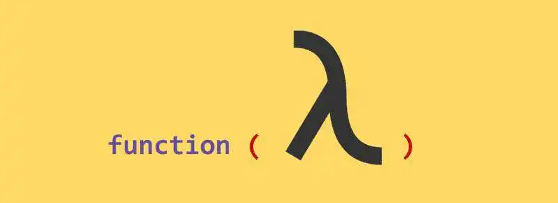

Python函数式编程 

## 什么是函数？
这个问题只要稍微有点编程基础的人都能告诉你是函数是啥。但把它用专业的术语表示出来，估计还是有点难度的。  来看下专业的描述，看看是否能看懂？ 函数是Python内建支持的一种封装，通过把大段代码拆成函数，通过一层一层的函数调用，就可以把复杂任务分解成简单的任务，这种分解可以称之为「**面向过程**」的程序设计。 **「函数就是面向过程的程序设计的基本单元。」** Tips： 面向过程: 就是分析出解决问题所需要的步骤，然后用函数把这些步骤一步一步实现，使用的时候一个一个依次调用就可以了。 面向对象：是把构成问题事务分解成各个对象，建立对象的目的不是为了完成一个步骤，而是为了描述某个事物在整个解决问题的步骤中的行为。

## 什么是函数式编程?
函数式编程 —— Functional Programming，虽然也可以归结到**「面向过程」**的程序设计，但其思想更接近数学计算。 我们首先需要搞明白计算机Computer和计算Compute的概念。 在计算机的层次上，CPU执行的是加减乘除的指令代码，以及各种条件判断和跳转指令，所以，**「汇编语言」**是最贴近计算机的语言。  而计算则指数学意义上的计算，越是抽象的计算，离计算机硬件越远。 对应到编程语言，就是**「越低级的语言，越贴近计算机，抽象程度低，执行效率高，比如C语言；越高级的语言，越贴近计算，抽象程度高，执行效率低，比如Lisp语言」**。 

### 无参函数
函数式编程就是一种抽象程度很高的编程范式，纯粹的函数式编程语言编写的函数没有变量，因此，任意一个函数，只要输入是确定的，输出就是确定的，这种纯函数我们称之为没有副作用。

### 有参函数
允许使用变量的程序设计语言，由于函数内部的变量状态不确定，同**「样的输入，可能得到不同的输出」**，因此，这种函数是有副作用的。 函数副作用指当调用函数时，除了返回可能的函数值之外，还对主调用函数产生附加的影响。例如修改全局变量（函数外的变量），修改参数，向主调方的终端、管道输出字符或改变外部存储信息等。 函数式编程的一个特点就是，**「允许把函数本身作为参数传入另一个函数，还允许返回一个函数！」**

## Python是不是纯函数式编程语言呢？
Python对函数式编程提供部分支持。由于**「Python允许使用变量」**，因此，Python不是纯函数式编程语言。 函数式编程中，所有的代码都是以函数作为载体，哪怕是变量。 
