Python
<a name="WVxS8"></a>
## 1、基础函数
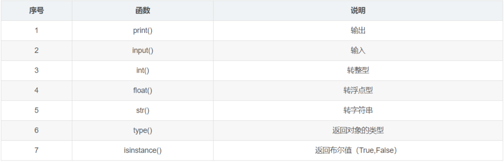<br />案例：将浮点型数值转换为字符串，输出转换后的数据类型
```python
f = 30.5
ff = str(f)
print(type(ff))

#输出结果为 class 'str'
```
<a name="yg6nN"></a>
## 2、流程控制
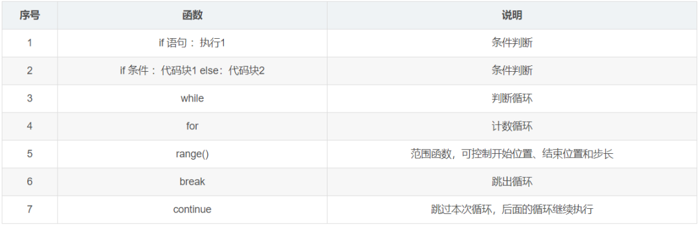<br />案例：根据用户输入的分数判断成绩，低于50分时提示“你的分数低于50分”，5059分时提示“你的分数在60分左右”，大于等于60分为及格，8090分为优秀，大于90分为非常优秀。
```python
s = int(input("请输入分数:"))
if 80 >= s >= 60:
    print("及格")
elif 80 < s <= 90:
    print("优秀")
elif 90 < s <= 100:
    print("非常优秀")
else:
    print("不及格")
    if s > 50:
        print("你的分数在60分左右")
    else:
        print("你的分数低于50分")
```
<a name="MBAFT"></a>
## 3、列表
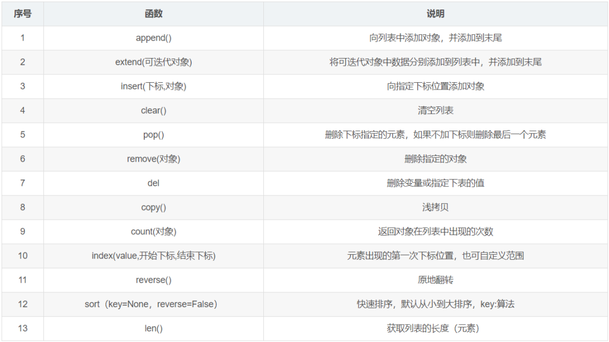<br />案例：判断6这个数在列表[1,2,2,3,6,4,5,6,8,9,78,564,456]中的位置，并输出其下标。
```python
l = [1,2,2,3,6,4,5,6,8,9,78,564,456]
n = l.index(6, 0, 9)
print(n)

#输出结果为  4
```
<a name="DefEP"></a>
## 4、元组
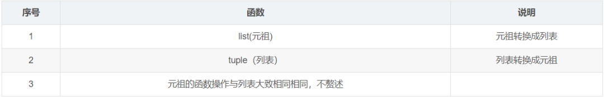<br />案例：修改元组
```python
#取元组下标在1~4之间的3个数，转换成列表
t = (1,2,3,4,5)
print(t[1:4])
l = list(t)
print(l)
#在列表下标为2的位置插入1个6
l[2]=6
print(l)
#讲修改后的列表转换成元组并输出
t=tuple(l)
print(t)

#运行结果为：

(2, 3, 4)
[1, 2, 3, 4, 5]
[1, 2, 6, 4, 5]
(1, 2, 6, 4, 5)
```
<a name="nAw47"></a>
## 5、字符串
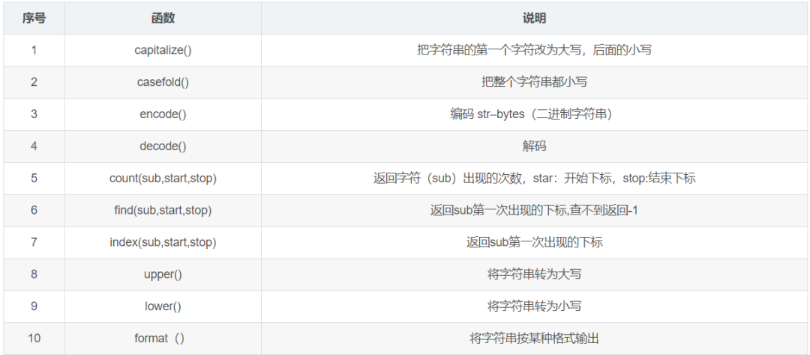<br />案例：用`format()`的三种方式输出字符串<br />方式1：用数字占位（下标）
```python
"{0} 嘿嘿".format("Python")
a=100
s = "{0}{1}{2} 嘿嘿"
s2 = s.format(a,"JAVA","C++")
print(s2)

#运行结果为：100JAVAC++ 嘿嘿
```
方式2：用{} 占位
```python
a=100
s = "{}{}{} 嘿嘿"
s2 = s.format(a,"JAVA","C++","C# ")
print(s2)

#运行结果为：100JAVAC++ 嘿嘿
```
方式3：用字母占位
```python
s = "{a}{b}{c} 嘿嘿"
s2 = s.format(b="JAVA",a="C++",c="C# ")
print(s2)

#运行结果为：C++JAVAC#  嘿嘿
```
<a name="FcGEh"></a>
## 6、字典
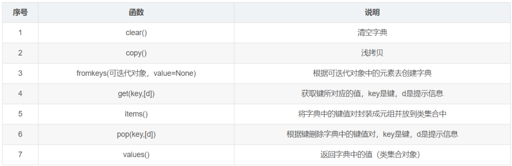<br />案例：在字典中查找数据
```python
d = {"name": "小黑"}
print(d.get("name2", "没有查到"))
print(d.get("name"))

#运行结果为：
没有查到
小黑
```
<a name="Uw4qx"></a>
## 7、函数
函数这块重头戏更多的是自定义函数，常用的内置函数不是很多，主要有以下几个：<br />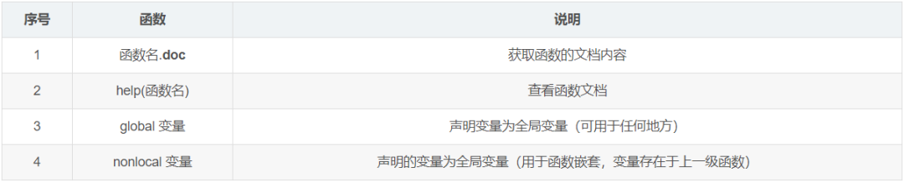<br />案例：在函数中定义一个局部变量，跳出函数仍能调用该变量
```python
def fun1():
    global b
    b=100
    print(b)
fun1()
print(b)

#运行结果为：
100
100
```
<a name="BwGGV"></a>
## 8、进程和线程
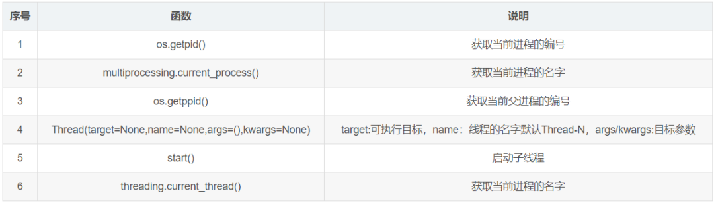<br />案例：继承Thread类实现
```python
#多线程的创建
class MyThread(threading.Thread):
    def __init__(self,name):
        super().__init__()
        self.name = name
    def run(self):
        #线程要做的事情
        for i in range(5):
            print(self.name)
            time.sleep(0.2)
 #实例化子线程
t1 = MyThread("凉凉")
t2 = MyThread("最亲的人")

t1.start()
t2.start()
```
<a name="O9uyg"></a>
## 9、模块与包
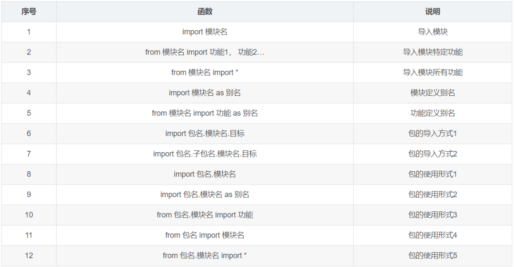<br />案例：包的使用方式4
```python
from my_package1 import my_module3
print(my_module3.a)
my_module3.fun4()
```
<a name="MFora"></a>
## 10、文件操作
（1）常规文件操作<br />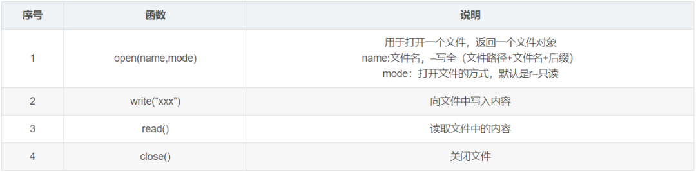<br />关于文件操作的常规模式：<br />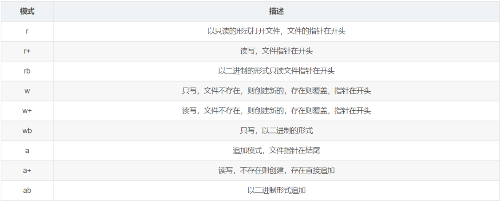<br />file的对象属性<br />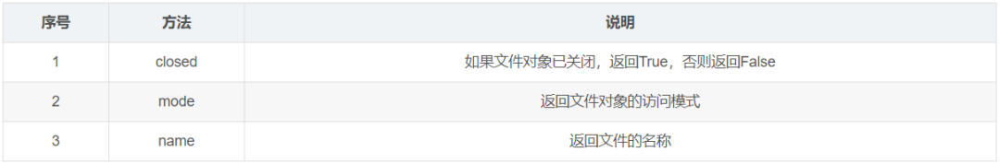<br />file对象的方法<br />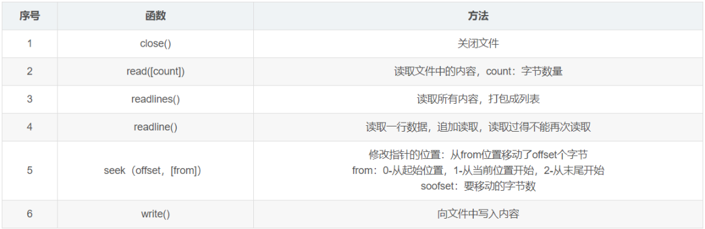<br />（2）OS模块

- 关于文件的功能

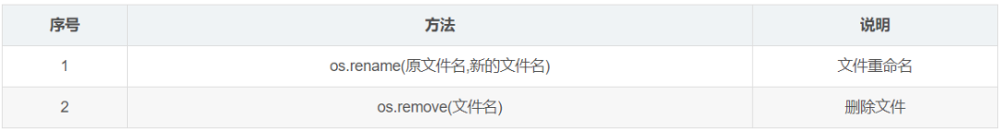

- 关于文件夹的功能

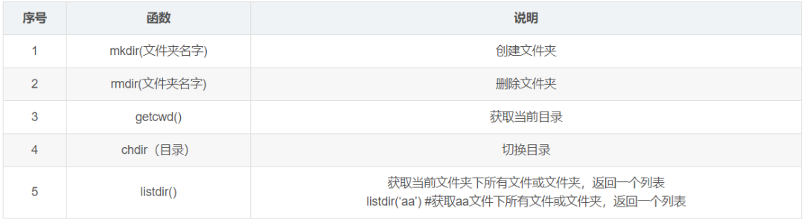
<a name="vHyog"></a>
## 11、修饰器/装饰器
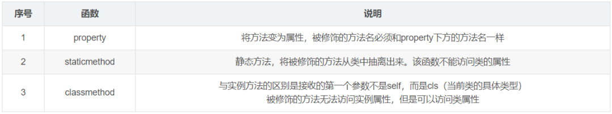<br />案例：classmethod的用法举例
```python
class B:
    age = 10
    def __init__(self,name):
        self.name = name
    @classmethod
    def eat(cls): #普通函数
        print(cls.age)

    def sleep(self):
        print(self)

b = B("小贱人")
b.eat()

#运行结果为:10
```
<a name="kkbIv"></a>
## 12、正则
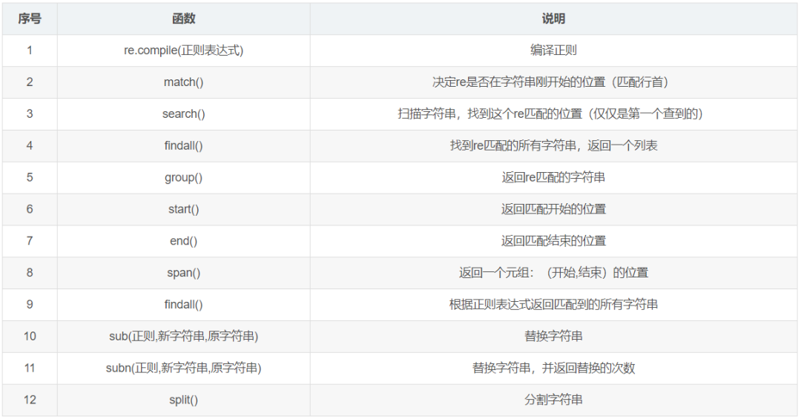<br />案例：用`split()`函数分割一个字符串并转换成列表
```python
import re
s = "abcabcacc"
l = re.split("b",s)
print(l)

#运行结果为：['a', 'ca', 'cacc']
```
