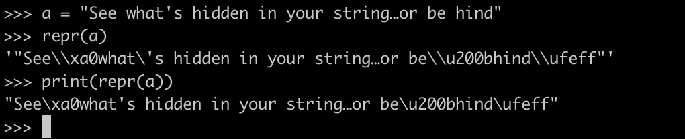

Python 字符串<br />在整个 Unicode 字符集里面，不可见的字符还有很多。比如下面这句话：
```python
See what's hidden in your string… or behind 
```
如果在 Python 里面，使用repr函数显示这个字符串真正的样子，那么可以看到里面实际上有哪些字符：<br /><br />那么，现在问题来了。如果给你一个字符串，如何把里面所有的不可见字符全部移除呢？<br />由于不知道里面有哪些不可见字符，所以显然不可能通过穷举的方法一个一个移除。那么，应该怎么把他们全部移除呢？<br />这个时候，可以使用字符串的`.isprintable()`方法。对于可见字符，这个方法返回 `True`，对于不可见字符，它返回`False`。例如：<br /><br />于是，对于上面的字符串，可以通过这个方法，移除所有不可见字符，如下图所示：<br />
