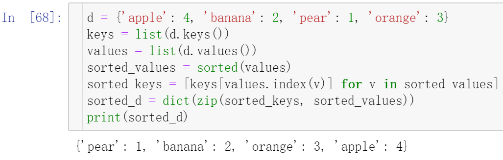

Python<br />分别介绍5种Python字典“键”和“值”的排序方法。
<a name="YHUDU"></a>
## 使用 `sorted()` 函数
使用 `sorted()` 函数对字典进行排序，将其转换为元组列表，再按照指定的键或者值进行排序。
<a name="RWOkF"></a>
### 按照键排序的示例代码
```python
d = {'apple': 4, 'banana': 2, 'pear': 1, 'orange': 3}
sorted_d = dict(sorted(d.items(), key=lambda x: x[0]))
print(sorted_d)
```
结果如下：
<a name="Q9i99"></a>
### 按照值排序的示例代码
```python
d = {'apple': 4, 'banana': 2, 'pear': 1, 'orange': 3}
sorted_d = dict(sorted(d.items(), key=lambda x: x[1]))
print(sorted_d)
```
结果如下：
<a name="pXe9O"></a>
## 使用 `itemgetter()` 函数
可以使用 operator 模块的 `itemgetter()` 函数对字典进行排序，将其转换为元组列表，然后按照指定的键或者值进行排序。
<a name="FU2i7"></a>
### 按照键排序的示例代码
```python
from operator import itemgetter
d = {'apple': 4, 'banana': 2, 'pear': 1, 'orange': 3}
sorted_d = dict(sorted(d.items(), key=itemgetter(0)))
print(sorted_d)
```
结果如下：
<a name="vYIiX"></a>
### 按照值排序的示例代码
```python
from operator import itemgetter
d = {'apple': 4, 'banana': 2, 'pear': 1, 'orange': 3}
sorted_d = dict(sorted(d.items(), key=itemgetter(1)))
print(sorted_d)
```
结果如下：
<a name="leQ7r"></a>
## 使用 `OrderedDict` 类
可以使用 collections 模块的 `OrderedDict` 类对字典进行排序。`OrderedDict` 是一个有序的字典，它保留了元素插入的顺序。
<a name="dllBT"></a>
### 按照键排序的示例代码
```python
from collections import OrderedDict
d = {'apple': 4, 'banana': 2, 'pear': 1, 'orange': 3}
sorted_d = OrderedDict(sorted(d.items(), key=lambda x: x[0]))
print(sorted_d)
```
结果如下：
<a name="O4MQZ"></a>
### 按照值排序的示例代码
```python
from collections import OrderedDict
d = {'apple': 4, 'banana': 2, 'pear': 1, 'orange': 3}
sorted_d = OrderedDict(sorted(d.items(), key=lambda x: x[1]))
print(sorted_d)
```
结果如下：
<a name="j8vsT"></a>
## 使用 `zip()` 函数
可以使用 `zip()` 函数将字典的键和值分别转换为列表，然后按照指定的键或者值进行排序，最后将排序后的键和值重新组成字典。
<a name="UozLS"></a>
### 按照键排序的示例代码
```python
d = {'apple': 4, 'banana': 2, 'pear': 1, 'orange': 3}
keys = list(d.keys())
values = list(d.values())
sorted_keys = sorted(keys)
sorted_values = [d[k] for k in sorted_keys]
sorted_d = dict(zip(sorted_keys, sorted_values))
print(sorted_d)
```
结果如下：
<a name="YrAHs"></a>
### 照值排序的示例代码
```python
d = {'apple': 4, 'banana': 2, 'pear': 1, 'orange': 3}
keys = list(d.keys())
values = list(d.values())
sorted_values = sorted(values)
sorted_keys = [keys[values.index(v)] for v in sorted_values]
sorted_d = dict(zip(sorted_keys, sorted_values))
print(sorted_d)
```
结果如下：
<a name="xpTgZ"></a>
## 使用 Pandas 库
可以使用 Pandas 库将字典转换为 DataFrame，然后按照指定的键或者值进行排序，最后将排序后的 DataFrame 转换为字典。
<a name="S7dae"></a>
### 按照键排序的示例代码
```python
import pandas as pd
d = {'apple': 4, 'banana': 2, 'pear': 1, 'orange': 3}
df = pd.DataFrame(list(d.items()), columns=['fruit', 'count'])
sorted_df = df.sort_values('fruit')
sorted_d = dict(zip(sorted_df['fruit'], sorted_df['count']))
print(sorted_d)
```
结果如下：
<a name="svBvU"></a>
### 按照值排序的示例代码
```python
import pandas as pd
d = {'apple': 4, 'banana': 2, 'pear': 1, 'orange': 3}
df = pd.DataFrame(list(d.items()), columns=['fruit', 'count'])
sorted_df = df.sort_values('count')
sorted_d = dict(zip(sorted_df['fruit'], sorted_df['count']))
print(sorted_d)
```
结果如下：
