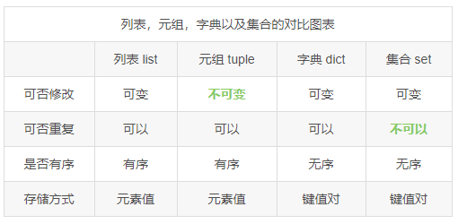
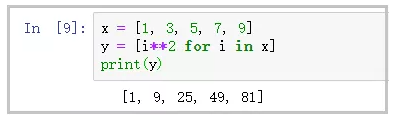
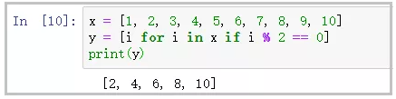
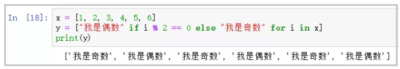
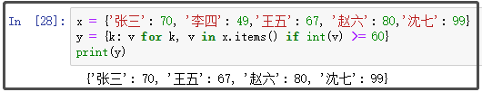
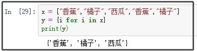

Python
<a name="Bj4zk"></a>
## 什么是推导式
推导式 comprehensions（又称解析式），是 Python 的一种独有特性。推导式是可以从一个数据序列构建另一个新的数据序列。<br />看定义很抽象，下面来看看具体的例子，通过例子来学习四种推导式。
<a name="jsDTY"></a>
### 列表推导式
先来看一个需求：<br />快速创建一个包含元素 1-9 的平方的列表<br />面对这个需求，通常的实现方式是这样的：
```python
lis = []
for i in range(1, 10):
    lis.append(i*i)
print(lis) # [1, 4, 9, 16, 25, 36, 49, 64, 81]
```
用列表推导式怎么实现呢？只需要一行代码：
```python
lis = [x * x for x in range(1, 10)]
print(list) # [1, 4, 9, 16, 25, 36, 49, 64, 81]
```
这就是推导式。可以看到列推导式的语法是这样的：<br />`变量名 = [表达式 for 变量 in 列表]`<br />再来一个复杂点的：
```python
list = [x * y for x in range(1, 10) for y in range(1, 10)]
print(lis)
# [1, 2, 3, 4, 5, 6, 7, 8, 9, 2, 4, 6, 8, 10, 12, 14, 16, 18, 3, 6, 9, 12, 15, 18, 21, 24, 27, 4, 8, 12, 16, 20, 24, 28, 32, 36, 5, 10, 15, 20, 25, 30, 35, 40, 45, 6, 12, 18, 24, 30, 36, 42, 48, 54, 7, 14, 21, 28, 35, 42, 49, 56, 63, 8, 16, 24, 32, 40, 48, 56, 64, 72, 9, 18, 27, 36, 45, 54, 63, 72, 81]
```
这个是多个变量的类型，因此可以扩展上面的语法：<br />`变量名 = [表达式 for 变量 in 列表 for 变量 in xxx]`<br />当然，还有一种带条件的列推导式，它的语法是这样的：<br />`变量名 = [表达式 for 变量 in 列表 if 条件]`<br />来看一个需求：快速创建一个包含 1-10 之间所有偶数的列表。
```python
lis = [i for i in range(1, 11) if i % 2 == 0]
print(lis) # [2, 4, 6, 8, 10]
```
<a name="cDMNA"></a>
### 字典推导式
字典推导式的形式和列表推导式类似，语法也是类似的，只不过字典推导式返回的结果是字典。<br />`变量名 = {key: value表达式}`<br />来看一个例子：
```python
dic = {x: x/2 for x in range(1,11) if x % 2 == 0}
print(dic) # {2: 1.0, 4: 2.0, 6: 3.0, 8: 4.0, 10: 5.0}
```
如果这里写成下面这种方式，返回的结果是什么呢？
```python
dic = {'half': x/2 for x in range(1,11) if x % 2 == 0}
print(dic)
```
大家可以自己尝试运行一下，看跟想的结果是不是一样的。
<a name="Oe2Jz"></a>
### 集合推导式
看了前面两个推导式，想必已经知道集合推导式怎么写了。语法如下：<br />`变量名 = {表达式 for 变量 in 列表 for 变量 in xxx}`<br />或者<br />`变量名 = {表达式 for 变量 in 列表 if 条件}`<br />来一个实际的例子：创建一个存储10个偶数的集合。
```python
set1 = {x for x in range(10) if x % 2 == 0}
print(set1) # {0, 2, 4, 6, 8}
```
<a name="bRCfW"></a>
### 元组推导式
先来看一个例子：
```python
tup=(x for x in range(1,10))
print(tup) # <generator object <genexpr> at 0x1101fade0>
```
看到这个结果打印是不是有点懵？<br />上面的代码返回的变量其实是一个生成器，并不是一个元组。其实没有真正的元组推导式，只能用一个类似的方法来生成元组，暂且叫做“伪元组推导式”。<br />上面的例子来改进一下：
```python
tup=tuple(x for x in range(1,10))
print(tup) # (1, 2, 3, 4, 5, 6, 7, 8, 9)
```
在前面加上 tuple 来显式进行类型转换就行了。
<a name="iAFUm"></a>
## 解析式
<a name="bfhNF"></a>
### 1、列表、字典、集合概念说明
在讲述这三个概念之前，首先需要对列表、字典、集合三个概念，做一个简单的说明。<br />
<a name="IIogm"></a>
### 2、列表解析式
列表推导式，在日常编程中发挥着很重要的作用(尤其是利用Python做数据清洗的时候)，它能够简化代码，极其好用，这里将它的常见3种用法给大家总结一下。<br />① 一般形式

- 语法格式：`[ expression for i in iterable ]`
```python
x = [1, 3, 5, 7, 9]
y = [i**2 for i in x]
print(y)
```
结果如下：<br />
<a name="dDLS0"></a>
#### ② 带if的列表解析式

- 语法：`[ expression for i in iterable if…]`
```python
x = [1, 2, 3, 4, 5, 6, 7, 8, 9, 10]
y = [i for i in x if i % 2 == 0]
print(y)
```
结果如下：<br />
<a name="tLGcz"></a>
#### ③ 带`if...else...`的列表解析式

- 语法：`[ expression if...else... for i in iterable]`
```python
x = [1, 2, 3, 4, 5, 6]
y = ["我是偶数" if i % 2 == 0 else "我是奇数" for i in x]
print(y)
```
结果如下：<br />
<a name="v1hp9"></a>
### 3、字典解析式
其实不管是现在要讲述的字典解析式，还是后面要讲述的集合解析式，基本都可以使用列表解析式的3中常规操作，我这里仅仅用下面这一个案例来进行说明。

- 语法：`{ expression for i in iterable }`
- 用法和列表一样，区别就是用 `{ }` 包起来，而且前面的expression是 `key:value` 的形式。

这里有一份成绩单，记录了每个学生的英语成绩，下面要筛选出英语成绩及格(大于等于60)的信息。
```python
x = {'张三': 70, '李四': 49,'王五': 67, '赵六': 80,'沈七': 99}
y = {k: v for k, v in x.items() if int(v) >= 60}
print(y)
```
结果如下：<br />
<a name="NSvTG"></a>
### 4、集合解析式
注意一个概念，集合是不可重复的，集合解析式能够自动实现去重功能。其实这里的用法和上述的字典有点相似，仔细看清楚哦。

- 语法：`{ expression for i in iterable }`
- 用法和字典类似，也是用 `{ }` 包起来，但是前面的expression不再是 `key:value` 的形式。
```python
x = ["香蕉","橘子","西瓜","香蕉","橘子"]
y = {i for i in x}
print(y)
```
结果如下：<br />

