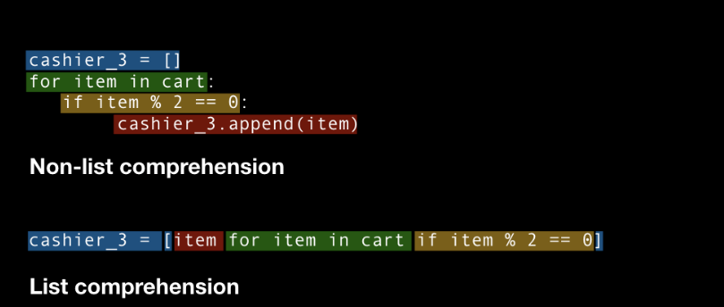

Python推导式<br />对于数据科学，Python通常被广泛地用于进行数据的处理和转换，它提供了强大的数据结构处理的函数，使数据处理更加灵活，这里说的“灵活性”是什么意思?<br />这意味着在Python中总是有多种方法来实现相同的结果，总是有不同的方法并且需要从中选择易于使用、省时并能更好控制的方法。<br />要掌握所有的这些方法是不可能的。所以这里列出了在处理任何类型的数据时应该知道的4个Python技巧。<br /><br />列表推导式List Comprehension是创建列表的一种优雅且最符合python语言的方法。与for循环和if语句相比，列表推导式在基于现有列表的值创建新列表时语法要短得多。因此，看看该特性如何获得列表的副本。
<a name="pcSRA"></a>
## 使用列表推导式复制一个列表
有时需要创建现有列表的副本。最简单的答案是`.copy()`，它允许您将一个列表的内容复制到另一个(新)列表。<br />例如，一个由整数组成的列表original_list。
```python
original_list = [10,11,20,22,30,34]
```
可以简单地使用`.copy()`方法复制此列表。
```python
duplicated_list = original_list.copy()
```
列表推导式可以得到完全相同的输出。复制列表是理解列表推导式的最佳案例。 看看下面这段代码。
```python
duplicated_list = [item for item in original_list]
```
这里并不是说复制列表使用列表推导式更好，而是说对于介绍列表推导式的工作方式，这个案例是最好的。<br />接下来，看看对列表的每个元素执行数学运算时，列表推导式如何使工作变得简单。
<a name="rCSU1"></a>
## 列表中的元素相乘
最简单或直接的乘法方法是使用乘法运算符，即*<br />例如，想用一个标量(即数字5)乘以列表中的每一项。这里肯定不能使用original_list*5，因为它将创建列表的5个副本。<br />在这个场景中，最好的答案是列表推导式，如下所示。
```python
original_list = [10,11,20,22,30,34] multiplied_list = [item*5 for item in original_list] # Output [50, 55, 100, 110, 150, 170]
```
这里的操作并不局限乘以一个数字。可以对原始列表的每个元素执行复杂的操作。 例如，假设想计算每一项的平方根的立方，可以在一行中解决它。
```python
multiplied_list = [math.sqrt(item)**3 for item in original_list] # Output [31.6227766016838,  36.4828726939094,  89.4427190999916,  103.18914671611546,  164.31676725154983,  198.25236442474025]
```
用于计算数字平方根的函数sqrt属于库math，因此在本例中需要在使用它之前导入它。 与上面所示的内置函数类似，还可以在列表的每个元素上使用用户定义的函数。 例如如下所示的简单函数。
```python
def simple_function(item):
    item1 = item*10
    item2 = item*11
    return math.sqrt(item1**2 + item2**2)
```
可以对列表的每一项应用这个用户定义的函数。
```python
multiplied_list = [simple_function(item) for item in original_list]

# Output
[148.66068747318505,
 163.52675622050356,
 297.3213749463701,
 327.0535124410071,
 445.9820624195552,
 505.4463374088292]
```
列表推导式在实际场景中甚至更有用。通常在分析任务中需要从列表中删除某种类型的元素，例如消0护着nan元素。列表推导式是完成这些任务的完美工具。
<a name="Kz3WP"></a>
## 删除列表中的元素
根据特定条件筛选数据是选择所需数据集的常见任务之一，同样的逻辑也用于列表推导式中。<br />假设有下面提到的数字列表。
```python
original_list = [10, 22, -43, 0, 34, -11, -12, -0.1, 1]
```
想要从这个列表中只保留正值。因此，从逻辑上讲，您希望只保留那些对条件项> 0求值为TRUE的项。
```python
new_list = [item for item in original_list if item > 0]  # Output [10, 22, 34, 1]
```
if子句用来删除负值。可以使用if子句应用任何条件来从列表中删除任何项。<br />例如，当想删除所有平方小于200的项时需要做的就是在列表综合中提到条件项**2 > 200，如下所示。
```python
new_list = [item for item in original_list if item**2 > 200]

# Output
[22, -43, 34]
```
在处理真实的数据集时，过滤列表项的条件可能要复杂得多，这种方法既快又易于理解。
<a name="QyigI"></a>
## 使用`dict()`将两个列表转换为字典键值对
有时需要从两个列表中的值创建字典。可以使用字典推导式(dictionary comprehension) ，而不是一个一个地输入，这是创建字典的一种优雅而简洁的方法! 它的工作原理与列表推导式完全相似，唯一的区别是——创建一个列表推导式时，将所有内容都包含在方括号中，例如`[]`，而在字典推导式中，将所有内容都包含在花括号中，例如`{}`。<br />假设有两个列表—字段和详细信息—如下所示。
```python
fields = [‘name’, ‘country’, ‘age’, ‘gender’]
details = [‘pablo’, ‘Mexico’, 30, ‘Male’]
```
一个简单的方法是使用像这样的字典推导式：
```python
new_dict = {key: value for key, value in zip(fields, details)}
 
 # Output
 {'name': 'pablo', 'country': 'Mexico', 'age': 30, 'gender': 'Male'}
```
这里需要理解的重要是函数zip是如何工作的。<br />在Python中，`zip`函数接受可迭代对象，如字符串、列表或字典作为输入，返回它们聚合为元组。<br />因此，在本例中zip已经从列表fields和details中形成了每个项的对。当字典推导式中使用key: value时，只需将此元组解包为单独的键-值对。<br />当使用Python中内置的`dict()`构造函数(用于创建字典)时，这个过程甚至会变得更快，因为`dict()`比字典推导式至少快1.3倍!<br />所以需要将此构造函数与`zip()`函数一起使用，它的语法要简单得多——`dict(zip(fields，details))`。
<a name="dbkf9"></a>
## 总结
正如一开始提到的，Python非常灵活，因为有多种方法可以实现相同的结果。根据任务的复杂程度需要选择最好的方法来实现它。
