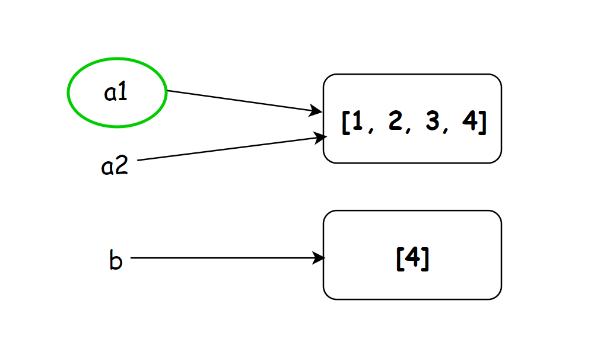

Python 可变类型 不可变类型 Python中

- 不可变类型：数字，字符串，元组
- 可变类型：列表，字典

### 不可变类型运算举例

#### 1.不可变+=

#### 2.不可变=+
 不可变类型在进行+=和=+之后结果是一样的。

### 可变类型运算举例

#### 1. 可变+=
 可变类型+=情况

#### 2. 可变= +
 可变类型a=a+b情况 通过上图对比发现可变类型的变量在进行a += b和a = a + b时结果是不一样的。在进行+=操作时，a1和a2值同时改变，但是在进行先加后赋值时a1和a2不能同时改变。

### 原理__add__和 __iadd__ 的区别

- __add__ 方法接收两个参数，返回它们的和，两个参数的值均不变。
- __iadd__ 方法接收两个参数，第一个参数的值改变

可变类型使用加号操作（即a=a+b），调用__add__会返回一个新的对象，原来的对象不变。 示意图如下：  a1 = a1 + b 后a1会指向新的结果，但是a2指向不变  可变类型使用+=操作（即a+=b），调用__iadd__方法，第一个参数的值改变，即a1指向的本身内容发生改变，指向位置不发生改变。  示意图如下：  ta1 += b后a1指向的内容发生改变，指向的位置不发生改变，所以a2的内容也会跟着a1一起改变 
