Python
<a name="n7bta"></a>
## 字符串的3种创建方式
<a name="bkE23"></a>
#### ① 单引号(`''`)，创建字符串
```python
a = 'I am a student'
print(a)
```
结果如下：<br />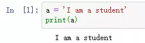
<a name="WJFd8"></a>
#### ② 双引号(`""`)，创建字符串
```python
b = "I am a teacher"
print(b)
```
结果如下：<br />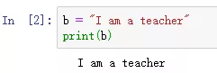
<a name="hL7Nu"></a>
#### ③ 连续3个单引号或者3个单引号，创建多行字符串
```python
c = '''
I am a student
My name is黄伟
I am a teacher
My name is陈丽
'''
print(c)
```
结果如下：<br />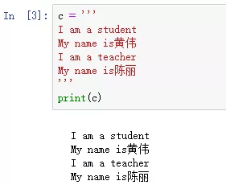
<a name="86Gi2"></a>
## 列表的5种创建方式
<a name="B2bWF"></a>
#### ① 用`[]`创建列表
```python
a = [1,2,3]
print(a)
```
结果如下：<br />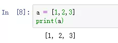
<a name="xOZN6"></a>
#### ② 用`list`创建列表
```python
b = list('abc')
print(b)
c = list((1,2,3))
print(c)
d = list({"aa":1,"bb":3}) #对于字典，生成的是key列表。
print(d)
```
结果如下：<br />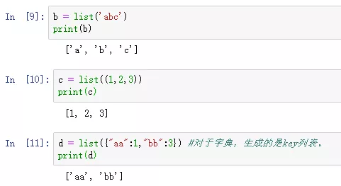
<a name="SWnjx"></a>
#### ③ 用`range`创建整数列表
```python
e = list(range(10))
print(e)
```
结果如下：<br />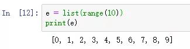
<a name="ijE5s"></a>
#### ④ 用列表推导式创建列表
```python
f = [i for i in range(5)]
print(f)
```
结果如下：<br />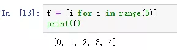
<a name="4xF13"></a>
#### ⑤ 用`list`和`[]`创建空列表
```python
g = list()
print(g)
h = []
print(h)
```
结果如下：<br />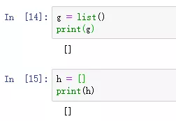
<a name="yxSGx"></a>
## 字典的5种创建方式
<a name="1t1T2"></a>
#### ① 用`{}`创建字典
```python
a = {'name':'陈丽','age':18,'job':'teacher'}
print(a)
b = {'name':'陈丽','age':18,'job':['teacher','wife']}
print(b)
```
结果如下：<br />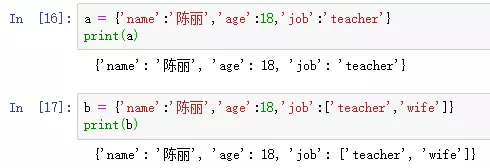
<a name="Z54uo"></a>
#### ② 用`dict`创建字典
```python
c = dict(name='张伟',age=19)
print(c)
d = dict([('name','李丽'),('age',18)])
print(d)
```
结果如下：<br />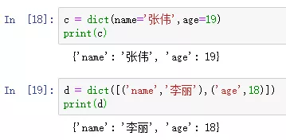
<a name="uJeL1"></a>
#### ③ 用`zip`函数创建字典
```python
x = ['name','age','job']
y = ['陈丽','18','teacher']
e = dict(zip(x,y))
print(e)
```
结果如下：<br />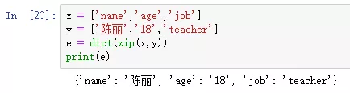
<a name="3scxa"></a>
#### ④ 用`{}`,`dict`创建空字典
```python
f = {}
print(f)
g = dict()
print(g)
```
结果如下：<br />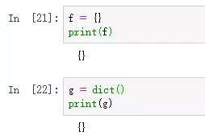
<a name="v2UDZ"></a>
#### ⑤ 用`fromkeys`创建'值为空'的字典
```python
h =dict.fromkeys(['name','age','job'])
print(h)
```
结果如下：<br />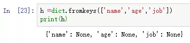
