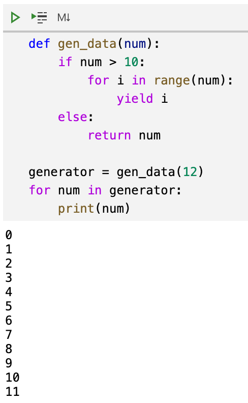
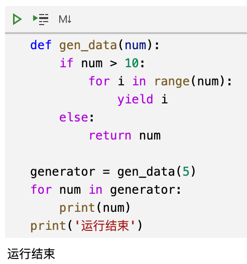
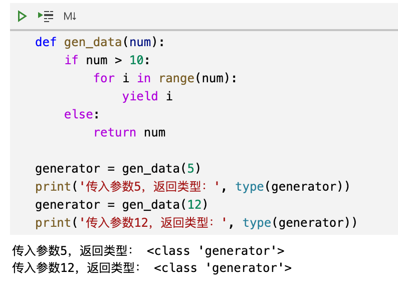
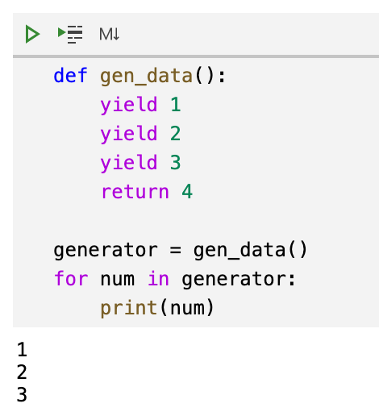
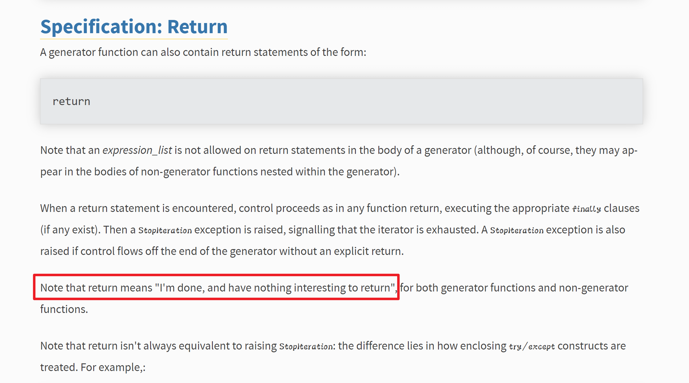

Python 生成器
```python
def gen_data(num):
    if num > 10:
        for i in range(num):
            yield i
    else:
        return num

generator = gen_data(5)
for num in generator:
    print(num)
```
当传入的的参数小于等于10 的时候，为什么没有返回这个参数本身？<br />当传入的参数大于10的时候，能得到符合预期的结果，如下图所示：<br /><br />但是，当传入数据5的时候，来看看运行效果：<br /><br />可以看到，数字5并没有被打印出来，程序直接运行到了最后。<br />之所以会出现这种情况，因为`gen_data`里面有`yield`，所以`gen_data(参数)`返回一个生成器。无论参数传入的是什么，返回的都是生成器。如下图所示：<br /><br />为了说明为什么传入参数为5的时候，for 循环不执行，简化一下代码：
```python
def gen_data():
    yield 1
    yield 2
    yield 3
    return 4

generator = gen_data()
for num in generator:
    print(num)
```
运行效果如下图所示：<br /><br />可以看到，对于这样一个非常简单的生成器，在 for 循环里面也只是打印了数字123，并没有打印数字4。<br />关于生成器中的`return`，可以从 Python 官方文档[PEP 255 — Simple Generators](https://www.python.org/dev/peps/pep-0255/#specification-return)中找到说明：<br /><br />`return` 在生成器中，表示生成器运行完成了，可以结束了。然后生成器会抛出一个`StopIteration`的异常。而`for`循环能够检测到这个异常，于是结束循环。所以当传入的参数为5的时候，生成器直接运行到了 `return`，于是它直接就抛出`StopIteration`，于是 for 循环检测到这个异常就结束了。<br />在生成器里面的`return`只是一个结束标志，它不会把后面写的值返回给调用者。这跟函数里面的`return`语句是不一样的。
