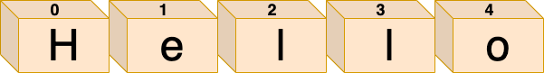
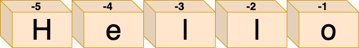

Python<br />在Python中，像字符串或列表这样的有序序列的元素可以通过它们的索引单独访问。这可以通过提供从序列中提取的元素的数字索引来实现。另外，Python支持切片，这是一个特性，可以提取原始`sequence`对象的子集。<br />在本文中，将探讨索引和切片是如何工作的，以及如何使用它们来编写更干净、更具python风格的代码。
<a name="BTx9s"></a>
### 索引
与大多数编程语言一样，Python偏移量从位置0开始，在位置N-1结束，其中N被定义为序列的总长度。例如，字符串Hello的总长度等于5，每个字符都可以通过索引0到4进行访问，如下图所示：<br /><br />现在，可以通过编程方式访问字符串中的各个字符，方法是提供要获取的相应偏移量（用方括号括起来）：
```python
>>> my_string = 'Hello'
>>> print(my_string[0])
'H'
>>> print(my_string[2])
'l'
>>> print(my_string[3])
'l'
```
同样重要的是要知道，当你尝试访问大于序列长度（减1）的偏移量时，Python将抛出一个IndexError，通知你请求的偏移量超出范围：
```python
>>> my_string[5]
Traceback (most recent call last):
  File "<input>", line 1, in <module>
IndexError: string index out of range
```
还可以通过提供一个负索引来访问元素，该索引基本上对应于从序列右侧开始的索引。最后一项可以通过-1访问，倒数第二项可以通过-2访问，依此类推<br /><br />从技术上讲，当使用负偏移量时，Python会将该偏移量添加到序列的长度中，以便推断准确的位置。例如，假设要使用负偏移量从字符串`my_string = 'Hello'`中提取字符e。现在表达式`my_string[-4]`基本上将被翻译成
```python
my_string[len(my_string) - 4]，它相当于my_string[5 - 4]和my_string[1]，最终为我们提供所需的输出：
>>> my_string[-4]
'e'
```
<a name="kusPi"></a>
### 切片
切片是一种索引形式，它允许推断原始序列的整个（子）部分，而不仅仅是单个项。<br />要在Python中对序列执行切片，需要提供两个由冒号分隔的偏移量，尽管在某些情况下可以只定义其中一个，甚至不定义（下面将讨论更多关于这些情况的内容）。<br />第一个偏移量表示起点并包含在内，而第二个偏移量表示终点，但与起点偏移量不同，它不包含在内。
```python
my_string[start:end]
```
因此，在执行切片时，Python将返回一个新对象，其中包含从下索引开始到上索引少一个位置的所有元素。作为一个例子，考虑一个用例，其中需要获取字符串的前两个元素：
```python
>>> my_string[0:2]
'He'
```

---

正如已经提到的，2个位置都提供并不是强制性的。如果忽略起始偏移量，则其值将默认为0。另一方面，如果不提供结束偏移量，则其默认值将等于序列的长度。实际上有三种不同的情况，如下所示：
```python
my_string[0:]   # 忽略终点
my_string[:-1]  # 忽略起点
my_string[:]    # 都忽略
```
<a name="agVPP"></a>
#### 忽略终点偏移
当想切掉前导文本时，第一个符号通常很有用。假设想要得到字符串的第一个字符以外的所有字符。可以使用以下符号
```python
>>> my_string = 'Hello'
>>> my_string[1:]
'ello'
```
正如已经提到的，当结束偏移量被忽略时，默认是序列的长度：
```python
>>> my_string[1:] == my_string[1:len(my_string)]
True
```
<a name="zlgh2"></a>
#### 忽略起始偏移
假设现在只需要字符串的第一个字符。在这种情况下，忽略起始偏移量将起到以下作用：
```python
>>> my_string = 'Hello'
>>> my_string[:-1]
'Hell'
```
如果跳过下限，则其值将默认为0：
```python
>>> my_string[:-1] == my_string[0:-1]
True
```
<a name="FRgvp"></a>
#### 忽略两个偏移
Python中的切片表示法允许省略起始偏移和结束偏移。
```python
>>> my_string = 'Hello'
>>> my_string[:] == my_string[0:len(my_string)]
True
```
如果忽略下限和上限，则默认值分别为0和len（序列），这是一种快速复制对象的方法，如下所示
```python
>>> my_string = 'Hello'
>>> my_string_copy = my_string[:]
```
请注意，当此切片技术将生成一个不同的对象时，该对象将被分配到不同的内存位置。这对字符串之类的不可变对象类型没有任何区别，但是在处理列表之类的可变对象类型时，注意这一点非常重要。
<a name="bSe6E"></a>
#### 扩展切片
Python中的切片表达式附带了第三个索引，该索引是可选的，指定时用作步骤。显然，当省略step值时，它默认为1，这意味着请求的sequence子部分中的任何元素都不会被跳过。符号如下所示
```python
[start:end:step]
```
例如，假设有一个字符串，其中包含字母表中的字母，希望从位于位置1和19的字母中提取其中的所有其他项，：
```python
>>> import string
>>> my_string = string.ascii_lowercase # 'abcdefg...'
>>> my_string[1:20:1]
'bdfhjlnprt'
```
这种符号可以用来代替列表生成式。例如，假设想要得到一个列表中所有具有偶数索引的元素。实现这一点的列表生成式是
```python
>>> my_list = [100, 400, 34, 179, 0, 89, 121]
>>> [value for index, value in enumerate(my_list) if index % 2 == 0]
[100, 34, 0, 121]
```
在这种情况下，切片表示法可以使代码更简单，可读性更高：
```python
>>> my_list = [100, 400, 34, 179, 0, 89, 121]
>>> my_list[::2]
[100, 34, 0, 121]
```

---

与开始偏移和结束偏移一样，步长索引可以是负数。从技术上讲，想要反转有序序列中元素的顺序时，这是很有用的
```python
>>> my_string = 'Hello'
>>> my_string[::-1]
'olleH'
```
换句话说，当应用负步幅索引时，起始偏移和结束偏移的效果是相反的。为了弄清楚这一点，跳到另一个例子中，实际上定义了所有三个可能的偏移量。
```python
>>> import string
>>> my_string = string.ascii_lowercase # 'abcdefg...'
>>> my_string[20:10:-1]
'utsrqponml'
```
在上面的例子中，基本上按照相反的顺序从索引11到20创建一个新字符串。
<a name="hy6WY"></a>
### 结论
探讨了在Python中索引和切片是如何工作的。这两种符号在大多数Python应用程序中都被广泛使用，因此需要确保了解它们是如何工作的。
<a name="KO8Ut"></a>
#### 索引

- 第一项从偏移量0开始
- 最后一项结束于偏移长度`len(my_sequence) - 1`
- 负指数表示计数将向后开始。从本质上讲，它被添加到序列的长度中。例如，`my_string[-1]`转换为`my_string[len(my_string) - 1]`
<a name="s0yJ1"></a>
#### 切片

- 起始索引（下限）包含在内
- 结束索引（上限）不包含在内
- 当忽略起始索引时，它默认为0
- 如果省略结束索引，则默认为序列的长度
- 如果省略起始索引和结束索引，则会创建原始对象的副本-`my_string[:]`
- 第三个索引表示步幅
- 省略步幅索引时，默认为1（即不跳过任何元素）
- 负步幅索引可以创建反向序列（例如，`my_string[::-1]`）
