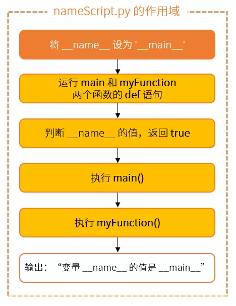
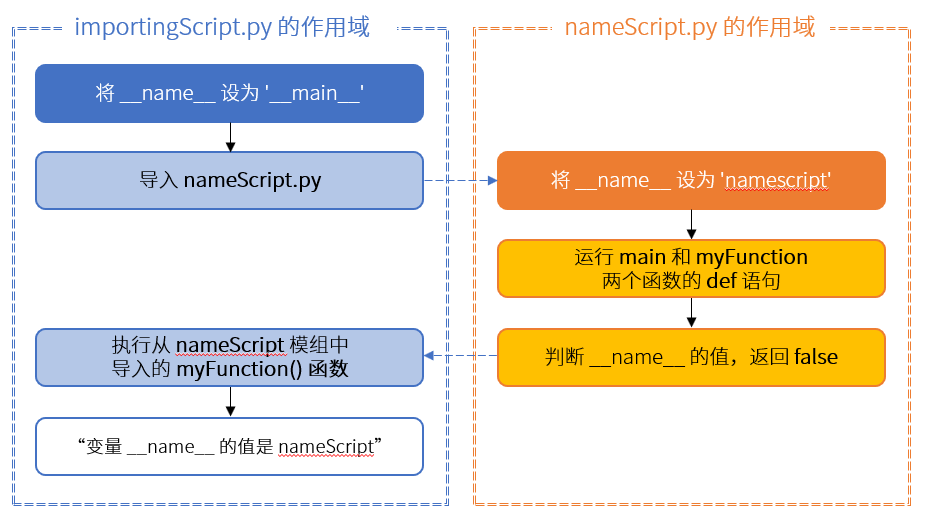

Python<br />在很多 Python 脚本里见到过 `__name__` 变量，它经常是以类似这样的方式出现在程序里：
```python
if __name__ == '__main__':
    main()
```
<a name="Bh4Vg"></a>
##  `__name__` 变量的作用
作为 Python 的内置变量，`__name__`变量（前后各有两个下划线）还是挺特殊的。它是每个 Python 模块必备的属性，但它的值取决于是如何执行这段代码的。<br />在许多情况下，代码不可能全部都放在同一个文件里，或者在这个文件里写的函数，在其他地方也可以用到。为了更高效地重用这些代码，需要在 Python 程序中导入来自其他文件的代码。<br />所以，在`__name__` 变量的帮助下，可以判断出这时代码是被直接运行，还是被导入到其他程序中去了。
<a name="4DCkc"></a>
##  `__name__` 变量的取值
当直接执行一段脚本的时候，这段脚本的 `__name__`变量等于 '`__main__`'，当这段脚本被导入其他程序的时候，`__name__` 变量等于脚本本身的名字。<br />下面，举两个栗子来说明：
<a name="KoCbL"></a>
### 情况 1 - 直接运行脚本
假设有一个nameScript.py，代码如下：
```python
def myFunction():
    print('变量 __name__ 的值是 ' + __name__)
def main():
    myFunction()
if __name__ == '__main__':
    main()
```
当直接执行 nameScript.py 时，流程是这样处理的：

<br />在所有其他代码执行之前，`__name__`变量就被设置为 '`__main__`' 了。在此之后，通过执行 def 语句，函数 `main()` 和 `myFunction()` 的本体被载入。<br />接着，因为这个 if 语句后面的表达式为真 true，函数 `main()` 就被调用了。而 `main()` 函数又调用了`myFunction()`，打印出变量的值'`__main__`'。
<a name="Me59r"></a>
### 情况 2 - 从其他脚本里导入
如果需要在其他脚本里重用这个 `myFunction()` 函数，比如在 importingScript.py 里，可以将 nameScript.py 作为一个模组导入。<br />假设 importingScript.py 的内容如下：
```python
import nameScript as ns
ns.myFunction()
```
这时，就有了两个不同的作用域：一个是 importingScript 的，一个是 nameScript 的。画个示意图，就能看出这和之前的区别了：<br /><br />在 importingScript.py 里，`__name__` 变量就被设置为 '`__main__`'。当导入 nameScript 的时候，Python 就在本地和环境变量 PATH 指向的路径中寻找对应名称的 .py 文件，找到之后，将会运行导入的文件中的代码。<br />但这一次，在导入的时候，它自身的 `__name__` 变量就被设置为了 'nameScript'，接下来还是一样，函数 `main()` 和 `myFunction()` 的本体被载入。然而，这一次 if 语句后面的表达式结果为假 false，所以 `main()` 函数没有被调用。<br />导入完毕之后，回到 importingScript.py 中。现在 nameScript 模块中的函数定义已经被导入到当前的作用域中，于是通过 `ns.myFunction()` 的方式调用模块中的函数，这个函数返回的是模块内的变量的值 'nameScript'。<br />如果试着在 importingScript 中打印 `__name__` 变量的值，当直接执行 importingScript 的时候，它也会输出 '`__main__`'。原因在于，这个变量是在 importingScript 的作用域中的。
<a name="wtN9U"></a>
## 总结
 `__name__` 变量在模组中的特性，不同的调用方式对它的值影响。利用这个特性，既可以在程序中导入模组来使用，也可以直接把模组本身作为程序来运行。
