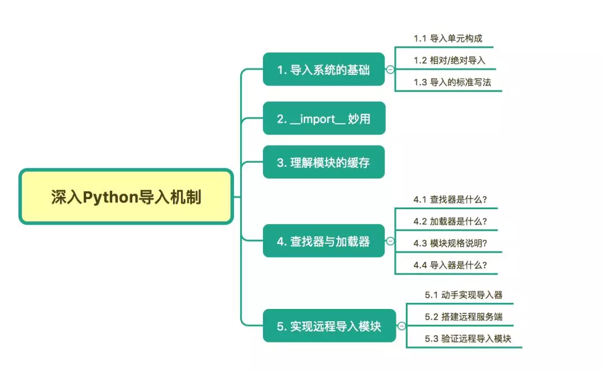

Python import <br />所谓的模块导入，是指在一个模块中使用另一个模块的代码的操作，它有利于代码的复用。<br />熟悉掌握Python的模块导入可以算是 Python 的进阶技能，会深入地探讨并以真实案例讲解 Python import Hook 的知识点。<br />
<a name="LHjia"></a>
## 1、导入系统的基础
<a name="lg4aU"></a>
### 1.1 导入单元构成
导入单元有多种，可以是模块、包及变量等。<br />对于这些基础的概念，有必要介绍一下它们的区别。<br />**模块**：类似 *.py，*.pyc， *.pyd ，*.so，*.dll 这样的文件，是 Python 代码载体的最小单元。<br />**包** 还可以细分为两种:

- Regular packages：是一个带有 __init__.py  文件的文件夹，此文件夹下可包含其他子包，或者模块
- Namespace packages

关于 Namespace packages，有的人会比较陌生，这里摘抄官方文档的一段说明来解释一下。<br />Namespace packages 是由多个部分构成的，每个部分为父包增加一个子包。各个部分可能处于文件系统的不同位置。部分也可能处于 zip 文件中、网络上，或者 Python 在导入期间可以搜索的其他地方。命名空间包并不一定会直接对应到文件系统中的对象；它们有可能是无实体表示的虚拟模块。<br />命名空间包的 `__path__` 属性不使用普通的列表。而是使用定制的可迭代类型，如果其父包的路径 (或者最高层级包的 sys.path) 发生改变，这种对象会在该包内的下一次导入尝试时自动执行新的对包部分的搜索。<br />命名空间包没有 `parent/__init__.py` 文件。实际上，在导入搜索期间可能找到多个 parent 目录，每个都由不同的部分所提供。因此 parent/one 的物理位置不一定与 parent/two 相邻。在这种情况下，Python 将为顶级的 parent 包创建一个命名空间包，无论是它本身还是它的某个子包被导入。
<a name="ab8a958d"></a>
### 1.2 相对/绝对对导入
当使用 import 导入模块或包时，Python 提供两种导入方式：

- 相对导入（relative import ）：`import foo.bar` 或者 `form foo import bar`
- 绝对导入（absolute import）：`from . import B` 或 `from ..A import B`，其中.表示当前模块，..表示上层模块

可以根据实际需要进行选择，但有必要说明的是，在早期的版本（ Python2.6 之前），Python 默认使用的相对导入。而后来的版本中（ Python2.6 之后），都以绝对导入为默认使用的导入方式。<br />使用绝对路径和相对路径各有利弊：

- 当在开发维护自己的项目时，应当使用相对路径导入，这样可以避免硬编码带来的麻烦。
- 而使用绝对路径，会让模块导入结构更加清晰，而且也避免了重名的包冲突而导入错误。
<a name="CSwvP"></a>
### 1.3 导入的标准写法
在 PEP8 中有一条，对模块的导入顺序提出了要求，不同来源模块导入，应该有清晰的界限，使用一空行来分开。

- import 语句应当分行书写
```python
# bad
import os,sys
# good
import os
import sys
```

- import语句应当使用absolute import
```python
# bad
from ..bar import  Bar
# good
from foo.bar import test
```

- import语句应当放在文件头部，置于模块说明及docstring之后，全局变量之前
- import语句应该按照顺序排列，每组之间用一个空格分隔，按照内置模块，第三方模块，自己所写的模块调用顺序，同时每组内部按照字母表顺序排列
```python
# 内置模块
import os
import sys
# 第三方模块
import flask
# 本地模块
from foo import bar
```
<a name="7MkU2"></a>
## 2、`__import__` 的妙用
在 Python 中使用 import 关键字来实现模块/包的导入，可以说是基础中的基础。<br />但这不是唯一的方法，还有 `importlib.import_module()` 和 `__import__()` 等。<br />对于 `__import__` ，普通的开发者，可能就会比较陌生。<br />和 `import` 不同的是，`__import__` 是一个函数，也正是因为这个原因，使得 `__import__` 的使用会更加灵活，常常用于框架中，对于插件的动态加载。<br />实际上，当调用 import 导入模块时，其内部也是调用了 `__import__` ，请看如下两种导入方法，他们是等价的。
```python
# 使用 import
import os
# 使用 __import__
os = __import__('os')
```
通过举一反三，下面两种方法同样也是等价的。
```python
# 使用 import .. as ..
import pandas as pd
# 使用 __import__
pd = __import__('pandas')
```
上面说 `__import__` 常常用于插件的动态，事实上也只有它能做到（相对于 import 来说）。<br />`插件`通常会位于某一特定的文件夹下，在使用过程中，可能并不会用到全部的插件，也可能会新增插件。<br />如果使用 import 关键字这种硬编码的方式，显然太不优雅了，当要新增/修改插件的时候，都需要修改代码。更合适的做法是，将这些插件以配置的方式，写在配置文件中，然后由代码去读取配置，动态导入要使用的插件，即灵活又方便，也不容易出错。<br />假如一个项目中，有 `plugin01` 、`plugin02`、`plugin03` 、`plugin04`  四个插件，这些插件下都会实现一个核心方法 `run()`  。但有时候不想使用全部的插件，只想使用 `plugin02`、`plugin04` ，那就在配置文件中写要使用的两个插件。
```python
# my.conf
custom_plugins=['plugin02', 'plugin04']
```
那如何使用动态加载，并运行他们呢？
```python
# main.py
for plugin in conf.custom_plugins:
    __import__(plugin)
    sys.modules[plugin].run()
```
<a name="bGNIw"></a>
## 3、理解模块的缓存
在一个模块内部重复引用另一个相同模块，实际并不会导入两次，原因是在使用关键字 `import` 导入模块时，它会先检索 `sys.modules` 里是否已经载入这个模块了，如果已经载入，则不会再次导入，如果不存在，才会去检索导入这个模块。<br />实验一下，在 `my_mod02` 这个模块里， import 两次 `my_mod01` 这个模块，按逻辑每一次 import 会一次 `my_mod01` 里的代码（即打印 `in mod01`），但是验证结果是，只打印了一次。
```python
$ cat my_mod01.py                 
print('in mod01')                    
$ cat my_mod02.py                 
import my_mod01                                        
import my_mod01     
$ python my_mod02.py              
in mod01
```
该现象的解释是：因为有 `sys.modules` 的存在。<br />`sys.modules` 是一个字典（key：模块名，value：模块对象），它存放着在当前 namespace 所有已经导入的模块对象。
```python
# test_module.py
import sys
print(sys.modules.get('json', 'NotFound'))
import json
print(sys.modules.get('json', 'NotFound'))
```
运行结果如下，可见在 导入后 json 模块后，`sys.modules` 才有了 json 模块的对象。
```python
$ python test_module.py
NotFound
<module 'json' from 'C:\Python27\lib\json\__init__.pyc'>
```
由于有缓存的存在，使得无法重新载入一个模块。<br />但若想反其道行之，可以借助 importlib 这个神奇的库来实现。事实也确实有此场景，比如在代码调试中，在发现代码有异常并修改后，通常要重启服务再次载入程序。这时候，若有了模块重载，就无比方便了，修改完代码后也无需服务的重启，就能继续调试。<br />还是以上面的例子来理解，`my_mod02.py` 改写成如下
```python
# my_mod02.py
import importlib
import my_mod01
importlib.reload(my_mod01)
```
使用 python3 来执行这个模块，与上面不同的是，这边执行了两次 `my_mod01.py`
```python
$ python3 my_mod02.py
in mod01
in mod01
```
<a name="QywWs"></a>
## 4、查找器与加载器
如果指定名称的模块在 `sys.modules` 找不到，则将发起调用 Python 的导入协议以查找和加载该模块。<br />此协议由两个概念性模块构成，即 `查找器` 和 `加载器`。<br />一个 Python 的模块的导入，其实可以再细分为两个过程：

- 由查找器实现的模块查找
- 由加载器实现的模块加载
<a name="lAMiO"></a>
### 4.1 查找器是什么？
查找器（finder），简单点说，查找器定义了一个模块查找机制，让程序知道该如何找到对应的模块。<br />其实 Python 内置了多个默认查找器，其存在于 sys.meta_path 中。<br />但这些查找器对应使用者来说，并不是那么重要，因此在 Python 3.3 之前， Python 解释将其隐藏了，称之为隐式查找器。
```python
# Python 2.7
>>> import sys
>>> sys.meta_path
[]
>>>
```
由于这点不利于开发者深入理解 import 机制，在 Python 3.3 后，所有的模块导入机制都会通过 sys.meta_path 暴露，不会在有任何隐式导入机制。
```python
# Python 3.7
>>> import sys
>>> sys.meta_path
[<class '_frozen_importlib.BuiltinImporter'>, 
 <class '_frozen_importlib.FrozenImporter'>, 
 <class '_frozen_importlib_external.PathFinder'>, 
 <class '_frozen_importlib_external.PathFinder'>]
>>>
```
观察一下 Python 默认的这几种查找器 （finder），可以分为三种：

- 一种知道如何导入内置模块
- 一种知道如何导入冻结模块
- 一种知道如何导入来自 import path 的模块 (即 path based finder)。

那能不能自已定义一个查找器呢？当然可以，只要：

1. 定义一个实现了 find_module 方法的类（py2和py3均可），或者实现 find_loader 类方法（仅 py3 有效），如果找到模块需要返回一个 loader 对象或者 ModuleSpec 对象（后面会讲），没找到需要返回 None
2. 定义完后，要使用这个查找器，必须注册它，将其插入在 sys.meta_path 的首位，这样就能优先使用。
```python
import sys
class MyFinder(object):
    @classmethod
    def find_module(cls, name, path, target=None):
        print("Importing", name, path, target)
        # 将在后面定义
        return MyLoader()
# 由于 finder 是按顺序读取的，所以必须插入在首位
sys.meta_path.insert(0, MyFinder)
```
查找器可以分为两种：
```python
object
 +-- Finder (deprecated)
      +-- MetaPathFinder
      +-- PathEntryFinder
```
这里需要注意的是，在 3.4 版前，查找器会直接返回 加载器（Loader）对象，而在 3.4 版后，查找器则会返回模块规格说明（ModuleSpec），其中包含加载器。<br />而关于什么是加载器和模块规格说明， 继续往后看。
<a name="DUG6A"></a>
### 4.2 加载器是什么？
查找器只负责查找定位找模，而真正负责加载模块的，是加载器（loader）。<br />一般的 loader 必须定义名为 `load_module()` 的方法。<br />为什么这里说一般，因为 loader 还分多种：
```
object
 +-- Finder (deprecated)
 |    +-- MetaPathFinder
 |    +-- PathEntryFinder
 +-- Loader
      +-- ResourceLoader --------+
      +-- InspectLoader          |
           +-- ExecutionLoader --+
                                 +-- FileLoader
                                 +-- SourceLoader
```
通过查看源码可知，不同的加载器的抽象方法各有不同。<br />加载器通常由一个 查找器返回。详情参见 PEP 302。<br />那如何自定义自己的加载器呢？<br />只要：

1. 定义一个实现了 load_module 方法的类
2. 对与导入有关的属性（点击查看详情）进行校验
3. 创建模块对象并绑定所有与导入相关的属性变量到该模块上
4. 将此模块保存到 sys.modules 中（顺序很重要，避免递归导入）
5. 然后加载模块（这是核心）
6. 若加载出错，需要能够处理抛出异常（ ImportError），若加载成功，则返回 module 对象

具体的例子在后面。
<a name="8Kseg"></a>
### 4.3 模块的规格说明
导入机制在导入期间会使用有关每个模块的多种信息，特别是加载之前。大多数信息都是所有模块通用的。模块规格说明的目的是基于每个模块来封装这些导入相关信息。<br />模块的规格说明会作为模块对象的 `__spec__` 属性对外公开。有关模块规格的详细内容请参阅 `ModuleSpec`。<br />在 Python 3.4 后，查找器不再返回加载器，而是返回 ModuleSpec 对象，它储存着更多的信息

- 模块名
- 加载器
- 模块绝对路径

那如何查看一个模块的 ModuleSpec ？<br />这边举个例子
```bash
$ cat my_mod02.py
import my_mod01
print(my_mod01.__spec__)
$ python3 my_mod02.py
in mod01
ModuleSpec(name='my_mod01', loader=<_frozen_importlib_external.SourceFileLoader object at 0x000000000392DBE0>, origin='/home/MING/my_mod01.py')
```
从 ModuleSpec 中可以看到，加载器是包含在内的，那如果要重新加载一个模块，是不是又有了另一种思路了？<br />来一起验证一下。<br />现在有两个文件：<br />一个是 my_info.py
```python
# my_info.py
name='python'
```
另一个是：main.py
```python
# main.py
import my_info
print(my_info.name)
# 加一个断点
import pdb;pdb.set_trace()
# 再加载一次
my_info.__spec__.loader.load_module()
print(my_info.name)
```
在 `main.py` 处，加了一个断点，目的是当运行到断点处时，修改 my_info.py 里的 name 为 `ming` ，以便验证重载是否有效？
```python
$ python3 main.py
python
> /home/MING/main.py(9)<module>()
-> my_info.__spec__.loader.load_module()
(Pdb) c
ming
```
从结果来看，重载是有效的。
<a name="8IaLQ"></a>
### 4.4 导入器是什么？
导入器（importer）它只是同时实现了查找器和加载器两种接口的对象，所以可以说导入器（importer）是查找器（finder），也可以说它是加载器（loader）。
<a name="DLigx"></a>
## 5、远程导入模块
由于 Python 默认的查找器和加载器 仅支持本地的模块的导入，并不支持实现远程模块的导入。<br />为了更好的理解 Python Import Hook 机制，下面会通过实例演示，如何自己实现远程导入模块的导入器。
<a name="ED4mb"></a>
### 5.1 动手实现导入器
当导入一个包的时候，Python 解释器首先会从 sys.meta_path 中拿到查找器列表。<br />默认顺序是：内建模块查找器 -> 冻结模块查找器 -> 第三方模块路径（本地的 sys.path）查找器<br />若经过这三个查找器，仍然无法查找到所需的模块，则会抛出ImportError异常。<br />因此要实现远程导入模块，有两种思路。

- 一种是实现自己的元路径导入器；
- 另一种是编写一个钩子，添加到sys.path_hooks里，识别特定的目录命名模式。

这里选择第一种方法来做为示例。<br />实现导入器，需要分别查找器和加载器。<br />**首先是查找器**<br />由源码得知，路径查找器分为两种

- MetaPathFinder
- PathEntryFinder

这里使用 MetaPathFinder 来进行查找器的编写。<br />在 Python 3.4 版本之前，查找器必须实现 `find_module()` 方法，而  Python 3.4+ 版，则推荐使用 `find_spec()`  方法，但这并不意味着不能使用 `find_module()`，但是在没有 `find_spec()` 方法时，导入协议还是会尝试 `find_module()` 方法。<br />先举例下使用 `find_module()` 该如何写。
```python
from importlib import abc
class UrlMetaFinder(abc.MetaPathFinder):
    def __init__(self, baseurl):
        self._baseurl = baseurl
    def find_module(self, fullname, path=None):
        if path is None:
            baseurl = self._baseurl
        else:
            # 不是原定义的url就直接返回不存在
            if not path.startswith(self._baseurl):
                return None
            baseurl = path
        try:
            loader = UrlMetaLoader(baseurl)
            # loader.load_module(fullname)
        except Exception:
            return None
```
若使用 `find_spec()` ，要注意此方法的调用需要带有两到三个参数。<br />第一个是被导入模块的完整限定名称，例如 `foo.bar.baz`。第二个参数是供模块搜索使用的路径条目。对于最高层级模块，第二个参数为 `None`，但对于子模块或子包，第二个参数为父包 `__path__` 属性的值。如果相应的 `__path__` 属性无法访问，将引发 `ModuleNotFoundError`。第三个参数是一个将被作为稍后加载目标的现有模块对象。导入系统仅会在重加载期间传入一个目标模块。
```python
from importlib import abc
from importlib.machinery import ModuleSpec
class UrlMetaFinder(abc.MetaPathFinder):
    def __init__(self, baseurl):
        self._baseurl = baseurl
    def find_spec(self, fullname, path=None, target=None):
        if path is None:
            baseurl = self._baseurl
        else:
            # 不是原定义的url就直接返回不存在
            if not path.startswith(self._baseurl):
                return None
            baseurl = path
        try:
            loader = UrlMetaLoader(baseurl)
            return ModuleSpec(fullname, loader, is_package=loader.is_package(fullname))
        except Exception:
            return None
```
**接下来是加载器**<br />由源码得知，路径查找器分为两种

- FileLoader
- SourceLoader

按理说，两种加载器都可以实现想要的功能，这里选用 SourceLoader 来示范。<br />在 SourceLoader 这个抽象类里，有几个很重要的方法，在写实现加载器的时候需要注意

- get_code：获取源代码，可以根据自己场景实现实现。
- exec_module：执行源代码，并将变量赋值给 module.dict
- get_data：抽象方法，必须实现，返回指定路径的字节码。
- get_filename：抽象方法，必须实现，返回文件名

会经常看到加载器要实现 `load_module()` ，而这个方法早已在 Python 3.4 的时候就被废弃了，当然为了兼容考虑，若使用 `load_module()` 也是可以的。
```python
from importlib import abc
class UrlMetaLoader(abc.SourceLoader):
    def __init__(self, baseurl):
        self.baseurl = baseurl
    def get_code(self, fullname):
        f = urllib2.urlopen(self.get_filename(fullname))
        return f.read()
    def load_module(self, fullname):
        code = self.get_code(fullname)
        mod = sys.modules.setdefault(fullname, imp.new_module(fullname))
        mod.__file__ = self.get_filename(fullname)
        mod.__loader__ = self
        mod.__package__ = fullname
        exec(code, mod.__dict__)
        return None
    def get_data(self):
        pass
    def execute_module(self, module):
        pass
    def get_filename(self, fullname):
        return self.baseurl + fullname + '.py'
```
当使用这种旧模式实现自己的加载时，需要注意两点，很重要：

- execute_module 必须重载，而且不应该有任何逻辑，即使它并不是抽象方法。
- load_module，需要在查找器里手动执行，才能实现模块的加载。。

做为替换，应该使用 `execute_module()` 和 `create_module()` 。由于基类里已经实现了 `execute_module` 和 `create_module()`，并且满足使用场景。这边可以不用重复实现。和旧模式相比，这里也不需要在设查找器里手动执行 `execute_module()`。
```python
import urllib.request as urllib2
class UrlMetaLoader(importlib.abc.SourceLoader):
    def __init__(self, baseurl):
        self.baseurl = baseurl
    def get_code(self, fullname):
        f = urllib2.urlopen(self.get_filename(fullname))
        return f.read()
    def get_data(self):
        pass
    def get_filename(self, fullname):
        return self.baseurl + fullname + '.py'
```
查找器和加载器都有了，别忘了往sys.meta_path 注册自定义的查找器（UrlMetaFinder）。
```python
def install_meta(address):
    finder = UrlMetaFinder(address)
    sys.meta_path.append(finder)
```
所有的代码都解析完毕后，将其整理在一个模块（my_importer.py）中
```python
# my_importer.py
import sys
import importlib
import urllib.request as urllib2
class UrlMetaFinder(importlib.abc.MetaPathFinder):
    def __init__(self, baseurl):
        self._baseurl = baseurl
    def find_module(self, fullname, path=None):
        if path is None:
            baseurl = self._baseurl
        else:
            # 不是原定义的url就直接返回不存在
            if not path.startswith(self._baseurl):
                return None
            baseurl = path
        try:
            loader = UrlMetaLoader(baseurl)
        except Exception:
            return None
class UrlMetaLoader(importlib.abc.SourceLoader):
    def __init__(self, baseurl):
        self.baseurl = baseurl
    def get_code(self, fullname):
        f = urllib2.urlopen(self.get_filename(fullname))
        return f.read()
    def get_data(self):
        pass
    def get_filename(self, fullname):
        return self.baseurl + fullname + '.py'
def install_meta(address):
    finder = UrlMetaFinder(address)
    sys.meta_path.append(finder)
```
<a name="G2TWW"></a>
### 5.2 搭建远程服务端
要实现一个远程导入模块的方法。还缺一个在远端的服务器来存放模块，为了方便，使用python自带的 `http.server` 模块用一条命令即可实现。
```bash
$ mkdir httpserver && cd httpserver
$ cat>my_info.py<EOF
name='Python编程时光'
print('ok')
EOF
$ cat my_info.py
name='Python编程时光'
print('ok')
$ 
$ python3 -m http.server 12800
Serving HTTP on 0.0.0.0 port 12800 (http://0.0.0.0:12800/) ...
...
```
一切准备好，就可以验证了。
```python
>>> from my_importer import install_meta
>>> install_meta('http://localhost:12800/') # 往 sys.meta_path 注册 finder 
>>> import my_info  # 打印ok，说明导入成功
ok
>>> my_info.name  # 验证可以取得到变量
'Python编程时光'
```
至此，实现了一个简易的可以导入远程服务器上的模块的导入器。
