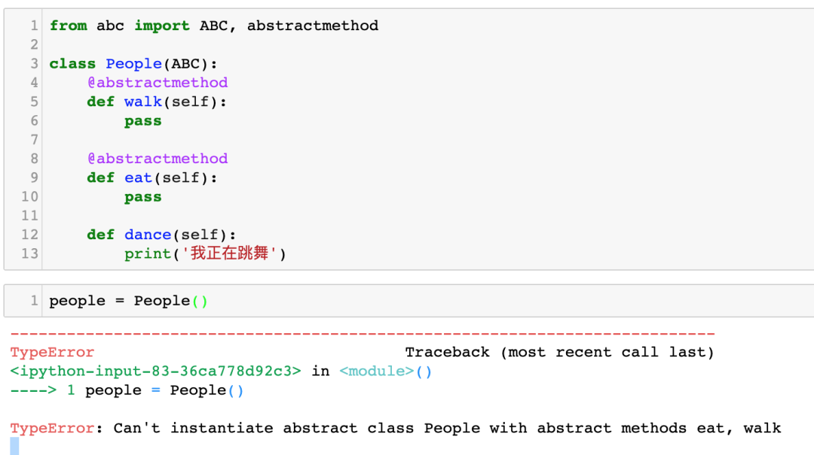
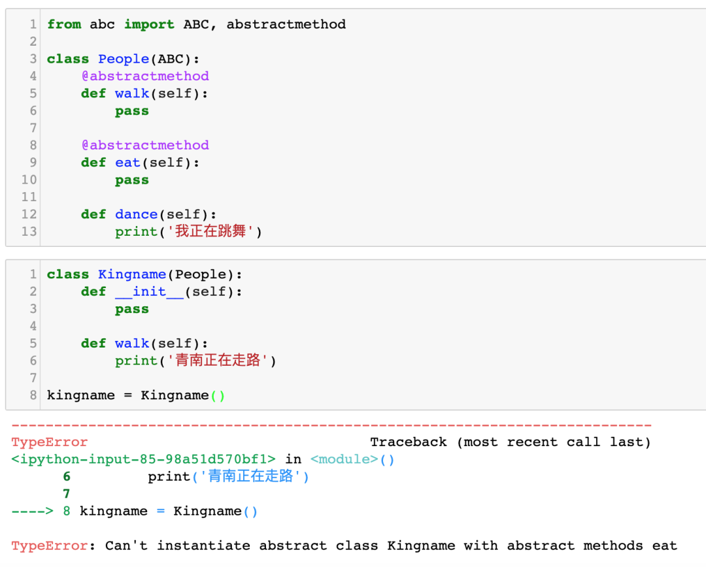
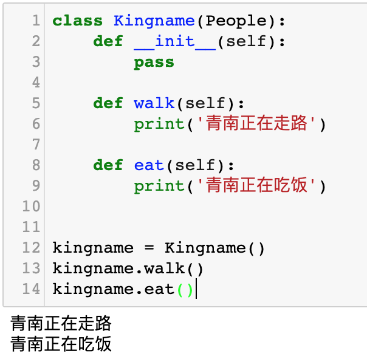

Python<br />Python 自带的`abc`模块用于实现抽象类相关的定义和操作。<br />通过一个简单的例子来说明在 Python 中实现抽象类：
```python
from abc import ABC, abstractmethod

class People(ABC):
    @abstractmethod
    def walk(self):
        pass
    
    @abstractmethod
    def eat(self):
        pass
    
    def dance(self):
        print('我正在跳舞')
```
从`abc`模块导入`ABC`类，和`abstractmethod`抽象方法装饰器。基于`ABC`类可以实现一个抽象类。通过`@abstractmethod`装饰一个方法，让它成为一个抽象方法。抽象方法在子类中必需被实现。<br />抽象类不能被实例化，所以实例化一下，可以看到这里报错了，如下图所示：<br /><br />再看一下，如果继承抽象类，但是没有实现其中的某个抽象方法，也会导致报错。如下图所示：<br /><br />当把所有抽象方法都实现了以后，子类就能够正常初始化了，如下图所示：<br /><br />抽象类`People`中的`dance`不是抽象方法，所以子类不需要覆盖。抽象类是软件开发中一个非常重要的概念，通过定义抽象类，可以约定子类必需实现的方法。当一个类有几十上百个方法时，用抽象方法来防止子类漏掉某些方法是非常方便的做法。
